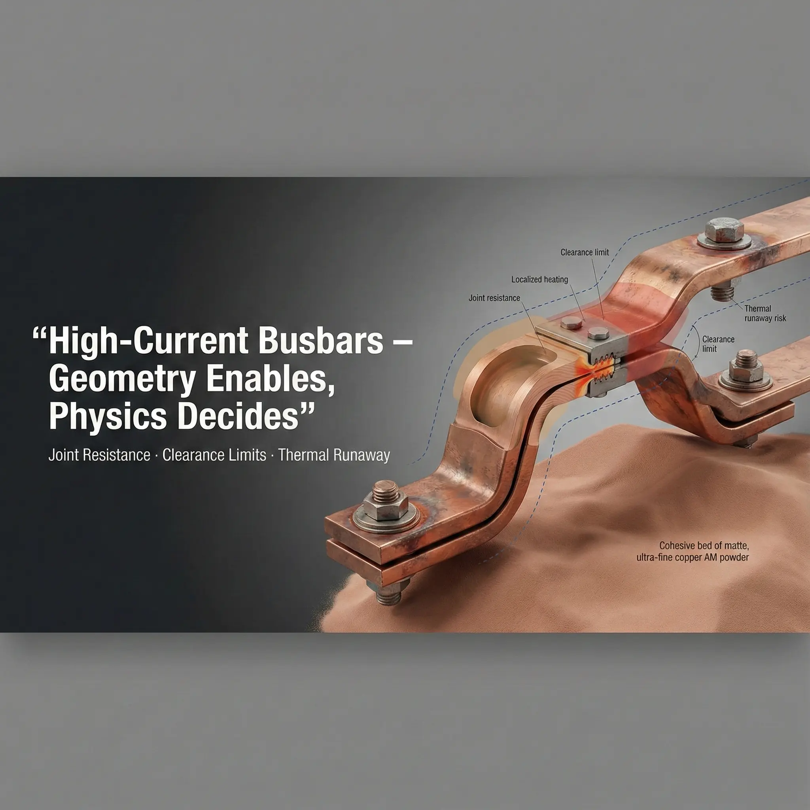

> 3D printed copper busbars and induction coils are worth reviewing when current path, thermal control, compact routing, or integrated cooling cannot be handled cleanly by flat copper, bent bar, tube, brazed parts, or CNC machining. The RFQ should define the electrical function and acceptance requirements first, then the geometry.

### Why Electrical Copper Parts Need a Different RFQ

Electrical copper hardware is not only a shape. The quote depends on current path, contact resistance, heat generation, insulation distance, surface finish, plating, cooling, and inspection.

For busbars, the risk often sits at joints and contact planes. For induction coils, the risk often sits in local overheating, cooling path reliability, and spacing between turns. For high-voltage or RF hardware, surface condition and field concentration may become the dominant issue.

That is why a STEP file alone is often not enough for a confident quote.

### When Copper AM Is Useful for Busbars

Most busbars should be simple. Flat, bent, stamped, laminated, or machined copper is often the right route. Copper AM becomes more interesting when the design has a real 3D constraint.

Useful AM drivers include:

- Compact routing around keep-outs, cooling hardware, or dense packaging.
- Integrated liquid cooling or local heat-spreading features.
- Multiple mounting, sensing, or structural features consolidated into one copper body.
- Prototype or low-volume development where tooling is not attractive.
- Geometry that would otherwise require many joints, bends, or assemblies.

AM is weaker when the requirement is only a flat conductor with simple holes and contact faces. In that case, conventional copper fabrication is usually the cleaner quote route.

### When Copper AM Is Useful for Induction Coils

Induction coils may justify copper AM when the coil needs geometry that is difficult to form from tube or machined copper.

Good candidates include:

- Compact coil paths with changing cross-section.
- Internal cooling channels integrated near the heat source.
- Local thickening around high-current or high-heat zones.
- Repeatable coil geometry where hand forming creates variation.
- Integrated mounting, sensor, or fluid connections.

The main caution is that printed copper still needs a practical finishing, cleaning, and inspection route. If the cooling path cannot be cleaned or pressure-tested, the printed concept may not be a good production route.

### RFQ Inputs for Copper Busbars and Coils

| Input | Busbar relevance | Induction coil relevance |
| --- | --- | --- |
| Current and duty cycle | Sizing, heating, contact resistance | Heating, cooling load, duty factor |
| Contact faces | Machining, flatness, plating, bolt pattern | Power connection faces and repeatability |
| Cooling requirement | Integrated channels or heat spreading | Flow path, coolant, pressure drop, leak risk |
| Insulation requirement | Creepage, clearance, coating, isolation | Turn spacing, fixture insulation, cooling isolation |
| Material preference | Pure copper vs CuCrZr trade-off | Conductivity vs stability and strength |
| Surface finish and plating | Joint resistance and corrosion control | Contact faces, oxidation, cleaning |
| Quantity and lead time | Route and nesting economics | Prototype vs repeat production approach |
| Inspection | Dimensional, conductivity, contact surfaces | Pressure/leak, flow, dimensional, thermal checks |

If you do not know every value, send the known operating condition and highlight what is critical.

### Contact Surfaces Drive the Quote

For busbars, the printed geometry may be complex, but the final performance often depends on simple machined surfaces.

State these clearly:

- Contact face location and size.
- Flatness and surface finish requirement.
- Hole pattern and bolt or clamp approach.
- Plating or coating expectation.
- Whether electrical testing or resistance measurement is required.

Do not assume an as-printed surface is acceptable for a high-current contact. Contact faces usually need machining, cleaning, and sometimes plating.

### Cooling and Pressure Requirements

If the part includes internal cooling, the RFQ should define:

- Coolant type and flow rate if known.
- Working pressure and proof pressure.
- Pressure drop target or limit if relevant.
- Leak test method or acceptance if required.
- Cleaning and drying expectations.

For a cooled busbar or coil, the cooling requirement can be more important than the outside shape. A geometry that prints successfully can still fail the project if it cannot be cleaned, sealed, or tested.

### Insulation, Creepage, and Clearance

Electrical parts need spacing information. This is especially important when copper AM is used to fit conductors into a compact volume.

Include:

- Voltage level and insulation system.
- Required creepage and clearance if already defined.
- Adjacent conductive or grounded surfaces.
- Coating, sleeve, potting, or fixture assumptions.
- Edge radius or surface finish requirements for field-sensitive areas.

If the design is high-voltage sensitive, review the separate guide on [3D printed copper high-voltage electrodes](/posts/EngineeringGuide/3d-printed-copper-high-voltage-electrodes-feasibility/).

### Material and Post-Processing

Pure copper may be preferred for conductivity, but CuCrZr may be useful when strength, threaded features, clamp stability, or temperature exposure matter. The material choice should follow the operating condition, not only the word "copper" on the drawing.

Post-processing can include:

- Stress relief or heat treatment.
- Machining of contact faces, holes, and reference datums.
- Polishing or surface conditioning where needed.
- Plating or coating.
- Pressure, leak, flow, conductivity, or dimensional inspection.

Use the [materials overview](/materials/) when the alloy is not fixed.

### Go/No-Go Review Before Quoting

**Good fit for copper AM:**

- 3D routing solves a real packaging issue.
- Integrated cooling reduces assembly or thermal risk.
- Contact surfaces are reachable for machining.
- Internal channels can be cleaned and tested.
- Quantity and acceptance scope justify the route.

**Weak fit for copper AM:**

- Flat conductor geometry with simple holes.
- Very large low-complexity copper parts.
- Contact faces cannot be machined or plated as required.
- Internal cooling paths have no cleaning or leak-test plan.
- Electrical acceptance is undefined.

### Practical RFQ Email

For a busbar or induction coil quote, send CAD, drawing, quantity, target lead time, current, duty cycle, contact faces, cooling requirement, insulation constraints, material preference if known, and inspection requirements.

Send files to [info@szcomo.com](mailto:info@szcomo.com). A simple part can be quoted with stated assumptions. If the electrical or cooling requirement is unclear, expect focused clarification before quote.

