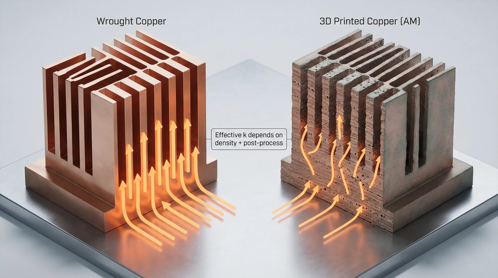
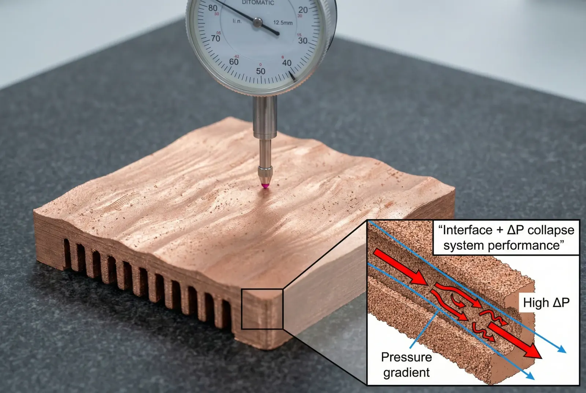
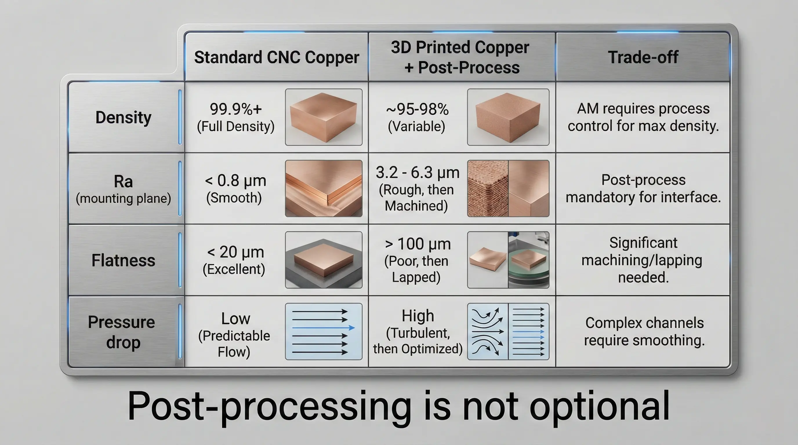

> **3D printed copper heat sinks are conditionally feasible for low-to-mid volume, geometry-constrained thermal solutions where conventional fin manufacturing cannot meet airflow, packaging, or manifold requirements.**While they can unlock internal channels and part consolidation, teams must account for**material conductivity deficits, surface/interface penalties, and mandatory post-processing “tax”**to reach predictable thermal performance.

### 3D Printed Copper Heat Sink Request Patterns in Thermal Management Teams

We repeatedly see the same procurement brief: “We need a copper heat sink, but the envelope is fixed, airflow is ugly, and we want internal channels.” The attraction is rational—**copper is a high-conductivity material (~390–400 W/m·K for high-purity wrought copper)**, and additive manufacturing promises geometry freedom.

The mismatch usually appears after first prototypes: a 3D printed copper heat sink often behaves like “copper in CAD” but not “copper in system.” The delta is rarely a single factor; it is a stack-up of**effective conductivity loss, roughness-driven pressure drop, contact resistance at mounting faces, and variability across builds**—all of which become visible when you measure**Rθ (°C/W)**and not just “looks like a heat sink.”

### Copper Additive Manufacturing Process Constraints in L-PBF, EBM, and Binder Jet

3D printed copper heat sinks are a type of**metal additive thermal solution**most commonly produced by**laser powder bed fusion (L-PBF)**,**electron beam melting (EBM)**, or**binder jet + sinter**. Each process produces a different “engineering reality”:

- **L-PBF copper** fights reflectivity and thermal conductivity during melting, increasing sensitivity to parameter drift; you often pay for stability via tighter process windows and slower builds.
- **EBM copper** can reduce reflectivity issues but changes surface condition and resolution constraints; thin fins and microchannels are not universally practical.
- **Binder jet copper** shifts risk to sintering: shrink, distortion, and density gradients become the dominant failure modes for flatness and mating surfaces.

What matters thermally is not the name of the process; it is the achieved combination of:

- **Relative density (%) / porosity (%)**
- **Effective thermal conductivity (W/m·K) after post-processing**
- **Surface roughness (Ra, µm) on airflow and contact faces**
- **Dimensional stability (flatness, parallelism, tolerance stack-up)**

#### Effective Thermal Conductivity in Printed Copper vs Wrought Copper

In real builds, printed copper rarely equals wrought copper conductivity without paying for densification and microstructure control. Even when bulk density is “high,” residual porosity and microstructural discontinuities can reduce effective conduction enough that the sink’s spreading resistance dominates at high heat flux.

A practical way to reason about this is: if your design depends on copper’s textbook conductivity to keep base-to-fin ΔT low, you need evidence (measured k, density, and repeatability) that the printed part is actually operating in that regime.

#### Surface Condition and Interface Resistance at the Mounting Plane

A heat sink is only as good as its interface. The mounting plane is a type of**thermal interface boundary**where**thermal contact resistance**can outweigh a 10–20% gain elsewhere. As-printed copper surfaces typically have**Ra in the multi-µm to double-digit µm range**, and as-built flatness can drift with residual stress relief.

In practice, high-performance assemblies usually require:

- **CNC machining or grinding of the base** to a controlled flatness (commonly tens of µm depending on footprint and clamp scheme).
- A defined **TIM bondline thickness (BLT)** and clamp pressure window to avoid “TIM pumping” and voiding over thermal cycles.

#### Fluid and Air-Side Penalties from Rough Channels and Fins

Internal channels are often the reason to print. The hidden penalty is that as-printed internal surfaces increase friction factor and turbulence unpredictably, driving:

- Higher **pressure drop (ΔP)** at the same flow
- More pump/fan power
- More variance between “identical” builds if internal surface condition drifts

If you are targeting a fixed airflow curve (e.g., compact blower), this can flip a design from “thermally adequate” to “starved” with no CAD change—only surface reality.

### Execution Log from a 3D Printed Copper Heat Sink Build with Post-Processing Tax

A client requested a copper heat sink for a compact power electronics module where the envelope prevented conventional fin stacks and the cold plate routing required a one-piece manifold. The printed concept was elegant: consolidated base + internal flow paths + mounting bosses.

The first iteration failed system targets by a margin that looked “too large to be measurement noise.” The root cause was a stack:

- Bulk conduction underperformed expectation (effective k lower than assumed).
- The mating plane contact resistance was high due to as-built waviness and roughness.
- Pressure drop exceeded the fan/pump operating point, collapsing flow rate in-system.

#### Resolution Path and the Price of Success in Printed Copper

We recovered performance, but the recovery had a bill:

1. **Densification / stability step** (process-dependent): to reduce porosity variability and stabilize conduction.
2. **Mandatory base machining** : to control flatness and surface finish at the interface.
3. **Flow-path rework** : to keep ΔP within the fan/pump curve, trading some surface area for predictable flow.
4. **Inspection escalation** : CT or equivalent for internal features + tighter QA on density and distortion.

The outcome met thermal targets, but lead time and unit cost moved materially. The project remained viable because the geometry constraint was real and the production volume was low enough that the post-processing burden did not dominate lifecycle cost.

### Data Forensics Table for 3D Printed Copper Heat Sink Decision-Making

| Parameter | Standard Approach | Advanced Approach | The Trade-off |
| --- | --- | --- | --- |
| Base material conductivity assumption (W/m·K) | Wrought copper baseline (design uses ~390–400) | Printed copper validated by measured k after post-process | You must measure k; “copper powder” is not “wrought copper” in performance |
| Relative density (%) | Near-full density by conventional stock | Process + densification strategy to reach stable density | Higher density usually means higher cost, longer cycle time |
| Mounting face roughness Ra (µm) | Low Ra via machining as default | As-printed + machining/grinding to spec | Machining becomes mandatory, not optional |
| Base flatness / parallelism (µm) | Controlled via machining fixturing | Stress relief + machining plan + distortion allowance | Print distortion can force extra stock and extra setups |
| Internal channel surface condition | Smooth tube/reamed channel | As-printed roughness + possible flow tuning | Roughness increases ΔP and reduces predictability |
| Feature tolerance (mm) | Typical CNC capability for mating interfaces | Print + post-machine critical datums | Hybrid manufacturing is required for interfaces |
| Inspection method | CMM + visual + simple gauges | CT for internal features + CMM for datums | CT adds cost and can become a schedule gate |
| Thermal interface resistance (°C·cm²/W) | Controlled with known surface + TIM | Needs controlled surface + clamp window validation | Interface can dominate total Rθ if unmanaged |

*Test method: ASTM D5470 for thermal interface characterization; system-level Rθ validated under representative airflow/flow conditions with calibrated power input and multi-point thermometry.*

### Go/No-Go Criteria for 3D Printed Copper Heat Sinks in Real Programs

#### Clearly Feasible: 3D Printed Copper Heat Sink Use Cases with Hard Constraints

Go ahead if all of the following are true:

- **Geometry is the driver** : internal manifolds, embedded channels, or consolidation eliminates brazed joints and leak paths that you cannot tolerate.
- **You will post-machine critical surfaces** : base plane and datums are machined to a defined flatness/finish that your TIM and clamp method can support.
- **You have a measurement plan** : density/porosity and thermal performance are verified per lot (at minimum by coupon strategy; ideally correlated to system Rθ).
- **Volumes are compatible** : low-to-mid volume where added inspection and post-processing do not dominate lifecycle economics.

#### Conditionally Feasible (High-Cost Route): Performance Is Possible, but You Pay for It

Proceed only if you accept the “tax” and can resource it:

- Your design depends on high spreading performance at the base (high heat flux, tight ΔT budget).
- You need thin features or complex internal flow paths that push process limits.
- You require tight repeatability across builds and suppliers.

In this zone, the project succeeds when you explicitly budget for:

- Densification/parameter control (process-specific)
- Hybrid machining (multiple setups)
- Higher-grade inspection (often CT + CMM)
- Iteration to tune ΔP and flow distribution

#### Structurally Mismatched: When 3D Printed Copper Heat Sinks Are the Wrong Tool

Do not print copper when any of the following are true:

- The geometry is a conventional finned heat sink (extrusion, skiving, bonded fin, or machining can meet it).
- Cost per unit must be low at volume, and you cannot absorb post-processing and inspection.
- Your thermal requirement is interface-dominated but you cannot machine the base or control clamp/TIM.
- Your airflow system is fragile (small blowers) and cannot tolerate ΔP variability.

In these cases, the highest-probability alternatives are:

- **Skived copper fin heat sinks** (high fin density without AM variability)
- **Bonded fin copper assemblies** (cost-effective surface area at scale)
- **Vapor chamber + conventional fins** (reduces spreading resistance without printing copper)
- **Machined microchannel cold plates** (predictable channels and surfaces)

> **Project Readiness Check**- Before committing, ask yourself (or your supplier):
>   - Do we have measured evidence (k, density, Rθ) that printed copper meets the thermal model assumptions at lot-to-lot repeatability?
>     - Have we budgeted the full post-processing and inspection stack (machining, stress relief, CT/CMM) required to control interface and internal features?

### FAQ on 3D Printed Copper Heat Sinks

**What is the single most common reason 3D printed copper heat sinks miss targets?**

The interface stack-up. As-printed base roughness/flatness plus uncontrolled TIM bondline and clamp conditions can dominate total thermal resistance even if the geometry is “better” on paper.

**Is printing copper automatically better than printing aluminum for heat sinks?**

Not automatically. Copper’s advantage depends on achieving effective conductivity and controlling the interface. If the printed copper’s k is depressed or the base is not machined, system Rθ can converge toward (or underperform) well-executed aluminum solutions.

**Do internal channels guarantee better cooling?**

No. Internal channels are only better if the system can supply the required flow rate at the resulting pressure drop. As-printed roughness can increase ΔP enough to reduce flow and negate the theoretical surface-area advantage.

**What should be machined on a printed copper heat sink?**

At minimum: the mounting plane and any datum features used for assembly alignment. If the part interfaces to seals, fittings, or precision manifolds, those sealing faces and ports should also be post-machined to controlled finish and geometry.

**What is the minimum test evidence for a go decision?**

A correlation between coupon metrics (density/porosity and, if available, conductivity proxy) and system-level thermal resistance (Rθ) under representative boundary conditions, plus dimensional verification of the mounting plane and critical interfaces.

> *Disclaimer: All scenarios described are based on real or closely analogous executed projects. If you choose to implement any of the examples described in this article, please conduct a careful evaluation first. This site assumes no responsibility for losses resulting from implementations made without prior evaluation.*

---
