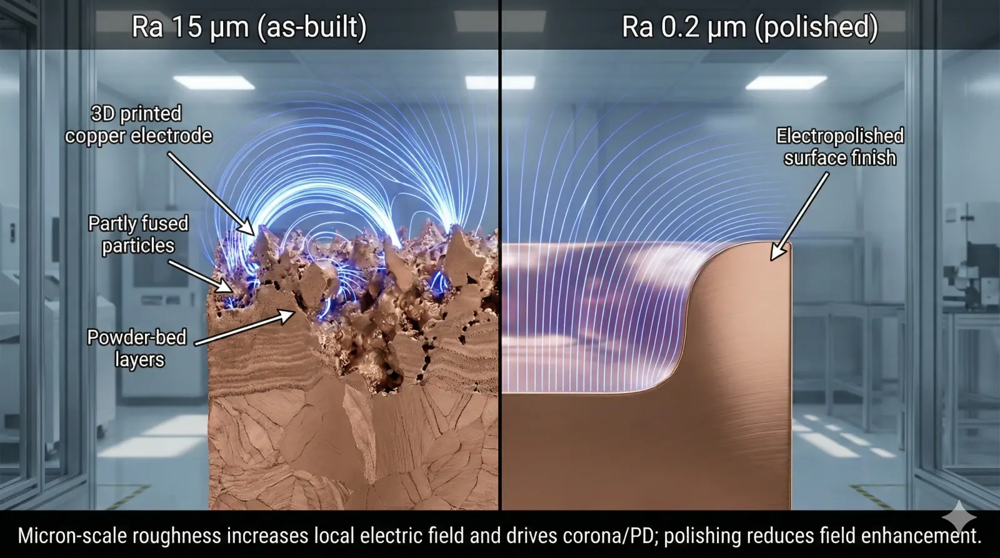
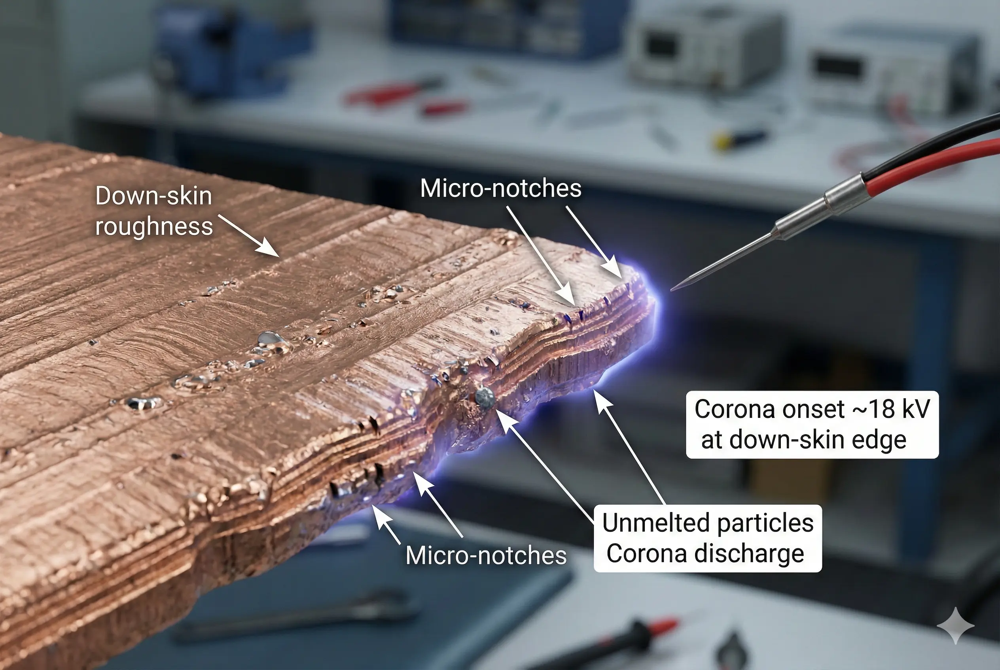
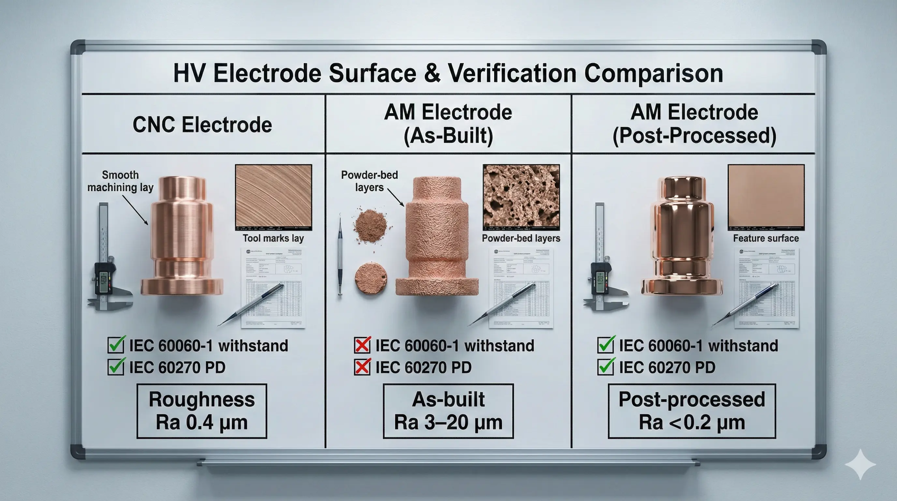

> 3D printed copper high-voltage electrodes are**conditionally feasible**for air/oil applications where**all field-critical surfaces are post-machined and polished**. While AM can integrate cooling and complex geometries, engineering teams must account for**surface roughness–driven field enhancement and partial discharge risk**to make it viable.

### 3D Printed Copper High-Voltage Electrode Requests in Power and Plasma Hardware

We keep seeing the same RFQ pattern: “We want a copper electrode with integrated cooling channels, but we also need it to hold off**30–80 kV**without corona or partial discharge.” The attraction is obvious—powder bed fusion can pack features into a volume that would be expensive to machine.

The conflict is also predictable: high-voltage electrodes punish microscopic defects. A surface “feature” that is irrelevant at**5 kV**can become the initiating site for corona at**20–40 kV**, especially in air at sharp edges and down-skin regions.

### High-Voltage Electrode Physics: Electric Field, Surface Roughness, and PD

A high-voltage electrode**is a type of conductor**that shapes an electric field in a defined medium (air, oil, SF₆ alternatives, vacuum). Your breakdown margin is dominated by (1) local field enhancement and (2) how the medium responds (corona inception, partial discharge, or full breakdown).

For AM copper, the first problem is surface condition. Published powder bed fusion copper data shows as-built Ra can be**3.3–19.2 μm**depending on surface orientation (top/side/bottom). ([ScienceDirect](https://www.sciencedirect.com/science/article/abs/pii/S2214860421005704)) Other copper PBF studies report down-skin roughness on the order of**~28–35 μm Ra**on inclined surfaces. ([Springer](https://link.springer.com/article/10.1007/s40516-025-00313-9)) Those ranges are structurally misaligned with HV practice, where field-critical faces often need sub-micron finishing for stable behavior (especially in vacuum or where PD limits are tight).

The second problem is defect topology. Even when density is high, pores and lack-of-fusion features can act like embedded field concentrators. Electron beam melting of copper can reach**>99% relative density**under suitable conditions, but “high density” is not the same as “HV-stable surface and subsurface.” ([MDPI](https://www.mdpi.com/2079-6412/11/6/740))

### Copper AM Reality: Conductivity, Heat Treatment, and What It Means for Electrodes

Electrical conductivity matters for electrodes because resistive heating can change temperature, outgassing, and surface conditioning over time. AM copper alloys can vary widely: one vendor datasheet for AM CuCrZr shows**~23% IACS as-built**and up to**~88% IACS after conductivity-optimized heat treatment**(measured per ASTM E1004). ([EOS GmbH](https://www.eos.info/05-datasheet-images/Assets_MDS_Metal/EOS_CopperAlloy_CuCrZr/Material_DataSheet_EOS%20_Copper_CuCrZr_en.pdf))

This creates an immediate feasibility constraint: if your electrode design assumes “near-OFHC behavior,” you cannot accept a process route that lands at**<80% IACS**without explicitly modeling the thermal and electrical consequences.

### Execution Log: A 60 kV Class Electrode That Failed at 18 kV Until We Paid the “Surface Tax”

Client context: a compact test fixture needed a copper electrode with internal cooling, targeting**60 kV DC**in air with intermittent duty. The client chose AM to integrate coolant paths and reduce assembly interfaces.

What we tried first: printed copper, stress relief, and a cosmetic external bead blast. The first HV step test showed audible corona and unstable current starting around**~18 kV**near a down-skin edge, well below the target.

Pivot point (failure mode): the down-skin region had orientation-driven roughness and micro-edges; local field enhancement dominated the behavior. This was not a “material strength” failure; it was a “field geometry at the micron scale” failure.

Resolution (and the tax): we reworked the plan into an HV-grade finishing stack:

- CNC skim all field-critical faces; enforce minimum edge radii of **≥1.0 mm** on exposed transitions.
- Buffered chemical polish + electropolish to drive Ra toward **<0.2 μm** where geometry allowed (material removal on the order of **~25–125 μm** is common across polishing steps). ( [FinishingandCoating.com](https://finishingandcoating.com/index.php/mass-finishing/1901-a-pulse-pulse-reverse-electrolytic-approach-to-electropolishing-and-through-mask-electroetching) )
- Add a plated finish on the field surfaces (application-specific; the key is defect masking + stable surface chemistry).
- Re-test using standardized HV withstand + PD measurement practices (see standards below).

Net result: corona inception shifted upward and behavior stabilized, but the electrode was no longer “printed and done.” The finishing stack added**multiple process steps**and forced design changes to expose surfaces that polishing chemistry could actually reach.

### Data Forensics for 3D Printed Copper HV Electrodes: What Changes vs CNC

| Parameter | Standard Approach (CNC Copper Electrode) | Advanced Approach (AM Copper Electrode) | The Trade-off |
| --- | --- | --- | --- |
| Surface roughness on field faces | Post-machined + polish to Ra typically in the sub-μm regime (application-defined) | As-built Ra reported 3.3–19.2 μm depending on orientation; must be machined/polished afterward (ScienceDirect) | More operations; polishing access becomes a design constraint |
| Down-skin field stability | Tool-controlled edges; predictable radii | Down-skin roughness reported ~28–35 μm Ra on some copper PBF geometries (Springer) | Orientation planning becomes an electrical design variable |
| Conductivity (IACS) | Material-spec driven; often near wrought copper targets | AM CuCrZr example: ~23% IACS as-built to ~88% IACS heat-treated (EOS GmbH) | Heat treatment becomes mandatory; properties vary by machine + recipe |
| Subsurface defect risk | Low; defects typically governed by billet quality | High sensitivity to lack-of-fusion/pores; “high density” does not equal “HV-stable” (MDPI) | Requires CT/sectioning strategy when stakes are high |
| Vacuum / PD sensitivity | Established finishing playbook | Roughness strongly influences breakdown; reducing roughness from 3.5 μm to 0.35 μm improved breakdown threshold by ~35% in reported vacuum study (PMC) | If vacuum or very low PD is required, polishing is not optional |
| Verification standards | HV withstand and PD per established lab practice | Same standards apply; AM doesn’t change acceptance physics | More test iterations; more rejects if criteria aren’t explicit |

*Test method: dielectric withstand and measuring systems aligned to IEC 60060-1 (high-voltage test techniques) and PD measurement aligned to IEC 60270; surface texture parameters commonly referenced to ISO 4287, noting migration to ISO 21920 in newer drawing practices.*([webstore.iec.ch](https://webstore.iec.ch/en/publication/65088))

### Go/No-Go Criteria for 3D Printed Copper High-Voltage Electrodes

#### Clearly Feasible: 3D Printed Copper Electrodes for Low Field Stress Geometry

Go ahead if all of the following are true:

- Operating voltage is modest (typical **≤20–30 kV** class) and geometry enforces generous edge radii (practically **≥1.0 mm** on exposed transitions).
- Every field-critical surface is reachable by CNC finishing and controlled polishing to a defined Ra target (often **≤0.2–0.8 μm** , application-specific). ( [Clarwe](https://www.clarwe.com/finishes/electropolishing.html) )
- Acceptance includes a standardized HV withstand plan per IEC 60060-1, not an ad-hoc bench test. ( [webstore.iec.ch](https://webstore.iec.ch/en/publication/65088) )

#### Conditionally Feasible: AM Copper Electrodes for Integrated Cooling and Compact Assemblies

Possible, but expect a “surface and verification bill”:

- You need **30–80 kV** class operation and want AM for internal cooling or integration.
- You accept mandatory post-processing: machining + chemical/electropolish; and you design for polishing access (no blind HV faces).
- You budget for PD characterization per IEC 60270 (AC/DC as applicable) and iteration cycles when PD is detected. ( [webstore.iec.ch](https://webstore.iec.ch/en/publication/65087) ) This zone is where projects succeed—but only when the RFQ locks surface finish, radii, and test methods as contractual acceptance criteria.

#### Structurally Mismatched: AM Copper Electrodes for Vacuum HV, Ultra-Low PD, or Unfinishable Geometries

Not recommended when any of the following are true:

- Vacuum breakdown performance is critical and the electrode must be used near material limits; roughness effects are material and repeatedly observed in the literature. ( [PMC](https://pmc.ncbi.nlm.nih.gov/articles/PMC11902148/) )
- Geometry contains field-critical areas that **cannot** be machined or chemically polished (blind corners, trapped volumes, inaccessible down-skin faces).
- You cannot accept conductivity variability or require “wrought-copper-like” IACS without a qualified heat-treatment route (AM alloys can swing from **~23% to ~88% IACS** depending on condition). ( [EOS GmbH](https://www.eos.info/05-datasheet-images/Assets_MDS_Metal/EOS_CopperAlloy_CuCrZr/Material_DataSheet_EOS%20_Copper_CuCrZr_en.pdf) ) Use a CNC-machined electrode from a specified copper grade instead, or redesign the electrode to move peak field away from AM surfaces.

> **Project Readiness Check**- Before committing, ask yourself (or your supplier):
>   - Are the **field-critical surfaces** explicitly defined with a measurable roughness target (Ra) and a minimum edge radius (e.g., **≥1.0 mm** )?
>     - Can every one of those surfaces be **accessed** for machining/polishing and then verified using IEC-aligned HV withstand + PD measurement (IEC 60060-1 / IEC 60270)? ( [webstore.iec.ch](https://webstore.iec.ch/en/publication/65088) )

### FAQ: 3D Printed Copper High-Voltage Electrodes

**What is the single biggest failure driver for AM copper HV electrodes?**

Surface-driven field enhancement. Published copper PBF data shows as-built Ra can be in the **single to tens of microns** depending on orientation, which is fundamentally incompatible with stable high-field behavior unless you machine/polish the working faces.

**Is “>99% density” sufficient for high-voltage reliability?**

No. High density reduces bulk defects, but HV failures are often initiated at surfaces and near-surface features. Studies show breakdown behavior is strongly dependent on electrode surface condition; improving roughness from **3.5 μm to 0.35 μm** improved breakdown threshold by **~35%** in a reported vacuum study.

**What finishing stack is realistic if we must use AM for internal cooling?**

A typical “HV-leaning” stack is: print → stress relief/HIP (as required) → CNC skim field faces → chemical polish → electropolish. Industry references commonly cite electropolishing outcomes toward **Ra < 0.2 μm** when geometry permits, with material removal on the order of **~25 μm** for final smoothing steps.

**Which standards should be referenced for acceptance testing?**

For dielectric withstand and general HV test requirements, IEC 60060-1 is the common anchor. For partial discharge measurement methods, IEC 60270 is the common anchor. These do not guarantee “pass,” but they make your test method auditable and comparable across suppliers and labs.

**Does ISO 4287 still matter for specifying roughness?**

ISO 4287 remains widely referenced historically for profile roughness parameters, but industry guidance notes migration toward ISO 21920 for newer drawing practices. If you specify Ra, explicitly state the evaluation method and instrument settings to avoid argument-by-interpretation.

---

> *Disclaimer: All scenarios described are based on real or closely analogous executed projects. If you choose to implement any of the examples described in this article, please conduct a careful evaluation first. This site assumes no responsibility for losses resulting from implementations made without prior evaluation.*
