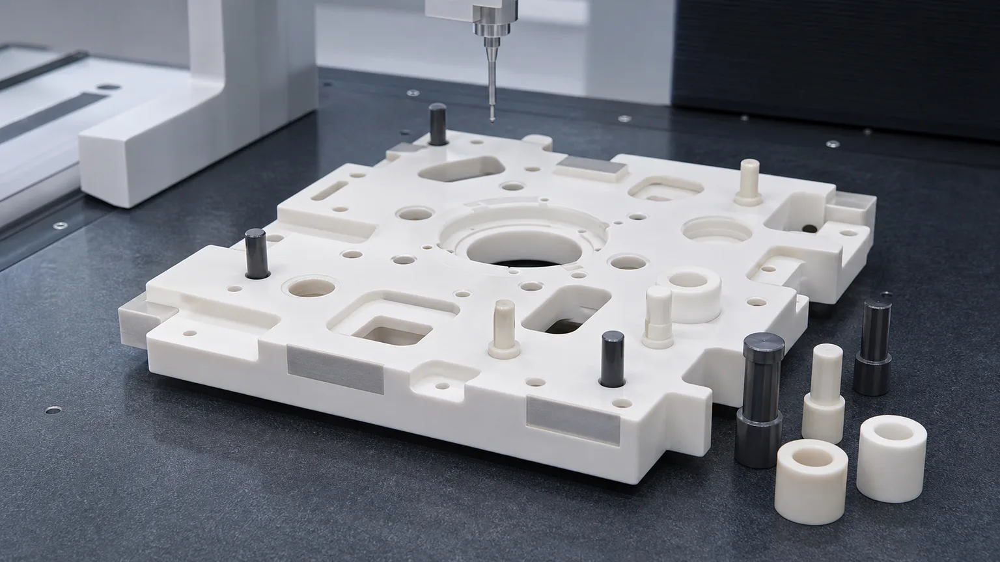
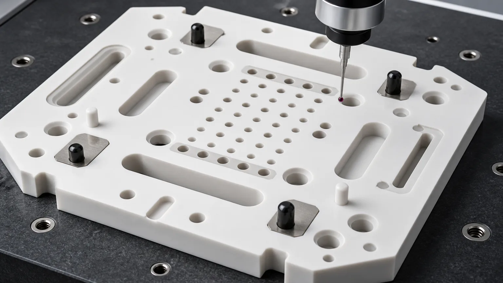
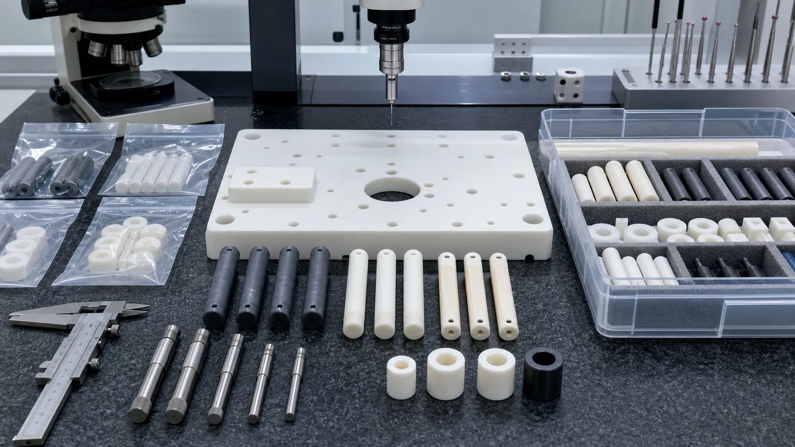

> A precision ceramic fixture plate should not be quoted as a simple flat plate with holes. For semiconductor inspection, clean automation, sensor assembly, and high-purity production fixtures, the accepted part depends on material grade, datum strategy, bore position, locating-pin fit, lapped pads, edge-chip limits, cleaning, packaging, and the inspection evidence that proves the fixture can repeat.

This is a representative engineering case study, not a claim about a named customer program. It reflects a common RFQ pattern: an engineering team needs a ceramic fixture plate with locating pins, guide bushings, insulating spacers, and protected contact surfaces for an inspection or assembly station. The CAD model looks straightforward. The quotation risk is not.

The buyer may say:

**We need an alumina ceramic plate with holes and pins for a clean inspection fixture. Can you quote it?**

The better first question is:

**Which surface is the datum, which bores locate the assembly, which pins touch the workpiece, and what evidence proves the fixture will repeat after cleaning, packaging, and installation?**

For broad background, use the [precision ceramic machining guide](/posts/industrial-ceramic-machining/precision-ceramic-machining-high-performance-industrial-components/), the [custom ceramic CNC machining RFQ checklist](/posts/rfq-preparation/custom-ceramic-cnc-machining-rfq-checklist/), and the [ceramic tolerance capability map](/posts/tolerances-gdt/ceramic-tolerance-capability-map-by-feature-process/). This article narrows the discussion to fixture plates, locating pins, and inspection automation.

## Why This Case Has Current And Long-Term Search Value

The near-term signal is semiconductor and automation investment. [SEMI reported on April 1, 2026](https://www.semi.org/en/semi-press-release/semi-projects-double-digit-growth-in-global-300mm-fab-equipment-spending-for-2026-and-2027) that worldwide 300mm fab equipment spending is expected to grow in 2026 and 2027, with AI chip demand as a major driver. More tools, inspection stations, transfer systems, and high-purity subsystems mean more demand for stable fixture materials, low-particle interfaces, and inspection-ready ceramic components.

Automation is also a durable trend, not only a one-year news cycle. The [International Federation of Robotics](https://ifr.org/ifr-press-releases/news/record-of-4-million-robots-working-in-factories-worldwide) reported that the global operational stock of industrial robots passed 4 million units, and its outlook describes continuing long-term growth. Precision ceramic fixture parts fit this trend where production needs insulation, dimensional stability, wear resistance, low contamination, or stable reference geometry.

Ceramic suppliers already position fine ceramics in semiconductor and inspection equipment. [Kyocera's semiconductor processing overview](https://global.kyocera.com/prdct/fc/wp/catalog/semiconductor/index.html) lists high-precision ceramic uses around inspection equipment, probers, wafer transfer arms, end effectors, vacuum chucks, nozzles, and related tool components. For CERAMIC CNC, the SEO opportunity is not to repeat catalog language. It is to translate that demand into RFQ-ready machining decisions.

## The Starting Requirement

The starting RFQ in this case pattern was a fixture set for a clean inspection or assembly cell:

- One alumina ceramic fixture plate with pockets, slots, precision bores, and datum pads.
- Several zirconia locating pins for low chip risk and wear-resistant contact.
- Dark silicon nitride guide pins where strength, stiffness, or wear mattered.
- Alumina or zirconia bushings for insulating or wear-resistant guide locations.
- Lapped or ground contact pads that set part height and repeatability.
- Clean packaging because contact faces and pin tips could not be damaged in shipment.

The part family was not difficult because of one extreme feature. It was difficult because many moderate features had to work together. A single bore position error could shift the assembly. A small chip on a locating edge could create a particle. An unprotected lapped pad could pass inspection and then arrive scratched. A missing datum note could make the CMM report meaningless.

## RFQ Inputs That Changed The Review

The first useful step was to separate the drawing into functions.

| RFQ input          | What the buyer should define                                                                                  | Why it changes the quote                                                   |
| ------------------ | ------------------------------------------------------------------------------------------------------------- | -------------------------------------------------------------------------- |
| Fixture role       | Inspection nest, assembly fixture, sensor module fixture, clean automation fixture, or wafer-adjacent support | Controls material choice, cleaning, edge criteria, and inspection evidence |
| Primary datum      | Ground or lapped face, bore pair, edge, pad, or customer fixture reference                                    | Determines setup, CMM strategy, and which surfaces must be finished        |
| Locating features  | Precision bores, dowel holes, ceramic pins, slots, bushings, and adjustable holes                             | Controls positional tolerance, reaming/grinding route, and pin fit         |
| Contact surfaces   | Lapped pads, support lands, probe contact zones, edge-contact areas, or clearance faces                       | Prevents over-specifying the whole part while missing the real interface   |
| Material route     | Alumina, zirconia, silicon nitride, AlN, Macor prototype, or hybrid set                                       | Changes grinding, chipping, strength, thermal, and cleaning risk           |
| Clean handling     | Particle sensitivity, solvent compatibility, packaging, tray separation, or customer final clean              | Affects finishing, washing, drying, bagging, and arrival condition         |
| Inspection package | CMM report, flatness map, bore gauge, pin fit, optical edge review, or sample approval                        | Aligns cost with acceptance instead of a generic pass/fail report          |

If these inputs are missing, the supplier may still produce a price, but the price is not a reliable engineering quote.

## Why The First CAD Was Not Quote-Ready

The first CAD model showed the plate, bores, pins, and slots. It did not explain the acceptance logic. That is common with fixture RFQs because the fixture is often designed by the team that already knows the assembly. The supplier does not.

Typical gaps include:

- The largest face is assumed to be a datum, but the drawing does not say whether it is ground, lapped, or only a support surface.
- The locating bores have tight positional tolerance, but no datum scheme defines how they will be inspected.
- All edges say "break sharp edges," but the workpiece-contact edges need a different chip criterion than clearance edges.
- The pins are shown as ceramic, but the material choice between zirconia, alumina, and silicon nitride is not justified by load, wear, or temperature.
- Slots are drawn with sharp internal corners that increase ceramic chipping risk.
- The fixture plate has several lapped pads, but no flatness map or height-matching requirement says which pads matter.
- The packaging note says "clean packaging," but does not state whether pins, lapped pads, and bores must be separated or protected.

The review converted the CAD from a shape into a manufacturing and inspection package.

## Material Route: Alumina Plate, Zirconia Pins, Silicon Nitride Guides

Most fixture plates begin with alumina because it is a strong default for insulation, stiffness, clean handling, and practical precision ceramic machining. But the complete fixture set may use more than one ceramic.

| Ceramic material                                                                                                              | Where it can fit in this fixture case                                              | RFQ caution                                                                          |
| ----------------------------------------------------------------------------------------------------------------------------- | ---------------------------------------------------------------------------------- | ------------------------------------------------------------------------------------ |
| [Alumina Al2O3](/posts/industrial-ceramic-machining/precision-machined-alumina-ceramic-parts-industrial-applications/)        | Fixture plates, insulating spacers, bushings, datum plates, clean automation nests | Define purity, fired state, flatness, bores, edge criteria, and cleaning expectation |
| [Zirconia ZrO2](/posts/industrial-ceramic-machining/zirconia-ceramic-machining-high-strength-precision-components/)           | Locating pins, small guides, contact posts, low-chip-risk wear features            | Review temperature, wear, pin OD finish, roundness, and mating surface               |
| [Silicon nitride Si3N4](/posts/industrial-ceramic-machining/silicon-nitride-ceramic-machining-structural-wear-parts/)         | Strong guide pins, wear elements, compact supports, pins with mechanical load      | Review grade, load path, chamfer, roundness, and inspection method                   |
| [Aluminum nitride AlN](/posts/industrial-ceramic-machining/aluminum-nitride-ceramic-machining-thermal-management-components/) | Heater-adjacent fixture pads or thermal-interface support plates                   | Protect thermal-contact faces and define flatness, Ra, and moisture handling         |
| [Macor](/posts/industrial-ceramic-machining/macor-machinable-glass-ceramic-parts-applications-design-guide/)                  | Prototype fixture bodies or fast lab trials                                        | Useful for iteration, but not a drop-in production substitute without service review |

The RFQ should not say only "ceramic." It should say what the fixture must survive: temperature, cleaning chemistry, electrical insulation, contact load, sliding wear, particle sensitivity, and measurement repeatability.

## Datum Strategy Is The Core Of The Case

The fixture plate is not valuable because it is ceramic. It is valuable because it locates something repeatedly. That makes datum planning the core of the case.

A quote-ready drawing should answer:

- Which face is datum A?
- Which two bores or edges define datum B and datum C?
- Which holes are true locating bores and which are clearance holes?
- Which surfaces are lapped pads rather than general ground faces?
- Which pin OD and bore ID relationship controls fit?
- Is pin fit slip, press, adhesive, or customer-assembled?
- Should inspection happen free-state, supported, clamped, or in a customer fixture?

For ceramic parts, a datum is not just a drawing symbol. It determines how the plate is held, ground, measured, cleaned, and protected. A rough as-fired face should not become a tight reference unless the process route supports that decision.

## Precision Bores, Slots, And Pin Interfaces

The most common mistake is applying a tight tolerance to every hole. A fixture usually needs several classes of holes:

| Feature class         | Typical control                                                | RFQ note                                                               |
| --------------------- | -------------------------------------------------------------- | ---------------------------------------------------------------------- |
| Primary locating bore | Diameter, position, roundness, chip-free lead-in, CMM evidence | Usually needs the cleanest datum relationship                          |
| Pin-retention bore    | Fit type, bore finish, depth, wall thickness, edge break       | Specify whether the customer installs the pin or supplier assembles it |
| Clearance hole        | Practical diameter and edge break                              | Do not overprice if it does not locate the assembly                    |
| Elongated slot        | Width, end radius, breakout limit, position to datum           | Replace sharp ends with ceramic-friendly radii when possible           |
| Lapped pad            | Height, flatness, parallelism, surface finish                  | Apply low Ra only where contact or measurement needs it                |
| Counterbore or pocket | Bottom radius, depth, edge chip limit                          | Avoid sharp internal corners and fragile webs                          |

For hole-heavy designs, pair this case with the [ceramic micro-hole machining RFQ guide](/posts/micro-hole-machining/ceramic-micro-hole-machining-rfq/). For thin webs, slots, and edge risks, use the [ceramic CNC machining design rules](/posts/design-rules-dfm/ceramic-cnc-machining-design-rules-advanced-ceramic-parts/).

## Edge Quality Is A Functional Requirement

Fixture parts often fail by small edge details. A chip at a nonfunctional outside corner may be acceptable. A chip at a locating bore, pin tip, probe contact pad, or workpiece support edge may not be acceptable.

Do not use a universal "no chips" note. Define edge zones:

- Workpiece-contact edges.
- Locating bore lead-ins.
- Pin tips and pin shoulders.
- Lapped pad perimeters.
- Slot edges near fragile webs.
- Clearance edges and handling edges.

Each zone can have a different chamfer, radius, chip limit, and inspection magnification. This is where the [ceramic surface finish and subsurface damage guide](/posts/surface-finish-functional/ceramic-ssd-surface-finish-specify-control-price/) helps. Surface finish, lapping, polishing, and visual criteria should be tied to function, not applied as a blanket note.

## Inspection Plan For The First Article

The first article should prove that the fixture can be installed, used, and repeated. Appearance is not enough.

| Requirement              | Evidence to discuss                                      | Why it matters                                              |
| ------------------------ | -------------------------------------------------------- | ----------------------------------------------------------- |
| Datum face flatness      | Flatness map, CMM, optical method, or lapping note       | Controls reference stability and height repeatability       |
| Locating bore position   | CMM report from agreed datums                            | Proves the feature relationship that the fixture depends on |
| Bore diameter and fit    | Pin gauge, bore gauge, air gauge, or assembled pin check | Prevents loose, tight, or damaged pin interfaces            |
| Pin OD and roundness     | Micrometer, roundness, CMM, or sampling plan             | Controls repeatable location and wear behavior              |
| Lapped pads              | Flatness, height, Ra, and protected packaging            | Protects functional contact areas                           |
| Slot and pocket geometry | CMM, optical, or fixture check                           | Avoids stress concentration and assembly interference       |
| Edge quality             | Visual or microscope review by zone                      | Controls particles, cracks, and handling damage             |
| Clean handling           | Cleaning note, separated packaging, protected trays      | Preserves the inspection state after shipment               |

When final fixture repeatability is tested by the customer, say that in the RFQ. The machining supplier can provide geometry, finish, cleaning, and packaging evidence, but the customer may own final process capability testing inside the machine or inspection cell.

## Cleaning And Packaging Are Part Of Acceptance

Clean automation fixtures often fail after machining for reasons that do not appear on a simple dimensional report:

- Lapped pads rub against another part during shipping.
- Pin tips contact each other and develop small chips.
- Bores contain grinding residue.
- Plastic bags scuff a critical face.
- Foam or tray material contaminates a clean surface.
- Loose mixed parts make incoming inspection slow and uncertain.

The RFQ should define whether the parts need individual bagging, tray pockets, face separators, pin-tip protection, or customer final cleaning. Clean packaging is especially important when the fixture is used around sensors, semiconductor components, high-purity fluid hardware, optical equipment, or vacuum-side assemblies.

For adjacent topics, see the [precision ceramic components for cleanroom and high-purity manufacturing systems guide](/posts/high-purity-cleanroom/precision-ceramic-components-cleanroom-high-purity-manufacturing-systems/) and the [precision ceramic components for sensors and measurement devices guide](/posts/sensor-measurement-devices/precision-ceramic-components-sensors-measurement-devices/).

## Cost Drivers In This Fixture Case

The cost of a ceramic fixture set is usually driven by the interaction of features, not by plate size alone.

Common cost drivers include:

1. Material grade, fired blank quality, and blank availability.
2. Large flatness requirement on the fixture plate.
3. CMM-controlled bore positions relative to finished datums.
4. Lapped pads or matched height requirements.
5. Zirconia or silicon nitride pin OD grinding and roundness.
6. Tight pin-to-bore fit or supplier-side assembly.
7. Slots, pockets, counterbores, and internal corner radii.
8. Edge-chip criteria near locating and contact zones.
9. Cleaning, tray packaging, traceability, and inspection report scope.
10. Prototype revision risk before the fixture geometry is frozen.

Cost control does not mean loosening the whole drawing. It means ranking features. Put tight controls on the datums, locating bores, pin interfaces, lapped pads, and workpiece-contact edges. Allow practical finish and tolerance on clearance pockets, nonfunctional exterior edges, and cosmetic surfaces.

## When This Case Is A Good Fit

Precision ceramic fixture plates and locating pins are worth reviewing when:

- The fixture needs electrical insulation near sensors, probes, power electronics, or test hardware.
- The part needs clean, low-particle, corrosion-resistant, or high-purity behavior.
- Thermal stability, wear resistance, or nonmagnetic behavior helps the inspection or assembly process.
- Locating pins, bushings, and datum pads must maintain repeatability.
- Metal fixtures create contamination, wear, electrical, or thermal problems.
- The buyer can define datums, functional surfaces, material route, inspection evidence, and packaging.

They are weaker when:

- A simple aluminum or stainless steel fixture already meets insulation, wear, cleanliness, and stability needs.
- The drawing has many tight tolerances but no functional ranking.
- The part uses sharp metal-style pockets, thin webs, or unsupported geometry that can be redesigned.
- The customer cannot define which surfaces locate the assembly.
- The only goal is to replace a low-cost metal plate with ceramic without a functional reason.

Use the [ceramic material selection guide](/posts/materials-grade-selection/ceramic-material-selection-cnc-machining/) and [green machining vs hard machining guide](/posts/process-routes-control/green-machining-vs-hard-machining/) before locking the route.

## RFQ Checklist For Ceramic Fixture Plates And Locating Pins

Send the following before expecting a reliable quotation:

1. 2D drawing with revision and STEP or native CAD file.
2. Fixture function: inspection nest, assembly fixture, robot interface, sensor fixture, wafer-adjacent support, or clean automation part.
3. Material grade for the plate, pins, bushings, spacers, and any allowed alternatives.
4. Blank source requirement: customer-supplied or supplier-sourced, fired blank, plate, rod, near-net blank, or prototype material.
5. Datum scheme and which faces, bores, pads, or edges are functional.
6. Bore classes: locating, retention, clearance, vacuum, vent, or adjustment.
7. Pin fit: slip, press, bonded, customer-assembled, supplier-assembled, matched set, or interchangeable lot.
8. Surface finish, flatness, lapping, and height requirements by face.
9. Chamfer, radius, edge break, and chip criteria by zone.
10. Inspection report scope: CMM, flatness, bore, pin, edge, visual, material certificate, or CoC.
11. Cleaning, packaging, tray separation, and protected face requirements.
12. Quantity, prototype or production stage, target timing, and revision risk.

If the RFQ is not ready, start from the [RFQ page](/rfq/) and send drawings, CAD files, material or grade, quantity, target timing, functional surfaces, surface finish, edge criteria, and inspection evidence.

## FAQ

**Why use ceramic for fixture plates instead of metal?**  
Ceramic may be useful when insulation, wear resistance, low contamination, thermal stability, chemical resistance, or nonmagnetic behavior matters. It should not be used only because the part looks premium.

**Which ceramic is best for locating pins?**  
Zirconia is often reviewed for tougher precision pins, while silicon nitride can fit stronger guide or wear roles. Alumina can work for insulating pins or spacers. The right choice depends on load, temperature, wear, mating material, cleaning, and inspection.

**Can a ceramic fixture plate be quoted from a STEP file only?**  
A STEP file can start review, but a useful RFQ usually needs a 2D drawing with datums, functional surfaces, material grade, bore classes, pin fit, edge criteria, cleaning, packaging, quantity, and inspection requirements.

**Should every face be lapped?**  
No. Lapping should be assigned to functional datum faces, contact pads, seal lands, or height-critical surfaces. Blanket lapping can raise cost without improving fixture performance.

**What inspection evidence should be requested?**  
Common evidence includes CMM report, flatness map, bore gauge or pin gauge checks, pin OD measurement, visual edge review, surface finish readings, cleaning note, protected packaging confirmation, and certificate of conformity.

> RFQ note: Final feasibility, tolerance, price, lead time, cleaning method, packaging, and inspection scope depend on drawing review, ceramic grade, blank state, functional surfaces, machining route, and acceptance method.
