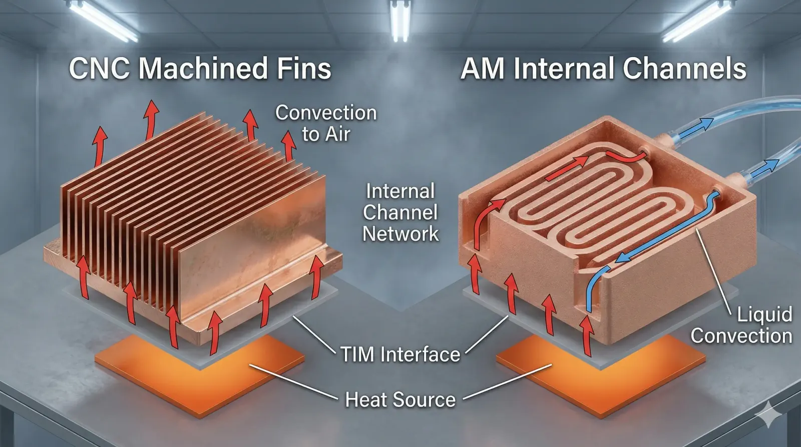
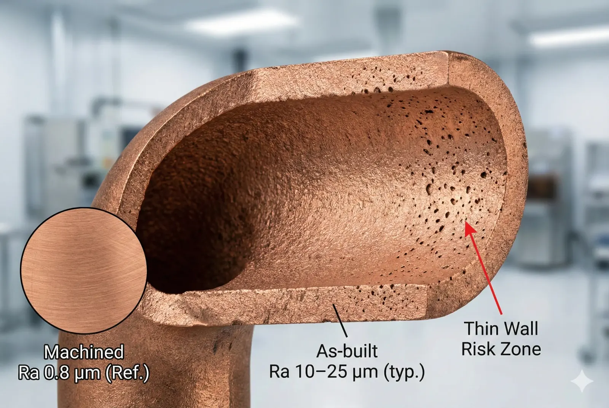
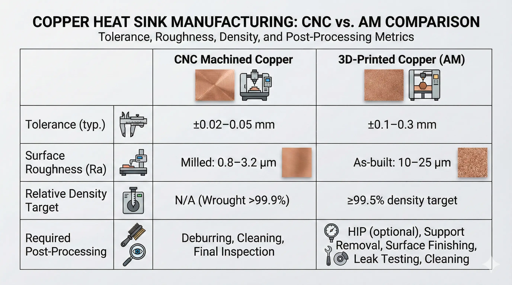

> **CNC-machined copper heat sinks are clearly feasible for tight-tolerance, low-risk thermal hardware (±0.02 mm class) when you can live with “open” fin/channel geometries. 3D-printed copper heat sinks are conditionally feasible when you need internal flow networks or topology-optimized lattices, but engineering teams must account for porosity control (e.g., ≥99.5% relative density targets), surface roughness (Ra 10–25 µm as-built), and mandatory post-processing to make performance repeatable.**

### CNC Machining vs 3D Printing for Copper Heat Sinks: The Common RFQ Dilemma

We often see the same request pattern: “We need lower junction temperature, but we also need it fast, auditable, and manufacturable.” The attraction of 3D printing is obvious—internal channels, compact footprints, and geometric freedom—while CNC machining looks “safer” because tolerances and surface finishes are predictable (Ra ~0.8–3.2 µm on milled surfaces is routine with the right tooling).

Where projects get stuck is not the headline thermal conductivity number; it is the manufacturability tax. Copper is a type of high-conductivity material (typical k ≈ 380–400 W/m·K for high-purity grades), and it is also a type of manufacturing “stress test” because it is reflective (for lasers) and gummy (for cutting), which pushes both AM process stability and CNC tool wear.

### Copper Heat Sink Physics: Thermal Resistance, Surface Area, and Contact Losses

A copper heat sink is a type of thermal resistor network: conduction through the base, spreading into fins (or internal walls), and convection into air or liquid. In practice, the interface dominates earlier than teams expect—an extra 20–60 µm of flatness error or a surface finish mismatch can add measurable contact resistance when clamping pressure is limited (e.g., <1 MPa on fragile modules).

CNC machining keeps the “contact layer” controllable: base flatness in the 0.02–0.05 mm range and planar Ra <1.6 µm are achievable without heroic steps, which makes thermal interface material (TIM) thickness more predictable (often 30–100 µm in real assemblies). The upside is repeatability; the downside is geometry: you are mostly constrained to open fins, drilled galleries, or brazed stacks once you need internal complexity.

3D printing (typically LPBF variants for copper) changes the constraint set. It can create internal flow manifolds, lattice cores, and curved microchannel networks that CNC cannot reach. But the heat sink becomes a type of “post-processing project”: you must plan for support removal, stress relief, surface finishing, and often critical face machining because as-built copper surfaces commonly land at Ra ~10–25 µm and dimensional tolerances often start in the ±0.10–0.30 mm band before secondary ops.

### Manufacturing Reality: What CNC Copper and 3D-Printed Copper Actually Deliver

#### CNC-Machined Copper Heat Sinks: Capability Envelope

We treat CNC as the baseline when requirements include: (1) high contact quality, (2) tight positional tolerances for assembly, and (3) short verification loops. For fin heat sinks, 0.8–1.5 mm fin thickness is achievable depending on height and tool reach, while base tolerances of ±0.02–0.05 mm are a normal quoting regime. The trade is geometric freedom: closed internal channels are not “machined,” they are “assembled” (brazed plates, diffusion-bonded laminations, or soldered stacks), which adds its own yield and leak-test burden.

#### 3D-Printed Copper Heat Sinks: Capability Envelope

We treat AM as a geometry enabler, not as a shortcut. When internal channels matter, AM can place flow exactly where heat is generated, reduce manifold volume, and integrate mounts. But the physics shows up as manufacturing constraints: you must control relative density (often targeting ≥99.5% for pressure-bearing parts), verify porosity distribution, and accept that “as-built” surfaces raise pressure drop and reduce convective heat transfer unless you finish the wetted surfaces (chem polish / abrasive flow / reaming / machining, depending on channel size).

### Execution Log: One Copper Cold Plate Program That Forced a Pivot

**Client context (anonymized):**a power electronics team needed a compact copper heat sink for liquid cooling with a footprint cap, and they wanted internal serpentine channels to avoid external tubing. Heat load was ~1–2 kW, coolant was water/glycol, and leak-tightness was non-negotiable (helium leak test requirement implied).

**What we tried:**we first pursued 3D-printed copper to realize a tight internal manifold and eliminate brazed joints. The first build met the envelope, but pressure drop was higher than predicted because as-built internal surfaces behaved like a rough pipe (Ra effectively in the 10–25 µm class), and cleaning/inspection of small internal turns became its own schedule line item.

**Failure mode (the pivot point):**we hit repeatability risk: two builds with similar external dimensions produced different flow restriction because micro-porosity + surface texture changed the hydraulic diameter in the most sensitive channel sections. Even if relative density targets were met, the “local defect” risk at thin walls was not ignorable for a production program.

**Resolution:**we pivoted to a CNC + bonded stack architecture: machined plates with open channels, then brazed/diffusion-bonded, then final-face machined the interface and ports. Thermal performance landed within target, pressure drop became predictable, and leak yield improved after process tuning.

**The bill (the real tax):**we paid for the pivot in three places: (1) added joint qualification (coupon testing + metallography), (2) leak testing every unit (time + fixture cost), and (3) a longer NPI loop because joint process control is a discipline, not a checkbox. Compared to “print-and-ship,” the path was slower—but it was auditable and scalable.

### Data Forensics Table: Copper Heat Sink Decision Parameters

| Parameter | Standard Approach | Advanced Approach | The Trade-off |
| --- | --- | --- | --- |
| Base flatness / contact planarity | CNC face milling, 0.02–0.05 mm typical | CNC + lapping, ≤0.01–0.02 mm achievable | Lapping adds cost + handling risk (scratch/warp). |
| Surface roughness at TIM interface | CNC finish, Ra ~0.8–1.6 µm | Superfinish / lap, Ra ≤0.4–0.8 µm | Diminishing returns if TIM thickness is already ≥50 µm. |
| Internal geometry (closed channels) | Machined plates + braze/bond | 3D-printed monolithic manifold | Printing reduces joint count but increases post-processing + inspection complexity. |
| Internal surface condition (flow walls) | CNC channels, Ra ~1.6–3.2 µm | AM as-built, Ra ~10–25 µm; then finish ops | Finishing internal AM channels can be infeasible below certain diameters. |
| Dimensional tolerance (as delivered) | ±0.02–0.05 mm common | AM near-net ±0.10–0.30 mm then machine critical faces | AM requires machining anyway for interfaces and ports. |
| Thermal conductivity continuity | Wrought copper k ~380–400 W/m·K | AM copper is density- and process-dependent (set target ≥99.5% rel. density) | Porosity and grain structure can reduce effective k and consistency. |
| Leak risk (liquid cooling) | Joints are the risk (braze/bond) | Bulk defects + local porosity are the risk | Different failure modes; both demand test strategy. |
| Lead time dynamics | Faster iteration if geometry is simple | Faster iteration if geometry is complex and post-processing is mature | AM lead time is dominated by post-processing queue, not build time. |
| Cost drivers | Tooling time + scrap on thin fins | Powder cost + machine time + post-processing + CT/inspection | AM costs scale with volume and QA burden; CNC scales with cycle time. |

*Test method: validate thermal with ASTM D5470-style interface characterization (for TIM/contact) and confirm pressure drop vs flow on a calibrated loop; verify leak with helium mass spectrometry where required.*

### Feasibility Verdict: CNC vs 3D-Printed Copper Heat Sinks

#### Clearly Feasible: CNC-Machined Copper Heat Sinks

Go ahead if:

- Your geometry is external fins, open channels, or simple drilled passages (no hidden cavities).
- You need tight assembly control (±0.02–0.05 mm) and reliable TIM contact (Ra ≤1.6 µm on the base).
- You expect production scaling where yield and inspection must stay simple.

#### Conditionally Feasible: 3D-Printed Copper Heat Sinks (High-Cost Route)

Possible, but expect high cost/complexity if:

- You require internal manifolds, lattice cores, or topology-optimized structures that cannot be assembled.
- You can fund the “qualification stack”: density/porosity validation (often ≥99.5% targets), mandatory face machining, and a cleaning + inspection method that proves internal feature integrity.
- Your performance win is large enough to justify post-processing and QA as permanent line items (not NPI-only).

#### Structurally Mismatched: 3D-Printed Copper Heat Sinks Without Post-Processing

Not recommended if:

- You need liquid-tight parts but cannot support leak testing and defect screening.
- Your design depends on as-built internal surfaces to meet pressure-drop and heat-transfer targets.
- You expect CNC-like tolerances without secondary machining on interfaces/ports.

> **Project Readiness Check**- Before committing, ask yourself (or your supplier):
>   - What is the acceptance criteria for density/porosity (e.g., ≥99.5% relative density) and how will it be measured on production parts (coupon, CT, sectioning)?
>     - Which surfaces are “functional” (TIM, seals, ports), and which ones will be machined post-build vs left as-built—and what is the plan if internal channels cannot be finished?

**Is 3D-printed copper always better for thermal performance?**

No. 3D printing helps when geometry is the bottleneck (internal flow placement, manifolds, lattice). If your constraint is TIM contact, base flatness, or predictable convection surfaces, CNC often wins because Ra and flatness are controllable without a large post-processing stack.

**When does CNC machining lose to 3D printing?**

When the required performance depends on sealed internal networks that cannot be economically fabricated as a bonded stack. If your manifold complexity drives multiple joints, alignment steps, and leak paths, a monolithic printed architecture can be the lower-risk solution—provided you accept the inspection and finishing program.

**What is the most common hidden cost in 3D-printed copper heat sinks?**

Post-processing and verification. The recurring costs are typically: machining all functional faces, removing supports, cleaning internal passages, and proving integrity (density/porosity strategy plus leak testing for liquid parts). These costs do not disappear after prototyping.

**Can internal AM channels be made “smooth enough” for low pressure drop?**

Sometimes, but it depends on channel diameter, curvature, and access. If you cannot apply an internal finishing method (reaming, abrasive flow, chemical polish) reliably, you should assume as-built roughness will increase pressure drop and treat that as a design constraint.

**What is the safest hybrid approach?**

Print for geometry, machine for interfaces. Use AM to create the internal network or lattice, then CNC machine the TIM interface, seal faces, and ports to tolerance. This hybrid is often the only way to combine geometric freedom with assembly-grade surfaces.

> *Disclaimer: All scenarios described are based on real or closely analogous executed projects. If you choose to implement any of the examples described in this article, please conduct a careful evaluation first. This site assumes no responsibility for losses resulting from implementations made without prior evaluation.*

---
