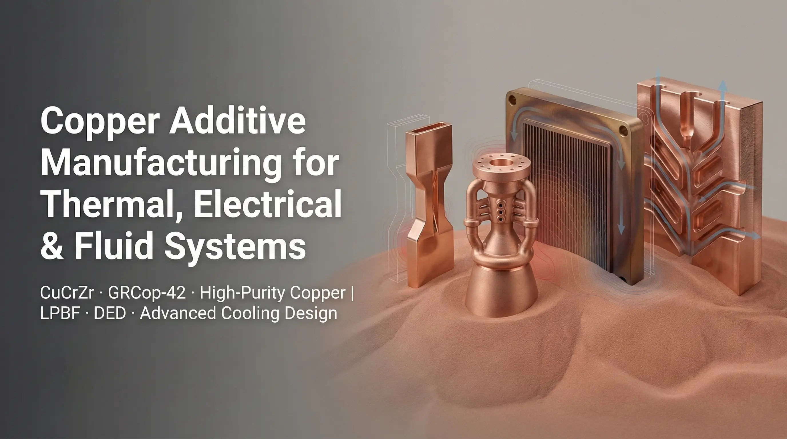

> A useful copper 3D printing service RFQ does not need to be overprepared. Send the CAD or drawing, quantity, material preference if known, lead time, and the requirements that affect acceptance. A simple part can be quoted with basic assumptions; a demanding thermal, fluid, electrical, or RF part usually needs a focused engineering review before the quote is reliable.

### What a Copper 3D Printing Service Actually Reviews

Copper 3D printing service is not only a build-price question. For custom copper parts, the quote usually depends on the full route:

- Whether the geometry is a good fit for LPBF copper or CuCrZr.
- Whether critical faces need CNC machining after printing.
- Whether internal channels can be cleaned, inspected, and accepted.
- Whether conductivity, pressure, thermal, electrical, RF, or vacuum requirements change material and post-processing.
- Whether CT, leak testing, pressure testing, thermal testing, or dimensional reports are required.

This is why the same drawing can produce two very different quote routes. A simple copper bracket with light machining may be treated as a basic part. A copper cold plate with buried channels and a leak target needs a different review, even if the outside dimensions look similar.

### When Copper 3D Printing Is Worth Quoting

LPBF copper and copper alloy printing is most useful when additive manufacturing changes the engineering outcome, not when it only replaces machining.

Good RFQ candidates usually have one or more of these drivers:

- Internal cooling channels, manifolds, or non-planar flow paths.
- Compact heat sinks where fins, pins, or liquid passages cannot be routed cleanly by CNC.
- Electrical copper parts with compact 3D current paths or integrated cooling.
- RF, vacuum, or semiconductor copper hardware where geometry and consolidation matter.
- Low-to-mid volume parts where tooling or multi-part assembly is not attractive.

Weak RFQ candidates are usually simple plates, oversized blocks, cosmetic copper parts, or geometries where standard CNC, skiving, brazing, casting, or fabrication gives the same function with less risk.

### What to Send for a First Review

The fastest RFQ is not the longest RFQ. It is the clearest RFQ.

| Input | Why it matters | Minimum useful detail |
| --- | --- | --- |
| CAD file | Confirms geometry, build orientation, supports, and machining access | STEP, X_T, or native CAD |
| 2D drawing | Defines what must be controlled | Datums, tolerances, sealing lands, threads, flatness, critical faces |
| Quantity | Changes route, nesting, post-processing, and inspection cost | Prototype, pilot lot, or batch quantity |
| Material preference | Controls conductivity, strength, heat treatment, and risk | Pure copper, CuCrZr, GRCop-42, or "please review" |
| Lead time | Affects whether advanced inspection or outsourced finishing is realistic | Target date or schedule constraint |
| Functional requirement | Prevents quoting a part that cannot be accepted later | Heat load, pressure, current, RF band, vacuum, service temperature |
| Inspection scope | Major cost and lead-time driver | CT, leak test, pressure test, CMM, thermal test, conductivity report |

If you only have a drawing and quantity, send that. The quote may use basic assumptions, and clarification may follow if the part has hidden risk.

### Material Selection: Do Not Start With the Alloy Name Alone

Most RFQs begin with pure copper, CuCrZr, or GRCop-42, but the right route depends on function.

Pure copper is usually reviewed when thermal or electrical conductivity is the main requirement and mechanical loads are controlled. CuCrZr is usually reviewed when strength, clamp-load stability, or service temperature matters. GRCop-42 is typically discussed for high-temperature aerospace or thermal hardware where qualification expectations are higher.

If the material is not fixed, send the operating condition instead:

- Heat load, coolant, flow rate, and allowable temperature rise for thermal parts.
- Current, duty cycle, contact faces, plating, creepage, and clearance for electrical parts.
- Frequency band, surface requirement, plating, and test method for RF hardware.
- Pressure, leak target, cleaning, trapped-volume concern, and bakeout needs for vacuum or fluid parts.

Use the [materials page](/materials/) when the alloy choice is still open.

### Post-Processing Is Part of the Quote, Not an Afterthought

Printed copper parts often need post-processing to become useful hardware. A good RFQ says which surfaces and tests matter so the quote includes the correct route.

Common post-processing items include:

- Stress relief or heat treatment.
- CNC machining of datum faces, sealing lands, mounting planes, threads, and ports.
- Polishing, blasting, plating, coating, or cleaning.
- CT review for internal passages or trapped powder risk.
- Pressure, helium leak, flow, thermal, or conductivity testing.

For a [3D printed copper cold plate](/copper-cold-plates/), post-processing may be driven by sealing surfaces, leak targets, and CT inspection. For a [3D printed copper heat sink](/copper-heat-sinks/), the same quote may be driven by base flatness, surface finish, airflow, coolant pressure drop, or thermal test acceptance.

### Basic Quote vs Engineering Review

Not every RFQ receives the same style of response. That is normal.

| RFQ type | Typical response | What helps |
| --- | --- | --- |
| Simple geometry, clear quantity | Basic quote with assumptions | CAD, drawing, quantity, delivery target |
| Geometry is clear but requirements are missing | Clarification before quote | Critical tolerances, material, test needs, use condition |
| Internal channels or pressure boundary | Engineering review before quote | Channel model, pressure, leak target, cleaning and CT expectations |
| Electrical or RF function | Engineering review before quote | Current, voltage, RF band, surface finish, plating, contact requirements |
| Qualification-sensitive program | Route discussion and documentation scope | Acceptance criteria, inspection plan, reports, traceability needs |

The goal is not to make the first email perfect. The goal is to provide enough information that the supplier is not forced to guess the expensive parts of the quote.

### Common Reasons Copper 3D Printing RFQs Stall

Most delays come from missing acceptance information rather than missing geometry.

Common blockers include:

- The drawing shows internal channels but no pressure, leak, flow, or cleaning requirement.
- The heat sink has a thermal target but no airflow, coolant, interface, or test condition.
- The electrical part has current but no contact surface, plating, duty cycle, or insulation requirement.
- The material is specified as "copper" but conductivity, strength, or temperature expectation is not stated.
- The quote asks for CT, leak testing, or reports but does not define acceptance limits.

When these items are unclear, the professional response is to ask focused questions before quoting or to quote with stated assumptions.

### Practical RFQ Email Format

Use this short structure:

1. Part name and application.
2. CAD and drawing attachment.
3. Quantity and target lead time.
4. Material preference if known.
5. Critical surfaces, tolerances, ports, threads, or sealing areas.
6. Thermal, fluid, electrical, RF, vacuum, or service requirements.
7. Inspection or documentation required for acceptance.

Send the drawing and requirements to [info@szcomo.com](mailto:info@szcomo.com). If the request is clear, it can move toward quote. If key requirements are missing, we will ask focused questions before quoting.

