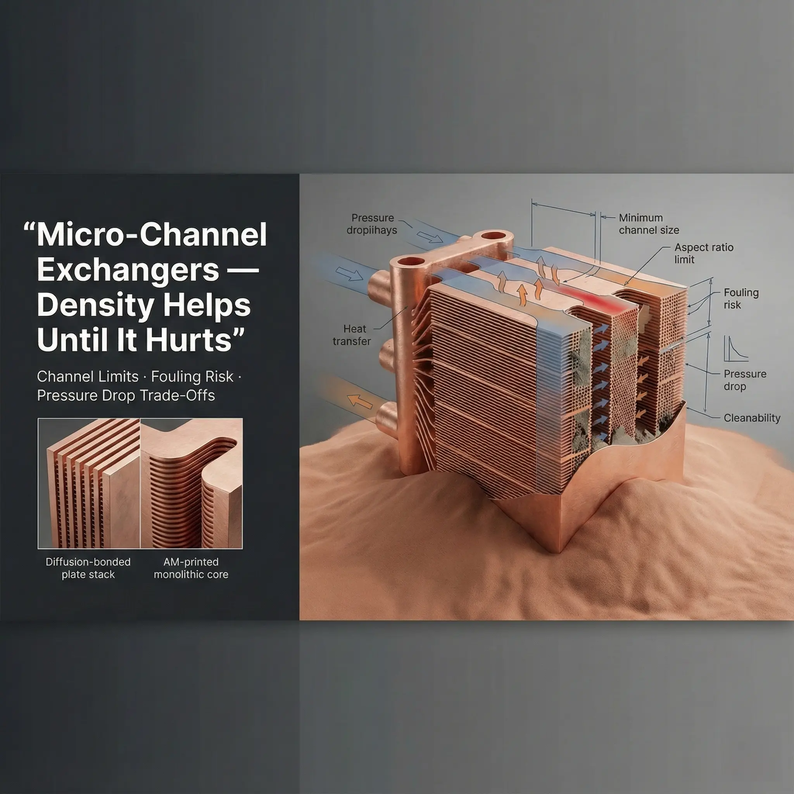

> Copper additive manufacturing is valuable when it solves a geometry, thermal, fluid, electrical, or assembly problem that conventional manufacturing cannot solve cleanly. It is not automatically the best route for every copper part. A strong RFQ states the function first, then lets the process route be reviewed against cost, risk, and acceptance criteria.

### Start With the Failure Mode, Not the Manufacturing Method

Many teams ask for "3D printed copper" before defining why printing is needed. That can lead to an expensive quote for a part that should be machined, brazed, skived, or fabricated.

A better starting question is:

**What breaks if this part is made conventionally?**

The answer usually falls into one of these categories:

- Internal flow paths cannot be machined or assembled without too many joints.
- Thermal performance depends on channel placement, manifold integration, or compact packaging.
- Electrical routing requires a 3D current path, integrated cooling, or part consolidation.
- A brazed, welded, or assembled design creates unacceptable leak or alignment risk.
- Low-volume development makes tooling or complex assembly unattractive.

If none of those are true, copper 3D printing may still be possible, but it may not be the best quote route.

### Quick Process Selection Table

| Route | Strong fit | Main risk | What to send in the RFQ |
| --- | --- | --- | --- |
| LPBF copper AM | Internal channels, integrated manifolds, complex thermal or electrical geometry | Post-processing, rough internal surfaces, inspection burden | CAD, function, material, critical faces, inspection and test needs |
| CNC machining | Simple blocks, plates, accessible channels, tight surfaces | Tool access, long cycle time for deep or tiny features | Drawing, tolerance stack, surface finish, quantity |
| Brazed copper assembly | Open-machined channels, volume parts, conventional cold plates | Braze joint quality, leak path, thermal cycling | Braze acceptance, leak target, pressure, cleaning requirement |
| Skiving or bonded fins | Forced-air heat sinks with repeatable fin fields | Geometry limits, contact resistance, attachment quality | Heat load, airflow, base interface, quantity |
| EDM or drilling | Slots, holes, electrodes, deep features in controlled directions | Slow features, access limits, debris removal | Feature drawing, tolerance, surface requirement |
| Fabrication or assembly | Large copper structures, simple routing, lower density | Joint resistance, leakage, alignment | Interfaces, joining method, inspection scope |

This table is not a rulebook. It is a way to avoid forcing every copper problem into the same manufacturing answer.

### When LPBF Copper AM Is the Right Quote Route

LPBF copper AM is worth reviewing when the part uses three-dimensional geometry to reduce risk or improve function.

Common examples include:

- [Copper cold plates](/copper-cold-plates/) with internal channels, integrated manifolds, or compact coolant routing.
- [Copper heat sinks](/copper-heat-sinks/) where fins, pins, internal liquid paths, and mounting features must fit inside a tight envelope.
- Electrical copper hardware where current path, heat removal, and compact routing are linked.
- RF, vacuum, or semiconductor parts where part consolidation reduces alignment or joint risk.

LPBF should be reviewed carefully when the part has:

- Long enclosed channels with limited powder removal access.
- Tight surface finish on hidden internal faces.
- High pressure or leak acceptance.
- Field-critical electrical or RF surfaces.
- Very large copper mass or very simple geometry.

In those cases, the question is not "can it print?" The question is whether the printed route can be cleaned, machined, tested, and accepted at a sensible cost.

### When CNC or Brazing Is Still the Better Route

CNC remains strong when features are accessible, surfaces must be tight, and geometry does not require true 3D internal routing. Simple copper blocks, mounting plates, busbar contact planes, and many heat spreaders should usually start with a CNC review.

Brazing remains strong for many cold plates because open channels can be machined efficiently and then sealed with a cover. At volume, a controlled brazed route can be more economical than a monolithic printed route.

The trade-off is joint risk. If the design has high pressure, thermal cycling, inaccessible leak paths, or a field failure cost that is unacceptable, the RFQ should compare the brazed route against a monolithic or printed route.

For more detail, see [monolithic vs brazed copper cold plates](/posts/EngineeringGuide/monolithic-vs-brazed-copper-cold-plates/).

### Process Choice Changes the Inspection Plan

Inspection should match the route.

For LPBF copper AM, common inspection questions include:

- Does CT need to confirm channel continuity or trapped powder risk?
- Is pressure or helium leak testing required?
- Are density, conductivity, or heat-treatment records needed?
- Which surfaces need post-machining and dimensional inspection?

For CNC or brazed routes, the inspection focus may shift:

- Tool-access features, flatness, and burr control for CNC.
- Braze seam quality, void risk, leak testing, and thermal cycling for brazed assemblies.
- Interface resistance, plating, and surface finish for electrical copper hardware.

Do not add every possible inspection item by default. Add the inspection that controls acceptance. Unnecessary inspection raises cost without making the part better.

### Ask for Two Routes When the Choice Is Unclear

When the route is genuinely uncertain, ask for a standard route and an advanced route:

- Standard route: CNC, brazed, skived, or conventional manufacturing if it can meet the requirement.
- Advanced route: LPBF copper AM when internal geometry, consolidation, or performance may justify it.

The RFQ should ask the supplier to state assumptions, risks, and required post-processing for each route. This gives the buyer something useful to compare beyond unit price.

### Process Selection Inputs for a Useful RFQ

Include these items when possible:

| Input | Why it matters |
| --- | --- |
| Function of the part | Determines whether geometry freedom matters |
| Quantity and stage | Prototype, qualification, and production have different route logic |
| Critical interfaces | Drives machining, flatness, surface finish, and inspection |
| Internal features | Drives powder removal, CT, pressure, and cleaning scope |
| Operating load | Heat, pressure, current, RF, vacuum, or service temperature changes route |
| Acceptance criteria | Prevents quoting a process that cannot pass the final test |

If the process is not fixed, say so. A clear requirement with an open process can produce a better quote than a fixed process with unclear acceptance.

### Practical Recommendation

Use copper 3D printing when the design needs internal geometry, compact integration, or part consolidation that changes performance or risk. Use conventional routes when they satisfy the requirement with fewer steps.

Send the drawing, quantity, requirements, and any known route preference to [info@szcomo.com](mailto:info@szcomo.com). If the route is uncertain, ask for a review of the practical manufacturing path before requesting a final price.

