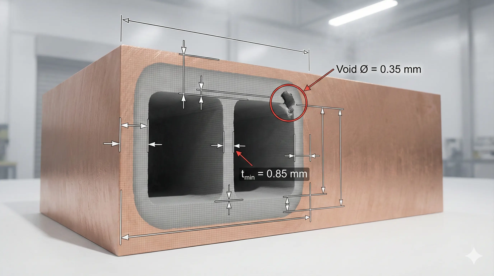
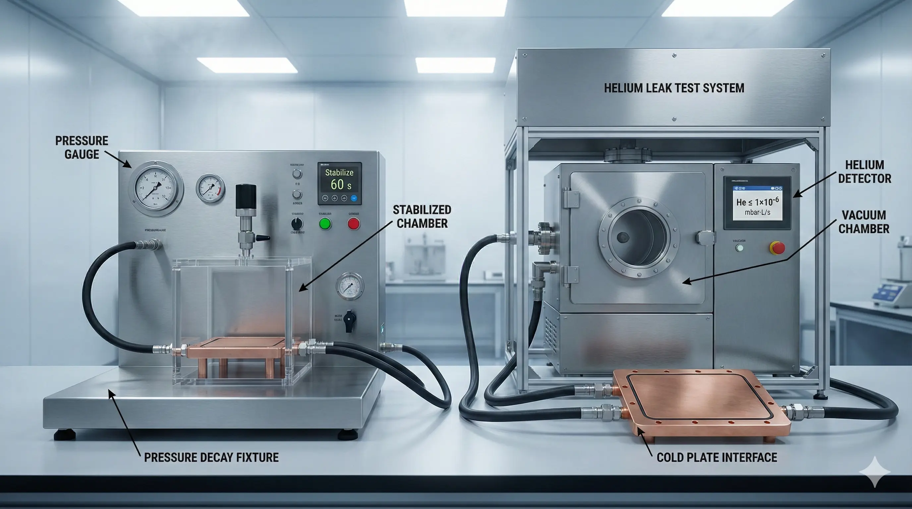
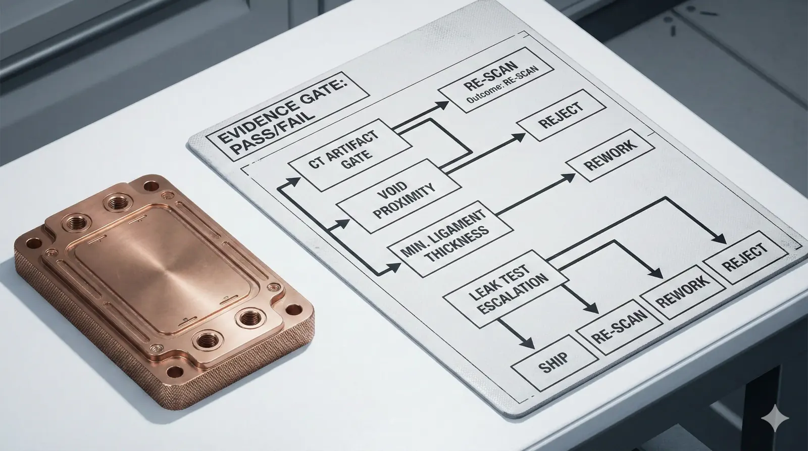

> Copper cold plate CT scan and leak test acceptance criteria only work when they are written as a trade-off ledger: defect risk vs. test sensitivity vs. throughput cost.

When a copper cold plate fails in the field, it rarely fails because “copper is weak.” It fails because a hidden void intersects a thin wall, a braze bridge becomes a leak path after thermal cycling, or a printed channel necks down until pressure drop and hotspot drift become the real defect. CT scanning and leak testing exist to prevent those failure modes, but “pass/fail” is meaningless unless you define (1) what defects matter for your geometry and duty cycle, and (2) what detection limits are realistic for the chosen inspection method.

This article provides an engineering-grade acceptance framework you can adapt to your specific cold plate design (machined + bonded, brazed stack, vacuum-brazed, or 3D printed copper). It is intentionally explicit about what criteria cost to enforce, what they miss, and how we structure escalation when results are ambiguous.

1. What you are actually trying to guarantee

Most teams say they want “no leaks” and “good internal quality.” The real objective is narrower:

A. Containment: no external leakage under specified pressure, temperature, and thermal cycling.
B. Hydraulic integrity: no internal blockage or critical restriction beyond a defined pressure-drop limit.
C. Structural margin: minimum ligament thickness around channels and ports so fatigue crack initiation probability stays below your tolerance.
D. Process stability: defect rate stays predictable enough that procurement can plan yield and lead time.

Acceptance criteria should map to these guarantees directly. Anything that doesn’t reduce risk on A–D becomes noise (and cost).

2. CT scan: what it can and cannot prove

Computed tomography (CT) is strongest at detecting internal geometry deviations and volumetric defects (voids, lack of fusion, inclusions) when the scan resolution (voxel size) and contrast are sufficient. It is weaker when you ask it to quantify very tight surface-connected microcracks, or when your part geometry causes beam-hardening and scatter that bury defects in artifacts.

Key CT limitations we have encountered in copper cold plates:

- Copper is high density; attenuation forces higher tube energy and longer exposure, which increases cycle time and reduces throughput.
- Fine channels and thin walls create partial-volume effects: the measured wall thickness can shift by 1–3 voxels depending on thresholding.
- Beam-hardening and ring artifacts can imitate “shadow voids” near sharp edges, especially around ports and thicker bosses.
- Very thin, surface-connected cracks can be missed if their opening is below the effective voxel size or aligned with the scan direction.

Practical inference: CT acceptance must be written in terms of “detectable defect classes at defined scan settings,” not as a blanket guarantee of perfection.

CT scan inputs that must be declared in a procurement-ready acceptance spec

If you want CT results to be comparable across suppliers and batches, specify the minimum reporting fields:

- Voxel size (µm) and scan region of interest (full part vs. channel zone only).
- Tube voltage/current and filtration (reported, not necessarily mandated).
- Reconstruction method and artifact controls (ring artifact correction on/off; beam-hardening correction).
- Segmentation method for wall thickness and channel diameter (threshold or dual-threshold).
- Measurement uncertainty statement for wall thickness and channel diameter (e.g., ±(2–3 voxels)).

Without these, you cannot interpret “no defects found” consistently.

3. Leak testing: you are selecting a sensitivity and a physics model

Leak tests do not measure “quality.” They measure whether a pressure boundary allows mass flow under a chosen driving force. The method you choose sets the detection threshold and determines what “pass” actually means.

Common methods for cold plates:

- Pressure decay (air or nitrogen): good for gross leaks, fast, low cost; sensitivity depends on volume, temperature stability, and time.
- Helium mass spectrometer (sniffer or vacuum chamber): high sensitivity, higher cost, better at micro-leaks; requires cleanliness and process discipline.
- Bubble immersion: intuitive, cheap, detects gross leaks; not a quantitative micro-leak method.
- Flow-through / rate-of-rise variants: used when internal volume and temperature drift are controlled.

The core variables that dominate your leak test capability:

- Test pressure (bar or kPa) and stabilization time (s).
- Internal volume (cm³) and its temperature drift (°C) during test.
- Allowed leak rate threshold (e.g., mbar·L/s for helium, sccm for air-equivalent).
- Part sealing method during test (fixture o-rings, port plugs, brazed adapters).

4. A usable acceptance framework: tiered criteria by risk

Because cold plate applications range from lab prototypes to mission-critical compute racks, a single threshold is either too strict (kills yield) or too loose (creates warranty failures). We recommend tiered acceptance classes, each tied to a clear use case.

Assumptions (explicit, because your use case may differ):

- Copper cold plates with channel wall thickness commonly in the 0.6–2.0 mm range.
- Operating pressure typically < 10 bar, with thermal cycling that can exceed 10³ cycles in long-life deployments.
- Failure cost is high when coolant contacts electronics; therefore containment is the primary gate for most customers.

Acceptance Class A (Prototype / R&D)

- Goal: fast iteration, identify gross build problems.
- CT: geometry sanity check on critical zones only; report minimum wall thickness and obvious void clusters.
- Leak test: pressure decay or bubble test at an agreed pressure; “no visible bubbles” or pressure drop below agreed limit.
- Risk: micro-leaks and fatigue-initiating voids can pass; acceptable when failures are tolerable and learning speed matters.

Acceptance Class B (Pilot / Pre-production)

- Goal: control yield and field reliability for limited release.
- CT: full channel network inspection at declared voxel size; quantify minimum ligament thickness and major porosity clusters.
- Leak test: pressure decay with defined stabilization + time window; optional helium sniff on suspect units.
- Risk: smallest surface-connected defects may still escape; mitigated by sampling strategy and process control.

Acceptance Class C (Production / High consequence leakage)

- Goal: contain coolant reliably; reduce early-life failures.
- CT: defined voxel size plus artifact criteria; explicit reject thresholds for voids near pressure boundary and for minimum wall thickness.
- Leak test: helium mass spectrometer (vacuum chamber preferred for sensitivity), with declared threshold and fixture method.
- Risk: CT misses sub-voxel cracks; helium catches many but not all if wetted paths are blocked by contamination.

Acceptance Class D (Mission-critical / Long-life thermal cycling)

- Goal: reduce fatigue-driven leaks over long service.
- CT: stricter wall-thickness margin and defect proximity rules; higher sampling or 100% CT depending on geometry risk.
- Leak test: helium chamber test + pressure proof test; optional thermal preconditioning before leak test.
- Risk: cost and throughput hit; fixtures and calibration become part of acceptance risk.

5. Recommended CT acceptance criteria for copper cold plates

Below is a practical criteria set that teams can lift into an RFQ, then tune.

5.1 Channel geometry and wall thickness (structural + hydraulic integrity)

- Minimum ligament thickness around channels:
  - Class B: t_min ≥ design t_min + 0.15 mm (or ≥ +3 voxels, whichever is larger)
    - Class C/D: t_min ≥ design t_min + 0.25 mm (or ≥ +5 voxels, whichever is larger) Rationale: CT-derived thickness uncertainty and segmentation drift can easily be 2–3 voxels. If you set margin below measurement uncertainty, you get false rejects and endless arguments.
- Channel hydraulic diameter deviation:
  - Class B: ±0.10 mm in critical zones
    - Class C/D: ±0.05 mm in critical zones Tie to pressure-drop budget; if your system tolerates ±10% flow variation, loosen this threshold and buy yield.
- Blockage / un-fused powder / burr intrusion:
  - Reject if any channel cross-section reduction exceeds 15% (Class B) or 10% (Class C/D) over any continuous length > 5 mm. This is more actionable than “no obstructions.”

5.2 Porosity / voids and proximity to pressure boundary

Define a “pressure boundary zone” as the material volume within a set distance from external surfaces and sealing interfaces. Then tie defect rules to that zone:

- Surface-connected voids/cracks:
  - Reject if CT shows a connected indication that intersects the boundary zone. CT cannot always prove connectivity, but you can use morphology + proximity as a conservative proxy.
- Volumetric voids near boundary zone:
  - Class B: reject if any single void equivalent diameter ≥ 0.6 mm within 0.5 mm of boundary.
    - Class C/D: reject if any single void equivalent diameter ≥ 0.3 mm within 0.5 mm of boundary. The point is not the absolute number; it’s enforcing that large voids near thin walls are not negotiable.
- Bulk porosity away from boundary zone:
  - Class B: allow if total volumetric porosity fraction < 0.5% in non-critical volume.
    - Class C/D: allow if < 0.2% in non-critical volume. If you do not have validated porosity fraction capability, replace this with a simpler “no void cluster exceeding X mm³ in ROI.”

5.3 CT artifact and interpretability gate

This is the “we can’t trust the scan” rule. It prevents false confidence:

- Reject CT report (require re-scan) if ring artifacts obscure more than 10% of the channel perimeter in any critical slice stack, or if beam-hardening streaks intersect the boundary zone around ports. This is not a part reject; it is an evidence reject.

6. Recommended leak test acceptance criteria

Leak acceptance should be written as a method + threshold + fixture description. Otherwise, suppliers will select the cheapest method that still allows them to claim compliance.

6.1 Pressure proof and pressure decay (baseline containment)

- Proof pressure: 1.5× max operating pressure, hold 60–120 s, no visible deformation or fixture blow-off.
- Pressure decay test:
  - Stabilization: ≥ 30–60 s (depends on internal volume)
    - Test window: 60–180 s
    - Pass: pressure drop ≤ defined ΔP that corresponds to your allowable leak rate and system volume.

Hard metric example (replace with your system numbers):

- If internal volume ≈ 50 cm³ and test pressure = 6 bar, a pressure decay threshold equivalent to ≤ 1 sccm air-equivalent might be reasonable for production screening, but only if temperature drift is controlled within ±0.2°C during the test window. Temperature control is often the hidden failure mode of pressure decay tests.

6.2 Helium mass spectrometer (micro-leak gate)

- Method: vacuum chamber preferred; sniffing is acceptable for localized diagnosis but is operator-dependent.
- Threshold (typical procurement language):
  - Class C: ≤ 1×10⁻⁶ mbar·L/s He equivalent
    - Class D: ≤ 1×10⁻⁷ mbar·L/s He equivalent These thresholds are common in high-consequence containment contexts, but they are not free: fixtures, cleanliness, and cycle time rise.

Practical note from execution: we have seen “mysterious fails” disappear after adding a controlled drying step and banning certain lubricants on port threads. Helium leak testing punishes contamination and trapped moisture because they change outgassing behavior.

7. The acceptance matrix you can hand to procurement

Use this table to convert “CT results” into “ship / rework / scrap.” It is intentionally operational.

| Defect / Condition | Detection | Class B Disposition | Class C/D Disposition | Typical Rework Path |
| --- | --- | --- | --- | --- |
| Min wall thickness below threshold | CT | Rework if localized and machinable | Reject (usually) | Add external boss, local machining + insert, redesign |
| Channel constriction > limit | CT | Rework if accessible | Reject if in critical flow zone | Drill-out, EDM, redesign for powder removal |
| Single void near boundary zone | CT | Case-by-case + leak test escalation | Reject | None (usually scrap) |
| Void cluster away from boundary | CT | Accept if below cluster limit | Conditional accept + sample leak | Process tuning (print params, braze cycle) |
| Evidence quality gate failed (artifacts) | CT | Re-scan | Re-scan | Adjust CT setup, re-fixture |
| Pressure decay fail | Leak test | Diagnose; re-test after stabilization | Diagnose; helium confirm | Fixture check, seal replacement, cleaning |
| Helium leak fail | Leak test | Reject or localized repair if proven external | Reject | Local braze repair (rare), scrap |

8. Execution log: what goes wrong in real projects

Project example (closely analogous to repeated patterns we have executed):
A 3D printed copper cold plate passed a pressure decay test at 6 bar but failed helium at 1×10⁻⁶ mbar·L/s. CT initially looked “clean” at a coarse voxel size; the channel walls were thin but within nominal. When we tightened voxel size and re-scanned only the port transition region, we found a small lack-of-fusion indication aligned with the port thread root.

Fix path:

- We added a minimum ligament rule around the port transition zone (t_min margin increased by +0.25 mm).
- We changed the leak test sequence: thermal soak (to stabilize temperature), then helium chamber test.
- The change reduced false passes but increased inspection cycle time by ~20–30% and required a better fixture seal design (tooling cost increased by several thousand dollars). The net result was fewer “mystery failures” after integration.

The honest trade-off: the new criteria improved containment confidence, but it also forced an earlier design-for-inspection conversation. Without that, we would have spent the same money later as warranty and schedule slip.

9. Readiness check before you publish acceptance criteria

Answer these as yes/no. Any “no” means your acceptance spec will create disputes or waste money.

- Do you have a declared operating pressure, proof pressure, and allowable leak rate threshold tied to system risk?
- Is your CT voxel size tied to the smallest defect class you care about, with a stated measurement uncertainty?
- Did you define a pressure boundary zone (distance from external surfaces and seals) for proximity-based defect rules?
- Are CT artifact limits included (evidence quality gate), so “bad scans” don’t become “bad parts” or false passes?
- Is the leak test fixture method described (ports sealed how, o-ring material, torque spec), not just “perform leak test”?
- Do you have an escalation rule: when pressure decay fails, does helium confirm, and who pays for re-test?

10. Verdict: which acceptance strategy to choose

Choose Class A if you are still changing geometry weekly and a failure is a learning event, not a catastrophe.

Choose Class B if you need predictable yield and basic field reliability, but your cost ceiling cannot support helium testing on every unit.

Choose Class C if coolant leakage has high consequence (electronics exposure, warranty risk), and you are ready to pay for higher discipline in fixtures, cleanliness, and CT reporting.

Choose Class D only when long-life thermal cycling risk is a primary driver, and you can justify higher inspection cost via avoided downtime, liability, or replacement logistics.

**FAQ: What is the most common mistake in CT acceptance criteria?**

Writing “no internal defects” without stating voxel size, ROI, and artifact limits. That creates false certainty and inconsistent enforcement across suppliers.

**FAQ: Can pressure decay replace helium leak testing for production?**

It can screen gross leaks well, but micro-leak sensitivity depends on volume and temperature stability. If you cannot control drift within roughly ±0.2°C during the test window, pressure decay results become ambiguous.

**FAQ: Should CT be 100% inspection?**

Only when the geometry risk is high (thin ligaments, complex port transitions) or the cost of failure dominates inspection cost. Otherwise, combine CT sampling with stable process controls and 100% leak testing.

**FAQ: How do we handle borderline CT indications?**

Use an escalation ladder: re-scan ROI at tighter settings (evidence gate), then apply leak test escalation. If you cannot prove interpretability, treat it as an evidence failure and re-scan rather than arguing about the part.

> *Disclaimer: All scenarios described are based on real or closely analogous executed projects. If you choose to implement any of the examples described in this article, please conduct a careful evaluation first. This site assumes no responsibility for losses resulting from implementations made without prior evaluation.*

---
