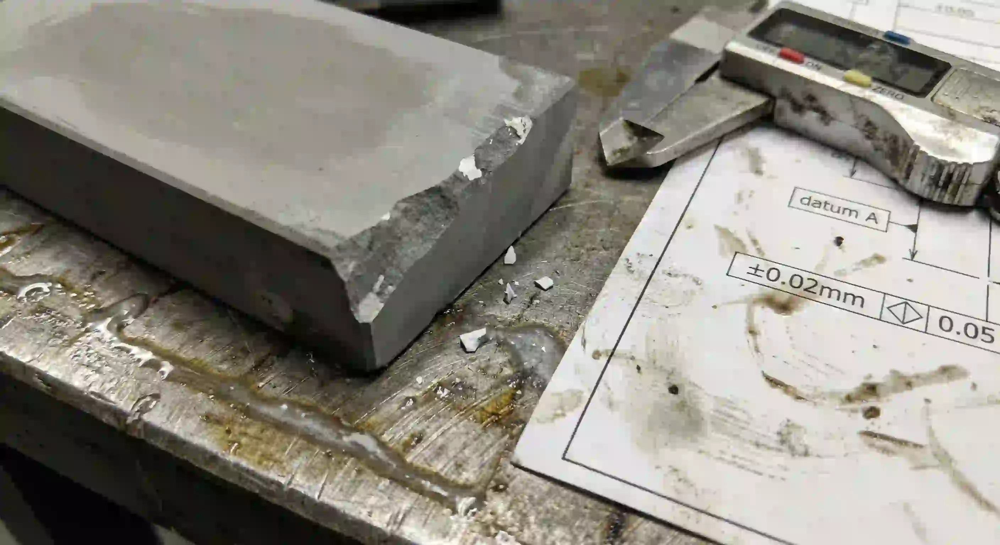
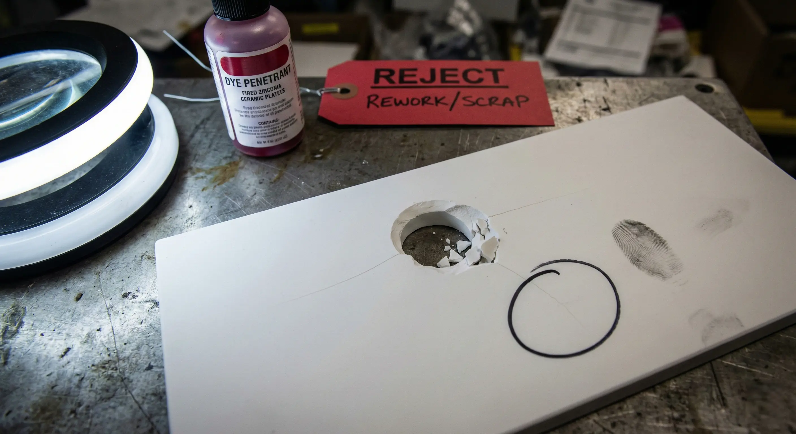
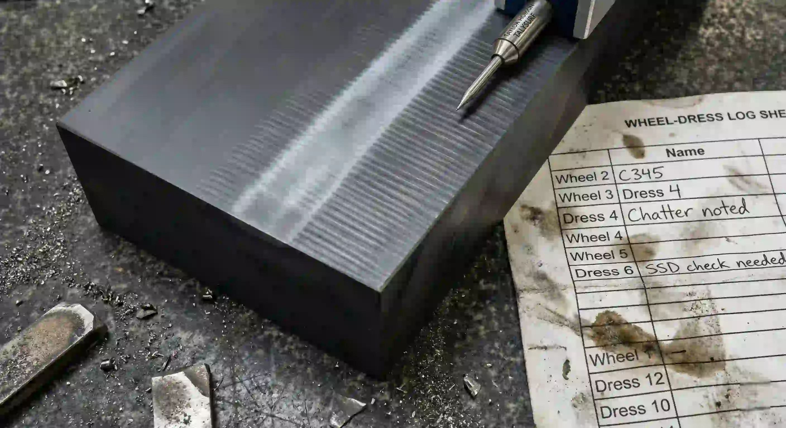

> Ceramic DFM starts with fracture mechanics, not toolpath optimism. A feature is quote-ready only when it can be supported, machined, finished, and inspected without making edge chips and micro-cracks the hidden acceptance gate.

### Design Rule 1: Avoid Metal-Style Sharpness

Sharp internal corners, knife edges, and abrupt thickness changes create stress concentrations. In ceramics, they also chip during machining and handling.

Use:

- Internal radii wherever tool access allows.
- Chamfers or radii on handling and assembly edges.
- Relief around slots, pockets, and thin transitions.
- Defined chip criteria if a sharp edge is unavoidable.

### Design Rule 2: Separate Functional and Non-Functional Precision

Do not apply tight tolerance to every face. Instead:

- Mark datum faces that will be finished.
- Identify seal lands, bores, and contact surfaces.
- Allow non-critical faces to remain as-sintered or standard-ground.
- Define the inspection method for each critical feature.

This improves quote accuracy and reduces unnecessary finishing.

### Design Rule 3: Treat Holes as Edge Features

Ceramic holes fail at entry, exit, and nearby edges. A micro-hole requirement should include:

| Requirement            | Why it matters                           |
| ---------------------- | ---------------------------------------- |
| Diameter and tolerance | Controls method and inspection           |
| Depth or thickness     | Sets aspect ratio and breakout risk      |
| True position          | Requires stable datums                   |
| Taper allowance        | Avoids hidden flow or alignment disputes |
| Edge condition         | Controls chip and crack origin           |
| Inspection method      | Makes acceptance auditable               |

### Design Rule 4: Thin Walls Need Support and Purpose

Thin unsupported ceramic walls can fracture during grinding, inspection, packaging, or assembly. If thin walls are required, define:

- Minimum wall thickness and length.
- Adjacent slot or pocket radius.
- Whether the wall sees load, flow, insulation, or only spacing.
- Handling and packaging expectations.
- Which faces need final finishing.

### Design Rule 5: Slots and Pockets Need Radius and Access

Narrow grooves, long slots, deep pockets, and high aspect ratio cavities increase tool wear and chip risk. A manufacturable design normally uses generous internal radii, controlled step-down, and clear exit paths for tooling and debris.

If a slot is functional, specify width, radius, bottom condition, edge break, and measurement method.

### Design Rule 6: Design for Inspection

A ceramic feature that cannot be measured cannot be accepted cleanly. Before sending an RFQ, ask:

- Can CMM access the datum and dependent feature?
- Is optical measurement better for micro-holes or edge chips?
- Is a pin gauge appropriate or too coarse?
- Does CT have enough resolution for the feature?
- Are flatness and Ra measured on the correct face?

### Go/No-Go Summary

**Clearly feasible:** accessible faces, controlled radii, finished datums, localized precision, and measurable acceptance.

**Conditionally feasible:** micro-holes, tight bores, thin walls, seal faces, or low Ra requirements with defined route and inspection.

**High risk:** sharp internal corners, unsupported thin walls, tight tolerance everywhere, uninspectable features, or missing edge criteria.

### RFQ Checklist

Send material grade, CAD, drawing revision, functional surfaces, datums, edge condition, surface finish, critical tolerances, quantity, target lead time, and inspection expectations.
