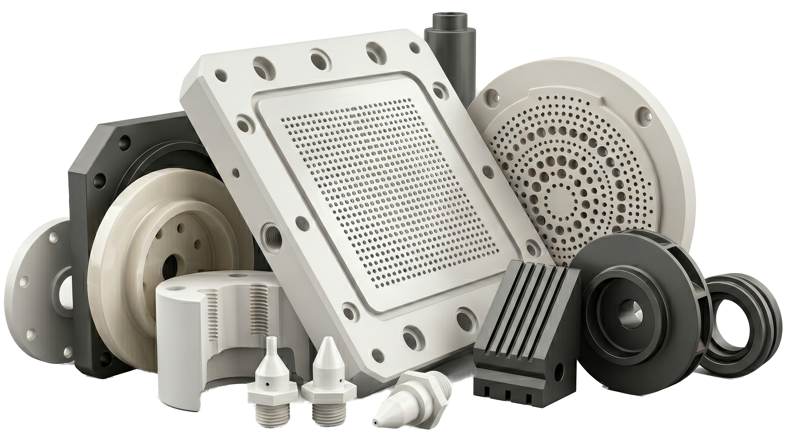

> Ceramic AM belongs in a precision ceramic program only when it solves a preform or geometry problem and still leaves a practical route for sintering, CNC finishing, inspection, and acceptance.

### Where Ceramic AM Can Create a Useful Preform

Ceramic additive manufacturing can be valuable when conventional machining or forming cannot economically create the near-net geometry:

- Complex internal channels.
- Porous or lattice structures.
- Low-volume research components.
- Heat-resistant fixtures with non-planar geometry.
- Insulating parts with integrated routing features.
- Flow, filtration, or diffusion components.

However, precision interfaces still usually need CNC grinding, lapping, or polishing after sintering.

### The Post-Sinter Reality

AM ceramic programs still need to manage:

| Risk             | Why it matters                                 | Control                             |
| ---------------- | ---------------------------------------------- | ----------------------------------- |
| Sinter shrinkage | Dimensions change after printing               | Compensation and qualification      |
| Warpage          | Thin or asymmetric parts distort               | Geometry rules and support strategy |
| Porosity         | Strength and leak behavior vary                | Density targets and verification    |
| Surface finish   | Printed surfaces are rarely precision surfaces | Grinding, lapping, or polishing     |
| Datums           | As-printed references are unstable             | Create finished datums after firing |
| Inspection       | Internal geometry may be hard to verify        | CT or process validation            |

### Good-Fit Preform Applications

**Thermal and high-temperature fixtures** can benefit from ceramic AM when geometry needs to manage heating profiles, gas flow, or weight reduction. Final contact faces may still require grinding.

**Porous flow components** can benefit when the pore architecture is functional and tolerance demands are moderate. Acceptance should define flow, pressure drop, density, and cleanliness.

**Electrical insulation parts** can benefit when routing complexity matters, but high-voltage interfaces still need edge radius, surface condition, and creepage geometry control.

**Research and prototype parts** can benefit when the goal is design learning rather than immediate production repeatability.

### Poor-Fit CNC RFQs

Ceramic AM is usually mismatched when:

- The geometry is simple enough for conventional forming or machining.
- Tight tolerance is required everywhere without finishing access.
- Full density is assumed but not verified.
- Leak-tight performance is required without density and surface evidence.
- Sharp internal features must remain precise after sintering.

### CNC Finishing Implication

For most precision applications, ceramic AM is a preform route, not the final acceptance route. The RFQ should state which surfaces will be finished after sintering and what evidence will be provided.

Common post-AM CNC tasks include:

- Grinding datum faces.
- Lapping seal lands.
- Finishing bores and holes.
- Chamfering fragile edges.
- Polishing selected functional faces.
- Preparing reports for key dimensions.

### RFQ Checklist

Send geometry, material system, target density or porosity, sintering assumptions, functional surfaces, post-sinter finish requirements, quantity, and inspection expectations.

### FAQ

**Can ceramic AM replace ceramic CNC machining?**  
Sometimes for geometry creation, but precision faces often still need CNC grinding or lapping after sintering.

**What is the biggest risk?**  
Assuming the printed shape is the accepted shape. Shrinkage, warpage, porosity, surface condition, and inspection access must be controlled.

**When should I choose CNC instead?**  
If the part is simple, tolerance-driven, or easy to inspect by conventional machining, CNC or grinding may be the more direct review path.
