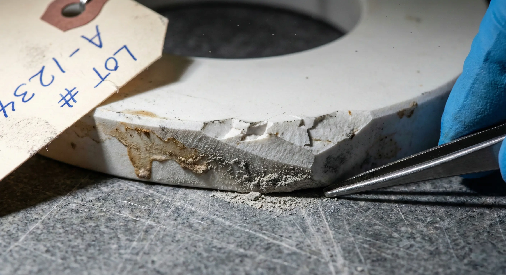
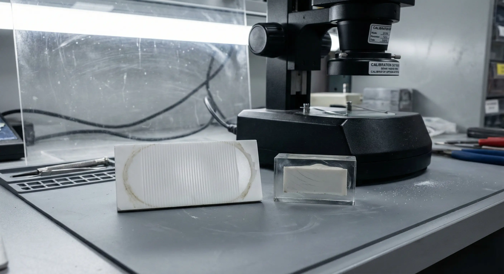
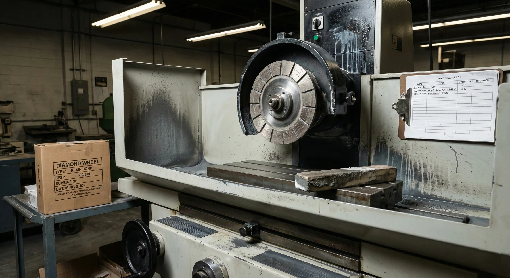
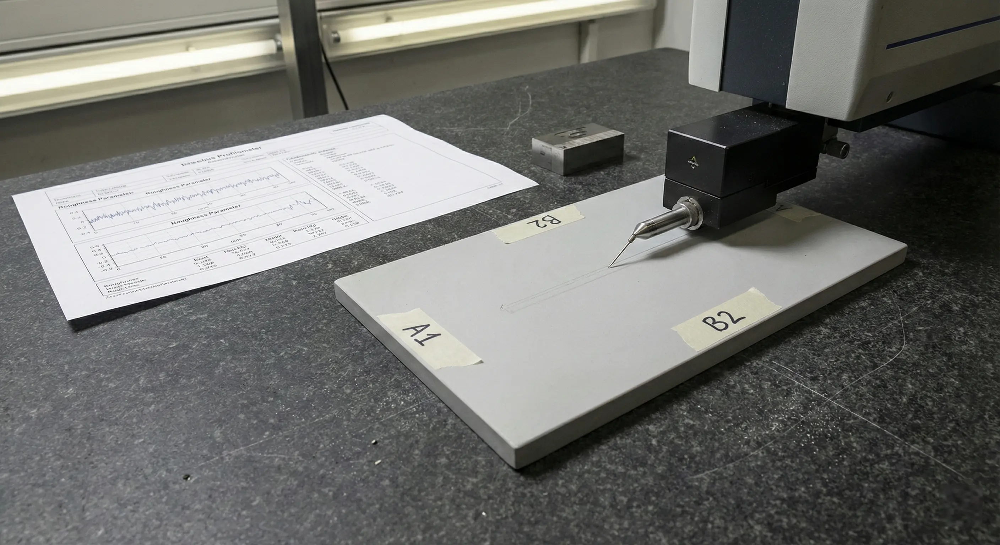
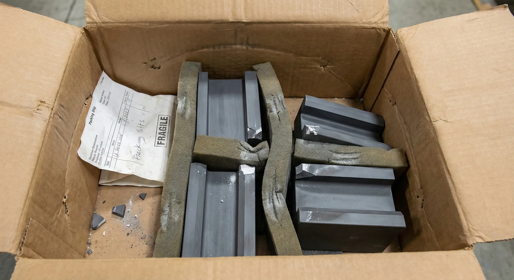

> Diamond grinding is often part of the route for tight tolerance and controlled surface finish on advanced ceramics. The procurement leverage comes from defining the acceptance gate before the supplier prices uncertainty.

This guide is for engineers and buyers comparing ceramic CNC machining suppliers, CNC ceramic machining routes, and precision ceramic machining quotes for functional industrial parts.

### What Buyers Are Actually Buying

A custom ceramic CNC machining RFQ is not only a size and quantity request. It buys a route:

- Material grade and blank state.
- Customer-supplied or supplier-sourced blank assumptions.
- Machining or green-route assumptions.
- Diamond grinding and lapping scope.
- Edge protection and chip criteria.
- Surface finish and surface integrity.
- Inspection method and documentation.
- Yield risk and handling risk.

### Ceramic Constraints That Decide Outcomes

Ceramics fail from flaw populations, not yielding. A part can be dimensionally correct and still have a chip or subsurface crack that becomes a service failure.

This means procurement should control:

- Which faces are functional.
- Which edges must be protected.
- Which surfaces require Ra or lapping.
- Which datums are finished and measurable.
- Which inspection method proves acceptance.

### Capability Envelope

Capability depends on material, feature geometry, process route, and measurement method.

| Requirement  | Practical buyer question                                            |
| ------------ | ------------------------------------------------------------------- |
| Tight size   | Is the feature post-sinter ground or as-sintered?                   |
| Flatness     | Is lapping needed and where is it measured?                         |
| Ra           | Which face and which measurement method?                            |
| Micro-hole   | Diameter, depth, taper, position, and breakout?                     |
| Edge quality | Which zone and what max chip size?                                  |
| Inspection   | CMM, optical, profile, special inspection, or key-dimension report? |

### Cost Drivers

The dominant cost drivers are usually:

1. Fixturing and setup.
2. Wheel wear and dressing.
3. Inspection and measurement time.
4. Yield loss from chips or cracks.
5. Lapping or polishing cycles.
6. Material grade and blank availability.
7. Rework loops from ambiguous datums.

### Lead Time Drivers

Lead time is affected by blank sourcing, customer-supplied material readiness, preform route, grinding capacity, lapping capacity, CMM availability, surface finish measurement, cleaning, and documentation.

Schedule review is clearer when:

- Drawing revision is frozen.
- Critical features are limited to what matters.
- Material grade is approved early.
- Inspection plan is defined before PO.
- Rework rules are agreed before machining.

### Acceptance Gate

A useful acceptance gate includes:

- Drawing revision and datum scheme.
- Critical feature list.
- Surface finish requirement by face.
- Edge condition and chip allowance by zone.
- Inspection method and sampling plan.
- Report requirements.
- Nonconformance and rework rules.

If the buyer does not define the gate, the supplier has to define it through assumptions.

### Supplier Selection

Ask suppliers for evidence that matches your risk:

| Criterion                       | How to verify                                     |
| ------------------------------- | ------------------------------------------------- |
| Experience in the ceramic grade | Similar features and material/blank references    |
| Grinding route control          | Wheel, dressing, coolant, and handling discipline |
| Metrology capability            | Sample CMM, profile, Ra, or microscopy reports    |
| Edge damage control             | Chip criteria and packaging method                |
| Yield transparency              | Scrap or rework communication                     |

### Related Guides

- Start with the [precision ceramic machining overview](/posts/industrial-ceramic-machining/precision-ceramic-machining-high-performance-industrial-components/) for the full material, process, tolerance, finish, and inspection path.
- Use the [ceramic material selection guide](/posts/materials-grade-selection/ceramic-material-selection-cnc-machining/) when alumina, zirconia, Si3N4, SiC, AlN, Macor, BN, or fused silica are still being compared.
- Use the [ceramic CNC machining design rules](/posts/design-rules-dfm/ceramic-cnc-machining-design-rules-advanced-ceramic-parts/) before sending drawings with holes, slots, thin walls, pockets, or sharp internal corners.
- Use the [custom ceramic CNC machining RFQ checklist](/posts/rfq-preparation/custom-ceramic-cnc-machining-rfq-checklist/) when the project is ready for supplier review.

### FAQ

**How can I reduce quote variance?**

Define datums, finished faces, edge condition, Ra per functional face, and inspection method.

**Can I use Ra alone for acceptance?**  
Ra alone is not enough for high-risk surfaces. Pair it with flatness, edge criteria, method, and surface integrity expectations.

**When do I need strength-related validation?**  
When the ceramic is load-bearing, safety-relevant, or failure consequence is high. Consider whether proof testing, coupons, microscopy, or qualification lots belong in the customer qualification plan.

**What should I send first?**  
Send drawing, STEP, material grade, blank or sourcing requirement, quantity, lead time, CTQs, surface finish, edge condition, and documentation needs.
