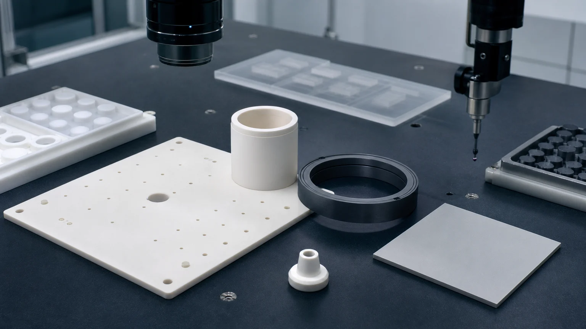
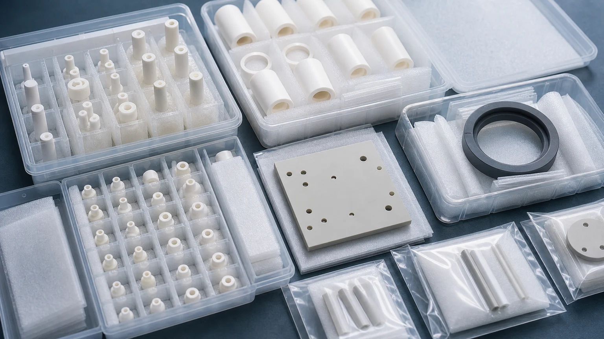

> Cleanroom ceramic components should be specified as contamination-sensitive functional interfaces, not as generic custom ceramic parts. The quote needs to define material grade, fired state, machined surfaces, chip-sensitive edges, cleaning scope, packaging method, inspection evidence, and the boundary between supplier acceptance and customer final qualification.

Cleanroom and high-purity manufacturing systems use technical ceramics because many machine zones need insulation, wear resistance, dimensional stability, chemical resistance, low contamination risk, or thermal control. The parts may look simple from a purchasing list: ceramic spacers, sleeves, pins, plates, nozzles, rings, valve seats, pump parts, standoffs, holders, and fixture blocks. In a clean manufacturing system, however, a simple shape can become a critical component if it sits near particles, vacuum, plasma, high-purity fluids, wafer handling, optical paths, sensors, thermal interfaces, or precision automation.

This page is written for engineers and sourcing teams preparing RFQs for precision machined ceramic parts used in cleanroom and high-purity manufacturing systems. It builds on the broader [semiconductor equipment ceramic components guide](/posts/semiconductor-equipment/precision-ceramic-components-semiconductor-equipment/) and connects to deeper pages for [ceramic nozzles](/posts/semiconductor-equipment/precision-ceramic-nozzles-semiconductor-vacuum-equipment/), [vacuum chuck components](/posts/semiconductor-equipment/machined-ceramic-vacuum-chuck-components-semiconductor-tools/), [AlN thermal management parts](/posts/semiconductor-equipment/aluminum-nitride-ceramic-parts-semiconductor-thermal-management/), [ceramic pump and valve parts](/posts/pump-valve-components/precision-ceramic-pump-valve-components-corrosive-fluid-control/), and the [custom ceramic CNC machining RFQ checklist](/posts/rfq-preparation/custom-ceramic-cnc-machining-rfq-checklist/).

### Why Cleanroom Ceramic Components Deserve Their Own RFQ Logic

A cleanroom classification is not a ceramic part specification. [ISO 14644-1:2015](https://www.iso.org/standard/53394.html) classifies cleanrooms and clean zones by airborne particle concentration, but the ceramic component still needs a part-level specification for geometry, surfaces, residues, packaging, and acceptance evidence. A part can pass dimensional inspection and still create incoming risk if it sheds particles, traps grinding residue in a blind port, arrives with lapped faces touching each other, or has undefined chips on an airflow or fluid-exposed edge.

The commercial reason to treat this as a priority application is also current. [SEMI reported in April 2026](https://www.semi.org/en/semi-press-release/semi-projects-double-digit-growth-in-global-300mm-fab-equipment-spending-for-2026-and-2027) that worldwide 300mm fab equipment spending is projected to grow in 2026 and 2027, with AI chip demand and regional supply-chain investment as major drivers. That does not mean every cleanroom ceramic part is a wafer-contact component. It does mean that high-purity manufacturing, semiconductor support equipment, vacuum hardware, inspection systems, chemical delivery, thermal fixtures, and clean automation remain important procurement environments.

Major ceramic suppliers already show why this application family matters. [Kyocera lists fine ceramic products for semiconductor processing](https://global.kyocera.com/prdct/fc/industries/products/008.html), including vacuum chucks, stage parts, plasma-resistant parts, polishing plates, handling arms, and other high-precision components. [CoorsTek positions technical ceramics for semiconductor processing and wafer handling applications](https://www.coorstek.com/jp/eng/products/detail/detail_04.html). The useful RFQ work is to translate those application families into details a buyer can send: material, drawing controls, machining route, surface finish, cleaning, packaging, inspection, and qualification boundary.

### Common Component Families

High-purity ceramic components are defined by the risk they create in the system. The same alumina spacer may be a low-risk factory fixture in one project and a critical clean assembly part in another.

| Component family                     | Typical function                                                        | RFQ risk that should be defined before quotation                                  |
| ------------------------------------ | ----------------------------------------------------------------------- | --------------------------------------------------------------------------------- |
| Alumina spacers and standoffs        | Electrical insulation, height control, fixture separation               | Flatness, parallelism, bore chips, creepage path, cleaning, packaging             |
| Zirconia sleeves, pins, and plungers | Sliding, locating, dosing, wear-resistant motion                        | OD/ID fit, roundness, straightness, Ra, counterface, matched-set logic            |
| Silicon carbide rings and plates     | Wear, seal, process-side, chemical-adjacent, semiconductor-adjacent use | Lapped faces, edge chips, flatness, chemical exposure, protected handling         |
| Aluminum nitride plates              | Thermal transfer plus electrical insulation                             | Thermal-contact face, thickness, flatness, parallelism, edge protection           |
| Silicon nitride guide and wear parts | Stronger structural or thermal-shock-resistant precision components     | Load path, bore quality, roundness, thermal cycling, inspection method            |
| Ceramic nozzles and orifice inserts  | Gas, purge, vacuum, dispensing, dosing, analytical fluid control        | Bore geometry, outlet edge, blockage risk, flow-test boundary, microscopy         |
| Ceramic vacuum and fixture plates    | Clean reference surface, chuck-adjacent support, inspection fixture     | Hole field, grooves, flatness, datum strategy, particle-sensitive edges           |
| Valve seats and pump components      | High-purity fluid path, dosing, chemical delivery, analytical equipment | Lapped seal band, leakage boundary, media compatibility, cleaning responsibility  |
| Ceramic sensor and optical holders   | Stable insulation or alignment for measurement systems                  | Datum faces, mounting holes, edge condition, assembly stress, traceability record |

If the RFQ only says "ceramic parts for cleanroom equipment," the supplier has to guess which surfaces matter. A better RFQ separates functional surfaces from non-critical surfaces and explains what would cause failure: particles, leakage, fit, wear, thermal resistance, electrical breakdown, vacuum instability, or poor assembly repeatability.

For sample-wetted flow cells, restrictors, purge inserts, and small-channel parts inside analyzers, use the [ceramic fluid-path components for analytical instruments guide](/posts/analytical-instruments/ceramic-fluid-path-components-analytical-instruments/) to define media contact, cleanability, blockage evidence, and the boundary between dimensional acceptance and instrument calibration.

### Material Selection For High-Purity Ceramic Systems

Material selection should begin with environment and failure mode, not with the broad word "ceramic." The internal [ceramic material selection guide](/posts/materials-grade-selection/ceramic-material-selection-cnc-machining/) is the best starting hub, but cleanroom projects usually narrow the choice around the surface and contamination risk.

| Material family                                                                                                               | Typical clean or high-purity use                                                 | What to define on the RFQ                                                        |
| ----------------------------------------------------------------------------------------------------------------------------- | -------------------------------------------------------------------------------- | -------------------------------------------------------------------------------- |
| [Alumina Al2O3](/posts/industrial-ceramic-machining/precision-machined-alumina-ceramic-parts-industrial-applications/)        | Insulators, spacers, sleeves, standoffs, plates, sensor holders, vacuum hardware | Purity, density, fired state, bore chips, edge criteria, surface finish, CoC     |
| [Zirconia ZrO2](/posts/industrial-ceramic-machining/zirconia-ceramic-machining-high-strength-precision-components/)           | Small wear parts, sleeves, pins, plungers, bushings, locating parts              | Fit class, roundness, ID/OD finish, counterface, temperature, cleaning           |
| [Silicon carbide SiC](/posts/industrial-ceramic-machining/silicon-carbide-ceramic-machining-harsh-environment-applications/)  | Rings, lapped plates, wear parts, process-side parts, chemical-adjacent hardware | Grade, lapped faces, edge chips, chemical exposure, handling protection          |
| [Aluminum nitride AlN](/posts/industrial-ceramic-machining/aluminum-nitride-ceramic-machining-thermal-management-components/) | Thermal-interface plates, insulating heat spreaders, heater-adjacent spacers     | Thermal face, flatness, thickness, Ra, protected handling, final assembly method |
| [Silicon nitride Si3N4](/posts/industrial-ceramic-machining/silicon-nitride-ceramic-machining-structural-wear-parts/)         | Wear sleeves, guide components, stronger structural parts                        | Load, thermal shock, bore quality, roundness, contact pressure, inspection       |
| [Macor](/posts/industrial-ceramic-machining/macor-machinable-glass-ceramic-parts-applications-design-guide/)                  | Prototype insulating fixtures and laboratory proof-of-geometry parts             | Prototype role, final material change plan, cleanliness limits                   |
| [Boron nitride BN](/posts/industrial-ceramic-machining/boron-nitride-ceramic-machining-high-temperature-insulation-parts/)    | Selected high-temperature insulation and non-wetting fixture roles               | Atmosphere, handling sensitivity, strength limits, contamination constraints     |

For production high-purity hardware, avoid treating Macor or boron nitride as quick substitutes for alumina, SiC, AlN, zirconia, or silicon nitride. They can be excellent in the right setting, but the operating environment, load, cleaning route, and contamination boundary must be reviewed before substitution.

### Feature Controls That Usually Decide Acceptance

Clean manufacturing RFQs fail when buyers specify tight overall dimensions but leave the sensitive features undefined. The supplier can machine a rectangle accurately and still miss the acceptance gate if the lapped seal band, micro-hole edge, sleeve bore, or thermal-interface face is not controlled.

Define these zones early:

- Finished datums and assembly reference faces.
- Lapped, ground, polished, and as-sintered surfaces by face.
- Edges exposed to airflow, fluid flow, vacuum, sliding motion, wafer-adjacent handling, or frequent cleaning.
- Holes, counterbores, ports, grooves, blind holes, and micro-holes.
- ID/OD fits, sleeve clearance, plunger OD, concentricity, roundness, and straightness.
- Flatness, parallelism, thickness, and stack height.
- Surface roughness by functional face instead of one global note.
- Cleaning, bagging, tray separation, and protected-contact requirements.
- Inspection evidence required for first article approval and repeat production.

For hole arrays and very small ports, use the [ceramic micro-hole machining RFQ guide](/posts/micro-hole-machining/ceramic-micro-hole-machining-rfq/). For thin sleeves or long bores, use the [thin-wall ceramic sleeve machining guide](/posts/thin-wall-sleeves/ceramic-thin-wall-sleeve-bore-concentricity-rfq/). For seal lands, use the [ceramic lapped seal faces guide](/posts/lapped-seal-faces/ceramic-lapped-seal-faces-rfq/). For tolerance strategy across feature types, use the [ceramic tolerance capability map](/posts/tolerances-gdt/ceramic-tolerance-capability-map-by-feature-process/).

### Cleaning And Packaging Are Engineering Requirements

Cleaning and packaging are not clerical notes for high-purity ceramic components. They are part of the acceptance plan.

The RFQ should state whether the part is used in a vacuum-side zone, fluid path, wafer-adjacent area, high-voltage assembly, optical or sensor area, thermal fixture, laboratory instrument, or general clean manufacturing enclosure. Each environment changes how surfaces and cavities should be protected. For alumina rings, sleeves, spacers, insulating supports, and seal-adjacent parts entering high- or ultra-high-vacuum service, use the [machined alumina components for high- and ultra-high-vacuum systems guide](/posts/high-vacuum-systems/machined-alumina-components-high-ultra-high-vacuum-systems/) to define purity, trapped-volume review, cleaning, bake context, packaging, and customer-owned vacuum qualification.

Discuss these points before the quote is finalized:

- Which faces must not touch each other during packing.
- Whether lapped faces require separators or individual wrapping.
- Whether bores, grooves, micro-holes, blind cavities, and ports need blockage review.
- Whether the supplier is responsible for standard industrial cleaning only or a customer-defined clean process.
- Whether the customer will perform final cleanroom cleaning, particle testing, outgassing, leak, flow, or chemical validation.
- Whether parts need individual bags, separated tray pockets, fixed orientation, protective caps, material certificates, inspection reports, or certificates of conformity.
- Whether labels and paperwork should stay outside the clean inner bag.

For clean fluid control, pair this guide with the [precision ceramic pump and valve components guide](/posts/pump-valve-components/precision-ceramic-pump-valve-components-corrosive-fluid-control/). For clean automation and repeatable locating hardware, see the [ceramic locating pin and fixture plate guide](/posts/automation-fixtures/precision-ceramic-fixture-plate-locating-pins-case-study/). For sensor-adjacent parts, see the [precision ceramic components for sensors and measurement devices guide](/posts/sensor-measurement-devices/precision-ceramic-components-sensors-measurement-devices/). For mounts, apertures, and optical-axis interfaces, use the [optical and laser equipment ceramic guide](/posts/optical-laser-equipment/machined-ceramic-components-optical-laser-equipment/).

### Inspection Evidence Should Match The Failure Mode

An inspection report should prove the surfaces that matter. A long report covering non-critical outside dimensions does not replace evidence on a seal band, bore, hole field, flat thermal face, or particle-sensitive edge.

| Requirement                    | Evidence to discuss                                                      | Why it matters                                                             |
| ------------------------------ | ------------------------------------------------------------------------ | -------------------------------------------------------------------------- |
| Flat ceramic reference face    | Flatness map, CMM, surface plate method, lapping note                    | Controls assembly contact, vacuum interface, thermal path, or stack height |
| Precision bore or sleeve       | Bore gauge, CMM, air gauge, pin gauge, roundness, cylindricity           | Controls fit, leakage, alignment, wear, and motion repeatability           |
| Micro-hole or orifice          | Optical inspection, microscope image, pin gauge, flow-test boundary      | Controls purge, flow, blockage risk, and particle-sensitive edge quality   |
| Lapped seal or contact face    | Flatness, Ra, lapping process note, visual criteria, protected packaging | Controls leakage, contact behavior, and incoming QA risk                   |
| Edge quality                   | Zone-specific chip criteria, microscopy, sample photos, visual standard  | Reduces particle generation, crack origins, and handling failures          |
| Thermal-interface ceramic face | Thickness, parallelism, flatness, Ra, datum note, face protection        | Controls heat transfer, electrical isolation, and assembly stress          |
| Cleaning and packaging         | Cleaning note, tray layout, individual bags, separators, protected faces | Reduces avoidable incoming issues before customer final qualification      |
| Traceability                   | Material certificate, CoC, grade record, lot record, revision control    | Supports repeat orders, audits, and qualification history                  |

The drawing does not need to over-specify every surface. It needs to identify which features are acceptance-critical. That is the difference between a quote that prices every face as high-risk and a quote that applies precision where it protects function.

### Example RFQ Pattern: Mixed Cleanroom Ceramic Component Set

A typical clean manufacturing package may include:

- Alumina spacers for stack height and electrical insulation.
- Zirconia sleeves for a plunger or sliding locating pin.
- A SiC ring with a lapped face for a wear or seal interface.
- An AlN plate used as a thermally conductive insulating interface.
- Small ceramic nozzles or orifice inserts for purge, vacuum, or dispensing.
- A flat ceramic fixture plate with datum pads and small holes.

The risk is not the outside envelope of the set. The risk is the acceptance gate for each interface:

| Part                               | Functional concern                                 | Practical RFQ note                                                    |
| ---------------------------------- | -------------------------------------------------- | --------------------------------------------------------------------- |
| Alumina spacer                     | Height, parallelism, bore chips, insulation path   | Mark critical faces and creepage zones; state chip criteria           |
| Zirconia sleeve                    | ID/OD fit, roundness, sliding finish               | Define bore finish, mating shaft, clearance, and inspection method    |
| Silicon carbide ring               | Lapped face, wear, seal, chemical exposure         | Define flatness, Ra, edge protection, and media exposure              |
| Aluminum nitride plate             | Thermal path plus electrical isolation             | Define the thermal-contact face, flatness, thickness, and packing     |
| Ceramic nozzle                     | Bore geometry, outlet edge, blockage risk          | Define bore size, taper limit, edge condition, and flow-test boundary |
| Ceramic fixture or reference plate | Flatness, datum position, small holes, clean edges | Define datum scheme, hole inspection, protected faces, and packaging  |

When the RFQ presents the package this way, the supplier can separate standard grinding, precision grinding, lapping, polishing, inspection, cleaning, and packaging into a realistic process plan.

### Cost Drivers In Cleanroom Ceramic Machining Projects

The expensive part of a cleanroom ceramic project is usually not the word "cleanroom." It is the combination of fired ceramic hardness, difficult features, surface acceptance, and documentation.

Common cost drivers include:

- Diamond grinding time after sintering.
- Lapped or polished functional faces.
- Flatness, parallelism, and thickness control on plates.
- Long bores, thin walls, concentric sleeves, and matched sliding pairs.
- Micro-holes, small ports, nozzles, blind features, and grooves.
- SiC, AlN, high-purity alumina, or zirconia blank availability.
- Chip criteria on particle-sensitive edges.
- Cleaning, separated trays, individual bags, and protected lapped faces.
- CMM, optical, Ra, flatness, roundness, microscopy, material certificates, and CoC.
- Prototype qualification and repeat-order lot control.

Good cost control does not mean lowering every requirement. It means assigning precision only where it protects function: seal surfaces, thermal faces, ID/OD fits, datums, micro-holes, fluid ports, high-voltage paths, sliding interfaces, and particle-sensitive edges. The [ceramic surface finish and subsurface damage guide](/posts/surface-finish-functional/ceramic-ssd-surface-finish-specify-control-price/) is useful when deciding which faces need special finishing and which can stay standard-ground.

### RFQ Checklist For High-Purity Ceramic Components

Send the following before expecting a reliable quote:

- 2D drawing with revision plus STEP or native CAD file.
- Ceramic material grade, purity, fired state, certificate requirement, and whether equivalent review is allowed.
- Application environment: cleanroom, vacuum, semiconductor support, fluid path, wafer-adjacent, thermal, electrical, optical, laboratory, or clean automation.
- Functional surfaces: datums, lapped faces, thermal faces, bores, micro-holes, ports, grooves, seal bands, high-voltage paths, and edge zones.
- Tolerance priorities: flatness, parallelism, thickness, concentricity, roundness, cylindricity, hole position, Ra, and visual chip criteria.
- Cleaning requirement, packaging method, protected surfaces, individual bagging, tray orientation, and contact restrictions.
- Inspection evidence: CMM, optical, profile, flatness, Ra, microscope, roundness, key-dimension report, material certificate, or CoC.
- Final validation boundary: customer particle test, outgassing, leak, flow, pressure, chemical, vacuum, thermal, or life-cycle testing.
- Quantity, prototype or production stage, target timing, repeat-order expectation, and qualification status.

For first-time projects, start with the [custom ceramic CNC machining RFQ checklist](/posts/rfq-preparation/custom-ceramic-cnc-machining-rfq-checklist/). If the part is not yet manufacturable, use the [ceramic CNC machining design rules guide](/posts/design-rules-dfm/ceramic-cnc-machining-design-rules-advanced-ceramic-parts/) before locking the drawing.

### Practical Takeaway

Cleanroom and high-purity ceramic components create value when the material, machining route, functional surfaces, cleaning, packaging, and inspection evidence match the real contamination-sensitive function. A spacer, sleeve, nozzle, SiC ring, AlN plate, vacuum fixture, pump seat, or ceramic holder should not be quoted only by outside dimensions.

The best RFQ defines the environment, material grade, fired state, critical surfaces, edge quality, cleaning scope, packaging expectation, inspection evidence, and customer qualification boundary. That allows the supplier to review the part as a precision high-purity manufacturing component instead of a generic ceramic machined part.

### FAQ

**Which ceramic is best for cleanroom and high-purity manufacturing components?**  
There is no universal best material. Alumina is common for insulation and general clean hardware, zirconia for precision sleeves and wear features, SiC for harsh or lapped wear surfaces, AlN for thermal-interface insulation, and silicon nitride for stronger wear or structural parts. The environment and acceptance gate decide.

**Does a cleanroom ceramic part always need special packaging?**  
Not always, but lapped faces, micro-holes, polished bores, thin edges, and particle-sensitive surfaces often need separators, fixed orientation, individual bagging, or protected trays. Packaging should be defined before quotation.

**Can the machining supplier guarantee final cleanroom performance?**  
The supplier can usually quote geometry, surface condition, edge criteria, cleaning notes, packaging, and inspection evidence. Final particle, outgassing, leak, flow, chemical compatibility, or life-cycle testing may belong to the customer qualification plan unless a specific test method and acceptance standard are included in the RFQ.

**What should be marked first on the drawing?**  
Mark functional faces, datums, bores, hole fields, lapped surfaces, thermal interfaces, edge-chip zones, cleaning-sensitive cavities, packaging restrictions, and inspection methods. This prevents the quote from treating every surface as equally critical.
