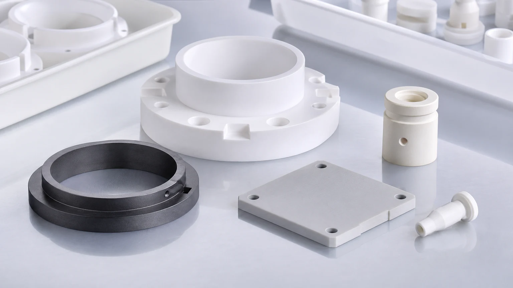
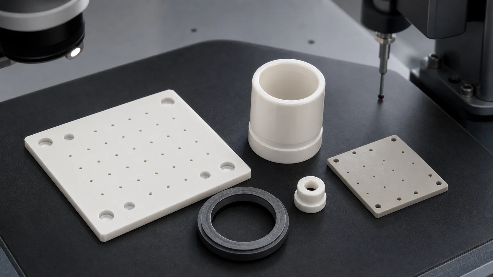
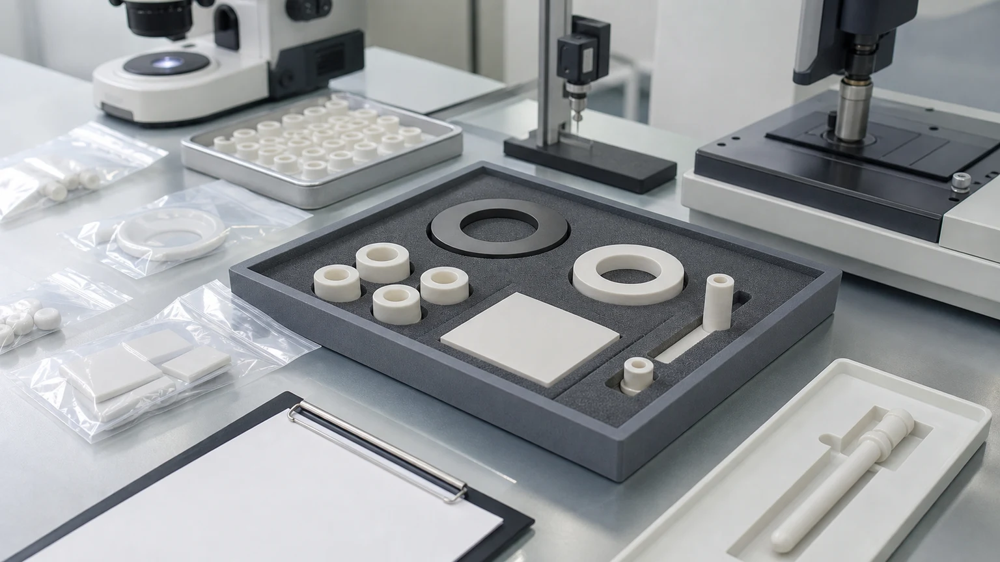

> Cleanroom and high-purity ceramic components should be quoted as contamination-sensitive functional interfaces, not as ordinary custom ceramic parts. The accepted part depends on material grade, exposed surfaces, finished datums, edge quality, cleaning method, packaging, inspection evidence, and the boundary between machining acceptance and the customer final qualification test.

High-purity manufacturing systems use ceramic parts in semiconductor equipment, analytical instruments, vacuum tools, precision fluid handling, medical and laboratory automation, optical equipment, thermal fixtures, power electronics, and advanced industrial production lines. The parts may look simple: spacers, sleeves, plates, rings, nozzles, standoffs, bushings, seats, holders, guide pins, and small insulating blocks. In practice, the RFQ risk is not simple because the ceramic part may sit near particles, fluids, vacuum, plasma, heat, voltage, or sensitive process hardware.

This article is a precision industrial ceramic machining case guide for cleanroom and high-purity manufacturing systems. It is not a replacement for the broader [precision ceramic components for semiconductor equipment guide](/posts/semiconductor-equipment/precision-ceramic-components-semiconductor-equipment/). That page maps semiconductor ceramic component families. This page focuses on the purchasing question that appears across clean manufacturing systems:

**Which ceramic features must be finished, cleaned, protected, and documented so the part can enter a high-purity assembly without creating avoidable contamination, fit, or inspection risk?**

### Why This Is A High-Value Long-Term Case Topic

The search value is durable because buyers do not only search for broad terms such as "ceramic part." They search for cleanroom ceramic components, high-purity ceramic spacers, ceramic sleeves, ceramic nozzles, alumina insulators, silicon carbide rings, zirconia plungers, AlN plates, vacuum ceramic parts, and ceramic components for semiconductor equipment when a real machine build or qualification path is already active.

There is also a current industrial reason to treat this as a priority topic. [SEMI reported expected double-digit growth in worldwide 300mm fab equipment spending for 2026 and 2027](https://www.semi.org/en/semi-press-release/semi-projects-double-digit-growth-in-global-300mm-fab-equipment-spending-for-2026-and-2027), with AI chip demand identified as a key driver. That does not mean every cleanroom ceramic part is a wafer-contact part. It does mean that high-purity equipment, wafer handling, vacuum, chemical delivery, inspection, packaging, and supporting manufacturing systems are commercially important search directions.

Technical ceramic suppliers already position ceramics in semiconductor and high-purity equipment environments. [Kyocera lists semiconductor ceramic components such as electrostatic chucks, ceramic heaters, vacuum chucks, nozzles, end effectors, plasma rings, and inspection equipment parts](https://global.kyocera.com/prdct/fc/industries/products/008.html). [CoorsTek describes technical ceramic components used in wafer handling and processing equipment](https://www.coorstek.com/jp/eng/products/detail/detail_04.html). For this website, the SEO opportunity is not to repeat catalog claims. The opportunity is to translate that application family into RFQ-ready machining language: features, routes, surfaces, cleaning, packaging, and inspection evidence.

### What Counts As A Cleanroom Or High-Purity Ceramic Component

A high-purity ceramic component is not defined only by the room where it is assembled. It is defined by the risk it creates if particles, residues, chips, burr-like edge damage, handling marks, or uncontrolled materials enter the system.

Common component families include:

| Component family                      | Typical role in high-purity systems                                      | RFQ issue that changes the machining route                                       |
| ------------------------------------- | ------------------------------------------------------------------------ | -------------------------------------------------------------------------------- |
| Alumina ceramic spacers and standoffs | Electrical insulation, height control, fixture spacing                   | Flatness, parallelism, bore chips, creepage path, clean packaging                |
| Zirconia sleeves, pins, and plungers  | Sliding, locating, dosing, or wear-resistant interfaces                  | OD/ID fit, roundness, Ra, straightness, counterface, cleaning                    |
| Silicon carbide rings and wear parts  | Harsh process-side, wear, seal, or chemical-adjacent hardware            | Lapped faces, edge chips, media exposure, surface integrity, protected handling  |
| Aluminum nitride plates               | Thermal interface plus electrical insulation in clean equipment          | Flatness, thickness, thermal-contact face, edge quality, clean handling          |
| Ceramic nozzles and orifice inserts   | Gas, vacuum, dispensing, purge, or fluid-control features                | Bore geometry, outlet edge, blockage risk, flow-test boundary, microscopy        |
| Ceramic vacuum or fixture plates      | Stable support, reference, chuck-adjacent, or inspection fixture surface | Hole field, groove geometry, flatness, datum strategy, particle-sensitive edges  |
| Valve seats and pump components       | Chemical delivery, dosing, analytical fluid handling, high-purity fluids | Lapped seal surface, roundness, media compatibility, matched-set logic           |
| Ceramic holders and guide components  | Sensor, optical, laboratory, or automation alignment                     | Datum surfaces, mounting holes, edge condition, assembly stress, inspection plan |

The same drawing can be low-risk in a general factory fixture and high-risk in a clean manufacturing system. The difference is not only tolerance. It is how the ceramic part is finished, cleaned, inspected, protected, and qualified.

### Case Pattern: A High-Purity Ceramic Component Set

A practical case is a mixed set of ceramic parts for a clean automation, vacuum, or fluid-control subsystem:

- Alumina spacers control stack height and electrical isolation.
- A zirconia sleeve guides a pin, plunger, or moving element.
- A silicon carbide ring provides a wear or lapped contact surface.
- An AlN plate provides a thermally stable insulating interface.
- A small ceramic nozzle or orifice insert controls gas, purge, vacuum, dispensing, or fluid flow.
- A ceramic fixture plate provides a flat, clean reference surface with holes or datum pads.

This looks like a normal ceramic parts package until the acceptance gate is discussed. The spacer may be governed by height and chip-free bores. The sleeve may be governed by roundness and bore finish. The SiC ring may be governed by lapped face condition and protected packaging. The AlN plate may be governed by thermal-interface flatness. The nozzle may be governed by outlet edge and blockage risk. The fixture plate may be governed by flatness, hole location, and clean handling.

That is why high-purity RFQs should be reviewed as systems of functional surfaces. A single line item called "ceramic components" is not enough.

### Material Selection For High-Purity Ceramic Parts

Material choice should follow the operating environment, not only the word "cleanroom." Each ceramic family creates a different machining and inspection plan.

| Material family                                                                                                              | Where it may fit in clean manufacturing systems                                               | RFQ notes                                                                                 |
| ---------------------------------------------------------------------------------------------------------------------------- | --------------------------------------------------------------------------------------------- | ----------------------------------------------------------------------------------------- |
| [Alumina Al2O3](/posts/industrial-ceramic-machining/precision-machined-alumina-ceramic-parts-industrial-applications/)       | Insulators, spacers, sleeves, standoffs, sensor holders, vacuum-side hardware                 | Define purity, density, fired state, bore chips, edge criteria, and inspection evidence   |
| [Zirconia ZrO2](/posts/industrial-ceramic-machining/zirconia-ceramic-machining-high-strength-precision-components/)          | Pins, plungers, sleeves, bushings, small wear parts, precision sliding or locating components | Review toughness, OD/ID fit, finish, temperature, counterface, and cleaning requirements  |
| [Silicon carbide SiC](/posts/industrial-ceramic-machining/silicon-carbide-ceramic-machining-harsh-environment-applications/) | Rings, seal faces, wear parts, chemical-adjacent parts, semiconductor-adjacent hardware       | Lapped faces, flatness, edge chips, chemical exposure, and packaging usually dominate     |
| [Aluminum nitride AlN](/posts/semiconductor-equipment/aluminum-nitride-ceramic-parts-semiconductor-thermal-management/)      | Thermal-interface plates, insulating heat spreaders, heater-adjacent spacers                  | Protect thermal faces, flatness, thickness, Ra, and clean handling before assembly        |
| [Silicon nitride Si3N4](/posts/industrial-ceramic-machining/silicon-nitride-ceramic-machining-structural-wear-parts/)        | Wear sleeves, rollers, guide parts, stronger structural or thermal-shock components           | Define load path, contact mode, roundness, bore quality, and inspection method            |
| [Macor](/posts/industrial-ceramic-machining/macor-machinable-glass-ceramic-parts-applications-design-guide/)                 | Prototype insulating fixtures, lab components, fast-turnaround proof-of-geometry parts        | Useful for prototypes, but validate whether it fits the final environment and cleanliness |
| [Boron nitride BN](/posts/industrial-ceramic-machining/boron-nitride-ceramic-machining-high-temperature-insulation-parts/)   | Selected high-temperature insulation and non-wetting fixtures                                 | Clarify atmosphere, load, handling sensitivity, and contamination constraints             |

If the grade is already specified by a customer specification, send the exact grade and certificate requirement. If the grade is open, send the failure mode: wear, insulation, heat transfer, chemical exposure, vacuum, particles, sliding fit, voltage, thermal cycling, or cleaning method. The [ceramic material selection guide](/posts/materials-grade-selection/ceramic-material-selection-cnc-machining/) is the right internal-link hub for early-stage decisions.

### Feature Controls That Matter In Clean Manufacturing RFQs

High-purity ceramic parts are often rejected because of small features, not because the overall outside size is wrong. The drawing should rank functional zones.

Define:

- Finished datums and assembly reference faces.
- Lapped, ground, polished, or as-sintered surfaces.
- Edges exposed to airflow, fluid, vacuum, wafer-side handling, or sliding motion.
- Holes, counterbores, micro-holes, slots, and ports.
- ID/OD fits, sleeve clearance, plunger OD, and concentricity.
- Flatness, parallelism, thickness, and stack height.
- Surface roughness by face, not as a global note.
- Visual chip limits by zone.
- Cleaning, bagging, tray separation, and contact restrictions.

The most useful RFQ package does not simply ask for "tight tolerance." It tells the supplier which surfaces are allowed to remain standard-ground or as-sintered and which surfaces must be finished after sintering, lapped, polished, cleaned, protected, and reported.

### Cleaning And Packaging Are Part Of The Specification

For high-purity parts, cleaning and packaging cannot be a vague shipping note. A ceramic component can pass dimensional inspection and still create incoming risk if lapped faces touch each other, micro-holes trap residue, bores hold abrasive debris, or edge chips create particles during handling.

Discuss:

- Whether the part is vacuum-side, fluid-side, wafer-adjacent, sensor-adjacent, optical, laboratory, or general clean manufacturing hardware.
- Which surfaces must not contact tray walls or other parts.
- Whether lapped faces require separators, individual wrapping, or fixed orientation.
- Whether bores, ports, grooves, blind holes, and micro-holes need blockage review.
- Whether cleaning is standard industrial cleaning, customer-specified cleaning, ultrasonic cleaning, solvent-compatible cleaning, or final customer cleanroom cleaning.
- Whether parts need individual bagging, tray packaging, lot labels, material certificate, certificate of conformity, or inspection report.
- Whether the machining supplier or customer owns the final particle, ionic contamination, outgassing, leak, or functional validation.

For high-purity fluid paths, use the [precision ceramic pump and valve components guide](/posts/pump-valve-components/precision-ceramic-pump-valve-components-corrosive-fluid-control/) and the [precision ceramic nozzles guide](/posts/semiconductor-equipment/precision-ceramic-nozzles-semiconductor-vacuum-equipment/) as companion pages. For wafer support and vacuum surfaces, use the [machined ceramic vacuum chuck components guide](/posts/semiconductor-equipment/machined-ceramic-vacuum-chuck-components-semiconductor-tools/).

### Inspection Evidence For High-Purity Ceramic Components

Inspection should prove the functional risk. A long report on non-critical outside faces does not replace evidence on the seal band, bore, hole field, thermal-interface face, or particle-sensitive edge.

| Requirement                    | Evidence to discuss                                                      | Why it matters                                                             |
| ------------------------------ | ------------------------------------------------------------------------ | -------------------------------------------------------------------------- |
| Flat ceramic reference face    | Flatness map, CMM, surface plate method, or lapping note                 | Controls assembly contact, vacuum interface, thermal path, or stack height |
| Precision bores and sleeves    | Bore gauge, CMM, air gauge, pin gauge, roundness, or cylindricity        | Controls fit, alignment, leakage, wear, and motion repeatability           |
| Micro-holes and orifices       | Optical inspection, microscope, pin gauge, flow-test boundary, or CMM    | Controls flow, purge, blockage risk, and particle-sensitive edges          |
| Lapped seal or contact face    | Flatness, Ra, lapping note, visual criteria, protected packaging         | Controls leakage, contact behavior, surface damage, and incoming QA        |
| Edge quality                   | Zone-specific chip criteria, microscopy, sample photos, visual standard  | Reduces particles, crack origins, and handling failures                    |
| Thermal-interface ceramic face | Thickness, parallelism, flatness, Ra, datum note, face protection        | Controls heat transfer, electrical isolation, and assembly stress          |
| Cleaning and packaging         | Cleaning note, separated trays, individual bags, protected lapped faces  | Prevents avoidable incoming issues before the customer final clean         |
| Material and traceability      | Material certificate, CoC, grade record, lot control, repeat-order notes | Supports qualification, repeat procurement, and supplier audit             |

For small holes, use the [ceramic micro-hole machining RFQ guide](/posts/micro-hole-machining/ceramic-micro-hole-machining-rfq/). For thin sleeves or long bores, use the [thin-wall ceramic sleeve machining guide](/posts/thin-wall-sleeves/ceramic-thin-wall-sleeve-bore-concentricity-rfq/). For lapped contact surfaces, use the [ceramic lapped seal faces guide](/posts/lapped-seal-faces/ceramic-lapped-seal-faces-rfq/). For tolerance planning, use the [ceramic tolerance capability map](/posts/tolerances-gdt/ceramic-tolerance-capability-map-by-feature-process/).

### Case-Specific RFQ Mistakes To Avoid

High-purity ceramic RFQs often become expensive or ambiguous for predictable reasons.

Avoid these mistakes:

1. Calling every surface "critical" without ranking functional zones.
2. Specifying a low Ra globally when only one face is a contact or thermal interface.
3. Leaving bore chips, port edge quality, or micro-hole breakout undefined.
4. Treating cleaning and packaging as a supplier assumption.
5. Asking for final cleanliness or particle performance without stating the test method and owner.
6. Mixing as-sintered and post-sinter ground surfaces without marking which is acceptable.
7. Treating alumina, zirconia, SiC, and AlN as interchangeable because all are "ceramic."
8. Leaving matched-set logic unclear for sleeves, plungers, seats, balls, and precision spacers.
9. Over-tightening non-functional outside surfaces while under-specifying lapped faces and edges.
10. Expecting a low quote before the inspection report, certificate, cleaning, and packaging scope is defined.

The [ceramic CNC machining design rules guide](/posts/design-rules-dfm/ceramic-cnc-machining-design-rules-advanced-ceramic-parts/) helps reduce avoidable geometry risk before the drawing reaches a supplier.

### Cost Drivers In Cleanroom Ceramic Machining Projects

The dominant cost drivers are usually not the word "cleanroom." They are the physical features and acceptance evidence behind it:

- Fired ceramic hardness and diamond grinding time.
- Lapped, polished, or low-Ra functional faces.
- Flatness, parallelism, thickness control, and datum relationships.
- Micro-holes, small ports, nozzles, grooves, and blind features.
- Sleeve bores, ID/OD concentricity, roundness, and long sliding fits.
- Edge chip criteria on particle-sensitive zones.
- SiC, AlN, zirconia, or high-purity alumina blank availability.
- Cleaning method, individual packaging, and protected surfaces.
- CMM, optical, Ra, flatness, roundness, microscopy, or key-dimension reports.
- Prototype qualification, repeat-order lot control, and customer approval samples.

Good cost control does not mean removing all precision. It means assigning precision only where it protects function: seal surfaces, flow features, datum pads, bores, thermal-interface faces, high-voltage paths, sliding fits, and particle-sensitive edges.

### RFQ Checklist For Cleanroom And High-Purity Ceramic Components

Send the following before expecting a reliable quote:

- 2D drawing with revision and STEP or native CAD file.
- Ceramic material grade, purity, fired state, certificate requirement, and whether equivalent review is allowed.
- Application environment: cleanroom, vacuum, fluid path, wafer-adjacent, thermal, electrical, optical, laboratory, or general high-purity manufacturing.
- Functional surfaces: datums, lapped faces, thermal faces, bores, micro-holes, ports, grooves, seal bands, and edge zones.
- Tolerance priorities: flatness, parallelism, thickness, concentricity, roundness, cylindricity, hole position, Ra, and visual chip criteria.
- Cleaning requirement, packaging method, protected surfaces, individual bagging, tray orientation, and contact restrictions.
- Inspection evidence: CMM, optical, profile, flatness, Ra, microscope, roundness, key-dimension report, material certificate, or CoC.
- Final validation boundary: customer particle test, outgassing, leak, flow, pressure, chemical, vacuum, thermal, or life-cycle testing.
- Quantity, prototype or production stage, target timing, repeat-order expectation, and qualification status.

For a standard quotation package, use the [custom ceramic CNC machining RFQ checklist](/posts/rfq-preparation/custom-ceramic-cnc-machining-rfq-checklist/).

### Practical Takeaway

Cleanroom and high-purity ceramic components create value when the material, machining route, cleaning, packaging, and inspection evidence match the real contamination-sensitive function. A spacer, sleeve, nozzle, SiC ring, AlN plate, vacuum fixture, or ceramic holder should not be quoted only by outside dimensions.

The RFQ should define the environment, material grade, functional surfaces, feature priorities, edge criteria, cleaning method, packaging expectation, inspection evidence, and final customer qualification boundary. That allows the part to be reviewed as a precision high-purity manufacturing component instead of a generic ceramic machined part.

### FAQ

**Which ceramic is best for cleanroom and high-purity manufacturing components?**  
There is no universal best material. Alumina is common for insulation and general clean hardware, zirconia for precision sleeves and wear features, SiC for harsh or lapped wear surfaces, and AlN for thermal-interface insulation. The operating environment and inspection gate decide.

**Does a cleanroom ceramic part need special packaging?**  
Often yes. Lapped faces, micro-holes, polished bores, and particle-sensitive edges may need separators, fixed orientation, individual bagging, or protected trays. The packaging method should be stated before quotation.

**Can the machining supplier guarantee final cleanroom performance?**  
The supplier can usually quote geometry, surface condition, edge criteria, cleaning notes, packaging, and inspection evidence. Final particle, outgassing, leak, flow, chemical compatibility, or life-cycle tests may belong to the customer qualification plan unless explicitly specified.

**What should be marked first on the drawing?**  
Mark functional faces, datums, bores, hole fields, lapped surfaces, thermal interfaces, edge-chip zones, cleaning-sensitive cavities, and inspection methods. This prevents the quote from treating every surface as equally critical.
