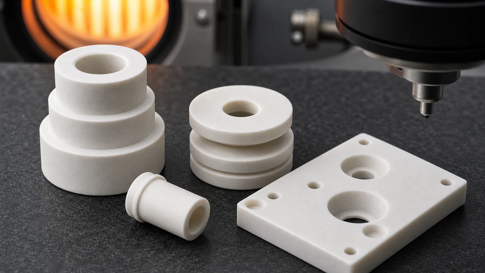
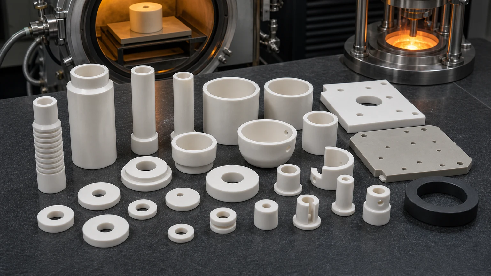

> Boron nitride ceramic machining is usually considered when a custom part must combine high-temperature stability, electrical insulation, thermal shock resistance, machinability, and non-wetting behavior in furnace, vacuum, molten-metal, semiconductor, laboratory, or high-temperature process equipment. BN can be a strong engineering choice, but the final part depends on grade, atmosphere, temperature, contact load, geometry, surface condition, and inspection requirements.

Boron nitride ceramic parts appear in vacuum furnace supports, high-temperature electrical insulators, heater element spacers, thermocouple protection parts, molten metal nozzles, crucible-adjacent hardware, evaporation and deposition fixtures, spacer washers, tubes, sleeves, bushings, ring insulators, and custom laboratory components. Many BN grades are easier to machine into complex shapes than hard-fired alumina, silicon carbide, or silicon nitride, which makes BN useful for low-volume custom parts with holes, slots, bores, grooves, and thin insulating geometry.

The practical sourcing question is not simply "Can this part be made from boron nitride?"

The better question is:

**Which BN grade, atmosphere, temperature range, electrical requirement, molten-metal or chemical exposure, contact load, and inspection method are required for this part to work in service?**

That question should be reviewed before feasibility, price, lead time, tolerance scope, or production route is confirmed.

### Why Boron Nitride Is Used In High-Temperature Insulation

Boron nitride, often written as BN, is selected because it can provide a useful combination of thermal stability, electrical insulation, thermal shock resistance, machinability, lubricity, and resistance to wetting by many molten metals. In solid form, hot-pressed BN is often used where graphite would be electrically conductive, where alumina would be harder to machine into complex shapes, or where a high-temperature fixture needs a clean non-metallic interface.

BN is not selected only because it is "high temperature." A BN insulator, nozzle, sleeve, or furnace support still needs the correct grade and design. Some grades are more suitable for high-purity or high-temperature service. Some are binder-bonded and may have moisture, strength, or atmosphere considerations. Some are better for molten metal contact. Some are chosen for machinability and quick custom geometry rather than maximum structural performance.

BN is often useful when the design needs:

- Electrical insulation at elevated temperature.
- Custom machined sleeves, tubes, spacers, washers, or bushings.
- Vacuum or inert-atmosphere furnace support hardware.
- Thermal shock resistance in heat-up and cool-down cycles.
- Non-wetting behavior near selected molten metals, glass, salts, or fluxes.
- Low-friction or release behavior at high temperature.
- Complex geometry that would be expensive to grind in hard-fired ceramics.

The broader [ceramic material selection guide](/posts/materials-grade-selection/ceramic-material-selection-cnc-machining/) can help compare BN with alumina, zirconia, silicon nitride, silicon carbide, aluminum nitride, and Macor. BN is often the right answer when the part needs high-temperature electrical insulation and machinable custom geometry, but the service environment still controls the decision.

### BN Compared With Other Technical Ceramics

BN should not be treated as a direct substitute for every high-temperature ceramic. Its strength, wear behavior, oxidation behavior, and grade sensitivity must be reviewed. It is often selected for insulation, release, thermal shock, and machinability, while other ceramics may be better for structural wear, mechanical strength, thermal management, or chemical duty.

| Material                       | Where it is often considered                                                                          | RFQ review focus                                                                                       |
| ------------------------------ | ----------------------------------------------------------------------------------------------------- | ------------------------------------------------------------------------------------------------------ |
| Boron nitride BN               | High-temperature insulation, furnace fixtures, molten metal contact, nozzles, spacers, tubes, sleeves | Grade, atmosphere, temperature, electrical path, contact load, moisture sensitivity, and machinability |
| Alumina Al2O3                  | General electrical insulation, wear parts, spacers, bushings, plates                                  | Purity, cost target, fired blank route, diamond grinding, and functional surfaces                      |
| Aluminum nitride AlN           | Thermal management with electrical insulation                                                         | Flatness, thickness, thermal-interface surface, cleaning, and assembly method                          |
| Silicon carbide SiC            | Harsh wear, seal faces, pump parts, process-side components                                           | Grade, lapped surfaces, media exposure, edge quality, and inspection evidence                          |
| Silicon nitride Si3N4          | Structural wear, rollers, shafts, sleeves, thermal shock components                                   | Load path, roundness, grade, sliding contact, and grinding route                                       |
| Zirconia ZrO2                  | Tough precision pins, plungers, sleeves, valve and wear parts                                         | Edge risk, fit, surface finish, toughness, and assembly stress                                         |
| Macor machinable glass ceramic | Fast prototype or lab insulation parts                                                                | Service limit, prototype intent, threads, and transition to final ceramic                              |

For cost-sensitive production insulation, [precision machined alumina ceramic parts](/posts/industrial-ceramic-machining/precision-machined-alumina-ceramic-parts-industrial-applications/) may be more practical. For thermal management, [aluminum nitride ceramic machining](/posts/industrial-ceramic-machining/aluminum-nitride-ceramic-machining-thermal-management-components/) may fit better. For harsh wear or chemical service, [silicon carbide ceramic machining](/posts/industrial-ceramic-machining/silicon-carbide-ceramic-machining-harsh-environment-applications/) may be the stronger review path. BN becomes especially valuable when insulation, thermal shock, high-temperature release, and machinable complexity matter together.

### Common Boron Nitride Machined Parts

Most BN machining projects become clearer when the part is described by service function rather than by shape alone. A washer, sleeve, nozzle, and furnace plate may all be BN components, but the RFQ risk can be very different.

| Part type                              | Common function                                                       | Critical review points                                                                           |
| -------------------------------------- | --------------------------------------------------------------------- | ------------------------------------------------------------------------------------------------ |
| High-temperature electrical insulators | Separate conductors, heater hardware, electrodes, or support hardware | Voltage, temperature, atmosphere, creepage path, edge quality, and surface condition             |
| Furnace spacers and supports           | Hold parts in vacuum, inert, or high-temperature process equipment    | Grade, contact load, thermal cycling, flatness, and support area                                 |
| BN tubes and sleeves                   | Protect thermocouples, guide rods, or isolate hot components          | ID/OD relationship, wall thickness, length, straightness, and end condition                      |
| Nozzles and orifice inserts            | Guide molten metal, powders, gas, or high-temperature process media   | Bore size, taper, edge condition, erosion risk, cleaning, and media compatibility                |
| Setter plates and fixture pads         | Provide stable, non-wetting, or insulating surfaces                   | Flatness, surface finish, contamination risk, thermal shock, and part contact area               |
| Crucible-adjacent hardware             | Support or isolate materials near molten metal or glass               | Wetting behavior, reaction risk, grade purity, and mechanical support                            |
| Semiconductor or vacuum fixtures       | Support process-adjacent hardware, heaters, or source fixtures        | Cleanliness, high-temperature electrical insulation, particle-sensitive edges, and documentation |

BN machining RFQs should separate insulation-critical surfaces, support surfaces, bore geometry, and non-critical clearance features before quotation.

### Grade Selection Is The First Gate

"Boron nitride" is not a complete material specification. Solid BN materials can differ by purity, binder system, density, grain structure, moisture behavior, maximum service environment, thermal conductivity, dielectric performance, and machinability. Some grades are hot-pressed hBN. Some are composite BN grades designed for higher strength, better moisture resistance, or molten metal handling. Some applications require very high purity or very low contamination risk.

The RFQ should clarify whether the project needs:

- A specific BN grade listed on the drawing or approved vendor list.
- A general machinable BN grade for high-temperature insulation.
- A high-purity BN material for vacuum, semiconductor, analytical, or sensitive process use.
- A BN composite grade for better strength, moisture resistance, or metal processing.
- A prototype grade for fixture testing before final qualification.
- Lot traceability, certificate, cleaning, or special packaging.

If the grade is open, the service environment becomes essential. Temperature, atmosphere, vacuum level, oxygen exposure, molten metal chemistry, flux or salt contact, electrical voltage, contact load, and cleaning method can all change the correct BN grade. A supplier should not select BN grade from a shape alone.

### Atmosphere, Temperature, And Oxidation Risk

High-temperature capability in BN depends heavily on atmosphere and grade. A BN part used in vacuum or inert atmosphere may behave differently from one exposed to air, oxygen, steam, combustion gas, molten metal, flux, or reactive process chemistry. This is why "maximum temperature" should not be copied into a drawing without service context.

For high-temperature RFQs, define:

- Continuous and peak operating temperature.
- Heat-up and cool-down cycle.
- Atmosphere: air, vacuum, nitrogen, argon, forming gas, reducing gas, or other process gas.
- Oxygen or moisture exposure during storage, warm-up, or operation.
- Molten metal, glass, salt, flux, slag, or powder contact.
- Thermal shock conditions, including quench or rapid transfer.
- Whether the part is structural support, insulation, release surface, or process-contact hardware.

BN is often strong in applications where thermal shock and electrical insulation matter. It is less suitable when the design ignores oxidation, mechanical load, or grade-specific limitations. If the temperature and atmosphere are not clear, the supplier cannot responsibly confirm material fit.

### Electrical Insulation At High Temperature

BN is commonly reviewed for high-temperature electrical insulation because it can remain electrically insulating while providing useful thermal behavior and machinability. Typical applications include heater supports, electrode insulation, furnace spacers, source fixtures, bushings, tubes, sleeves, and custom insulator bodies.

Electrical insulation RFQs should include:

- Voltage class or test voltage.
- AC, DC, RF, pulse, or static insulation duty.
- Operating temperature at the insulation path.
- Creepage and clearance intent.
- Adjacent conductor material.
- Edge radius or chamfer requirements.
- Surface cleanliness and contamination sensitivity.
- Whether the part is in air, vacuum, inert gas, or process atmosphere.

The [ceramic high-voltage insulators RFQ guide](/posts/high-voltage-insulation/ceramic-high-voltage-insulators-rfq/) explains why dielectric material data is not enough by itself. Edge chips, contamination, sharp transitions, narrow creepage paths, and assembly stress can all affect incoming acceptance.

### BN For Furnace Fixtures And Thermal Process Hardware

Vacuum furnaces, inert-atmosphere furnaces, sintering furnaces, heat treatment fixtures, deposition equipment, and laboratory thermal systems often need non-metallic parts that can handle heat, electrical isolation, and thermal cycling. BN may fit support pads, setters, spacers, sleeves, electrode insulators, fixture plates, and thermocouple-related hardware.

Useful drawing and process details include:

- Support load and contact area.
- Part weight being supported.
- Contact with graphite, molybdenum, tungsten, alumina, quartz, metal, or another ceramic.
- Temperature gradient across the part.
- Whether the part sees repeated thermal cycling.
- Whether flatness is functional or only approximate.
- Whether particles, surface marks, or edge chips affect the process.
- Cleaning and packaging expectation.

BN can reduce sticking or wetting in some high-temperature processes, but the contact material and atmosphere should be reviewed. A fixture pad that supports light lab samples is not the same RFQ as a structural support part carrying high load at temperature.

### BN Nozzles, Tubes, And Molten-Metal-Contact Components

BN is often considered for nozzles, orifice inserts, pouring hardware, atomization components, transfer components, and molten-metal-adjacent fixtures because selected BN grades can provide non-wetting behavior and thermal shock resistance. These parts need careful review because the smallest bore or edge can become the highest-risk feature.

For BN nozzles and orifices, define:

- Bore diameter and tolerance.
- Bore length, aspect ratio, and taper.
- Entry radius, exit edge, and chamfer.
- Flow media: molten metal, powder, gas, glass, salt, flux, or another material.
- Temperature and atmosphere.
- Erosion or abrasion risk.
- Cleaning method after machining.
- Inspection method: pin gauge, optical measurement, CMM, flow check, or visual edge standard.

If the bore is very small or deep, the [ceramic micro-hole machining RFQ guide](/posts/micro-hole-machining/ceramic-micro-hole-machining-rfq/) is relevant. Tiny holes are not only a nominal diameter problem. They are a tool access, taper, edge breakout, cleaning, and inspection problem.

BN material review should connect the machined geometry to atmosphere, temperature, electrical insulation, molten-metal contact, and inspection evidence.

### Machining Route And Design Rules

Many solid BN grades are known for excellent machinability compared with hard-fired ceramics. That can make BN attractive for custom shapes, complex grooves, threaded or stepped forms, plates, spacers, sleeves, and nozzles. However, machinability does not remove ceramic design rules. BN can still chip, crack, shed edges, or fail under local assembly stress if the drawing is too aggressive.

Practical BN design rules include:

- Use realistic internal radii instead of sharp square pockets.
- Avoid knife edges unless the function requires them and the risk is reviewed.
- Add practical chamfers to handling and assembly edges.
- Keep thin walls supported and avoid long fragile webs.
- Avoid deep narrow slots without tool access review.
- Use generous bore-to-edge distances where possible.
- Specify threads only when assembly torque and engagement are realistic.
- Avoid press fits unless stress analysis or assembly testing supports them.
- Separate functional insulation, sealing, support, and clearance surfaces.
- Provide datums that match inspection and assembly.

The [ceramic CNC machining design rules](/posts/design-rules-dfm/ceramic-cnc-machining-design-rules-advanced-ceramic-parts/) are still useful for BN, even when the material is easier to machine than alumina or silicon carbide. Complex features should be reviewed around function, not only whether a tool can cut them.

### Thin Walls, Slots, Threads, And Fragile Edges

BN parts often include thin sleeves, insulating tubes, rings, washers, slots, grooves, and small notches. These features are useful in high-temperature systems, but they can become fragile during machining, inspection, handling, shipping, and assembly.

For thin walls and sleeves, provide:

- Inside diameter and outside diameter.
- Length and wall thickness.
- Roundness or concentricity requirement.
- End-face flatness or squareness.
- Chamfer size at both ends.
- Whether the sleeve carries load or only provides clearance insulation.

For slots and grooves, provide:

- Width, depth, and corner radius.
- Whether the slot is a wire path, thermal relief, locating feature, or clearance.
- Minimum wall thickness near the slot.
- Edge condition and chip criteria.

For threads, provide:

- Thread size and depth.
- Mating fastener material.
- Assembly torque or preload if known.
- Number of assembly cycles.
- Whether a clearance hole, clamp, split design, or metal insert would reduce risk.

Threads in BN can be useful in prototypes and low-stress fixtures, but they should not be assumed to behave like metal threads. The safest RFQ tells the supplier how the part will be assembled.

### Tolerance And Surface Finish For BN Parts

BN machining tolerance should be tied to function. A heater spacer height, precision bore, nozzle orifice, flat support pad, and non-critical outside profile do not need the same tolerance strategy.

Good RFQ practice is to identify:

- Critical bores and IDs.
- Functional OD fits.
- Height stack dimensions.
- Flatness or parallelism on support surfaces.
- Nozzle bore and edge condition.
- Insulation path surfaces.
- Non-critical clearance pockets, profiles, or cosmetic faces.

The [ceramic tolerance capability map](/posts/tolerances-gdt/ceramic-tolerance-capability-map-by-feature-process/) can help decide which requirements need tight control and which can remain standard. The [surface finish and subsurface damage guide](/posts/surface-finish-functional/ceramic-ssd-surface-finish-specify-control-price/) is useful when a BN face contacts a seal, conductor, molten material, or process surface.

Surface finish should be specified by function:

| Surface type                  | Why it matters                                                                  | RFQ note                                                              |
| ----------------------------- | ------------------------------------------------------------------------------- | --------------------------------------------------------------------- |
| Electrical insulation surface | Surface contamination, edge chips, and sharp transitions can affect reliability | Define cleaning, edge break, and creepage-related geometry            |
| Nozzle bore or orifice        | Bore size, taper, entry edge, and exit condition affect flow and erosion        | Define bore tolerance, edge condition, and inspection method          |
| Furnace support face          | Contact area and flatness influence stability and local stress                  | Define load path, flatness, and support surface only where functional |
| Sleeve ID or guide bore       | Fit and alignment can determine assembly success                                | Define ID, roundness, length, and mating part                         |
| Non-critical outside profile  | Usually does not need tight tolerance or fine finish                            | Mark as clearance or non-functional where possible                    |

### When BN May Not Be The Right Material

BN has important advantages, but it is not a universal high-temperature ceramic. It should be reviewed carefully when the part needs high structural strength, heavy mechanical load, impact resistance, severe abrasion resistance, aggressive oxidation exposure, or tight structural preload.

BN may be the wrong choice if:

- The component is a high-load structural bracket.
- The part is a high-wear bearing or rolling element.
- The environment includes severe abrasive slurry.
- The atmosphere or oxygen exposure exceeds the grade's practical limit.
- The design requires sharp, thin, unsupported features.
- The part will be clamped like a metal component.
- The buyer needs a production wear part rather than a high-temperature insulator.

For structural wear, [silicon nitride ceramic machining](/posts/industrial-ceramic-machining/silicon-nitride-ceramic-machining-structural-wear-parts/) may fit better. For harsh chemical wear or seal faces, [silicon carbide ceramic machining](/posts/industrial-ceramic-machining/silicon-carbide-ceramic-machining-harsh-environment-applications/) may be a stronger route. For fast low-temperature prototypes, [Macor machinable glass ceramic parts](/posts/industrial-ceramic-machining/macor-machinable-glass-ceramic-parts-applications-design-guide/) may be more practical.

### Cost Drivers In BN Ceramic Machining

BN machining cost is usually driven by grade, material size, feature complexity, fragile geometry, bore quality, and inspection requirements rather than outside dimensions alone.

| Cost driver                       | Why it affects BN machining                                         | How to control it in the RFQ                                       |
| --------------------------------- | ------------------------------------------------------------------- | ------------------------------------------------------------------ |
| High-purity or specialty BN grade | Material cost and availability can dominate the quote               | State purity and documentation needs only where functional         |
| Thin-wall sleeves and long tubes  | Fragility increases machining, handling, and inspection risk        | Define support function, wall thickness, and end condition clearly |
| Small nozzles and deep bores      | Bore quality, taper, and edge condition add process risk            | Define flow-critical features and inspection method                |
| Tight tolerance on every face     | Adds time without improving service when surfaces are non-critical  | Apply precision only to fit, insulation, support, or flow surfaces |
| Furnace or molten-metal duty      | Atmosphere, wetting, thermal shock, and grade selection need review | Provide process temperature, atmosphere, and media contact         |
| Special cleaning or packaging     | BN surfaces may be process-sensitive or fragile                     | State packaging, cleanliness, and handling requirements early      |

The goal is not to avoid precision. The goal is to place precision where it supports insulation, thermal process stability, flow, assembly, and measurable acceptance.

### Inspection Evidence For BN Components

Inspection should match the part's function. A simple spacer, a high-voltage insulator, a nozzle, and a vacuum furnace support need different evidence packages.

| Feature or risk                    | Possible inspection evidence                                         | Why it matters                                         |
| ---------------------------------- | -------------------------------------------------------------------- | ------------------------------------------------------ |
| Height, thickness, or spacer stack | CMM, height gauge, micrometer, or surface plate method               | Controls assembly spacing and conductor isolation      |
| Bore or sleeve ID                  | Pin gauge, bore gauge, optical measurement, or CMM                   | Controls fit, alignment, and flow path                 |
| Nozzle orifice                     | Optical measurement, pin gauge, flow review, or visual edge standard | Controls flow and reduces edge failure risk            |
| Flat support face                  | Flatness check, surface plate method, or CMM                         | Controls contact area and local stress                 |
| Electrical insulation path         | Visual edge review, cleaning confirmation, and dimensional check     | Supports creepage and clearance reliability            |
| Furnace contact surface            | Visual inspection, flatness, edge criteria, and packaging review     | Reduces contamination, chipping, and handling disputes |

Do not assume a generic dimensional report is enough. If the incoming inspection team needs a CMM report, bore measurement, flatness check, visual edge criterion, cleaning note, or packaging requirement, include it in the RFQ.

### RFQ Inputs For Boron Nitride Ceramic Machined Parts

The best BN RFQ includes both the drawing and the service environment. Without service context, the supplier can machine the shape but may not be able to confirm material fit.

Include:

- 2D drawing with dimensions, tolerances, datums, and notes.
- STEP or CAD model for complex bores, grooves, slots, and sleeves.
- BN grade request, approved grade, or open grade review.
- Quantity: prototype, pilot, spare parts, or production batch.
- Continuous and peak operating temperature.
- Atmosphere: air, vacuum, inert gas, reducing gas, or process gas.
- Electrical voltage, creepage, clearance, or insulation intent.
- Molten metal, glass, salt, flux, powder, or chemical contact.
- Contact load, clamp method, support area, and mating materials.
- Functional surfaces, non-critical clearance surfaces, and edge-break requirements.
- Surface finish, cleaning, packaging, and inspection report needs.
- Target timing and any documentation requirements.

The [custom ceramic CNC machining RFQ checklist](/posts/rfq-preparation/custom-ceramic-cnc-machining-rfq-checklist/) can be used to organize drawings, material notes, quantity, timing, tolerances, surface finish, and acceptance evidence.

### Practical Takeaway

Boron nitride ceramic machining is valuable when a custom part must combine high-temperature electrical insulation, thermal shock resistance, machinable geometry, and non-wetting or release behavior in furnace, vacuum, molten-metal, laboratory, semiconductor, or thermal process equipment. It is especially useful for insulators, spacers, sleeves, tubes, nozzles, washers, setter-related parts, and custom high-temperature fixtures.

BN is not a generic replacement for every ceramic. Grade, atmosphere, temperature, moisture exposure, contact load, bore geometry, edge condition, and inspection evidence must be reviewed before quotation. For RFQ review, send the drawing, CAD file, BN grade or service environment, quantity, timing, functional surfaces, and acceptance requirements. Final feasibility, price, lead time, and inspection plan depend on drawing review, material review, machining route, and operating conditions.
