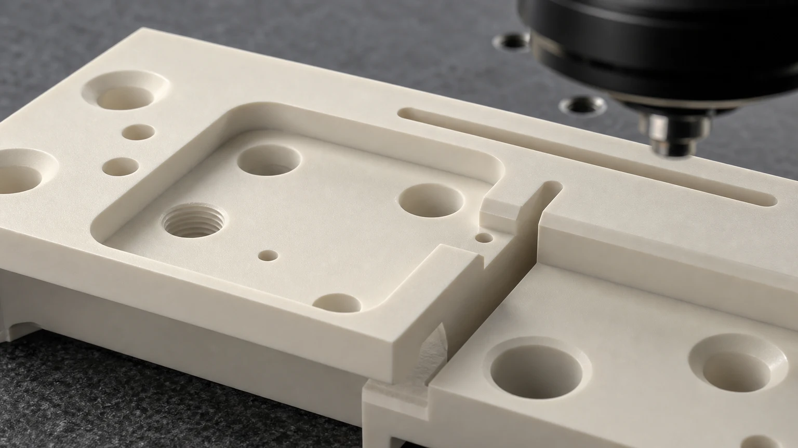
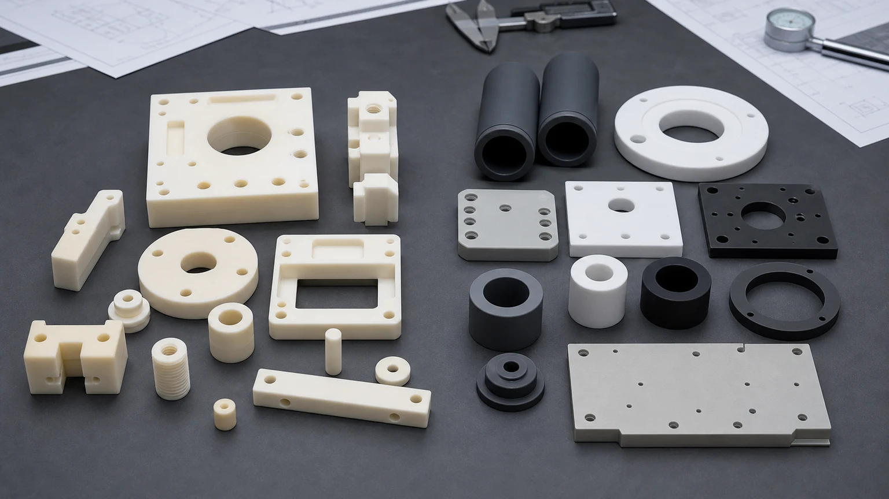

> Macor machinable glass ceramic is usually considered when an engineer needs a ceramic-like prototype, insulating fixture, vacuum-compatible trial part, or laboratory component without waiting for a full sintered ceramic production route. It can be a practical material, but it should be selected with clear service limits, ceramic-friendly design rules, and a plan for whether the final part will stay in Macor or transition to alumina, zirconia, silicon nitride, silicon carbide, aluminum nitride, or another technical ceramic.

Macor machinable glass ceramic parts appear in prototype fixtures, electrical insulation hardware, vacuum components, laboratory instruments, sensor mounts, test adapters, spacers, standoffs, alignment blocks, small plates, threaded ceramic features, and low-volume engineering trial parts. The reason is simple: Macor can often be machined with conventional shop equipment more easily than fully sintered advanced ceramics, so it can shorten early design learning.

That does not mean Macor should be treated as a universal production ceramic.

The practical sourcing question is not only "Can this part be made from Macor?"

The better question is:

**Is Macor the final service material, or is it a fast ceramic prototype used to validate geometry before moving to a higher-performance sintered ceramic?**

That question should be answered before feasibility, price, lead time, tolerance scope, or production route is confirmed.

### Why Engineers Choose Macor

Macor is attractive because it gives engineers a machinable ceramic option during the design and validation stage. A fully sintered alumina, zirconia, silicon nitride, silicon carbide, or aluminum nitride part usually requires diamond grinding, abrasive machining, lapping, or a near-net ceramic route after firing. That can be the correct path for production, but it may not be the fastest way to learn whether a mounting pattern, pocket geometry, electrical spacing, sensor location, or fixture interface is correct.

Macor is often reviewed when the project needs:

- A ceramic prototype with holes, pockets, slots, or threads.
- A non-metallic insulating fixture for testing.
- A vacuum-compatible experimental component.
- A small lab instrument part that does not justify a ceramic production route yet.
- A development fixture that may later be converted to alumina, zirconia, AlN, Si3N4, or SiC.
- A quick-turn part where geometry learning is more important than maximum wear, strength, or thermal performance.

The broader [ceramic material selection guide](/posts/materials-grade-selection/ceramic-material-selection-cnc-machining/) is useful when comparing Macor with high-performance production ceramics. For many RFQs, Macor is the right early-stage answer, while a different technical ceramic is the better final service material.

### Macor Is Different From Sintered Advanced Ceramics

Buyers sometimes group all "ceramic parts" together. That creates sourcing problems. Macor is a machinable glass ceramic. Fired alumina, zirconia, silicon nitride, silicon carbide, and aluminum nitride are advanced ceramics with different machining behavior and service expectations.

The distinction matters because it changes the cost model, design rules, and qualification path.

| Material path                  | Where it fits                                                                                                   | Machining and RFQ review focus                                                                                 |
| ------------------------------ | --------------------------------------------------------------------------------------------------------------- | -------------------------------------------------------------------------------------------------------------- |
| Macor machinable glass ceramic | Prototype fixtures, lab hardware, electrical insulation trials, vacuum test parts, low-stress custom components | Geometry, service limits, thread design, edge quality, and whether the part remains Macor or transitions later |
| Alumina Al2O3                  | Electrical insulation, wear parts, spacers, bushings, plates, general industrial ceramics                       | Purity, fired blank route, diamond grinding, functional surfaces, and cost-sensitive production                |
| Zirconia ZrO2                  | High-strength pins, plungers, precision wear components, small mechanisms                                       | Toughness, edge risk, sliding fit, surface finish, and assembly stress                                         |
| Silicon nitride Si3N4          | Structural wear parts, rollers, shafts, sleeves, guide components                                               | Load path, thermal shock, roundness, grade, and grinding route                                                 |
| Silicon carbide SiC            | Harsh chemical wear, seal faces, pump parts, semiconductor process-side hardware                                | Grade, lapped surfaces, media exposure, edge quality, and inspection evidence                                  |
| Aluminum nitride AlN           | Thermal management with electrical insulation                                                                   | Flatness, thickness, thermal-interface surfaces, cleaning, and handling                                        |
| Boron nitride BN               | High-temperature insulation, release-contact, and specialty thermal applications                                | Grade, atmosphere, strength limit, contact load, and machining fragility                                       |

If the part is only a development fixture or test adapter, Macor may reduce iteration time. If the part must survive abrasive slurry, high load, tight seal-face flatness, high thermal shock, plasma exposure, high-volume wear, or aggressive chemical service, the RFQ should review a production ceramic instead.

### Common Macor Machined Parts

Macor projects become clearer when the part is described by function rather than only by outside dimensions. A simple insulating washer, a threaded sensor mount, and a pocketed vacuum test fixture may all be Macor parts, but they create different design and inspection concerns.

| Part type                          | Common function                                                                    | Critical review points                                                                    |
| ---------------------------------- | ---------------------------------------------------------------------------------- | ----------------------------------------------------------------------------------------- |
| Prototype ceramic fixture blocks   | Validate shape, pockets, clearance, and assembly before production ceramic tooling | Internal radii, wall thickness, hole pattern, thread depth, and datum surfaces            |
| Electrical standoffs and spacers   | Provide insulation and spacing in test assemblies                                  | Height tolerance, parallelism, bore quality, chamfer, voltage path, and surface condition |
| Vacuum test components             | Support non-metallic hardware in vacuum or laboratory equipment                    | Flatness, cleanliness, trapped volume, edge chips, and interface surfaces                 |
| Sensor mounts and instrument parts | Hold probes, optical elements, or small devices in a stable non-metallic part      | Datum faces, hole location, thread strength, assembly load, and thermal exposure          |
| Threaded adapters and bushings     | Provide ceramic threaded interfaces for prototypes or low-stress use               | Thread form, engagement length, edge break, mating screw material, and torque limit       |
| Plates, brackets, and lab fixtures | Low-volume custom ceramic hardware for test benches                                | Pocket design, slot width, unsupported spans, mounting stress, and inspection method      |

Macor RFQs should define which features prove the prototype and which surfaces are only clearance or handling geometry.

### When Macor Is A Good Fit

Macor can be a practical choice when the job needs fast ceramic-like geometry, moderate precision, electrical insulation, dimensional stability, and custom machining flexibility. It is especially useful when the customer needs to test a design before committing to a sintered ceramic route.

Good-fit applications often include:

- Prototype ceramic fixtures for laboratory and industrial development.
- Electrical insulation parts where load and temperature are moderate.
- Vacuum test hardware that needs machinable ceramic geometry.
- Sensor and measurement device supports.
- Low-volume custom spacers, bushings, standoffs, and plates.
- Engineering models used to validate assembly access before alumina, AlN, zirconia, silicon nitride, or silicon carbide production.
- Research hardware where iteration speed matters more than maximum material performance.

Macor can also be useful when the drawing includes features that would be expensive to grind into a hard-fired ceramic during the first trial: deep pockets, threaded holes, several mounting patterns, adjustment slots, or geometry that may change after testing.

### When Macor May Not Be The Final Material

Macor should be reviewed carefully when the part must handle high load, high wear, severe thermal cycling, high bending stress, abrasive media, impact, corrosive process chemistry, high-temperature continuous duty, or particle-sensitive production environments. In those cases, the final material may need to be a high-performance ceramic.

For example:

- Use [precision machined alumina ceramic parts](/posts/industrial-ceramic-machining/precision-machined-alumina-ceramic-parts-industrial-applications/) when cost-effective electrical insulation, wear resistance, and production ceramic stability are more important than quick prototype machining.
- Use [zirconia ceramic machining](/posts/industrial-ceramic-machining/zirconia-ceramic-machining-high-strength-precision-components/) when compact precision parts need higher toughness, sliding fit, or edge durability.
- Use [silicon nitride ceramic machining](/posts/industrial-ceramic-machining/silicon-nitride-ceramic-machining-structural-wear-parts/) when structural wear, thermal shock, rollers, shafts, sleeves, or guide components are the main concern.
- Use [silicon carbide ceramic machining](/posts/industrial-ceramic-machining/silicon-carbide-ceramic-machining-harsh-environment-applications/) when the part faces harsh wear, corrosion, seal-face duty, or process-side semiconductor conditions.
- Use [aluminum nitride ceramic machining](/posts/industrial-ceramic-machining/aluminum-nitride-ceramic-machining-thermal-management-components/) when thermal management and electrical insulation must work together.

The safest approach is to state the actual service environment in the RFQ, not only the material name.

Macor can shorten geometry validation, but production ceramics may need different allowances, radii, tolerances, and inspection planning.

### Design Rules For Macor Machinable Ceramic Parts

Macor is easier to machine than many fired advanced ceramics, but it is still a brittle glass ceramic. Metal-style designs can still create chips, broken threads, fragile corners, and cost problems.

Useful design rules include:

- Use realistic internal radii instead of sharp square pockets.
- Add edge breaks or chamfers to handling and assembly edges.
- Avoid knife edges unless they are essential and reviewed.
- Keep holes away from thin walls and edges.
- Avoid very deep narrow slots unless tool access is clear.
- Define which faces need precision and which can use normal machined finish.
- Use practical thread engagement and avoid high torque assumptions.
- Avoid press fits unless stress and assembly method are reviewed.
- Provide datums that match how the part will be measured.
- Share the mating hardware, screw type, clamp load, or assembly method if known.

The [ceramic CNC machining design rules](/posts/design-rules-dfm/ceramic-cnc-machining-design-rules-advanced-ceramic-parts/) explain why ceramic designs should separate functional surfaces from non-critical geometry. That rule still applies to Macor. Even if a feature is machinable, it should still have a reason.

### Holes, Threads, Pockets, And Slots

One reason engineers choose Macor is the ability to machine holes, pockets, and threads more directly than in many sintered ceramics. These features are useful in fixtures, sensor mounts, test adapters, and lab components. They also need practical limits.

For holes, the RFQ should define:

- Hole diameter and depth.
- Through hole or blind hole condition.
- Hole-to-edge distance.
- Counterbore, countersink, or spotface requirements.
- Functional hole position relative to datums.
- Whether the edge must be chamfered or left sharp.
- Whether the hole is used for a screw, alignment pin, fluid path, sensor, or clearance.

For threads, define:

- Thread size and depth.
- Internal or external thread.
- Mating fastener material.
- Expected torque or clamp load if known.
- Whether thread inserts, clearance holes, or metal hardware could reduce ceramic stress.
- Whether the thread is for repeated assembly or one-time setup.

For pockets and slots, define:

- Pocket depth.
- Minimum corner radius.
- Slot width and length.
- Wall thickness around the pocket or slot.
- Whether a pocket floor is functional.
- Whether cosmetic tool marks are acceptable.

Threads and thin features should be reviewed with more care than simple holes. Macor may be machinable, but local stress concentration can still break ceramic features during assembly.

### Tolerance And Surface Finish Expectations

Macor can be machined to useful precision, but the tolerance discussion should still be feature-specific. A flat fixture face, a sensor bore, a threaded hole, and a clearance pocket should not all carry the same tolerance unless the assembly requires it.

Good RFQ practice is to separate:

- Critical datum faces.
- Mounting hole positions.
- Bore diameters and fits.
- Parallelism or perpendicularity requirements.
- Thickness or height stack dimensions.
- Non-critical pockets, reliefs, and clearance features.
- Cosmetic or non-functional surfaces.

The [ceramic tolerance capability map](/posts/tolerances-gdt/ceramic-tolerance-capability-map-by-feature-process/) can help align the drawing with a measurable route. The [surface finish and subsurface damage guide](/posts/surface-finish-functional/ceramic-ssd-surface-finish-specify-control-price/) is also useful when the part has sealing, contact, optical-adjacent, or vacuum-facing surfaces.

Surface finish should be specified by function:

| Surface type                  | Why it matters                                                         | RFQ note                                                               |
| ----------------------------- | ---------------------------------------------------------------------- | ---------------------------------------------------------------------- |
| Datum or mounting face        | Controls assembly position and repeatability                           | Define flatness, parallelism, and inspection method only where needed  |
| Electrical insulation path    | Chips, dirt, and sharp transitions can affect reliability              | Define edge break, cleaning, and creepage-related geometry if relevant |
| Vacuum interface surface      | Flatness, chips, and trapped pockets can affect sealing or cleanliness | Define gasket contact, cleaning expectation, and functional zones      |
| Threaded feature              | Local stress can break the ceramic during assembly                     | Define engagement length, fastener, torque, and assembly frequency     |
| Non-critical clearance pocket | Usually does not need fine finish or tight tolerance                   | Mark as clearance when possible to reduce cost and review time         |

### Macor In Electrical Insulation Parts

Macor is often selected for electrical insulation trials, custom spacers, standoffs, fixture plates, and test hardware. The important point is that electrical performance depends on the geometry and surface condition of the real part, not only on a material name.

For electrical insulation RFQs, provide:

- Voltage class or test voltage if known.
- Clearance and creepage intent.
- Surface condition requirement.
- Edge radius or chamfer requirement.
- Temperature range.
- Mating metal parts and clamp method.
- Whether the part is used in a prototype, test bench, or production assembly.

If the design is high-voltage sensitive, the [ceramic high-voltage insulators RFQ guide](/posts/high-voltage-insulation/ceramic-high-voltage-insulators-rfq/) gives more detail on creepage geometry, edge quality, and incoming acceptance.

### Macor In Vacuum And Laboratory Hardware

Macor is also used in vacuum, analytical, optical-adjacent, and laboratory equipment. The advantage is the combination of machinable ceramic geometry and non-metallic behavior in custom trial parts. The risk is that vacuum and lab hardware often has cleanliness, sealing, and thermal requirements that are not obvious from a simple drawing.

For these projects, the RFQ should clarify:

- Vacuum level or general vacuum class if known.
- Bake or temperature exposure.
- Cleaning method and packaging requirement.
- Gasket or seal interface surfaces.
- Blind holes, trapped volumes, or venting concerns.
- Whether the part touches sensors, optics, electrodes, or sample paths.
- Whether particles, chips, or visible tool marks affect acceptance.

A Macor component for a laboratory fixture can be straightforward. A Macor component used near a seal, sensor, electrode, or vacuum interface needs a more careful review.

### Prototype-To-Production Material Transition

Many successful Macor projects are not the end of the material decision. They are a step in a design path. A customer may use Macor to prove geometry, then switch to alumina, zirconia, silicon nitride, silicon carbide, aluminum nitride, or another ceramic for the final service environment.

This transition should be planned early because dimensions may not transfer one-to-one.

Review points include:

- Which features are geometry proof and which are final functional requirements.
- Whether pockets, slots, threads, or thin walls can be made in the production ceramic.
- Whether production will start from fired stock, near-net blanks, or a custom ceramic blank.
- Whether the final material requires diamond grinding, lapping, or polishing.
- Whether tolerances must be adjusted for the final ceramic route.
- Whether threads should become clearance holes, inserts, metal clamps, or alternate fastening geometry.
- Whether surface finish and edge quality need a different specification.
- Whether the final part needs material certificate, traceability, cleaning, or special packaging.

The RFQ should state if the Macor part is a prototype for a later ceramic. That context helps the supplier avoid optimizing the prototype in a way that cannot be reproduced economically in the final material.

### Cost Drivers In Macor Machining

Macor can reduce iteration cost in some projects, but it is not priced only by material volume. Geometry, fixture time, tolerance scope, threads, thin walls, and inspection can dominate the quote.

| Cost driver                        | Why it affects Macor parts                                              | How to control it in the RFQ                                         |
| ---------------------------------- | ----------------------------------------------------------------------- | -------------------------------------------------------------------- |
| Complex pocket geometry            | Adds setup, tool access planning, and corner-radius review              | Use practical radii and mark clearance pockets clearly               |
| Threaded ceramic features          | Threads require careful machining and assembly review                   | Define thread function, depth, fastener, and torque expectation      |
| Thin walls or ribs                 | Brittle sections can break during machining or assembly                 | Increase wall thickness where possible and define support conditions |
| Tight tolerance on every feature   | Adds inspection and machining time without always improving function    | Apply tight requirements only to datum, fit, or sealing surfaces     |
| Vacuum or electrical cleanliness   | Cleaning, edge control, and packaging may add process steps             | State cleanliness, handling, and edge criteria at RFQ stage          |
| Prototype-to-production conversion | A Macor-friendly design may not translate directly to sintered ceramics | Share final material intent early                                    |

The goal is not to remove useful precision. The goal is to place precision where it proves the design and supports the assembly.

### Inspection Evidence For Macor Parts

Inspection should match the purpose of the part. A prototype fixture may only need key dimensions, while a vacuum or electrical component may need face-specific checks and documented edge criteria.

| Feature or risk                | Possible inspection evidence                               | Why it matters                                             |
| ------------------------------ | ---------------------------------------------------------- | ---------------------------------------------------------- |
| Datum face or mounting surface | CMM, height check, surface plate method, or flatness check | Controls assembly repeatability                            |
| Hole position                  | CMM or optical measurement                                 | Aligns sensors, fasteners, pins, or mating parts           |
| Threaded hole                  | Thread gauge and visual edge review                        | Reduces assembly failure risk                              |
| Thin wall or pocket            | Dimensional check and visual inspection                    | Confirms the feature survived machining and handling       |
| Vacuum interface               | Flatness, visual edge criteria, and cleaning confirmation  | Reduces leak and contamination risk                        |
| Electrical insulation path     | Edge condition, surface condition, and dimensional review  | Supports creepage, clearance, and reliability expectations |

For custom ceramic projects, inspection should be agreed before production. A supplier should not guess whether the buyer needs a basic dimensional report, CMM report, flatness map, surface finish reading, visual edge standard, or special cleaning confirmation.

### RFQ Inputs For Macor Machinable Glass Ceramic Parts

The best Macor RFQ is clear about design purpose. Send enough information for the supplier to review the material, geometry, machining route, inspection, and risk.

Include:

- 2D drawing with dimensions, tolerances, datums, and notes.
- STEP or CAD model for pockets, slots, and complex geometry.
- Material request: Macor, alternate machinable ceramic, or open material review.
- Quantity: prototype, pilot, or production batch.
- Target timing.
- Functional surfaces and non-critical clearance areas.
- Hole, thread, slot, pocket, and edge-break requirements.
- Assembly method, screw type, clamp load, or mating components if known.
- Operating temperature, vacuum, voltage, chemical, or wear exposure.
- Whether the part is final Macor or a prototype for another ceramic.
- Inspection report, cleaning, packaging, or documentation requirements.

The [custom ceramic CNC machining RFQ checklist](/posts/rfq-preparation/custom-ceramic-cnc-machining-rfq-checklist/) can be used as a starting point for drawings and acceptance requirements.

### Practical Takeaway

Macor machinable glass ceramic is valuable when the buyer needs a fast, ceramic-like, custom machined prototype or low-volume technical part with practical holes, pockets, threads, insulation function, or laboratory geometry. It is especially useful when the engineering team is still learning the shape.

It is less appropriate when the part must carry high load, severe wear, harsh chemical attack, high-temperature production duty, tight seal-face performance, or semiconductor-grade process-side requirements. In those cases, Macor may still be useful as a prototype, but the final part should be reviewed as alumina, zirconia, silicon nitride, silicon carbide, aluminum nitride, boron nitride, or another production ceramic.

For quotation, send the drawing, CAD file, material intent, quantity, timing, service environment, functional surfaces, and inspection requirements. Final feasibility, price, lead time, and acceptance plan depend on drawing review, material review, machining route, and inspection scope.
