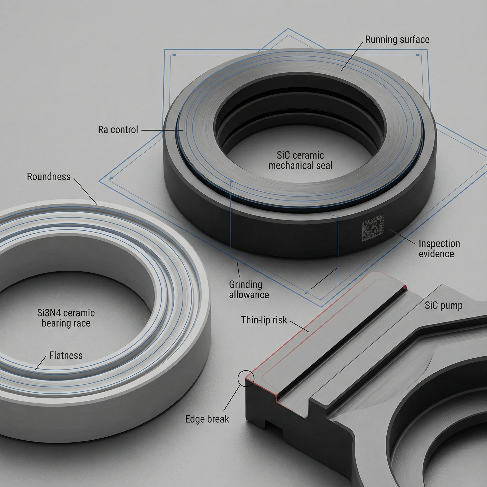

> Ceramic material selection should start from failure mode and acceptance requirements, not from a material name alone. The same drawing can price very differently depending on grade, blank state, machining route, and inspection scope.

Advanced ceramics are selected for insulation, wear resistance, thermal stability, corrosion resistance, low particle risk, or dimensional stability. But the material that performs well in service is not always the easiest material to machine, grind, lap, inspect, or source.

This guide helps engineering and procurement teams prepare better RFQs for ceramic CNC machining and diamond grinding.

### Select by Failure Mode First

Start by naming the problem the ceramic part must solve.

| Failure mode or requirement      | Material direction to review                                                |
| -------------------------------- | --------------------------------------------------------------------------- |
| Electrical insulation            | Alumina, MACOR, AlN, BN, fused silica, selected glass ceramics              |
| Abrasive or erosive wear         | Alumina, SiC, Si3N4, zirconia depending on impact and media                 |
| Seal face or valve seat          | Alumina, zirconia, SiC, sometimes Si3N4                                     |
| Thermal cycling                  | Si3N4, AlN, fused silica, selected alumina grades depending on load         |
| Harsh chemical media             | Alumina, SiC, and selected technical ceramics                               |
| Semiconductor or vacuum hardware | High-purity alumina, SiC, AlN, fused silica, or application-specific grades |
| Prototype machinability          | MACOR and selected machinable ceramics                                      |

The correct material depends on geometry and acceptance. A thin-wall SiC part with sharp slots is a different RFQ from a simple SiC ring. A zirconia seal ring is different from a zirconia threaded part with high clamping load.



### Material Families and RFQ Risk

Use this as a starting map, not as a final material decision.

| Material family                     | Common reasons to consider it                                             | Machining and RFQ notes                                                             |
| ----------------------------------- | ------------------------------------------------------------------------- | ----------------------------------------------------------------------------------- |
| Alumina Al2O3                       | Insulation, wear, cost efficiency, chemical stability                     | Specify purity, density, fired state, functional faces, and edge expectations       |
| Zirconia ZrO2                       | Toughness, reduced chipping risk, wear and sealing applications           | Review phase/grade, wall thickness, thermal exposure, and grinding heat sensitivity |
| Silicon Nitride Si3N4               | Bearing, wear, thermal shock, mechanical reliability                      | Strong candidate for demanding mechanical parts, but grade and route matter         |
| Silicon Carbide SiC                 | Extreme wear, corrosion, high temperature, seal faces                     | Very hard to finish; tight Ra and tolerance should be limited to functional faces   |
| MACOR and machinable glass ceramics | Prototypes, lab hardware, insulation, low-volume precision parts          | Easier to machine but not a substitute for high-strength structural ceramics        |
| AlN                                 | Thermal conductivity and electrical insulation                            | Moisture, handling, finish, and application environment need review                 |
| BN                                  | High-temperature insulation, release behavior, thermal shock in some uses | Soft and machinable relative to many ceramics, but mechanical strength is limited   |
| Fused silica                        | Thermal shock, optical/thermal stability, insulation                      | Edge quality, surface condition, and handling are important                         |

If the RFQ only says "ceramic," the quote cannot be precise. If it says "99.5% alumina, fired plate, finished faces A and B, Ra requirement on face A only," review becomes much clearer.

### Blank State Can Matter as Much as Material

Two parts with the same finished drawing can have different risks depending on the blank.

Common blank questions:

- Is the blank customer-supplied or supplier-sourced?
- Is it fired ceramic, green ceramic, presintered, pressed, molded, tube, rod, or plate?
- Is there enough stock allowance for grinding and lapping?
- Is the blank density, porosity, or surface condition acceptable?
- Does the blank already contain bow, warp, chips, or internal stress?
- Does the final geometry require near-net forming before hard machining?

For some drawings, a hybrid route is practical: rough features in green state, then post-sinter grinding or lapping on functional surfaces. For others, hard machining from fired stock is more predictable. The [green machining vs hard machining guide](/posts/process-routes-control/green-machining-vs-hard-machining/) explains this route choice in more detail.

### Match Material to Feature Geometry

Material selection cannot be separated from features.

| Feature           | Material-related risk                                              |
| ----------------- | ------------------------------------------------------------------ |
| Thin walls        | Fracture risk, fixturing stress, and sintering distortion          |
| Micro-holes       | Tool wear, exit breakout, taper, and inspection access             |
| Deep slots        | Minimum radius, wheel access, and edge chipping                    |
| Internal threads  | Wall thickness, load direction, and chip initiation                |
| Lapped seal faces | Material hardness, grain behavior, flatness, and surface integrity |
| Precision bores   | Roundness, coaxiality, datum stability, and measurement method     |

A material may be correct for the environment but difficult for the geometry. That is why ceramic material review and DFM review should happen together. Use the [ceramic DFM design rules](/posts/design-rules-dfm/ceramic-dfm-design-rules/) before locking a material around sharp corners, thin walls, or dense micro-features.


### Surface Finish and Tolerance Should Influence Material Choice

Low Ra, flatness, and tight tolerance requirements do not affect all ceramics equally. Harder materials may require more grinding time and wheel control. Tougher materials may reduce some chipping risk but still require careful finishing. Machinable ceramics can support rapid iteration but may not meet high wear, temperature, or strength requirements.

Before choosing a grade, ask:

- Which faces need low Ra?
- Which faces need lapping rather than standard grinding?
- Which dimensions are function-critical?
- Is the tolerance tied to a stable datum?
- Is the finish requirement cosmetic, sealing-related, wear-related, electrical, or vacuum-related?
- What inspection method will prove the requirement?

For surface-specific guidance, see the [surface finish and subsurface damage guide](/posts/surface-finish-functional/ceramic-ssd-surface-finish-specify-control-price/).

### Common Material Selection Mistakes

Avoid these patterns:

- Selecting the hardest ceramic because the part sees wear, without reviewing impact or edge risk.
- Choosing zirconia for toughness without checking temperature exposure or application environment.
- Asking for SiC on complex micro-feature geometry without reviewing feature access and finishing cost.
- Using alumina as a single word without purity, density, fired state, or functional requirements.
- Treating MACOR as a universal substitute for structural ceramics.
- Applying semiconductor-level finish or inspection to every surface when only one interface is critical.
- Changing material after the quote without reviewing shrinkage, stock allowance, route, and inspection again.

Material substitution should be treated as an engineering change, not a purchasing shortcut.

### What to Send When the Grade Is Unknown

If the exact grade is not known, send application information:

- Operating temperature and thermal cycling.
- Electrical insulation, dielectric, or thermal conductivity requirements.
- Wear type: sliding, abrasive, erosive, impact, or mixed.
- Chemical media and cleaning process.
- Vacuum, outgassing, particle, or contamination constraints.
- Load direction, clamping method, and assembly stress.
- Critical dimensions, surface finish, flatness, or micro-features.
- Quantity, target timing, and inspection evidence needed.

This lets the supplier review possible material families before quoting. It does not replace customer qualification or final design responsibility, but it reduces blind assumptions.

### RFQ Material Checklist

Use this material section in a ceramic machining RFQ:

```text
Preferred material:
Grade / purity / supplier spec:
Equivalent grade allowed: yes / no / review first
Blank source: customer-supplied / supplier-sourced / unknown
Blank state: fired / green / presintered / tube / rod / plate / near-net
Functional requirement: insulation / wear / seal / vacuum / thermal / chemical / other
Service environment:
Critical features affected by material:
Surface finish and flatness requirements:
Inspection or certificate requirements:
Previous sample or existing supplier route:
```

For complete RFQ preparation, combine this with the [custom ceramic CNC machining RFQ checklist](/posts/rfq-preparation/custom-ceramic-cnc-machining-rfq-checklist/) and the [materials overview](/materials/).

### FAQ

**Is alumina always the safest first choice?**  
No. Alumina is common and cost-effective, but the correct grade depends on purity, geometry, finish, wear mode, insulation need, and acceptance requirements.

**When should zirconia be reviewed?**  
Zirconia is useful when toughness and reduced chipping risk matter, especially in some wear and sealing parts. Temperature, environment, and grade still need review.

**Why is SiC often expensive to finish?**  
SiC is extremely hard. Tight tolerance, low Ra, lapping, or complex geometry can add significant grinding and inspection time.

**Can MACOR be used for production parts?**  
Sometimes, especially for lab hardware and insulating components. It should not be treated as a direct replacement for high-strength alumina, zirconia, Si3N4, or SiC without application review.

**Can the supplier recommend a material?**  
The supplier can review candidate materials when the application, geometry, quantity, and acceptance requirements are clear. Final qualification remains tied to the customer application and validation plan.
