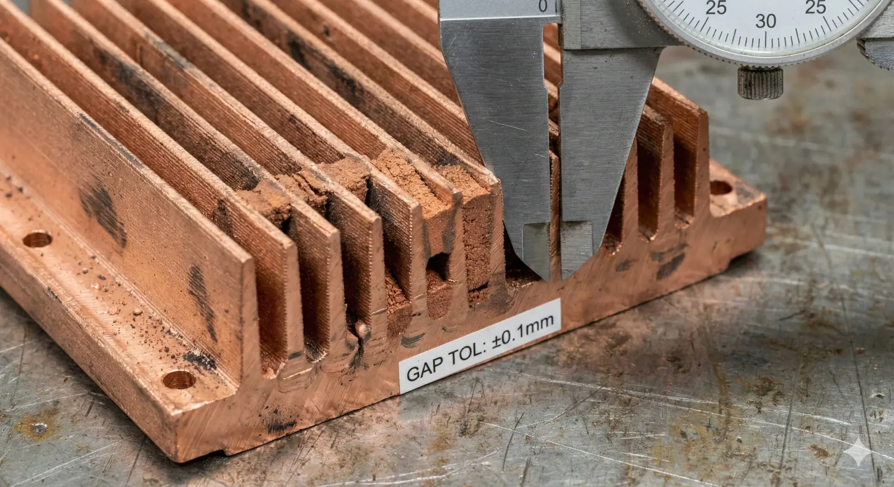
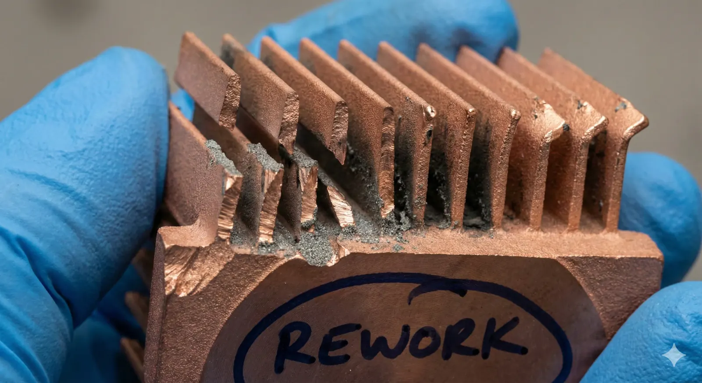
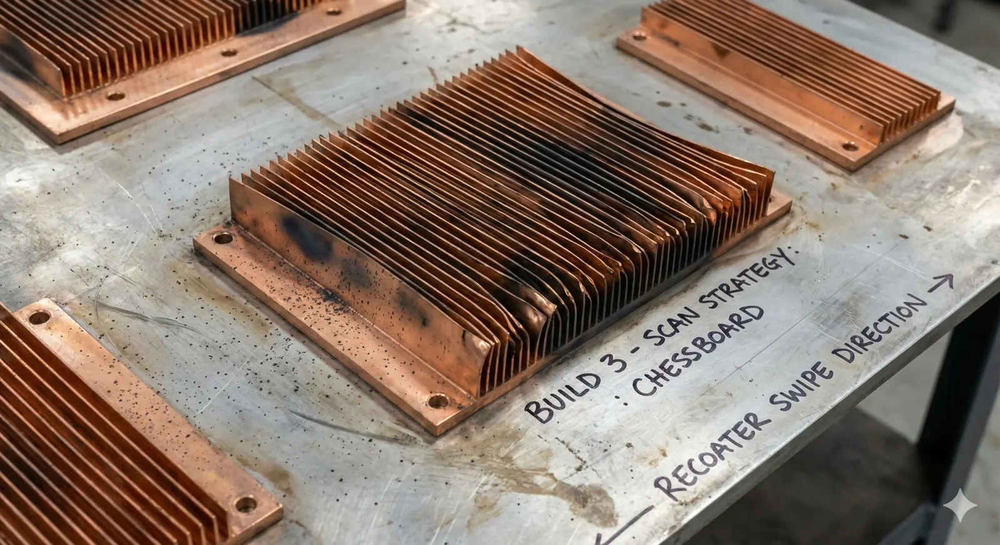
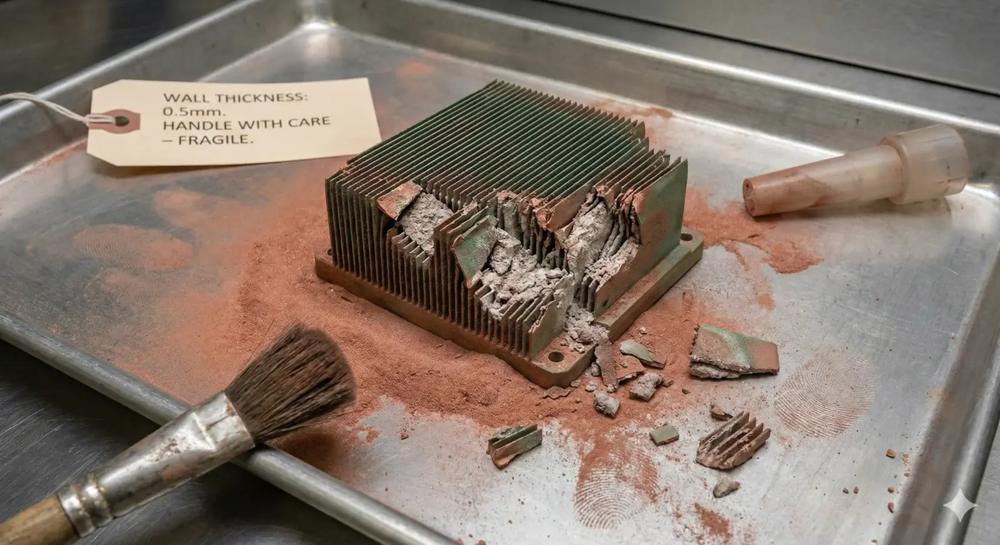
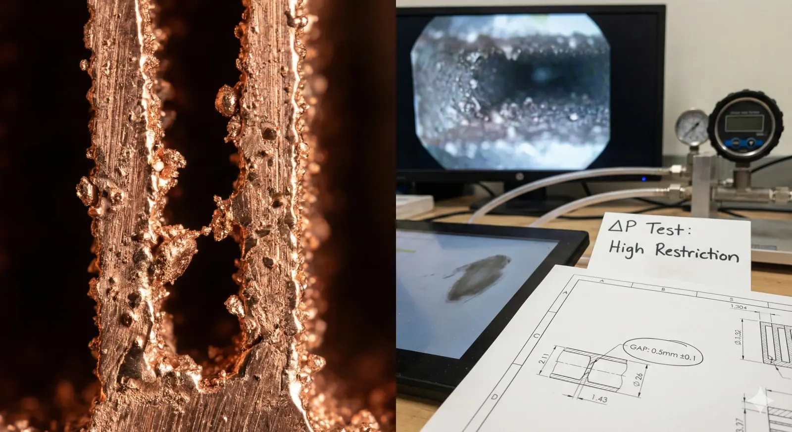

> **Zero-click summary (manufacturing reality, not brochure numbers):**
> For**powder bed fusion (PBF-LB/M) copper alloys**used for heat sinks (commonly**CuCrZr**), treat**0.8–1.0 mm fin thickness**as the lower bound for repeatable yield, and**≥1.2–1.5 mm fin spacing**as the lower bound for depowdering + airflow robustness. For**binder jet + sinter copper**, thin fins fail in handling and depowdering; set**≥2.0–3.0 mm fin thickness**and**≥2.0–3.0 mm spacing**, then validate shrink + distortion with coupons. “Printable” thinner features exist in labs, but**heat-sink production fails on yield, depowdering, and inspection**, not CAD.

### Objective

Define**minimum fin thickness (t)**and**minimum fin spacing (s)**for**3D printed copper heat sinks**that remain**repeatably manufacturable**,**inspectable**, and**serviceable**across common copper AM routes.

### Constraints

- **Manufacturing constraint** : Copper’s high thermal conductivity and reflectivity increase local melt-pool instability and distortion sensitivity versus common AM alloys, pushing minimum printable thin features upward in production. ( [MDPI](https://www.mdpi.com/2075-4701/15/10/1114) )
- **Post-processing constraint** : Fin arrays fail when **powder removal, bead blasting, or handling** imposes bending loads that exceed the as-built thin-wall strength (or green strength in binder jet). ( [Desktop Metal](https://www.desktopmetal.com/uploads/81-00239_Rev01_EN_Binder-Jet-Design-Guide.pdf) )
- **Inspection constraint** : Without **CT voxel resolution** and **surface roughness characterization** , thin fins cannot be qualified for gap uniformity or blockage risk.

### Decision point that actually matters

“Minimum” has three different meanings; mixing them creates scrap.

| Term | What it really means in production | What sets the floor |
| --- | --- | --- |
| Printable minimum | A fin appears in a one-off build | Machine + parameter window |
| Repeatable minimum | Fins survive depowdering + finishing with acceptable yield | Distortion + handling loads + powder bridging |
| Inspectable minimum | You can prove spacing is open and consistent | Metrology access + CT/optics limits |

The rest of this article targets**repeatable**and**inspectable**minima.

### Failure mechanisms that set minimum fin thickness and spacing

#### 1) Powder bridging and “false open area” inside fin gaps

When**s**approaches the scale where partially fused particles and downskin roughness intrude, the gap becomes a**tortuous porous channel**, not a clean fin passage; airflow drops and pressure rise increases, often undetected in visual inspection.

**Root cause chain**: small**s**→ higher probability of local fusion/adhesion → incomplete depowdering → flow blockage → thermal performance regression.

**Tax**: extra depowder operations, higher scrap, and late discovery during thermal test.

#### 2) Thin fins behave like springs during depowdering and blasting

Fin arrays act as cantilevers; bead blasting and manual depowdering apply lateral loads that exceed the fin’s elastic limit or fatigue it at the root fillet, creating fractures that look like “random handling damage” but are geometry-driven.

**Root cause chain**: low**t**and high**h/t**→ low bending stiffness → root stress concentration → crack initiation at rough downskin.

**Tax**: rework time and yield loss; fixing by thicker fins often reduces surface area and adds mass.

#### 3) Copper AM distortion accumulates across dense fin fields

Fin fields create a thermal “forest” with repeated scan turns and constrained shrinkage; residual stress bows fin tips and closes gaps, especially when the fin field is oriented against recoater direction.

**Root cause chain**: scan strategy + high local heat extraction → residual stress gradient → fin tip deflection → gap closure.

**Tax**: build orientation constraints, extra supports, and potential post-machining of the base.

#### 4) Binder jet: green part fragility dominates, not printer resolution

In binder jetting, thin fins fail before sintering because the**green part**cannot tolerate depowdering forces; published design guidance flags thin walls as fragile during depowdering even above the absolute minimum. ([Desktop Metal](https://www.desktopmetal.com/uploads/81-00239_Rev01_EN_Binder-Jet-Design-Guide.pdf))

**Tax**: conservative geometry, more mass, and more post-sinter machining to recover tolerances.

### Process window: minimum fin thickness and spacing by copper AM route

#### Assumptions (explicit)

- Heat sink is an **external fin array** (airflow over fins), not a fully enclosed microchannel cold plate.
- Material is either **CuCrZr** (common for PBF copper) or sintered copper (binder jet route).
- “Minimum” targets **repeatable yield** , not a one-off demo.

#### Data forensics (D1): production-oriented minima (repeatable + inspectable)

| AM route | Evidence anchor | t_min (repeatable) | s_min (repeatable) | What drives the minimum | How to verify |
| --- | --- | --- | --- | --- | --- |
| PBF-LB/M (CuCrZr, vendor parameter set) | EOS CuCrZr datasheet lists minimal wall thickness 0.8 mm (EOS GmbH) | 0.8–1.0 mm | 1.2–1.5 mm | thin-wall capability + distortion + depowder survival | CT for gap continuity; optical + profilometer for roughness; coupon fin pull/bend |
| PBF-LB/M (pure copper at service bureau) | Example service guidance shows minimum feature size 0.6 mm and minimum wall thickness 1.0 mm (DTI) | 1.0–1.2 mm | 1.5–2.0 mm | higher instability risk and stricter depowder constraints | CT + airflow ΔP screening; powder escape access check |
| Binder jet + sinter (copper) | Design guide warns <0.75 mm walls lack green strength and 0.75–2 mm remain fragile (Desktop Metal) | 2.0–3.0 mm | 2.0–3.0 mm | green part handling + sinter distortion/shrink | green handling trials; sinter coupon mapping; CMM post-sinter |
| Micro-extrusion / niche copper AM | Reported minimum wall thickness ~250 µm in controlled studies (Emerald) | Process-specific | Process-specific | resolution exists; throughput + surface finish dominate | only if supplier provides capability report + coupons |

*Test Method (for D1): Use a fin coupon (same height and pitch as design) placed at build-plate corners + center; measure gap closure via CT, and correlate with airflow pressure drop at a fixed flow rate.*

**Local uncertainty (non-negotiable)**: Without**CT voxel size stated**and**depowder process definition (air blast vs vibration vs bead blast)**, repeatable**s_min**cannot be guaranteed, because “open” gaps can still be functionally blocked.

### Why spacing usually fails before thickness in heat sinks

A fin that is slightly too thin often breaks visibly; a gap that is too tight often “passes” visual checks and fails thermally.

**Mechanism**: as-built copper surfaces have downskin roughness and adhered particles; in a narrow gap, roughness reduces hydraulic diameter and increases pressure drop, pushing the operating point to lower airflow. This is why**s_min**must include a**roughness allowance**, not only a CAD clearance.

**Hidden cost**: validating spacing requires CT or destructive sectioning; calipers and borescopes miss partial bridging in the mid-height of the fin field.

### A production rule set that survives procurement, build, and QA

#### Rule set R1: PBF copper alloy (CuCrZr) external fins

- **t ≥ 0.9 mm** when fin height **h ≥ 15 mm** (stiffness floor for depowder + blasting survival).
- **s ≥ 1.2 mm** when fin height **h ≤ 15 mm** ; **s ≥ 1.5 mm** when **h > 15 mm** (gap closure probability increases with height).
- Add a **root fillet** and prohibit knife-edge tips; tip rounding reduces crack initiation during blasting.

**Counterfactual**: If fin thickness is pushed below the vendor’s stated minimal wall capability (e.g., 0.8 mm for a CuCrZr parameter set), the build can succeed visually and still fail at depowdering with fractured tips and blocked gaps. ([EOS GmbH](https://www.eos.info/05-datasheet-images/Assets_MDS_Metal/EOS_CopperAlloy_CuCrZr/Material_DataSheet_EOS%20_Copper_CuCrZr_en.pdf))

#### Rule set R2: Binder jet + sinter copper external fins

- **t ≥ 2.5 mm** and **s ≥ 2.5 mm** as a default floor until green-handling trials prove lower is stable.
- Treat fins as **fragile green walls** even when thicker than the absolute minimum wall thickness guidance; depowdering is the dominant risk. ( [Desktop Metal](https://www.desktopmetal.com/uploads/81-00239_Rev01_EN_Binder-Jet-Design-Guide.pdf) )

**Regret/trade-off**: This geometry is heavier and reduces surface area density; it buys yield and predictable lead time.

### Execution log (failure → fix → tax)

**Failure**: A CuCrZr PBF heat sink with**t = 0.5 mm**and**s = 0.6 mm**produced fins that looked complete at the perimeter, but mid-array gaps were partially bridged; bead blasting broke multiple fin tips. [Figure 1]

**Fix**: Increase to**t = 0.9 mm**,**s = 1.5 mm**, add root fillets, and orient the fin field to reduce recoater interaction; require CT sampling on first article.

**Tax ledger**:

- **Material/geometry tax** : higher mass and lower surface area density.
- **Process tax** : CT screening and fin coupons consume machine time and inspection bandwidth.
- **Coordination tax (domain friction)** : aligning build orientation, support strategy, and depowder method across supplier and QA extends iteration cycles.

### Decision matrix: choose minima by what you are optimizing

| Goal | Recommended route | Geometry stance | Primary risk | Rollback trigger |
| --- | --- | --- | --- | --- |
| Max surface area density under moderate airflow | PBF-LB/M CuCrZr | t≈0.9–1.2, s≈1.2–1.8 | blockage + distortion | If CT shows >5% gaps partially blocked → increase s by 0.3 mm and reduce fin height |
| Low cost, robust handling, low inspection complexity | Binder jet + sinter | t≥2.5, s≥2.5 | green breakage + shrink | If green depowder breaks ≥1 fin per part → increase t and add handling ribs |
| Lab-grade ultra-thin features | niche processes | supplier-defined | throughput + surface finish | If supplier cannot supply coupon + capability report → stop and revert to PBF CuCrZr |

### If/then triggers (operational gates)

1. **If** fin spacing is ≤1.5 mm **then** require **CT** on first article and after any parameter change; optical inspection alone is invalid.
2. **If** fin height exceeds 20 mm **then** increase thickness by ≥0.2 mm or reduce height; otherwise depowder damage dominates yield.
3. **If** airflow is forced and pressure budget is tight **then** spacing must include a roughness allowance; validate with ΔP test, not CAD.
4. **If** supplier proposes “we can print 0.3 mm walls” **then** demand a fin coupon at the same aspect ratio; wall demos do not transfer to fin forests.

### Metrology plan (tool + limit)

- **CT scanning** : detects internal gap closure and powder retention; **misses** very fine adhered-powder layers below voxel size and can blur thin edges.
- **Optical microscopy** : resolves edge roughness and crack initiation; **misses** internal mid-gap bridging without sectioning.
- **Airflow ΔP test** (fixture): directly reveals functional blockage; **misses** the root cause location without CT correlation.

Without CT voxel size stated in the inspection report, “gap open” cannot be guaranteed.

### Readiness check (K1): design gate (max 7)

1. Fin field defined with **t, s, h** , and base thickness on the drawing (no implicit CAD intent).
2. Depowder plan defined (air blast / vibration / bead blast) and tied to minimum **s** .
3. Root fillets and tip radii specified to control root stress.
4. Build orientation specified or constrained (recoater interaction risk addressed).
5. Coupon geometry included in the build (same fin pitch and height).
6. Inspection method specified (CT + voxel size, or destructive section plan).
7. Acceptance metric defined (blocked-gap percentage + ΔP threshold).

### Readiness check (K2): supplier acceptance gate (max 7)

1. Supplier states AM route per ISO/ASTM process category (PBF vs binder jet). ( [International Organization for Standardization](https://www.iso.org/obp/ui/) )
2. Supplier provides parameter set or datasheet limits for the copper alloy (e.g., minimal wall thickness for CuCrZr). ( [EOS GmbH](https://www.eos.info/05-datasheet-images/Assets_MDS_Metal/EOS_CopperAlloy_CuCrZr/Material_DataSheet_EOS%20_Copper_CuCrZr_en.pdf) )
3. Documented depowder method and blast media.
4. CT capability statement (voxel size at part size).
5. Evidence of prior fin/cold-plate builds in copper alloys.
6. First-article plan includes coupons at corners + center.
7. Rework policy stated (what defects get scrapped vs reworked).

### FAQ (failure-bounded)

**Is “minimum wall thickness” equivalent to “minimum fin thickness”?**

No. A wall can be supported and continuous; a fin in a heat sink is a high-aspect-ratio cantilever exposed to depowder and blasting loads, so the repeatable minimum is usually thicker than the printable wall minimum. ([EOS GmbH](https://www.eos.info/05-datasheet-images/Assets_MDS_Metal/EOS_CopperAlloy_CuCrZr/Material_DataSheet_EOS%20_Copper_CuCrZr_en.pdf))

**Why do some sources claim 0.3–0.6 mm features for metal AM?**

Those values often refer to controlled coupons, different alloys, or “printable once” conditions. Independent LPBF design studies show sub-0.3 mm walls fail to build to full height even in other alloys, indicating the practical floor rises quickly with unsupported height. ([AIP Publishing](https://pubs.aip.org/lia/jla/article/34/1/012015/2845862/Design-guidelines-for-laser-powder-bed-fusion-in))

**Does using pure copper instead of CuCrZr change the minima?**

Yes. Service-bureau guidance for LPBF copper cites larger minimum wall and channel sizes than vendor CuCrZr parameter sets; treat pure copper as requiring wider process margins unless the supplier demonstrates stable coupons. ([DTI](https://www.dti.dk/_/media/94397_2025_Pulvertyper%20-%20kobber_EN.pdf))

---

> *Disclaimer: All scenarios described are based on real or closely analogous executed projects. If you choose to implement any of the examples described in this article, please conduct a careful evaluation first. This site assumes no responsibility for losses resulting from implementations made without prior evaluation.*
