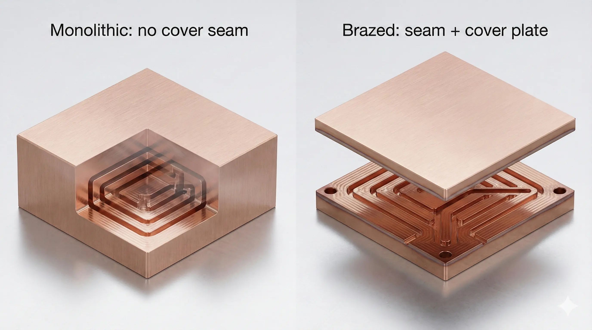
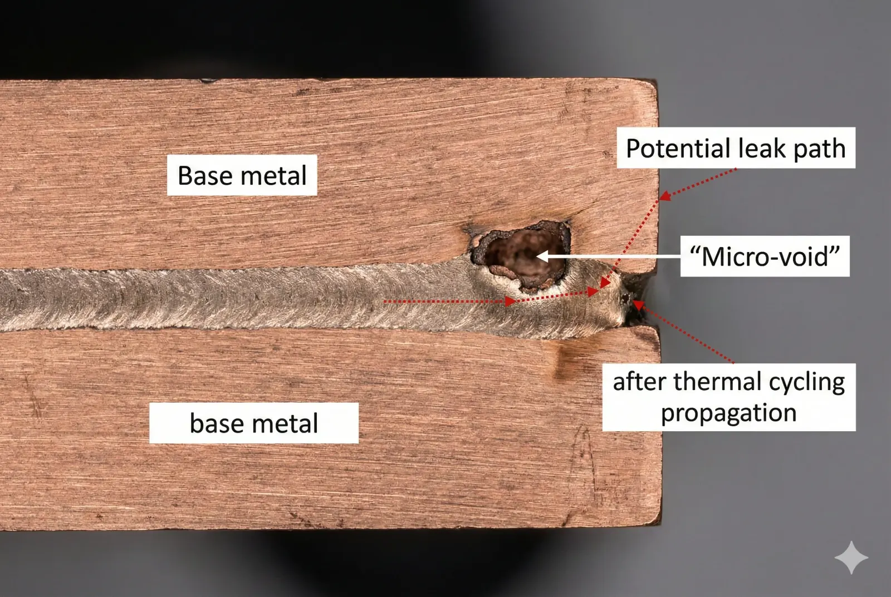
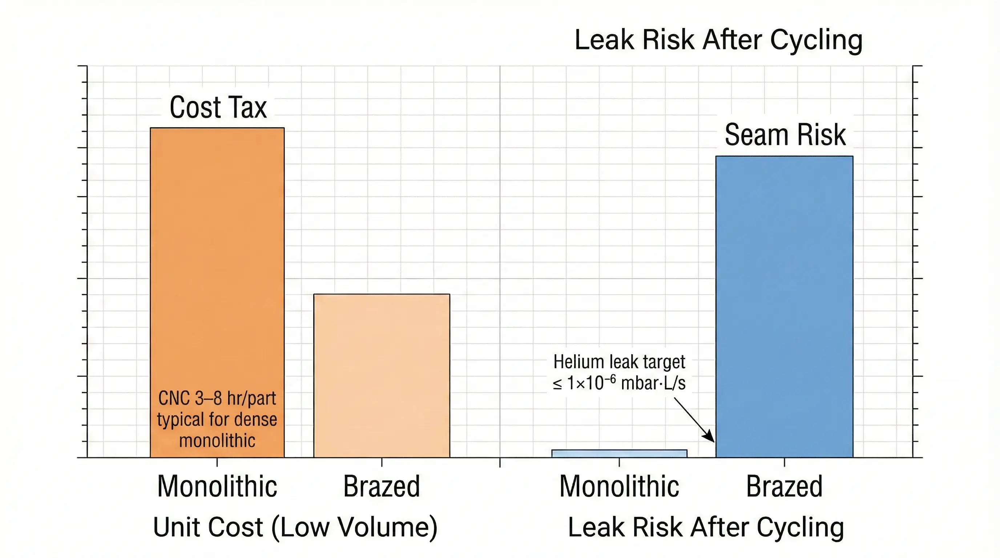

> **Monolithic copper cold plates vs brazed copper cold plates**is**conditionally feasible**depending on**leak-risk tolerance and volume economics**. Monolithic designs remove the**braze seam leak path**, but often increase**CNC hours (3–8 machine-hours/part)**and scrap risk; brazed designs reduce machining time yet introduce a**joint integrity variable**that must be controlled with**helium leak limits (commonly ≤ 1×10⁻⁶ mbar·L/s)**and disciplined furnace process control.

### Copper Cold Plate Requirement That Triggers the Monolithic vs Brazed Decision

We typically see this decision appear when a program hits**one of two thresholds**:

1. **Higher allowable coolant pressure / pulsation** (e.g., design proof pressure ≥ 10 bar and repetitive pulsation testing), where a seam becomes a reliability focal point.
2. **Higher heat flux density** (e.g., localized heat flux ≥ 100 W/cm² under IGBT / laser diode / ASIC footprints), where teams want thinner walls and more aggressive channel geometry.

The appeal is rational:**brazed copper cold plates**(machined channel plate + brazed cover) often lower unit cost at volume, while**monolithic copper cold plates**(one-piece body with sealed ports, no cover joint) often reduce leak paths and simplify root-cause if failures occur.

### Monolithic Copper Cold Plates: Reliability Mechanism and Cost Reality

A monolithic copper cold plate is a type of**single-piece copper fluid manifold**where internal channels are created by**deep CNC milling, drilling, EDM, or gun drilling**, then closed by geometry choices (e.g., blind channels, cross-drilled plugs) rather than a perimeter braze seam.

**Reliability upside (what we can measure):**

- You eliminate the **largest continuous joint** (the cover braze seam). In postmortems, the seam is frequently the dominant leak locus because it is long, thin, and thermally cycled.
- In qualification, monolithic units often show more stable leak performance after cycling because the primary sealing elements become **O-rings, plugs, or welded/brazed port fittings** , which are localized and inspectable.

**Cost and manufacturability taxes (what you pay):**

- **Machine time** climbs fast with channel density. We commonly see **3–8 CNC hours/part** for dense serpentine geometries, driven by small end mills and conservative stepdowns to avoid tool breakage.
- **Scrap risk** is structural: if an internal channel breaks out or a tool snaps inside a channel, rework may be impossible without affecting pressure boundary thickness (e.g., minimum wall targets of **0.8–1.5 mm** in compact designs).

### Brazed Copper Cold Plates: Cost Advantage With a Joint-Control Burden

A brazed copper cold plate is a type of**two-part copper assembly**: a machined channel plate and a cover plate joined by**furnace brazing**(often vacuum or controlled atmosphere). This architecture can be excellent—if the braze process is treated as a controlled special process, not a “joining step.”

**Where brazed designs win:**

- Channel machining is simpler because the channels are **open** during machining; you avoid many blind operations and reduce internal tool access constraints.
- At medium to high volumes, the unit cost can compress because machining hours drop and furnace cycles batch multiple parts. It is common to see **20–50% lower machining time** versus monolithic for comparable channel density (exact delta depends on channel width, depth, and allowable tool diameter).

**Where brazed designs fail (repeatable failure modes):**

- **Micro-voids and non-wet areas** at the seam create leak nucleation sites. These can pass initial pressure holds and fail after thermal cycling or vibration.
- **Joint clearance control** is critical. Typical target braze gaps are on the order of **25–75 µm** ; outside that band, capillary flow and fillet formation become inconsistent, increasing void probability.
- Any contamination (oxide, cutting fluid residue) becomes a yield and reliability multiplier, not a cosmetic issue.

### Copper Cold Plate Engineering Analysis: Leak Risk, Thermal Cycling, and Repairability

The core physics/economics conflict is simple:

- **Monolithic** shifts risk to **machining feasibility and plug/port sealing strategy** .
- **Brazed** shifts risk to **metallurgical joining quality and inspection depth** .

From a reliability engineering standpoint, the questions are measurable:

1. **Leak tightness target** : For liquid cooling in electronics, many teams set helium leak limits like **≤ 1×10⁻⁶ mbar·L/s** (sometimes tighter for mission-critical). If your field failure cost is high, treat this as a design driver, not a QA checkbox.
2. **Thermal cycling regime** : A common qualification envelope is **-40°C to +125°C for 500–1,000 cycles** , especially in power electronics. Brazed seams see differential strain and can develop microcracks if voids exist or if braze fillets are thin/uneven.
3. **Pressure pulsation** : Even “only” **2–6 bar** coolant systems can experience damaging pulsation if pumps create harmonic pressure ripples. Brazed seams and port joints are where pulsation damage concentrates.

### Execution Log From a Copper Cold Plate Program: The Pivot Point We Hit

A representative program (anonymized) came to us with a brazed copper cold plate that passed incoming leak tests but developed intermittent field leaks after combined thermal cycling and vibration. The plate ran**water-glycol**, operated around**60–80°C bulk coolant**, and had periodic pump-driven pulsation.

**The Attempt:**
We started by tightening brazing controls: surface prep, fixture flatness, and furnace profile discipline. We raised inspection to**100% helium leak test**and added a post-cycle retest gate.

**The Friction (Failure Mode):**
Leak failures clustered at seam segments adjacent to high channel density—areas that were also most sensitive to**warpage and braze gap variability**. The first-pass yield improved, but we still saw a long-tail of units that passed day-one tests and failed after cycling.

**The Pivot Point:**
We quantified the economics of chasing seam perfection versus eliminating the seam. When your seam length is long and your channel plate warps even slightly, you are paying a continuous “process tax.”

**The Resolution:**
We redesigned into a semi-monolithic architecture: monolithic channel body plus localized joining only at standardized port fittings, with a conservative minimum wall strategy. The reliability improved, but the bill was explicit:

- **+35–60% unit cost** at low volume due to CNC hours and higher scrap sensitivity
- **+2–4 weeks lead time** during process stabilization (tooling, probing, deburring, cleaning validation)
- Added requirements for **cross-drill plugs** and secondary sealing validation

The point is not “monolithic is better.” The point is:**you either pay to control a seam, or you pay to machine around it.**

### Data Forensics Table: Cost and Reliability Drivers in Copper Cold Plates

| Parameter | Standard Approach (Brazed Copper Cold Plate) | Advanced Approach (Monolithic Copper Cold Plate) | The Trade-off |
| --- | --- | --- | --- |
| Primary leak paths | Long perimeter braze seam + ports | Ports + plugs (localized) | Brazed has more continuous joint length; monolithic concentrates risk into fewer features |
| Leak screening | 100% helium test recommended (e.g., ≤ 1×10⁻⁶ mbar·L/s) | 100% helium test still recommended | Brazed depends more on seam consistency; monolithic depends more on plug/port execution |
| Typical cost structure at low volume | Lower CNC hours, added brazing + fixtures | Higher CNC hours, fewer joining steps | Brazed wins on machining time; monolithic wins on process simplification but costs more per hour |
| NRE / setup burden | Braze fixtures + furnace recipe validation | CNC process dev + deburr/clean validation | Brazed burdens metrology + joining; monolithic burdens toolpath stability and internal cleanliness |
| Rework feasibility | Limited; braze rework is risky and often scrap | Moderate; plugs/ports sometimes reworkable | Brazed defects are often irreversible; monolithic has more localized repair options |
| Channel geometry freedom | High for open channels before brazing | Limited by tool access and blind features | Brazed enables aggressive fin/channel features; monolithic constrained by cutters and access |
| Field failure signature | Often seam microleak after cycling | Often port/plugs if not robust | Both can fail; the failure locus differs and changes your containment strategy |

*Test method: helium mass spectrometer leak test + pressure hold, validated after thermal cycling and pressure pulsation per program-specific DVP&R.*

> **Project Readiness Check**- Before committing, ask yourself (or your supplier):
>   - What is the **maximum acceptable leak rate** after thermal cycling (numeric limit, not “no leaks”) and will you enforce **100% helium testing** post-cycle?
>     - What is your **field failure cost** (warranty + downtime + reputation) relative to a **+35–60% unit cost** increase at low volume?

### Feasibility Verdict for Copper Cold Plate Architecture Selection

#### Clearly Feasible: Brazed Copper Cold Plate With Controlled Joining

Go ahead if all of the following are true:

- You can enforce **braze joint clearance control (e.g., 25–75 µm targets)** and run a stable furnace process.
- You can afford **100% helium leak testing** and a post-cycle retest gate (not sample-only).
- Volume economics matter and you expect meaningful cost-down at scale via batch brazing.

#### Conditionally Feasible: Monolithic Copper Cold Plate in the High-Cost Route

Possible, but expect**higher CNC hours (3–8 hr/part)**and a higher process stabilization burden if:

- Your application has **high consequence of leakage** (mission-critical uptime or safety constraints).
- Your system sees aggressive thermal cycling (e.g., **-40°C to +125°C** ) and/or pulsation that historically reveals seam weaknesses.
- You can accept higher unit cost early to buy down seam risk structurally.

#### Structurally Mismatched: Monolithic or Brazed Used for the Wrong System Constraint

Not recommended in these cases:

- **Monolithic** is a poor fit if your design requires ultra-dense microfeatures that are not tool-accessible without extreme machining risk (scrap becomes the dominant cost). Consider a brazed architecture or diffusion-bonded laminate instead.
- **Brazed** is a poor fit if you cannot control cleanliness, gap, and furnace repeatability, or if you cannot run **100% leak testing** . In that environment, the seam becomes a probabilistic warranty generator.

### FAQ on Monolithic vs Brazed Copper Cold Plates (Cost and Reliability)

**What leak test level is “normal” for copper cold plates?**

For electronics liquid cooling, helium mass spectrometer testing with limits like ≤ 1×10⁻⁶ mbar·L/s is common for quality-focused programs. Some mission-critical systems tighten this further. The key is enforcing the same limit after thermal cycling, not only at incoming inspection.

**Does monolithic always mean “no brazing at all”?**

Not necessarily. Many “monolithic” programs still join standardized port fittings or close cross-drills using plugs. The reliability question becomes whether your joining is localized and inspectable versus a long continuous seam.

**Why do brazed seams pass initial testing but fail later?**

Small voids, non-wet regions, or thin fillets can remain stable at room temperature pressure holds, then open under combined thermal strain and vibration. Cycling (e.g., -40°C to +125°C) is a practical accelerator for revealing seam variability.

**Which is cheaper at scale: monolithic or brazed?**

At medium/high volumes, brazed designs often win because open-channel machining is faster and furnace brazing batches parts. Monolithic can be cost-competitive only when the design avoids deep, dense channels that drive long CNC cycles.

**What is the fastest way to de-risk a brazed design?**

Treat brazing as a special process: control joint clearance, mandate validated cleaning, run disciplined furnace profiles, require 100% helium testing, and add post-cycle retesting. If you cannot operationalize those controls, redesign away from the seam.

---
