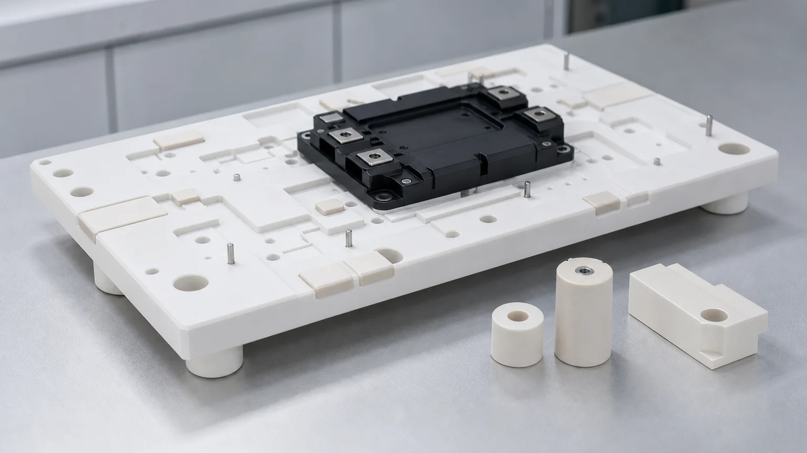
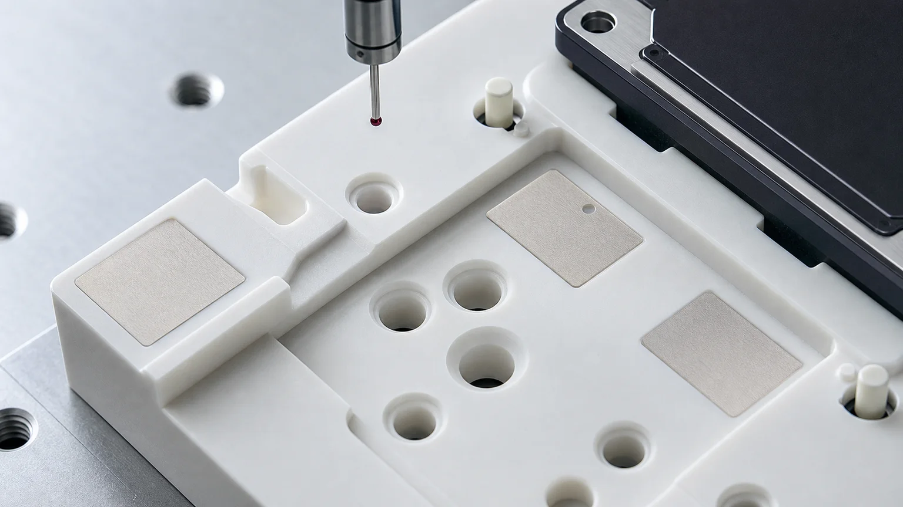
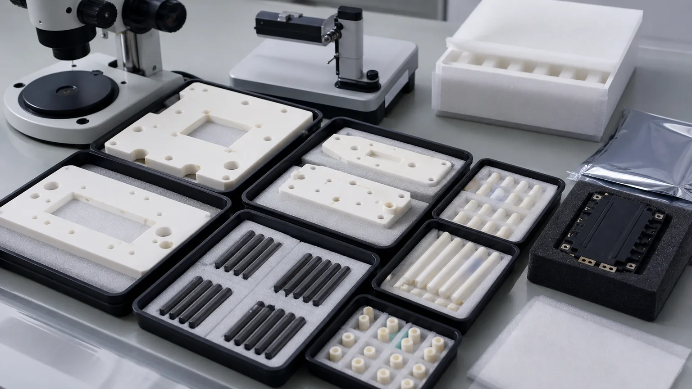

> An alumina ceramic inspection fixture for SiC power module assembly is not just a white insulating plate. It is a controlled reference system: datum pads, locating bores, module support lands, pin interfaces, creepage-aware edges, clean handling, and inspection evidence must work together before the fixture can repeat inside an assembly or test process.

This is a representative precision ceramic machining case study, not a claim about a named customer program. It reflects a common RFQ pattern: a power electronics team is building or qualifying an inspection fixture for SiC modules, power substrates, gate-driver assemblies, or high-voltage test hardware. The drawing shows an alumina plate with pockets, bores, support pads, and ceramic locating pins. The purchasing term may be simple: **alumina ceramic fixture**. The engineering problem is not simple.

If the buyer sends only a STEP file and asks for a unit price, the quote may miss the real acceptance risk. A useful review asks:

**Which surfaces locate the SiC module, which pads control height, which edges are high-voltage or particle-sensitive, and what inspection evidence proves the fixture is usable after cleaning and packaging?**

For broader background, use the [AI data center power ceramic parts guide](/posts/power-electronics/ai-data-center-power-electronics-ceramic-machining/), the [precision ceramic fixture plate case study](/posts/automation-fixtures/precision-ceramic-fixture-plate-locating-pins-case-study/), and the [custom ceramic CNC machining RFQ checklist](/posts/rfq-preparation/custom-ceramic-cnc-machining-rfq-checklist/). This page narrows the discussion to alumina inspection fixtures used around SiC power module assembly.

## Why This Case Matters To Power-Module Tooling

SiC power electronics support automotive electric powertrains, AI server power supplies, and industrial equipment such as data centers. On April 21, 2026, [ROHM described its 5th-generation SiC MOSFETs](https://www.rohm.com/news-detail?defaultGroupId=false&news-title=2026-04-21_news_sic-mosfet) for these applications and connected high power density, high-temperature operation, and lower-loss conversion to demand for SiC devices and modules.

The semiconductor equipment backdrop is also expanding. [SEMI reported on April 1, 2026](https://www.semi.org/en/semi-press-release/semi-projects-double-digit-growth-in-global-300mm-fab-equipment-spending-for-2026-and-2027) that worldwide 300mm fab equipment spending is expected to grow in 2026 and 2027, with AI chip demand and advanced-node investment as major drivers. More power-dense AI infrastructure and more electronics production both increase the need for stable inspection, test, and assembly tooling.

Ceramics are already central to power module packaging. [Rogers curamik ceramic substrate data](https://www.rogerscorp.com/advanced-electronics-solutions/curamik-ceramic-substrates) shows common power-electronics ceramic routes including Al2O3, ZTA/HPS alumina, AlN, and Si3N4, with value tied to insulation voltage, heat spreading, thermal conductivity, and coefficient of thermal expansion. The adjacent machining problem is different from the substrate itself: alumina fixtures, spacers, supports, masks, and inspection nests used to assemble, inspect, or test those power modules.

## The Representative Starting RFQ

The initial request in this case pattern usually looks like this:

- One alumina ceramic inspection fixture plate with a central module pocket.
- Several lapped or ground support pads that contact a power module, substrate, or test coupon.
- Precision locating bores for ceramic pins, metal dowels, or customer-side alignment hardware.
- Clearance holes, slots, and pockets for probes, screws, clamps, or cable exits.
- Alumina or zirconia insulating spacers for height control.
- Optional silicon nitride or zirconia guide pins where wear, toughness, or compact geometry matters.
- Clean packaging because pads, bores, and pin tips can be damaged before installation.

The buyer may care about the power module. The machining supplier must care about the ceramic fixture as a measured object. That means separating cosmetic surfaces from functional surfaces, ranking the bores, defining datums, and deciding which features need grinding, lapping, optical review, CMM evidence, or protected packaging.

## What The Fixture Actually Does

An alumina inspection fixture used around SiC power module assembly can serve several functions:

| Fixture function        | What the ceramic part must control                             | RFQ implication                                                               |
| ----------------------- | -------------------------------------------------------------- | ----------------------------------------------------------------------------- |
| Module seating          | Height, support-pad flatness, contact distribution             | Define lapped pads, flatness map, pad height, and support condition           |
| Electrical isolation    | Insulating body, creepage path, chip-free high-voltage edges   | Define voltage context, edge radius, contamination limits, and cleaning route |
| Positioning             | Bore position, pin fit, datum relationship, repeatable stops   | Define datum scheme and CMM evidence, not only hole diameters                 |
| Thermal test support    | Contact faces, thermal-interface pressure, temperature cycles  | Define temperature range, face finish, and whether customer owns final test   |
| Probe or vision access  | Windows, slots, pockets, clearance reliefs                     | Avoid fragile sharp corners and define inspection access                      |
| Clean assembly handling | Low particle edges, protected packaging, separated small parts | Define edge-chip zones, cleaning, tray packing, and incoming inspection       |

Without this functional split, the drawing can become over-specified in unimportant areas and under-specified on the surfaces that decide whether the fixture works.

## Why Alumina Is A Strong Default, But Not An Automatic Answer

Alumina is often reviewed first for power module fixtures because it combines electrical insulation, stiffness, wear resistance, practical cost, and mature precision machining routes. The [machined alumina ceramic parts guide](/posts/industrial-ceramic-machining/precision-machined-alumina-ceramic-parts-industrial-applications/) covers broad alumina RFQ issues. In this case, the question is narrower: where does alumina help the fixture, and where might another ceramic be better?

| Material route                                                                                                                | Possible role in this case                                           | Review point                                                                                 |
| ----------------------------------------------------------------------------------------------------------------------------- | -------------------------------------------------------------------- | -------------------------------------------------------------------------------------------- |
| [Alumina Al2O3](/posts/industrial-ceramic-machining/precision-machined-alumina-ceramic-parts-industrial-applications/)        | Main fixture plate, insulating spacers, support pads, masks          | Specify purity, fired state, flatness, support pads, edge-chip criteria, and cleaning method |
| [Zirconia ZrO2](/posts/industrial-ceramic-machining/zirconia-ceramic-machining-high-strength-precision-components/)           | Locating pins, wear posts, small support buttons                     | Review OD roundness, finish, temperature, mating material, and pin-tip chip risk             |
| [Silicon nitride Si3N4](/posts/industrial-ceramic-machining/silicon-nitride-ceramic-machining-structural-wear-parts/)         | Guide pins, wear-loaded supports, compact mechanical interfaces      | Review grade, load path, chamfer geometry, and measurement method                            |
| [Aluminum nitride AlN](/posts/industrial-ceramic-machining/aluminum-nitride-ceramic-machining-thermal-management-components/) | Thermal-interface plates, heater-adjacent spacers, test socket parts | Protect thermal faces and define flatness, Ra, handling, and moisture sensitivity            |
| [Macor](/posts/industrial-ceramic-machining/macor-machinable-glass-ceramic-parts-applications-design-guide/)                  | Fast lab prototype fixture when temperature/load allows              | Useful for iteration, but not a drop-in substitute for fired alumina in every test fixture   |

The RFQ should state whether alternatives are allowed. If a fixture must match an existing qualification, material grade may be locked. If the design is still early, the supplier can review whether a prototype material or a modified feature route reduces risk.

## Datum Strategy Comes Before Tolerance Numbers

Power module fixtures often contain many holes. Not all holes should drive the quote.

A useful drawing separates:

- Primary datum face used to seat the fixture.
- Module support pads used to set height or coplanarity.
- Locating bores that control module or substrate position.
- Pin-retention bores used for assembled ceramic or metal pins.
- Probe clearance holes and screw clearance holes.
- Handling holes that do not affect the process.
- Pockets and slots that provide access or avoid interference.

The [ceramic tolerance capability map](/posts/tolerances-gdt/ceramic-tolerance-capability-map-by-feature-process/) is useful here because ceramic precision depends on feature type, process route, and inspection method. A tight positional tolerance on a locating bore is meaningful only when the datum scheme and measurement setup are also defined. A blanket tight tolerance on every feature can raise cost without improving fixture repeatability.

## Support Pads And Lapped Faces

The most important surfaces are often small. A large alumina plate may have only six or eight small pads that actually contact the power module, substrate, or test coupon. Those pads may need a different finish and inspection method from the rest of the plate.

The RFQ should define:

- Which pads are functional.
- Whether pad height must be matched.
- Whether flatness applies to each pad, a group of pads, or the entire fixture.
- Whether the support condition is free-state, clamped, or mounted.
- Which Ra requirement applies to the pad surface.
- Whether the customer validates final thermal or electrical performance.

For face-specific finish decisions, use the [ceramic surface finish and subsurface damage guide](/posts/surface-finish-functional/ceramic-ssd-surface-finish-specify-control-price/). Lapping every visible face can make a fixture expensive without solving the real problem. Lapping only the functional support lands may be the better route if the drawing and inspection plan allow it.

## Bores, Pins, And Fixture Repeatability

Ceramic fixture bores should be classified before quotation:

| Bore or pin class     | Typical control                                      | Why it matters                                                           |
| --------------------- | ---------------------------------------------------- | ------------------------------------------------------------------------ |
| Primary locating bore | Diameter, position, roundness, entry chamfer         | Controls module or substrate position                                    |
| Ceramic pin bore      | Fit type, depth, wall thickness, edge quality        | Prevents cracked bores, loose pins, or assembly damage                   |
| Probe access hole     | Clearance, edge break, contamination risk            | Avoids electrical/test interference without overpricing                  |
| Fastener clearance    | Practical clearance, countersink/counterbore review  | Avoids treating every screw hole as a precision datum                    |
| Vent or vacuum hole   | Diameter, blockage risk, cleaning and inspection     | Matters if the fixture uses suction, purge, or thermal management access |
| Alignment slot        | Width, end radius, breakout limit, position to datum | Sharp metal-style slots can chip in fired ceramics                       |

If the fixture has small holes, deep holes, or tight hole fields, review the [ceramic micro-hole machining RFQ guide](/posts/micro-hole-machining/ceramic-micro-hole-machining-rfq/). If the fixture has thin webs, small radii, or narrow pockets, review the [ceramic CNC machining design rules](/posts/design-rules-dfm/ceramic-cnc-machining-design-rules-advanced-ceramic-parts/).

## High-Voltage And Edge Quality Risks

Power module fixtures can involve voltage, thermal cycling, and sensitive electronics. That does not mean every alumina surface needs an extreme requirement. It means the risk zones must be named.

Common risk zones include:

- Creepage-adjacent edges.
- Probe windows and clearance slots near high-voltage hardware.
- Module support-pad perimeters.
- Pin tips and pin shoulders.
- Pocket corners near brittle ceramic webs.
- Edges that could generate particles during handling.
- Surfaces exposed to cleaning solvents, flux residues, or test fluids.

Use zone-based edge criteria instead of a single "no chips" note. A clearance edge on the outside of the fixture may only need a practical chamfer. A support pad next to a high-voltage contact may need a cleaner edge, smoother radius, or tighter visual inspection method. For insulation-heavy designs, the [ceramic high-voltage insulators RFQ guide](/posts/high-voltage-insulation/ceramic-high-voltage-insulators-rfq/) is the stronger companion page.

## Process Route Review

The route depends on blank form, fired state, tolerance, and finish. A representative route review may include:

1. Confirm alumina grade, fired blank source, and whether customer-supplied blanks are required.
2. Review pocket depth, wall thickness, bore spacing, and minimum internal radii.
3. Decide which faces need grinding and which pads need lapping.
4. Establish datum sequence before bore finishing.
5. Finish locating bores, pin bores, and support pads from agreed references.
6. Apply edge break by functional zone rather than one generic chamfer.
7. Clean and dry the fixture in a way compatible with the application.
8. Inspect datums, bore position, pad flatness, pad height, and edge zones.
9. Package plates, pins, spacers, and lapped faces separately.

The [green machining vs hard machining guide](/posts/process-routes-control/green-machining-vs-hard-machining/) helps when the design is still flexible. Some geometry may be better formed or green-machined before sintering, while final datums, pads, and tight bores usually need post-sinter grinding, lapping, or finishing review.

## Inspection Evidence For A Quote-Ready Case

For an alumina power module inspection fixture, the first article should prove the features that decide function. A generic dimensional report may not be enough.

| Requirement           | Evidence to discuss                                      | RFQ note                                                      |
| --------------------- | -------------------------------------------------------- | ------------------------------------------------------------- |
| Datum face            | CMM setup note, flatness map, or agreed support method   | State free-state, clamped, or fixture-supported measurement   |
| Support pads          | Flatness, pad height, Ra, lapping note, protected faces  | Identify only the functional pads                             |
| Locating bores        | CMM position from agreed datums, bore gauge, pin gauge   | Separate locating bores from clearance holes                  |
| Ceramic pins/spacers  | OD/ID, roundness, height, chamfer, visual inspection     | State whether parts are loose, matched, or supplier-assembled |
| Edge quality          | Zone-based visual or microscope review                   | Define critical edges near module contact and high voltage    |
| Cleanliness           | Cleaning note, packaging method, incoming inspection aid | State whether customer performs final cleaning                |
| Functional validation | Customer test, assembly fit, electrical/thermal testing  | Do not confuse machining inspection with system qualification |

If the customer owns final electrical, thermal, or assembly process validation, say that clearly in the RFQ. The ceramic machining supplier can provide geometry, finish, material, cleaning, and packaging evidence, but the final power-module process capability may belong to the equipment or process owner.

## Cleaning And Packaging Are Not Afterthoughts

Alumina fixtures used around SiC power modules may pass inspection and still arrive unusable if the packaging is wrong.

Common failures include:

- Lapped pads rubbing against tray walls.
- Loose pins chipping in a mixed bag.
- White ceramic particles hiding in bores.
- Scuffed support lands that change contact behavior.
- Spacer height sets mixed between revisions.
- Unclear part orientation for incoming inspection.
- Contamination from foam, labels, or uncontrolled handling.

The RFQ should state whether parts need individual wrapping, separated tray pockets, face separators, pin-tip protection, double bagging, clean labels outside the bag, or customer final clean. For adjacent guidance, see the [cleanroom and high-purity ceramic components guide](/posts/high-purity-cleanroom/precision-ceramic-components-cleanroom-high-purity-manufacturing-systems/).

## Cost Drivers In This Case

The cost driver is usually not "alumina is expensive." The cost comes from machining and proving the features that matter.

Important cost drivers include:

1. Alumina grade, blank size, blank flatness, and fired blank availability.
2. Large ground surfaces or tight full-plate flatness.
3. Small lapped support pads with matched height requirements.
4. CMM-controlled locating bores tied to finished datums.
5. Pin bore fit, supplier-side assembly, or matched pin sets.
6. Narrow slots, sharp pockets, and fragile ceramic webs.
7. Tight edge-chip limits near module contact or high-voltage areas.
8. Cleaning, packaging, tray separation, and incoming inspection support.
9. First-article documentation scope and revision risk.
10. Quantity, repeat order stability, and whether the design is frozen.

The best cost-control method is not to remove precision from the drawing. It is to rank precision. Tighten the support pads, locating bores, datum faces, pin interfaces, and critical high-voltage edges. Relax cosmetic faces, open pockets, and clearance holes where they do not affect the module assembly or test result.

## When This Case Is A Good Fit

An alumina ceramic inspection fixture is worth reviewing when:

- Electrical insulation is required near SiC modules, power substrates, probes, or test hardware.
- The fixture needs stable ceramic support pads rather than a general metal nest.
- Wear resistance, thermal stability, nonmagnetic behavior, or low contamination matters.
- The part needs repeatable bores, pins, spacers, or datum surfaces.
- Cleaning and protected packaging are part of the deliverable.
- The buyer can define functional surfaces and acceptance evidence.

It is a weaker fit when:

- A metal or polymer fixture already meets insulation, wear, thermal, and cleanliness requirements.
- The design copies metal-style sharp pockets and thin webs without ceramic DFM review.
- The RFQ says "alumina plate with holes" but gives no datum, pad, edge, or inspection logic.
- The buyer expects guaranteed thermal or electrical performance without system-level validation.
- The project is still changing daily and no prototype route has been discussed.

## RFQ Checklist For Alumina Power Module Inspection Fixtures

Send the following before expecting a reliable quotation:

1. 2D drawing with revision, STEP or native CAD, and fixture assembly context.
2. Fixture purpose: assembly nest, inspection fixture, test socket support, probe fixture, module carrier, mask, or spacer set.
3. Ceramic material and grade: alumina purity, zirconia pins, Si3N4 guides, AlN or Macor alternatives if allowed.
4. Blank route: customer-supplied blank, supplier-sourced fired plate, near-net preform, rod, block, or prototype material.
5. Datum scheme and which faces, pads, bores, slots, and edges are functional.
6. Module contact zones, support-pad flatness, pad height, Ra, and protected packaging requirement.
7. Bore classes: locating, pin-retention, clearance, fastener, vent, vacuum, probe access, or adjustment.
8. Pin/spacer fit: loose, slip, press, bonded, matched set, supplier assembled, or customer assembled.
9. Electrical and thermal context: voltage class, creepage intent, temperature range, cleaning chemistry, thermal interface, and customer validation plan.
10. Edge-chip criteria by zone, especially around contact pads, high-voltage clearances, bore lead-ins, and pin tips.
11. Inspection scope: CMM, bore gauge, pin gauge, flatness map, Ra, optical edge review, material certificate, CoC, or sample approval.
12. Cleaning, packaging, tray layout, separated small parts, labels, lot traceability, quantity, target timing, and revision risk.

If the RFQ is not ready, start from the [RFQ page](/rfq/) and send drawings, CAD files, material or grade, quantity, target timing, functional surfaces, surface finish, edge criteria, and inspection evidence.

## FAQ

**Why use alumina for SiC power module inspection fixtures?**  
Alumina is often reviewed because it offers electrical insulation, stiffness, wear resistance, clean handling, and mature grinding or lapping routes. It should still be selected by fixture function, voltage context, temperature, support pads, and inspection requirements.

**Should the entire alumina fixture be lapped?**  
Usually no. Lapping should be tied to functional support pads, sealing or contact faces, and reference surfaces. Nonfunctional pockets and exterior surfaces may only need practical grinding or edge break if they do not control the process.

**Can ceramic pins be assembled into the fixture by the supplier?**  
Sometimes, but the RFQ must state fit type, adhesive or press requirement if any, pin material, bore depth, edge criteria, and whether pins are matched, replaceable, or customer-installed.

**Does a ceramic machining supplier validate final electrical or thermal performance?**  
Not automatically. The supplier can provide geometry, finish, cleaning, packaging, and inspection evidence. Final power module test performance, thermal-interface behavior, or high-voltage system validation may remain with the customer or equipment owner.

**What is the most common quoting mistake?**  
Treating the fixture as a generic alumina plate with many holes. A serious RFQ separates datum faces, support pads, locating bores, clearance holes, edge-chip zones, cleaning, packaging, and inspection evidence.

> RFQ note: Final feasibility, tolerance, price, lead time, cleaning method, packaging, and inspection scope depend on drawing review, ceramic grade, blank state, functional surfaces, power-module environment, quantity, and acceptance method.
