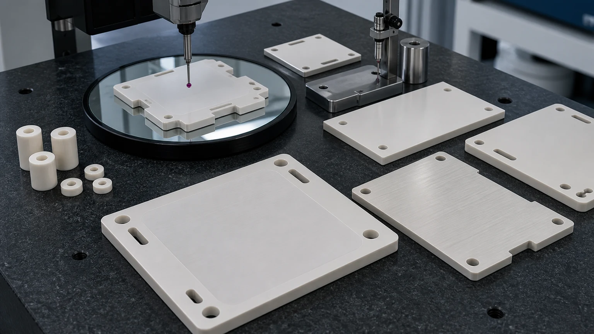
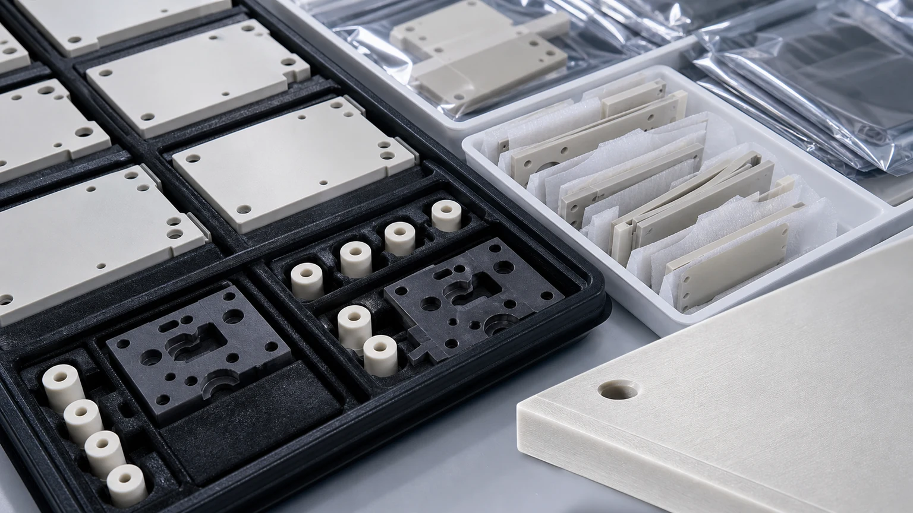

> Aluminum nitride heat spreaders are not ordinary ceramic plates. In power electronics, the finished part must move heat, maintain electrical insulation, survive assembly pressure, protect lapped contact faces, and arrive with inspection evidence that matches the drawing. The RFQ should define the heat path, voltage path, functional faces, flatness, thickness, Ra, edge criteria, cleaning, packaging, and qualification boundary before price or lead time is confirmed.

Aluminum nitride, usually written as AlN, is one of the most searched technical ceramics when engineers need thermal conductivity and electrical insulation in the same component. That makes it relevant to power modules, SiC and GaN development fixtures, AI data center power conversion, EV chargers, inverter hardware, high-voltage test equipment, laser power supplies, and compact industrial electronics.

The current demand signal is strong, but the useful sourcing question is still specific. [Yole Group's Q1 2026 power SiC/GaN monitor](https://www.yolegroup.com/product/quarterly-monitor/power-sicgan-compound-semiconductor-market-monitor/) projects long-term growth for both power SiC and GaN devices. [SEMI reported 2025 semiconductor equipment billings of $135.1 billion](https://www.semi.org/en/SEMI-Reports-Global-Semiconductor-Equipment-Billings-Reached-135-Billion-in-2025), with test and assembly/packaging equipment growth especially relevant to power-device qualification hardware. [SEMI also projects double-digit 300 mm fab equipment growth for 2026 and 2027](https://www.semi.org/en/semi-press-release/semi-projects-double-digit-growth-in-global-300mm-fab-equipment-spending-for-2026-and-2027), driven partly by AI chip demand.

Those market signals do not mean a machining supplier can quote an AlN heat spreader from a material name alone. They mean more buyers will need custom insulating thermal plates, heat-spreader ceramics, power-module fixture plates, pressure pads, spacers, and clean high-voltage support parts. The value of the article is how to make those RFQs clear enough to review.

## Where AlN Heat Spreaders Fit In Power Electronics

An AlN heat spreader is usually considered when a metal plate would create an electrical path, a polymer insulator would limit temperature or dimensional stability, and alumina would not provide enough thermal performance for the design. [CoorsTek describes aluminum nitride](https://www.coorstek.com/en/materials/aluminum-nitride/) as combining thermal conductivity with electrical resistance, which is why the material appears in heat spreaders, insulating plates, carriers, and thermal-management hardware.

In machining RFQs, the part may be called a heat spreader, insulating thermal plate, ceramic pressure pad, thermal-interface spacer, carrier, substrate, clamp plate, sensor support, or power-module fixture insert. Those names overlap, but the machining route depends on the functional surfaces.

| Part family                            | Power electronics function                                     | Machining review focus                                                           |
| -------------------------------------- | -------------------------------------------------------------- | -------------------------------------------------------------------------------- |
| AlN heat spreader plate                | Spreads heat while keeping electrical isolation                | Primary thermal face, flatness, thickness, Ra, hole pattern, protected packaging |
| Insulating thermal spacer              | Controls stack height between powered or grounded hardware     | Parallelism, height tolerance, bore quality, chamfer, creepage distance          |
| Ceramic pressure pad                   | Distributes clamping load over module or test interface        | Contact area, flatness, load path, edge break, surface finish                    |
| SiC/GaN module test fixture plate      | Supports repeatable module evaluation or assembly              | Datum pads, hole position, pockets, cleaning, inspection report                  |
| Power supply or inverter support plate | Provides thermal and electrical separation in compact hardware | Heat path, voltage path, mounting holes, slots, thickness control                |
| Sensor or laser power mount            | Holds device geometry while limiting electrical conduction     | Datum faces, bore location, surface finish, thermal cycling                      |

For broader material comparison, use the [ceramic material selection guide](/posts/materials-grade-selection/ceramic-material-selection-cnc-machining/). For general AlN machining details, use the [aluminum nitride ceramic machining guide](/posts/industrial-ceramic-machining/aluminum-nitride-ceramic-machining-thermal-management-components/). This page is narrower: it focuses on AlN heat spreaders and insulating thermal plates used around power electronics.

## Why The Drawing Should Start With Heat Path And Voltage Path

Many AlN RFQs arrive as a STEP file and a short note: "AlN ceramic plate, please quote." That is not enough for a reliable heat-spreader review. The same outside profile can have a very different route depending on whether the critical face is lapped, whether holes interrupt the contact area, whether the edge is part of a creepage path, and whether the final part will be clamped, bonded, greased, metallized, or tray packed for clean assembly.

The drawing should answer two questions first:

- Which surfaces move heat or control thermal contact?
- Which surfaces maintain electrical insulation, creepage, clearance, or isolation?

If the part sits near high-voltage hardware, the [high-voltage ceramic insulator RFQ guide](/posts/high-voltage-insulation/ceramic-high-voltage-insulators-rfq/) is a useful companion. If the part is a spacer, sleeve, standoff, or support for electronic assemblies, the [alumina ceramic insulator guide](/posts/electrical-insulation/alumina-ceramic-insulators-electrical-electronic-applications/) helps separate low-cost insulation needs from higher thermal-performance AlN needs.

## Thermal-Interface Flatness Is Usually The Cost Gate

AlN is often chosen for thermal behavior, but the theoretical material property is not enough. A heat spreader can underperform if the finished ceramic contacts the mating surface only at a few high spots, if clamp pressure bows a thin plate, or if the lapped face is scratched during packing.

For quote-ready review, identify:

- The primary thermal-contact face.
- Whether flatness applies free-state or under clamping.
- Whether flatness applies to the full face, a local pad, an annular band, or selected zones.
- Thickness tolerance and whether parallelism controls the assembly stack.
- Surface finish on the thermal interface, bonding face, or metallization surface.
- Hole and slot position relative to datum faces and contact zones.
- Mating material, thermal interface material, adhesive, grease, pad, copper base, module case, or cold plate if known.

The [ceramic tolerance capability map](/posts/tolerances-gdt/ceramic-tolerance-capability-map-by-feature-process/) is the right place to decide which dimensions deserve tight control. The [surface finish and subsurface damage guide](/posts/surface-finish-functional/ceramic-ssd-surface-finish-specify-control-price/) explains why Ra and lapping should be assigned by face, not globally.

## AlN, Alumina, Si3N4, And SiC: Choose By Failure Mode

AlN should not be chosen because it sounds more advanced. It should be chosen because the part needs a thermal and electrical function that lower-cost or tougher ceramics cannot satisfy as well.

| Dominant requirement                    | Material direction to review       | RFQ caution                                                                                           |
| --------------------------------------- | ---------------------------------- | ----------------------------------------------------------------------------------------------------- |
| Low-cost electrical insulation          | Alumina                            | May be sufficient when heat spreading is not the limiting requirement                                 |
| Thermal conductivity plus insulation    | AlN                                | Flatness, moisture/handling, surface finish, and protected packaging matter                           |
| Mechanical strength and thermal cycling | Silicon nitride                    | Strong candidate for structural or module-adjacent load paths, but not the same as AlN heat spreading |
| Harsh chemical or abrasive exposure     | Silicon carbide                    | Strong in severe media and wear, but grinding/lapping cost can dominate                               |
| Prototype insulating fixture            | Macor or other machinable ceramics | Useful for fast learning, not always a production substitute                                          |

Use [precision machined alumina ceramic parts](/posts/industrial-ceramic-machining/precision-machined-alumina-ceramic-parts-industrial-applications/) when the job is mainly insulation and cost-sensitive. Use [silicon nitride ceramic machining](/posts/industrial-ceramic-machining/silicon-nitride-ceramic-machining-structural-wear-parts/) when structural cycling and load are central. Use [silicon carbide ceramic machining](/posts/industrial-ceramic-machining/silicon-carbide-ceramic-machining-harsh-environment-applications/) when abrasive or corrosive exposure dominates. Use AlN when thermal transfer and electrical isolation must be solved together.

## Machining Route For AlN Heat Spreaders

The practical route starts with blank review. AlN grade, fired blank state, oversize stock, plate warp, certificate needs, and allowed equivalent materials can affect both cost and feasibility. Fired AlN is a hard brittle ceramic, so precision features normally rely on diamond grinding, abrasive machining, drilling, lapping, polishing, and careful cleaning.

A typical route review may include:

1. Confirm AlN grade, certificate requirement, and whether equivalent grade review is allowed.
2. Select plate or near-net blank stock with enough allowance for flatness and thickness control.
3. Establish datum faces before critical hole, slot, and pocket operations.
4. Grind or lap only the functional thermal-interface zones that need controlled contact.
5. Machine holes, counterbores, slots, and relief pockets with edge breakout risk in mind.
6. Apply chamfers or radii by functional zone, especially near high-voltage or handled edges.
7. Clean, inspect, and package so lapped faces and thin edges are protected.

The [ceramic CNC machining design rules for advanced ceramic parts](/posts/design-rules-dfm/ceramic-cnc-machining-design-rules-advanced-ceramic-parts/) are useful before releasing an AlN heat spreader drawing. Common metal-style features, such as sharp internal corners, thin unsupported tabs, deep narrow pockets, close hole-to-edge spacing, and blanket low-Ra notes, can create avoidable cost.

For power-module development fixtures, the [SiC power module inspection fixture case study](/posts/power-electronics/alumina-ceramic-inspection-fixtures-sic-power-module-assembly-case-study/) shows how ceramic fixtures become inspection and assembly tools, not just material samples.

## Holes, Slots, Counterbores, And Edge Quality

Heat spreaders often need mounting holes, sensor holes, counterbores, slots, isolation windows, or clearance cutouts. These features can reduce thermal contact area, concentrate stress, or create edge-chip risk. They can also interrupt creepage paths if the heat spreader sits near high voltage.

Useful drawing inputs include:

- Hole diameter, depth, and whether each hole is through, blind, counterbored, or countersunk.
- Hole-to-edge distance and distance from holes to lapped contact zones.
- Slot width, end radius, and minimum internal corner radius.
- Pocket depth and whether the bottom is functional.
- Datum hole, clearance hole, and non-critical feature ranking.
- Edge break by zone, especially near handled corners and electrical paths.
- Inspection method for holes: CMM, optical measurement, pin gauge, bore gauge, or sampling.

"No chips" is not a complete acceptance requirement. It should become a defined zone, magnification, chip-size criterion, or sample standard. A small edge mark on a hidden clearance side is not the same risk as a chip on a lapped thermal face, dielectric path, or precision mounting hole.

## Clean Packaging Is Part Of Thermal Performance

AlN heat spreaders can pass dimensional inspection and still fail incoming quality if the thermal face is rubbed, stacked, contaminated, or chipped during packing. For many power electronics parts, packaging is part of the specification because the interface must remain ready for assembly.

Discuss packaging before quotation when the drawing includes:

- Lapped or fine-ground thermal contact faces.
- Thin plate sections or fragile corners.
- Counterbores or holes that can trap debris.
- Bonding, metallization, thermal grease, or pad contact after machining.
- High-voltage insulation surfaces where chips or contamination matter.
- First-article or qualification parts that need traceability.

Good packaging notes may require individual trays, separators, clean bags, face protection, part orientation, lot labels, certificate of conformity, or inspection report pairing. For high-purity or clean manufacturing applications, use the [cleanroom and high-purity ceramic components guide](/posts/high-purity-cleanroom/precision-ceramic-components-cleanroom-high-purity-manufacturing-systems/).

## Inspection Evidence For Power Electronics Heat Spreaders

Inspection should prove the function of the part, not simply create paperwork. For AlN heat spreaders, the evidence usually focuses on flatness, thickness, parallelism, surface finish, hole position, edge condition, cleaning, and material identity.

| Requirement               | Evidence to discuss                                                    | Why it matters                                                 |
| ------------------------- | ---------------------------------------------------------------------- | -------------------------------------------------------------- |
| Thermal-contact flatness  | CMM, optical method, flatness map, or agreed surface plate method      | Controls contact quality and assembly stress                   |
| Thickness and parallelism | Micrometer, height gauge, CMM, or thickness map                        | Controls stack height, clamping, and pressure distribution     |
| Ra on contact zones       | Roughness measurement or lapping note                                  | Supports thermal interface, bonding, or metallization          |
| Hole and slot geometry    | CMM, optical measurement, pin gauge, or sampling plan                  | Controls mounting alignment and stress concentration           |
| Edge quality              | Zone-specific visual or microscopy criterion                           | Reduces chip risk, particle risk, and electrical path problems |
| Cleaning and packaging    | Cleaning note, tray method, separator method, or incoming plan         | Protects lapped faces and assembly readiness                   |
| Material identity         | Grade certificate, lot traceability, or customer-supplied blank record | Supports qualification and repeat production                   |

If final thermal resistance, dielectric testing, partial-discharge testing, module reliability, or tool-level qualification belongs to the customer's assembly, state that boundary clearly. The machining supplier can then focus on geometry, surface condition, cleaning, packaging, and inspection evidence.

## Cost Drivers In Aluminum Nitride Heat Spreader RFQs

The largest cost driver is rarely the outside rectangle. It is usually the precision surface and risk structure.

Common cost drivers include:

- Approved AlN grade and certificate requirements.
- Large or thin plates with strict flatness.
- Tight thickness and parallelism over a broad area.
- Lapped or polished thermal-interface zones.
- Small holes, counterbores, close edge distances, slots, and pockets.
- Particle-sensitive edge criteria or defined chip limits.
- Clean packaging, individual trays, separators, and face protection.
- First-article inspection report, flatness map, Ra readings, or lot documentation.
- Prototype-to-production uncertainty when the design is still changing.

The best cost control is feature ranking. Mark the thermal face, datum pads, electrical isolation path, critical holes, and protected edges. Then allow non-functional faces, clearance pockets, and cosmetic surfaces to use practical ceramic machining requirements.

## Common RFQ Mistakes

Avoid these mistakes when sourcing AlN heat spreaders:

1. Calling the part "AlN plate" without naming the heat path.
2. Applying tight flatness to every face instead of the functional contact zone.
3. Requiring low Ra everywhere instead of on thermal, bonding, or sealing surfaces.
4. Ignoring thickness and parallelism even though the part controls stack height.
5. Placing holes too close to edges, lapped bands, or thin webs.
6. Treating AlN, alumina, and silicon nitride as interchangeable because all are ceramics.
7. Forgetting packaging until after lapped faces are finished.
8. Asking the machining supplier to guarantee final module thermal performance without defining the customer qualification boundary.

These are solvable problems. A ranked drawing and a short functional note often reduce quote friction more than a longer tolerance block.

## RFQ Checklist For AlN Heat Spreaders

Send the following before expecting a reliable quotation:

- 2D drawing with revision and a STEP or native CAD model.
- Required AlN grade, approved material list, certificate needs, and whether equivalent review is allowed.
- Function: heat spreader, insulating thermal plate, pressure pad, spacer, fixture plate, or module support.
- Application: SiC module, GaN device, AI data center power conversion, inverter, charger, high-voltage test, laser power, or industrial electronics.
- Thermal path, electrical insulation path, and functional faces.
- Flatness, thickness, parallelism, Ra, GD&T, and edge criteria by feature zone.
- Hole, counterbore, slot, pocket, chamfer, radius, and chip requirements.
- Mating materials, clamp force, pressure distribution, thermal interface material, bonding, metallization, or coating if known.
- Cleaning, packaging, material certificate, inspection report, and traceability expectations.
- Quantity, prototype or production stage, target timing, and qualification status.

Use the [custom ceramic CNC machining RFQ checklist](/posts/rfq-preparation/custom-ceramic-cnc-machining-rfq-checklist/) to prepare a complete quote package. For broader high-voltage and AI data center context, use the [AI data center power electronics ceramic parts guide](/posts/power-electronics/ai-data-center-power-electronics-ceramic-machining/).

## Internal Decision Path

Use this page when the dominant sourcing problem is an AlN heat spreader or insulating thermal plate for power electronics. Use related pages when the intent changes:

| Dominant problem                                                 | Better supporting page                                                                                                                                                  |
| ---------------------------------------------------------------- | ----------------------------------------------------------------------------------------------------------------------------------------------------------------------- |
| General AlN machining and material behavior                      | [Aluminum nitride ceramic machining for thermal management](/posts/industrial-ceramic-machining/aluminum-nitride-ceramic-machining-thermal-management-components/)      |
| Semiconductor tool-side AlN heater plates or clean thermal parts | [AlN ceramic parts for semiconductor thermal management](/posts/semiconductor-equipment/aluminum-nitride-ceramic-parts-semiconductor-thermal-management/)               |
| High-voltage creepage, clearance, and insulation geometry        | [High-voltage ceramic insulators RFQ guide](/posts/high-voltage-insulation/ceramic-high-voltage-insulators-rfq/)                                                        |
| Low-cost alumina spacers, standoffs, and insulators              | [Alumina ceramic insulators for electrical applications](/posts/electrical-insulation/alumina-ceramic-insulators-electrical-electronic-applications/)                   |
| Ceramic fixture plates for module inspection or assembly         | [Alumina ceramic inspection fixtures for SiC power module assembly](/posts/power-electronics/alumina-ceramic-inspection-fixtures-sic-power-module-assembly-case-study/) |
| Face-specific surface finish and lapping decisions               | [Ceramic surface finish and subsurface damage guide](/posts/surface-finish-functional/ceramic-ssd-surface-finish-specify-control-price/)                                |

This structure keeps the site broad enough to capture many long-tail terms without turning every page into the same generic ceramic machining article.

## Practical Takeaway

Aluminum nitride heat spreaders are valuable when a power electronics part must combine heat transfer, electrical insulation, dimensional stability, and inspectable precision surfaces. The material name is only the start. The finished part depends on the thermal-interface face, thickness, flatness, surface finish, hole and slot design, edge quality, cleaning, packaging, and inspection evidence.

For a serious AlN heat spreader RFQ, do not send only a 3D model and ask for a plate price. Send the drawing, CAD model, material grade, application context, heat path, voltage path, functional faces, tolerances, surface requirements, packaging expectation, inspection scope, quantity, and qualification stage. That gives the ceramic machining review enough information to separate a simple insulating plate from a critical power electronics thermal-interface component.

## FAQ

**Is an aluminum nitride heat spreader the same as a ceramic substrate?**  
Not necessarily. A heat spreader may be a custom machined plate, spacer, pressure pad, or fixture component. A substrate may include different surface, metallization, bonding, or electrical requirements. The drawing and application decide the machining route.

**Why use AlN instead of alumina?**  
Alumina is often suitable for cost-effective insulation. AlN is reviewed when thermal transfer and electrical insulation must work together. The decision depends on heat path, voltage path, geometry, grade, and inspection needs.

**Should every AlN heat spreader surface be lapped?**  
Usually no. Lapping should be applied to functional thermal, bonding, sealing, or datum faces where the assembly needs it. Clearance faces and non-contact edges can often use practical ceramic machining finish.

**Can the machining supplier guarantee final power-module thermal performance?**  
Usually final performance is verified in the customer assembly. The machining supplier should define and prove geometry, flatness, thickness, surface condition, cleaning, packaging, and inspection evidence unless a specific thermal test is included in the purchase requirement.

**What makes AlN heat spreader RFQs expensive?**  
Large thin plates, tight flatness, strict thickness and parallelism, lapped contact faces, close holes or slots, edge-chip limits, clean packaging, certificate requirements, and first-article reports are common cost drivers.

> RFQ note: Final feasibility, tolerance, price, lead time, material route, cleaning method, packaging, and inspection scope depend on drawing review, AlN grade, blank state, functional surfaces, quantity, and acceptance method.
