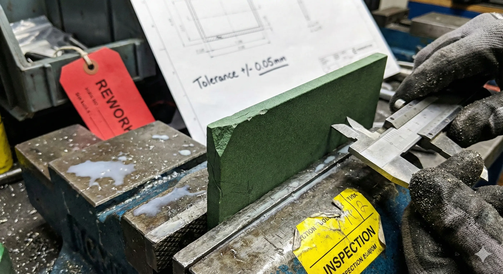
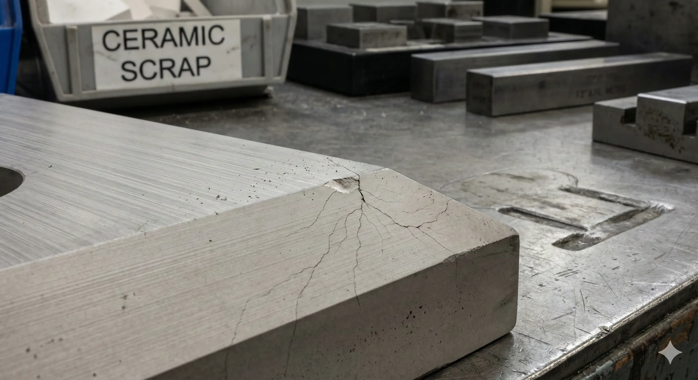
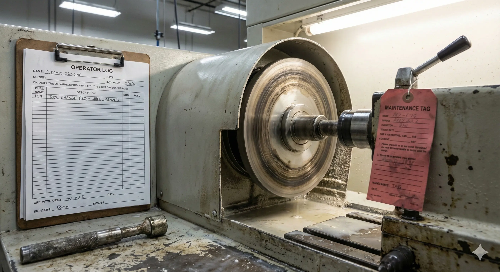
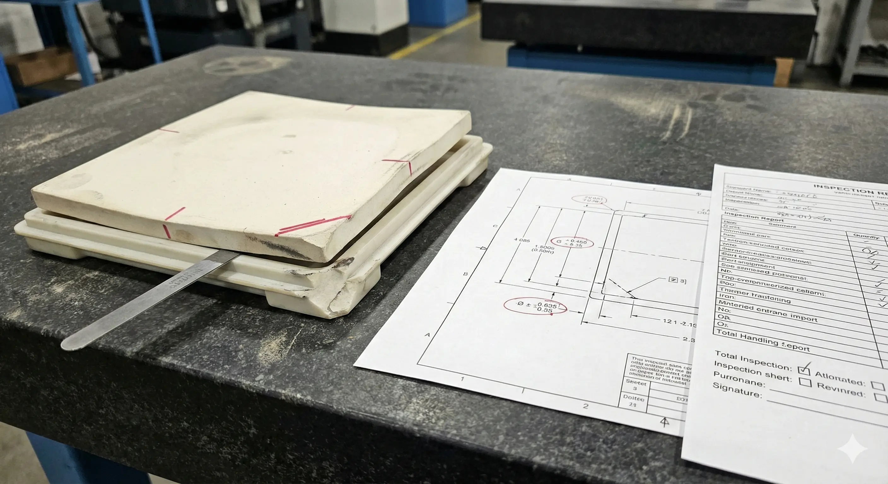

> A major cost lever in ceramic machining is often not cycle time. It is whether geometry is created before sintering, after sintering, or in a hybrid route with selected post-sinter finishing.

### What Green Machining Buys

Green machining means machining the ceramic body before final firing. The material is softer, removal is easier, and complex geometry can be shaped at lower tool cost.

It is usually reviewed when:

- Geometry is complex but final tolerances are moderate.
- Shrinkage compensation is understood.
- Critical interfaces can still be finished after sintering.
- The design tolerates some sinter distortion.

### What Hard Machining Buys

Hard machining means machining or grinding after the ceramic has been fired. This route is slower and more expensive, but it creates precision after the dimensions are stable.

It is usually needed for:

- Sealing faces.
- Precision bores.
- Ground datum pads.
- Tight flatness or parallelism.
- Low Ra functional surfaces.
- Features that must assemble without stress.

### Route Comparison

| Route                   | Strength                                       | Weakness                                   |
| ----------------------- | ---------------------------------------------- | ------------------------------------------ |
| Green machining         | Lower shaping cost, easier complex geometry    | Sinter shrinkage and warpage remain        |
| Hard machining          | Final dimensions after firing                  | Slow removal and higher chip risk          |
| Hybrid route            | Complex shape plus finished interfaces         | Requires planning and clear datum strategy |
| Lapping/polishing route | Lower flatness or Ra targets on selected faces | Costly and handling-sensitive              |

### Hybrid Routes Are Often Practical

Many successful ceramic programs use green machining for bulk geometry and post-sinter grinding only where function demands precision. That might mean:

- Green-machine pocket geometry, then grind datum pads.
- Form a ring near-net, then grind bore and faces.
- Sinter a nozzle blank, then finish the orifice and sealing face.
- Create a complex insulator shape, then finish mating surfaces.

This route prevents procurement from paying for hard grinding on every surface.

### Where Projects Go Wrong

Projects fail when the RFQ does not specify route assumptions. The supplier may quote as-sintered surfaces while the drawing expects final grinding, or quote full hard machining when only a few interfaces require it.

Common warning signs:

- Tight tolerances applied as default title-block values.
- Datums placed on as-sintered rough faces.
- No statement of which surfaces are finished after sintering.
- Surface finish required globally.
- Inspection method left undefined until after production.

### Buying Guidance

Before asking for price, decide:

1. Which geometry must be created before sintering?
2. Which faces must be finished after sintering?
3. Which datums are used for dependent features?
4. Which measurements decide acceptance?
5. Which surfaces can remain as-sintered or standard-ground?

### FAQ

**Is green machining less accurate?**  
It can shape complex features efficiently, but final accuracy is limited by shrinkage and warpage unless selected features are finished after sintering.

**Is hard machining always the right route?**

No. Hard machining everything can be unnecessarily expensive. Use it for functional surfaces and datums.

**What should the RFQ say?**  
State whether the expected route is as-sintered, green-machined, post-sinter ground, lapped, polished, or a hybrid route.
