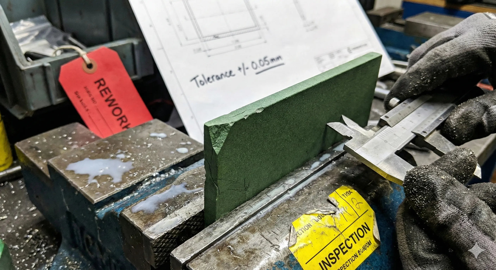
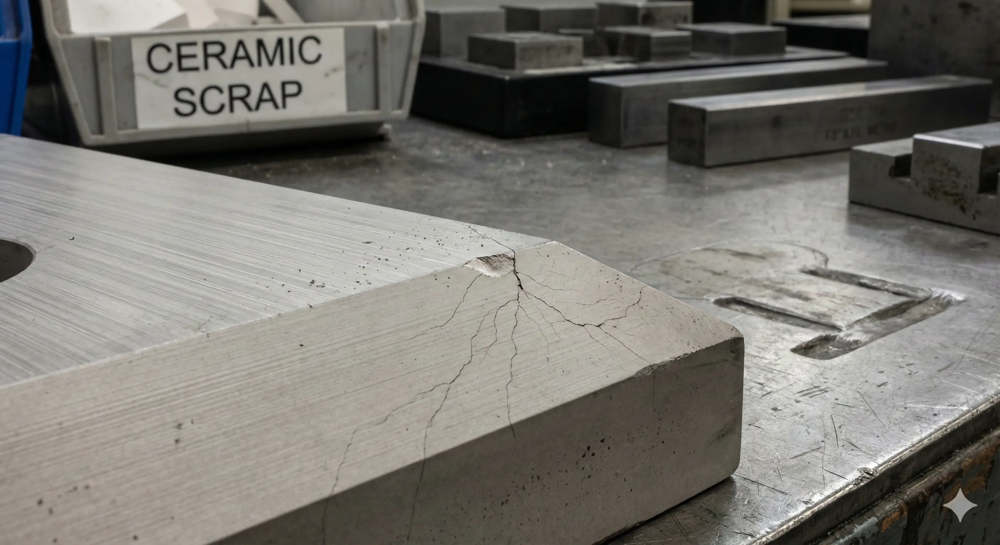
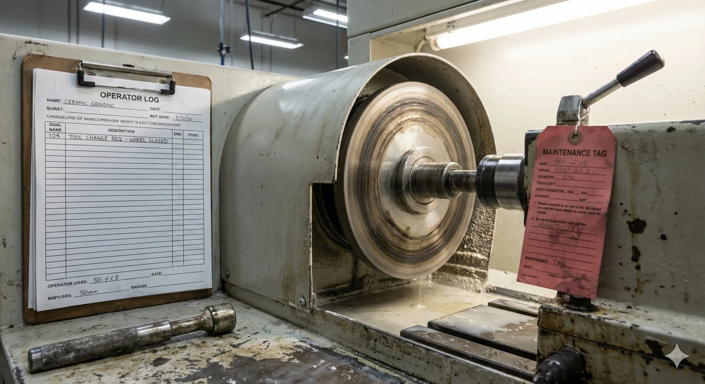
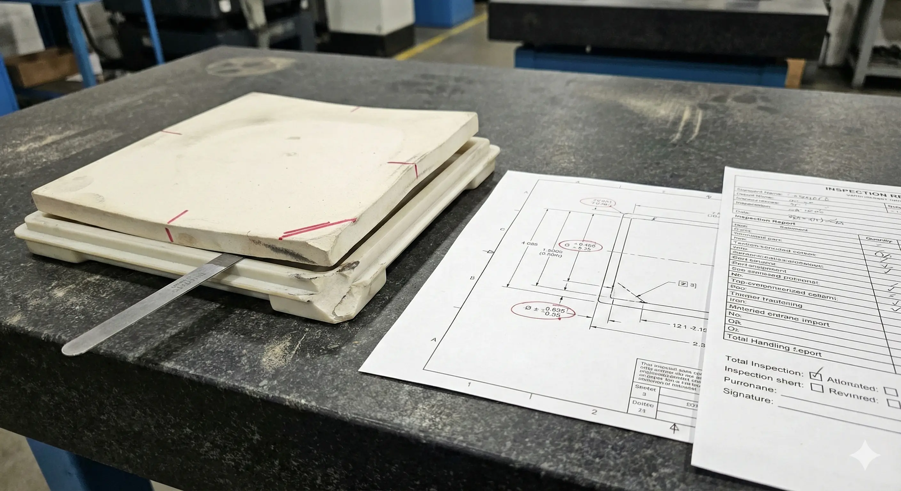

> A major cost lever in ceramic machining is often not cycle time. It is whether geometry is created before sintering, after sintering, or in a hybrid route with selected post-sinter finishing. For RFQs, this must be tied to the available blank or preform route rather than assumed.

## What Green Machining Buys

Green machining means shaping an unfired ceramic body before sintering. It can reduce the abrasive work needed on a dense fired part, but shaping economics depend on grade, binder/forming route, blank supplier capability, handling, shrinkage control, and post-sinter finishing allowances. A partially fired body is a different incoming state and should be identified separately.

[Kyocera's fine-ceramic production overview](https://global.kyocera.com/fcworld/first/process.html) describes pre-sinter shaping, shrinkage during densification, and abrasive finishing after firing. That sequence explains the route distinction; it does not establish one shrinkage percentage or one cost advantage for every material.

It is usually reviewed when:

- Geometry is complex but final tolerances are moderate.
- Shrinkage compensation and fired-state allowance are understood.
- Critical interfaces can still be finished after sintering.
- The design tolerates some sinter distortion.

## What Hard Machining Buys

For dense fired technical ceramics, hard machining usually means abrasive machining or grinding after sintering, so functional features are finished after sintering shrinkage has occurred. Removal effort, access, support, tool wear, and edge damage still require review. Fired machinable materials such as [MACOR](/posts/industrial-ceramic-machining/macor-machinable-glass-ceramic-parts-applications-design-guide/) and selected BN grades are a separate material decision; "fired" does not mean every ceramic requires the same diamond-grinding route.

It is usually needed for:

- Sealing faces.
- Precision bores.
- Ground datum pads.
- Tight flatness or parallelism.
- Low Ra functional surfaces.
- Features that must assemble without stress.

## Route Comparison

| Route                   | Strength                                       | Weakness                                   |
| ----------------------- | ---------------------------------------------- | ------------------------------------------ |
| Green machining         | Lower shaping cost, easier complex geometry    | Sinter shrinkage and warpage remain        |
| Hard machining          | Final dimensions after firing                  | Slow removal and higher chip risk          |
| Hybrid route            | Complex shape plus finished interfaces         | Requires planning and clear datum strategy |
| Lapping/polishing route | Lower flatness or Ra targets on selected faces | Costly and handling-sensitive              |

## Hybrid Routes Are Often Practical

Many successful ceramic programs use a preform or green-machined route for bulk geometry and post-sinter grinding only where function demands precision. That might mean:

- Green-machine pocket geometry, then grind datum pads.
- Form a ring near-net, then grind bore and faces.
- Sinter a nozzle blank, then finish the orifice and sealing face.
- Create a complex insulator shape, then finish mating surfaces.

This route prevents procurement from paying for hard grinding on every surface, but it should be quoted only after material source, fired state, and finishing scope are clear.

## Where Projects Go Wrong

Projects fail when the RFQ does not specify route assumptions. A supplier may quote as-sintered surfaces while the drawing expects final grinding, or quote full hard machining when only a few interfaces require it.

Common warning signs:

- Tight tolerances applied as default title-block values.
- Datums placed on as-sintered rough faces.
- No statement of which surfaces are finished after sintering.
- Surface finish required globally.
- Inspection method left undefined until after production.

## Buying Guidance

Before asking for price, decide:

1. Which geometry must be created before sintering, and who controls that preform route?
2. Which faces must be finished after sintering?
3. Which datums are used for dependent features?
4. Which measurements decide acceptance?
5. Which surfaces can remain as-sintered or standard-ground?

## Start With the Blank That Actually Exists

If the RFQ starts from a customer-supplied fired rod, tube, or plate, green machining is not an alternative operation on that same blank. It means reviewing a different upstream forming and sintering supply route. Conversely, a green preform is not a precision fired blank ready for final inspection.

Identify whether the blank is unfired, partially fired, fully sintered, or a fired machinable grade. State the exact grade, stock envelope, orientation if relevant, material record, and whether changing the blank supplier or process is allowed. Do not infer the state from the word "ceramic."

## Shrinkage and Finishing Allowance Have an Owner

A generic shrinkage percentage is not a safe CAD scaling rule. The grade, forming route, geometry, direction, firing conditions, and repeat-order controls need review by the blank/preform provider.

| Responsibility                  | What must be agreed before quote confirmation                                                       |
| ------------------------------- | --------------------------------------------------------------------------------------------------- |
| Preform design and compensation | Who owns compensated geometry and verifies fired dimensions; which assumptions require a trial      |
| Sintering and blank supply      | Exact grade, incoming state, source, material documentation, and acceptance of the fired blank      |
| Finishing stock                 | Which critical faces, bores, or edges retain enough stock for the planned final operations          |
| Datums after firing             | Which surfaces establish the final coordinate system and how dependent features are located         |
| Part inspection                 | Final feature requirements, methods, frequency, and reports                                         |
| Customer qualification          | Assembly fit, sealing, electrical, thermal, wear, or equipment tests outside dimensional acceptance |

The available stock has to cover the actual finishing sequence; allowance on one face does not repair an undersized bore or remove warp without affecting wall thickness. If no validated compensation or allowance plan exists, identify that uncertainty as a qualification item rather than quoting it as routine production. This does not imply that CERAMIC CNC performs every upstream operation in-house.

## First-Article Gates for a Hybrid Route

Use stage-specific evidence rather than inspecting only the final outside dimensions.

1. **Incoming fired blank:** review the agreed grade record, envelope, obvious damage, distortion, and finishing stock.
2. **Datum establishment:** confirm the finished references and support condition before finishing dependent features.
3. **Final machining and finishing:** inspect the required size, form, position, local finish, and edge criteria after the relevant operations.
4. **Release and qualification:** separate the machining report from any customer-defined assembly or functional approval.

For repeat orders, record the approved grade/source, preform route, drawing revision, datum scheme, finishing scope, and acceptance method. A change in one of these inputs may require renewed review; a previously accepted sample does not automatically validate a new blank route.

## Why Two Route Quotes Are Not Always Comparable

The lowest shaping price may exclude the fired blank, final grinding, lapping, tooling, trial parts, inspection reports, or protective packaging. Ask each quote to identify those items and any assumed subcontracted operations. State prototype quantity and expected repeat demand separately so a one-time development cost is not confused with a repeat unit price.

Do not assume green machining is always cheaper, hard machining always more accurate in the assembly, or a hybrid route always practical. Route selection is conditional on the supplied blank, feature access, function, and qualification cost. The [ceramic tolerance map](/posts/tolerances-gdt/ceramic-tolerance-capability-map-by-feature-process/) owns final feature and inspection decisions; the [surface-finish guide](/posts/surface-finish-functional/ceramic-ssd-surface-finish-specify-control-price/) owns texture and damage-sensitive acceptance.

## Send a Route-Decision Brief

Alongside the drawing and quantity, provide the incoming blank state, allowed sourcing alternatives, surfaces that may remain as-sintered, features requiring post-sinter finishing, proposed datum references, and any existing first-article or customer qualification requirement. If the upstream route is unknown, say so and ask for the options and unresolved assumptions to be listed separately.

Use the existing [RFQ preparation page](/rfq/) for submission. Pause confirmation if the grade/source is unresolved, finishing stock is insufficient, datums cannot be established repeatably, or customer functional tests have no owner. An early clarification is preferable to a route change after the blank has been fired.

## Related Guides

- Use the [precision ceramic machining overview](/posts/industrial-ceramic-machining/precision-ceramic-machining-high-performance-industrial-components/) when route choice affects material, grinding, lapping, and inspection together.
- Use the [ceramic material selection guide](/posts/materials-grade-selection/ceramic-material-selection-cnc-machining/) when grade, blank state, or substitution options are still open.
- Use the [ceramic tolerance capability map](/posts/tolerances-gdt/ceramic-tolerance-capability-map-by-feature-process/) when final datums, flatness, position, or bore relationships decide the process route.
- Use the [custom ceramic CNC machining RFQ checklist](/posts/rfq-preparation/custom-ceramic-cnc-machining-rfq-checklist/) before sending a route-dependent quote request.

## FAQ

**Is green machining less accurate?**  
It can shape complex features efficiently, but final accuracy is limited by shrinkage and warpage unless selected features are finished after sintering.

**Is hard machining always the right route?**

No. Hard machining everything can be unnecessarily expensive. Use it for functional surfaces and datums.

**What should the RFQ say?**  
State whether the expected route is as-sintered, green-machined/preform-based, post-sinter ground, lapped, polished, or hybrid, and whether blanks are customer-supplied or supplier-sourced.
