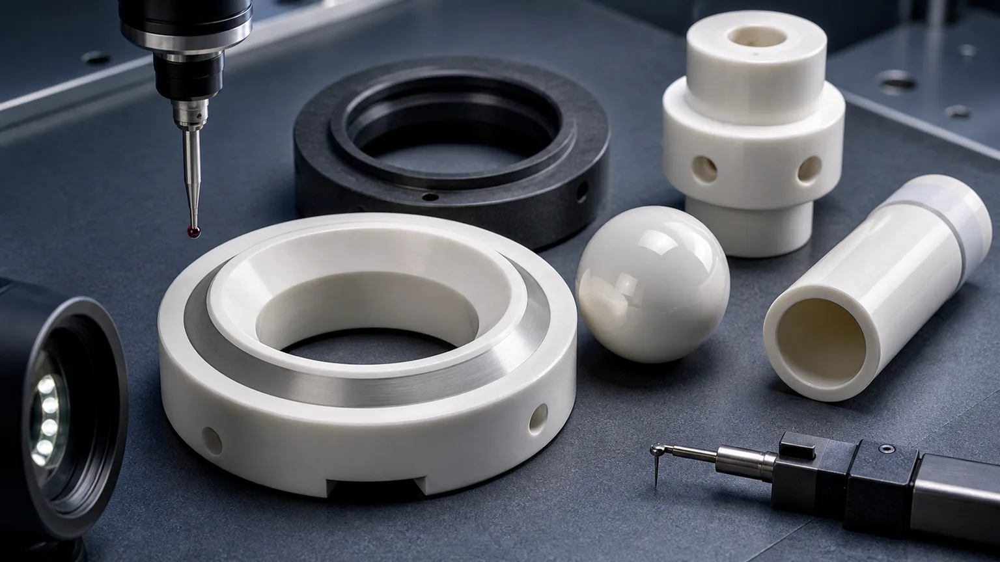
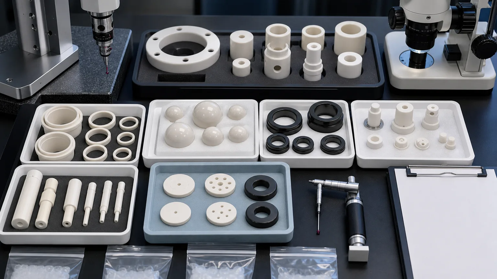

> Ceramic valve components for corrosive and abrasive fluids should be sourced as sealing, throttling, sliding, and flow-control interfaces. A useful RFQ defines the media, material grade, valve function, seat contact geometry, ball or plug relationship, lapped surfaces, port edges, cleaning, packaging, and inspection evidence before price, lead time, or feasibility can be confirmed.

Ceramic valve components appear in chemical processing, slurry handling, dosing systems, analytical instruments, high-purity fluid delivery, semiconductor wet-process support equipment, water treatment, energy systems, food and beverage dispensing hardware, laboratory equipment, and aggressive industrial process lines. Common RFQs include alumina valve seats, zirconia valve balls, silicon carbide valve trim, ceramic plugs, ceramic spools, liners, sleeves, plungers, check valve discs, guide bushings, flow restrictors, and metering inserts.

This page is narrower than the broad [precision ceramic pump and valve components guide](/posts/pump-valve-components/precision-ceramic-pump-valve-components-corrosive-fluid-control/) and different from the [ceramic seal faces for pumps and rotating equipment guide](/posts/pump-valve-components/precision-ceramic-seal-faces-pumps-rotating-equipment/). It focuses on valve-side ceramic components where shutoff, throttling, chemical exposure, abrasive particles, sliding fit, edge quality, and inspection evidence decide whether a machined part can move from drawing to qualification.

### Why Valve Function Must Be Defined Before Material

Valve problems usually appear as wear, leakage, sticking, contamination, erosion, or corrosion. The component name helps define the first review boundary:

- ceramic valve seat
- alumina valve seat
- zirconia valve ball
- ceramic ball and seat
- silicon carbide valve trim
- ceramic plug valve component
- ceramic check valve disc
- ceramic valve sleeve
- ceramic liner for corrosive fluid
- ceramic flow restrictor insert
- ceramic plunger for metering valve

The technical ceramic industry treats valves as a defined application family. [CoorsTek describes ceramic valves and valve components](https://www.coorstek.com/en/products-applications/valves-valve-components/) for abrasion, erosion, and corrosion resistance, including ball valve and seat components. [CeramTec presents high-performance ceramics for pumps, valves, and seals](https://www.ceramtec-industrial.com/en/products-applications/pumps-valves-and-seals), emphasizing wear and chemical resistance in demanding fluid-handling applications. [Kyocera lists fine ceramic faucet and valve products](https://global.kyocera.com/prdct/fc/industries/products/014.html) with wear and chemical resistance as product properties.

The useful next step is to translate that component name into an RFQ-ready machining conversation: which surface seals, which feature guides motion, which fluid touches the ceramic, which edge is particle-sensitive, and what evidence proves the component is acceptable.

### What Counts As A Ceramic Valve Component

Valve RFQs often use familiar words, but the machining risk changes by function.

| Component family                        | Typical role in a valve system                                 | RFQ issue that changes machining and inspection                                |
| --------------------------------------- | -------------------------------------------------------------- | ------------------------------------------------------------------------------ |
| Ceramic valve seat                      | Sealing contact for ball, plug, disc, or needle                | Seat angle, lapped land, contact width, edge chips, and mating part            |
| Zirconia or alumina valve ball          | Shutoff or check-valve element                                 | Diameter, sphericity, polish, surface defects, and seat match                  |
| Silicon carbide valve trim ring         | Wear and corrosion-resistant throttling or sealing insert      | SiC grade, lapped surfaces, erosion edges, fit, and media exposure             |
| Ceramic plug or spool                   | Flow control, shutoff, or metering movement inside a body      | OD roundness, port geometry, slot edges, bore relationship, and sliding fit    |
| Ceramic sleeve or liner                 | Protects a bore or guides moving valve elements                | ID/OD concentricity, wall thickness, bore finish, edge break, and fit          |
| Ceramic check valve disc                | Opens and closes against a seat under pressure or flow         | Flatness, contact band, impact risk, chip limit, and orientation               |
| Ceramic plunger or piston               | Moves fluid or controls metering in dosing and control systems | OD finish, straightness, roundness, sleeve clearance, and end-face condition   |
| Ceramic flow restrictor or orifice part | Controls flow through a small hole, groove, slot, or port      | Hole geometry, taper, burr-like edge defects, cleaning, and flow-test boundary |

A ceramic valve ball, a lapped valve seat, a SiC trim ring, and a ceramic spool may all be installed in "valves," but they do not share one machining plan. The quote should start with function, media, mating surfaces, and acceptance method.

### Materials: Alumina, Zirconia, SiC, And Silicon Nitride

Material choice should follow the valve environment, not a generic hardness ranking.

| Material family                                                                                                              | Where it is often reviewed for valve components                                  | RFQ notes                                                                                     |
| ---------------------------------------------------------------------------------------------------------------------------- | -------------------------------------------------------------------------------- | --------------------------------------------------------------------------------------------- |
| [Alumina Al2O3](/posts/industrial-ceramic-machining/precision-machined-alumina-ceramic-parts-industrial-applications/)       | Valve seats, discs, sleeves, liners, insulating valve-adjacent parts             | Purity, density, lapped land, edge chip criteria, and bore condition should be specified      |
| [Zirconia ZrO2](/posts/industrial-ceramic-machining/zirconia-ceramic-machining-high-strength-precision-components/)          | Valve balls, plungers, spools, sliding components, high-strength precision parts | Roundness, sphericity, polish, thermal condition, counterface, and wear mode need review      |
| [Silicon carbide SiC](/posts/industrial-ceramic-machining/silicon-carbide-ceramic-machining-harsh-environment-applications/) | Valve trim rings, severe wear inserts, chemical-duty seats, abrasive-fluid parts | Grade, lapped surfaces, erosion edge, chemical media, and protected packaging usually matter  |
| [Silicon nitride Si3N4](/posts/industrial-ceramic-machining/silicon-nitride-ceramic-machining-structural-wear-parts/)        | Selected guide, wear, ball, and high-load moving components                      | Load path, impact, thermal shock, roundness, finish, and grade should be clarified            |
| [Boron nitride BN](/posts/industrial-ceramic-machining/boron-nitride-ceramic-machining-high-temperature-insulation-parts/)   | Selected high-temperature or non-wetting fixtures near process media             | BN is not a default valve material; atmosphere, load, strength, and handling must be reviewed |
| [Macor](/posts/industrial-ceramic-machining/macor-machinable-glass-ceramic-parts-applications-design-guide/)                 | Laboratory prototypes, proof-of-geometry fixtures, low-load trial components     | Useful for fast machining trials, not a substitute for fired ceramics in severe service       |

[Saint-Gobain notes that Hexoloy SiC and Noralide Si3N4 seal products](https://www.ceramicsrefractories.saint-gobain.com/products/shapes/custom-shapes/hexoloy-sic-and-noralide-si3n4-seals) are used for seal faces with corrosion resistance and custom drawings. That is useful context for severe fluid handling, but a valve RFQ still needs the exact part role. A SiC trim insert, a Si3N4 guide element, and a lapped alumina seat are reviewed differently.

If the material is not fixed, use the [ceramic material selection guide](/posts/materials-grade-selection/ceramic-material-selection-cnc-machining/) before changing the drawing. Material substitution can affect sintered blank availability, diamond grinding route, edge behavior, lapping response, inspection method, and final customer qualification.

### Valve Seat And Ball Contact Geometry

The highest-value valve RFQs often center on a contact pair: a ceramic ball against a ceramic seat, a plug against a lapped ring, a check disc against a flat land, or a spool moving through a sleeve.

For ball-and-seat components, define:

- Ball material, diameter, sphericity, and surface finish.
- Seat material, seat angle, land width, and lapped or ground contact zone.
- Whether the ball and seat are supplied as a matched set or interchangeable lots.
- Whether contact is line, band, spherical, conical, or flat.
- Whether the buyer performs final leak, pressure, or cycling test.
- Whether the ceramic sees slurry, solvent, acid, caustic, high-purity water, steam, abrasive solids, or dry gas.
- Whether edge chips near the contact path create leak paths or particle risk.

The [lapped ceramic seal faces RFQ guide](/posts/lapped-seal-faces/ceramic-lapped-seal-faces-rfq/) is a useful companion when a valve seat or check disc depends on a controlled contact band. The [surface finish and subsurface damage guide](/posts/surface-finish-functional/ceramic-ssd-surface-finish-specify-control-price/) explains why low Ra should be assigned by functional surface, not scattered across every face.

### Plugs, Spools, Sleeves, And Liners

Ceramic plugs and spools can be harder to quote than a simple seat because they combine sliding geometry, flow windows, OD finish, port edges, and alignment. A ceramic liner or sleeve adds bore fit and wall stability.

Review these features:

- Plug or spool OD, roundness, cylindricity, and sliding finish.
- Sleeve ID, straightness, wall thickness, OD fit, and concentricity.
- Clearance target and whether movement is dry, wet, media-lubricated, or intermittent.
- Flow window geometry, slot end radius, port edge quality, and erosion-sensitive edges.
- End-face chamfer, groove radius, and chip criteria near sealing or sliding surfaces.
- Whether the ceramic is pressed, bonded, shrink-fitted, clamped, or free-standing in the valve body.
- Whether parts are matched sets or interchangeable spare components.

For sleeve-like valve liners, the [ceramic thin-wall sleeve machining guide](/posts/thin-wall-sleeves/ceramic-thin-wall-sleeve-bore-concentricity-rfq/) helps frame ID/OD concentricity, bore roundness, wall stability, and inspection method. For general cylindrical wear logic, use the [wear-resistant ceramic bushings guide](/posts/wear-components/wear-resistant-ceramic-bushings-industrial-machinery/).

### Flow Ports, Orifices, Slots, And Erosion Edges

Valve components often include small flow holes, side ports, metering slots, grooves, V-shaped openings, or restrictor features. These details can decide cost and acceptance more than the outside shape.

Good RFQ details include:

- Hole diameter, depth, taper, and exit-edge requirement.
- Port position relative to seat, bore, OD, or datum face.
- Slot length, width, end radius, and minimum ligament.
- Groove width, depth, bottom radius, and distance to sealing land.
- Whether media contains abrasive solids or crystallizes in small features.
- Whether port blockage, cleaning residue, or particles matter.
- Inspection method: microscope, optical comparator, CMM, pin gauge, air gauge, flow test, or customer functional test.

For very small holes or nozzles, use the [ceramic micro-hole machining RFQ guide](/posts/micro-hole-machining/ceramic-micro-hole-machining-rfq/) and the [precision ceramic nozzles guide](/posts/semiconductor-equipment/precision-ceramic-nozzles-semiconductor-vacuum-equipment/). Even when the end market is not semiconductor, those pages help define hole quality, taper, edge breakout, cleaning, and inspection evidence.

### Media Exposure Is Not A Footnote

"Corrosive and abrasive fluids" is too vague for a useful ceramic valve quote. The supplier needs the real exposure profile because a valve seat in filtered chemical service is not the same as a trim ring in abrasive slurry.

Send what is known:

- Fluid chemistry, pH range, solvent, acid, caustic, slurry, abrasive solids, or high-purity condition.
- Temperature, pressure, cycling, pressure drop, and start-stop pattern.
- Wet, dry, intermittent, flushing, or media-lubricated condition.
- Counterface or mating material: ceramic, metal, elastomer, carbon, polymer, or customer assembly.
- Whether the ceramic contacts food, beverage, lab reagent, semiconductor chemical, wastewater, mining slurry, or general industrial fluid.
- Whether the buyer owns final compatibility, leak, pressure, flow, or life-cycle testing.

This information does not make the machining supplier responsible for the complete valve design. It prevents a poor quotation based only on OD, ID, and thickness.

### Inspection Evidence For Ceramic Valve Components

Inspection should prove the valve function, not create unnecessary reports on non-functional geometry.

| Functional requirement    | Evidence to discuss                                                     | Why it matters                                                    |
| ------------------------- | ----------------------------------------------------------------------- | ----------------------------------------------------------------- |
| Valve seat contact        | Seat angle, contact land width, flatness or form, optical/CMM evidence  | Controls shutoff, throttling, leakage risk, and mating behavior   |
| Ceramic ball              | Diameter, sphericity, surface finish, visual defect limit, lot sampling | Controls check response, sealing, wear, and interchangeability    |
| Plug or spool OD          | Roundness, cylindricity, straightness, OD finish, and datum strategy    | Controls sliding fit, leakage, sticking, and wear                 |
| Sleeve or liner bore      | Bore gauge, air gauge, CMM, roundness, ID finish, and wall stability    | Controls motion, alignment, clearance, and assembly repeatability |
| SiC trim or lapped insert | Flatness, Ra, edge-chip criteria, fit diameter, material certificate    | Controls erosion resistance, contact behavior, and qualification  |
| Flow ports and orifices   | Microscope, optical inspection, pin gauge, CMM, or flow-test boundary   | Controls flow, blockage, erosion edge, and cleaning risk          |
| Edge quality              | Zone-based chip limit, magnification, sample photos, or visual standard | Prevents leaks, particles, crack origins, and assembly disputes   |
| Cleaning and packaging    | Cleaning note, separated trays, protected lapped faces, bagging method  | Protects functional surfaces before incoming inspection           |
| Material and traceability | Material certificate, grade confirmation, lot record, or CoC            | Supports qualification, repeat orders, and customer QA            |

If the buyer performs final leak, pressure, chemical compatibility, or life-cycle testing, the RFQ should state that boundary. The machining package can then focus on geometry, surface condition, cleaning, packaging, and traceability.

### Cleaning And Packaging For Valve Components

Valve ceramics can pass dimensional inspection and still fail incoming review because of contamination, contact marks, damaged lapped lands, chipped port edges, or particles trapped in small holes.

For valve-side parts, define:

- Whether parts require ultrasonic cleaning, high-purity cleaning, or standard industrial cleaning.
- Whether balls, seats, and matched components must remain paired and labeled.
- Whether lapped seats or SiC trim rings need soft separators, face protection, or single-part bags.
- Whether small holes, ports, and grooves require blockage review.
- Whether black SiC parts and white alumina/zirconia parts should be packed separately to avoid contact marks.
- Whether material certificates, inspection reports, CoC, or lot records must ship with the parts.

The [cleanroom and high-purity ceramic components guide](/posts/high-purity-cleanroom/precision-ceramic-components-cleanroom-high-purity-manufacturing-systems/) is useful when the valve part will enter a high-purity, wet-process, analytical, or vacuum-adjacent system.

### Cost Drivers In Ceramic Valve Component RFQs

Ceramic valve part costs usually rise for specific reasons:

1. Material grade and blank availability, especially for SiC and high-grade zirconia.
2. Fired ceramic hardness and diamond grinding time.
3. Lapped seat lands, flatness, and low Ra requirements.
4. Ball sphericity, polish, and defect limits.
5. Plug or spool OD roundness, cylindricity, and sliding finish.
6. Sleeve ID/OD concentricity and thin-wall stability.
7. Side ports, grooves, slots, V-ports, and small orifices.
8. Edge chip limits near sealing, throttling, or particle-sensitive zones.
9. Matched-set inspection, sorting, cleaning, and packaging.
10. Report scope: CMM, roundness, Ra, microscope photos, material certificate, and CoC.

Cost control does not mean removing all precision. It means assigning precision to the surfaces that control seal, flow, sliding, fit, and qualification. Non-functional relief surfaces can usually carry practical ceramic machining tolerance and finish.

### RFQ Checklist For Ceramic Valve Components

Send the following before expecting a reliable quotation:

- 2D drawing with revision and STEP or native CAD file.
- Component role: valve seat, ball, plug, spool, sleeve, liner, plunger, check disc, trim ring, flow restrictor, or wear insert.
- Material grade, purity, density, certificate requirement, and whether equivalent review is allowed.
- Media chemistry, solids content, abrasive condition, temperature, pressure, cycling, and cleaning requirement.
- Functional surfaces: seat land, ball surface, plug OD, spool port, sleeve ID, trim face, flow hole, groove, and chip-sensitive edges.
- Flatness, Ra, roundness, sphericity, cylindricity, concentricity, parallelism, and datum requirements by feature.
- Mating material, counterface, ball-seat relationship, sleeve clearance, press fit, shrink fit, or matched-set requirement.
- Final functional test boundary: customer leak, pressure, flow, chemical, vacuum, or life test.
- Cleaning, packaging, traceability, material certificate, inspection report, and sampling requirements.
- Quantity, target timing, prototype or repeat-order status, and qualification stage.

Use the [custom ceramic CNC machining RFQ checklist](/posts/rfq-preparation/custom-ceramic-cnc-machining-rfq-checklist/) to structure the full package. Use the [ceramic tolerance capability map](/posts/tolerances-gdt/ceramic-tolerance-capability-map-by-feature-process/) before assigning tight tolerances to every surface. Use the [ceramic CNC machining design rules guide](/posts/design-rules-dfm/ceramic-cnc-machining-design-rules-advanced-ceramic-parts/) before freezing narrow grooves, sharp internal corners, thin webs, close ports, or unsupported walls.

### How This Page Fits The Internal Selection Path

Use this page for a ceramic valve seat, ceramic valve ball, SiC valve trim, ceramic plug, valve sleeve, ceramic liner, check valve disc, or ceramic flow-control component. Use related pages when the dominant engineering issue changes:

- For full pump and valve component sets, use the [ceramic pump and valve components guide](/posts/pump-valve-components/precision-ceramic-pump-valve-components-corrosive-fluid-control/).
- For rotating pump seal faces, use the [precision ceramic seal faces guide](/posts/pump-valve-components/precision-ceramic-seal-faces-pumps-rotating-equipment/).
- For lapped sealing lands, use the [ceramic lapped seal faces RFQ guide](/posts/lapped-seal-faces/ceramic-lapped-seal-faces-rfq/).
- For SiC harsh-environment review, use the [silicon carbide machining guide](/posts/industrial-ceramic-machining/silicon-carbide-ceramic-machining-harsh-environment-applications/).
- For zirconia balls, plungers, and precision sliding elements, use the [zirconia machining guide](/posts/industrial-ceramic-machining/zirconia-ceramic-machining-high-strength-precision-components/).
- For broad wear applications, use the [industrial ceramic machining for wear-resistant components guide](/posts/industrial-ceramic-machining/industrial-ceramic-machining-wear-resistant-components/).

This structure helps the site capture long-tail valve searches without creating duplicate generic pages.

### Practical Takeaway

Ceramic valve components for corrosive and abrasive fluids should be quoted as functional valve interfaces, not as simple ceramic shapes. The important questions are specific: what fluid or slurry touches the part, which surface seals or throttles, whether the ball and seat are matched, how the plug or sleeve moves, which edges affect flow or particles, and what inspection evidence proves acceptance.

Send drawings, CAD, ceramic grade, media information, mating parts, functional surface requirements, tolerance and finish requirements, cleaning and packaging expectations, quantity, and qualification stage before expecting price, lead time, tolerance, or feasibility confirmation.

### FAQ

**Which ceramic is best for valve seats?**
There is no universal best ceramic. Alumina, zirconia, silicon carbide, and silicon nitride may all be reviewed depending on media, contact stress, temperature, wear mode, edge risk, and counterface.

**Are zirconia valve balls always matched to ceramic seats?**
Not always. Some projects require interchangeable lots; others need matched ball-seat review. The RFQ should state sphericity, surface finish, seat geometry, lot logic, and final test boundary.

**Can SiC be used for ceramic valve trim?**
SiC is often reviewed for severe wear, corrosion, and abrasive-fluid components, but grade, geometry, lapped surfaces, edge chips, fit, and media exposure must be reviewed from the drawing.

**Does every valve component need lapping?**
No. Lapping should be specified only where the surface controls sealing, contact, or sliding. Non-functional surfaces can often use practical ground or machined finish.

**Who performs final leak or pressure testing?**
Many buyers perform final leak, pressure, flow, chemical, or life testing in the assembled valve. The machining supplier should know whether it is responsible for dimensional and surface evidence only or for an agreed functional test.

> RFQ note: Final feasibility, tolerance, price, lead time, cleaning method, packaging, and inspection scope depend on drawing review, material grade, blank state, media exposure, mating parts, quantity, and acceptance method.
