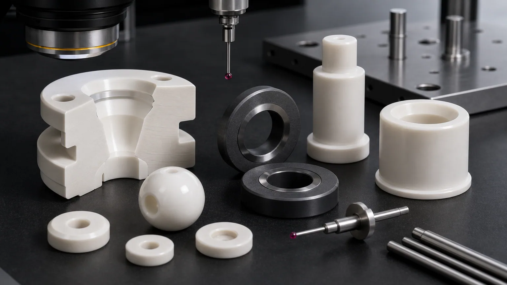
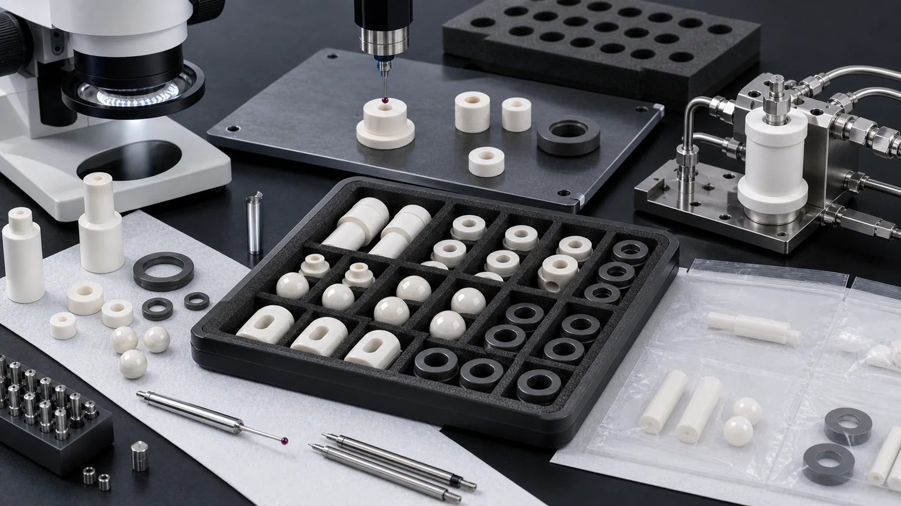

> Precision ceramic pump and valve components should be quoted as fluid-control interfaces, not as generic wear parts. The accepted part depends on material grade, media exposure, lapped faces, valve-seat geometry, ball roundness, plunger OD finish, bore relationship, edge quality, cleaning, and inspection evidence.

Ceramic pump and valve components appear in chemical processing, high-purity fluid systems, vacuum equipment, semiconductor wet-process support hardware, analytical instruments, metering pumps, dosing systems, abrasive slurry handling, pharmaceutical equipment, water treatment, and industrial automation. The component names are familiar: valve seats, balls, plugs, sleeves, plungers, pistons, seal rings, wear rings, check valve discs, bushings, and guide parts.

The RFQ problem is not familiar. A ceramic valve ball may fail because the mating seat, sphericity, edge condition, and media are not reviewed together. A silicon carbide seal ring may pass diameter inspection but fail if the lapped face, flatness, surface finish, and packaging are not protected. A zirconia pump plunger may be dimensionally correct but unsuitable if OD finish, straightness, sleeve fit, and chemical exposure were treated as afterthoughts.

This article is a precision industrial ceramic machining case guide for pump and valve components. It builds on the broader [industrial ceramic machining for wear-resistant components guide](/posts/industrial-ceramic-machining/industrial-ceramic-machining-wear-resistant-components/), but focuses specifically on fluid-control parts where lapped seal faces, valve seats, balls, plungers, sleeves, and clean inspection evidence decide acceptance.

For a valve-only RFQ involving seats, balls, plugs, trim, shutoff, or throttling interfaces, use the narrower [ceramic valve components for corrosive and abrasive fluids guide](/posts/pump-valve-components/ceramic-valve-components-corrosive-abrasive-fluids/). This page remains the component-family selector for mixed pump, seal, sleeve, plunger, and valve packages.

### Why Pump And Valve Components Need Function-Specific Review

Ceramic valve seats, balls, silicon carbide seal rings, zirconia plungers, alumina pump sleeves, and other fluid-control parts are usually sourced because a real assembly is wearing, corroding, leaking, sticking, or contaminating the fluid path.

There is also a current industrial signal. Semiconductor and advanced manufacturing investment continues to increase demand for chemical delivery, wet processing, high-purity fluid handling, vacuum support, dosing, and inspection equipment. [SEMI reported expected worldwide 300mm fab equipment spending growth in 2026 and 2027](https://www.semi.org/en/semi-press-release/semi-projects-double-digit-growth-in-global-300mm-fab-equipment-spending-for-2026-and-2027), driven in part by AI chip demand. That does not mean every pump or valve part is a semiconductor part, but it does increase the commercial value of high-purity, wear-resistant, corrosion-resistant, and inspectable ceramic fluid-control components.

The technical ceramic industry already treats this as a defined application family. [CeramTec presents advanced ceramics for pumps, valves, and seals](https://www.ceramtec-industrial.com/en/products-applications/pumps-valves-and-seals), and its application pages discuss ceramic pump components and valve components for fluid-handling systems. The useful RFQ translation is specific: which part surface seals, which feature guides motion, which material sees the media, and how the acceptance gate will be proven.

### What Counts As A Ceramic Pump Or Valve Component

Pump and valve RFQs often mix material, wear, sealing, sliding, and dimensional requirements in one small part. Start by naming the function before naming the ceramic.

| Component family               | Typical function                                            | RFQ issue that changes the route                                          |
| ------------------------------ | ----------------------------------------------------------- | ------------------------------------------------------------------------- |
| SiC mechanical seal face       | Controls rotating or static seal interface in harsh media   | Lapped flatness, Ra, seal land width, chip limit, and protected packaging |
| Ceramic valve seat             | Provides shutoff or throttling contact against ball or plug | Seat angle, roundness relationship, lapped land, edge quality, and media  |
| Zirconia or alumina valve ball | Provides shutoff, check, or metering contact                | Sphericity, surface finish, polishing, size match, and counterface        |
| Pump plunger or piston         | Transfers motion and pressure in metering or dosing system  | OD finish, straightness, roundness, sleeve fit, and end-face condition    |
| Ceramic guide sleeve           | Guides plunger, shaft, or moving valve element              | ID/OD concentricity, bore finish, wall thickness, and edge break          |
| Check valve disc or plate      | Opens and closes against a seat under flow pressure         | Flatness, contact band, edge chips, impact risk, and cleaning             |
| Ceramic wear ring or bushing   | Controls wear and alignment near pump shaft or valve stem   | Bore relationship, roundness, sliding finish, and counterface material    |
| Ceramic flow restrictor        | Controls flow through hole, slot, or orifice                | Hole geometry, cleaning, erosion edge, and inspection method              |

Two drawings can both be called "ceramic valve components" but need different production plans. A lapped SiC seal face, a zirconia ball, an alumina check valve disc, and a silicon nitride guide sleeve do not share the same inspection logic.

The useful RFQ question is:

**Which surface creates the seal, which geometry guides motion, which material touches the fluid, and what inspection evidence proves the component can enter the pump or valve assembly?**

### Case Pattern: A Ceramic Valve Seat, Ball, And Pump Plunger Set

A practical high-value case is a small set of ceramic fluid-control components for a dosing pump, check valve, or chemical handling assembly:

- A zirconia or alumina ceramic ball controls shutoff.
- A ceramic valve seat provides a conical or flat contact band.
- A SiC or alumina seal ring controls leakage at a face interface.
- A zirconia plunger or alumina piston moves through a guide sleeve.
- Small bores, slots, or ports manage flow and cleaning.

At first glance, the RFQ may look like a simple list of small round parts. In practice, each part has a different acceptance gate. The ball needs sphericity and surface quality. The seat needs contact geometry and edge control. The seal ring needs lapped flatness and Ra. The plunger needs OD finish, straightness, and matched sleeve logic. The flow feature needs hole or port inspection.

This is why the [lapped ceramic seal faces RFQ guide](/posts/lapped-seal-faces/ceramic-lapped-seal-faces-rfq/) and the [ceramic tolerance capability map](/posts/tolerances-gdt/ceramic-tolerance-capability-map-by-feature-process/) are natural supporting pages for pump and valve ceramic work.

### Material Selection For Ceramic Pump And Valve Parts

Material choice should follow media, wear mode, temperature, impact, contact stress, and cleaning requirement. Do not select only from a hardness number.

| Material family                                                                                                              | Where it may fit                                                                                | RFQ notes                                                                                |
| ---------------------------------------------------------------------------------------------------------------------------- | ----------------------------------------------------------------------------------------------- | ---------------------------------------------------------------------------------------- |
| [Silicon carbide SiC](/posts/industrial-ceramic-machining/silicon-carbide-ceramic-machining-harsh-environment-applications/) | Mechanical seal faces, wear rings, harsh chemical fluid-control components, abrasive media      | Grade, lapped surfaces, flatness, edge chips, and media exposure usually dominate review |
| [Zirconia ZrO2](/posts/industrial-ceramic-machining/zirconia-ceramic-machining-high-strength-precision-components/)          | Valve balls, plungers, sleeves, precision sliding or shutoff elements                           | Toughness, polish, roundness, OD finish, temperature, and counterface need review        |
| [Alumina Al2O3](/posts/industrial-ceramic-machining/precision-machined-alumina-ceramic-parts-industrial-applications/)       | Valve seats, discs, sleeves, insulating pump parts, general wear and chemical-duty components   | Purity, density, chip criteria, sealing face, and bore condition matter                  |
| [Silicon nitride Si3N4](/posts/industrial-ceramic-machining/silicon-nitride-ceramic-machining-structural-wear-parts/)        | Guide sleeves, wear parts, rolling or sliding elements where strength and shock behavior matter | Load path, thermal shock, roundness, finish, and grade should be clarified               |
| [Boron nitride BN](/posts/industrial-ceramic-machining/boron-nitride-ceramic-machining-high-temperature-insulation-parts/)   | Selected high-temperature or non-wetting fixtures near fluid or molten media paths              | Atmosphere, strength, load, and handling sensitivity require careful review              |
| [Macor](/posts/industrial-ceramic-machining/macor-machinable-glass-ceramic-parts-applications-design-guide/)                 | Prototype fluid-control fixtures, lab valves, vacuum proof-of-geometry parts                    | Useful for quick machining trials, but not a general substitute for hard-fired ceramics  |

If the part is tied to an approved pump or valve design, send the exact material grade. If the material is open, send the fluid chemistry, solids content, pressure, temperature, cycling, sliding or impact condition, counterface material, and acceptance method. The [ceramic material selection guide](/posts/materials-grade-selection/ceramic-material-selection-cnc-machining/) should be used before locking the drawing.

### Functional Geometry That Controls The Quote

Ceramic pump and valve parts are usually controlled by a few functional zones, not by every outside surface.

Define:

- Seal face or seat contact band.
- Ball diameter, sphericity, surface finish, and mating seat.
- Plunger OD, straightness, roundness, finish, and sleeve clearance.
- Sleeve ID, OD, wall thickness, and concentricity.
- Bore, port, slot, or orifice geometry.
- Chamfer, radius, and chip limit at fluid-facing edges.
- Flatness and parallelism on faces that seal or control stack height.
- Datum surfaces used for CMM, optical, roundness, or fixture inspection.

Avoid applying the same tight tolerance or low Ra to every surface. A practical drawing separates sealing lands, sliding surfaces, clearance faces, handling edges, and non-functional relief geometry. The [surface finish and subsurface damage guide](/posts/surface-finish-functional/ceramic-ssd-surface-finish-specify-control-price/) explains why lapping, polishing, and roughness requirements should be assigned by face and function.

### Lapped Seal Faces And Valve Seat Contact

Leakage risk often lives in the contact band. For SiC seal rings, alumina valve seats, check valve discs, and ceramic shutoff surfaces, the RFQ should state whether the contact is flat, conical, spherical, annular, line contact, or customer-lapped after assembly.

Clarify:

- Which face or band is the seal surface.
- Flatness or form requirement and measurement method.
- Ra requirement and whether lapping or polishing is required.
- Seat angle, ball size match, or plug contact relationship.
- Whether the part seals dry, wet, lubricated, chemically exposed, or vacuum-side.
- Whether final leak test is performed by the customer or the machining supplier.
- Whether protective packaging must prevent contact marks on lapped surfaces.

For many RFQs, the machining supplier can prove geometry, surface finish, flatness, and edge condition. The customer may still own final leak, flow, pressure, or life-cycle testing in the assembled pump or valve. State that boundary before quotation.

### Sliding Fits: Plungers, Pistons, Sleeves, And Guide Bushings

Pump plungers, metering pistons, and guide sleeves should be reviewed as matched motion components. The ceramic may resist wear, but sliding reliability depends on fit, finish, counterface, media, and alignment.

Review:

- Plunger OD tolerance and roundness.
- Sleeve ID tolerance, cylindricity, and straightness.
- Clearance target and whether it is dry, lubricated, wet, or media-lubricated.
- OD and ID surface finish and whether polishing is required.
- End-face chamfer and chip criteria.
- Stroke length, side load, pressure, and cycling rate if known.
- Whether components are supplied as matched sets or interchangeable lots.

For thin sleeves or long bores, the [thin-wall ceramic sleeve machining guide](/posts/thin-wall-sleeves/ceramic-thin-wall-sleeve-bore-concentricity-rfq/) helps define bore concentricity, roundness, wall stability, and inspection method. For high-strength zirconia sliding parts, use the [zirconia ceramic machining guide](/posts/industrial-ceramic-machining/zirconia-ceramic-machining-high-strength-precision-components/) alongside the drawing.

### Ports, Orifices, And Flow Edges

Pump and valve parts often include small holes, side ports, slots, grooves, counterbores, or flow restrictors. These features may control flow, cleaning, pressure drop, or erosion.

Good RFQ details include:

- Hole diameter, depth, taper, and exit edge requirement.
- Port position relative to seat, bore, OD, or datum face.
- Groove width, depth, bottom radius, and edge break.
- Slot length, width, end radius, and minimum wall thickness.
- Whether blockage, trapped media, or cleaning residue is a concern.
- Whether edge chips affect flow, seal, particles, or only appearance.
- Inspection method: optical, pin gauge, CMM, microscope, air flow, or customer functional test.

For very small holes, use the [ceramic micro-hole machining RFQ guide](/posts/micro-hole-machining/ceramic-micro-hole-machining-rfq/). For nozzle-like flow-control inserts, the [precision ceramic nozzles for semiconductor and vacuum equipment guide](/posts/semiconductor-equipment/precision-ceramic-nozzles-semiconductor-vacuum-equipment/) is a useful companion page. If the restrictor, sampling block, or flow cell sits inside an analyzer rather than a pump or valve assembly, use the [ceramic fluid-path components for analytical instruments guide](/posts/analytical-instruments/ceramic-fluid-path-components-analytical-instruments/) to separate machined-geometry acceptance from calibrated flow or instrument performance.

### Cleaning, Media, And Packaging

Fluid-control ceramic components can fail incoming inspection because of residue, contact marks, damaged lapped faces, edge chips, or particles trapped in ports. Cleaning and packaging belong in the RFQ, not only in shipping notes.

Discuss:

- Fluid chemistry, solids content, pH range, solvent, slurry, abrasive content, or high-purity requirement.
- Whether the part is wet-process, vacuum-side, chemical-side, sanitary, analytical, or general industrial.
- Whether holes, ports, grooves, and bores require blockage review.
- Whether lapped faces can touch packaging or other parts.
- Whether balls, seats, plungers, and sleeves are matched or interchangeable.
- Whether material certificate, traceability, certificate of conformity, or inspection report is required.

### Inspection Evidence For Ceramic Pump And Valve Components

Inspection should prove the fluid-control function, not create a long report for irrelevant surfaces.

| Functional requirement    | Evidence to discuss                                                    | Why it matters                                              |
| ------------------------- | ---------------------------------------------------------------------- | ----------------------------------------------------------- |
| Lapped seal face          | Flatness report, optical method, surface plate method, or lapping note | Controls leak path, contact behavior, and assembly stress   |
| Valve seat contact        | Seat angle, form, CMM/optical inspection, or mating sample review      | Controls shutoff, throttling, and ball or plug contact      |
| Ceramic ball              | Diameter, sphericity, surface finish, visual review, or lot sampling   | Controls sealing, check-valve response, and wear behavior   |
| Plunger or piston OD      | Micrometer, roundness, cylindricity, straightness, and Ra              | Controls sliding fit, leakage, wear, and stroke reliability |
| Sleeve or bushing ID      | Bore gauge, CMM, air gauge, roundness, or pin gauge                    | Controls fit, alignment, and repeatable motion              |
| Ports and flow features   | Optical inspection, pin gauge, microscope, CMM, or flow test boundary  | Controls flow, cleaning, blockage, and erosion risk         |
| Edge quality              | Visual criterion by zone, microscopy, chip limit, and sample evidence  | Reduces particles, crack origins, and sealing defects       |
| Cleaning and packaging    | Cleaning note, separated trays, protected lapped faces, bagging method | Protects functional surfaces before assembly                |
| Material and traceability | Material certificate, grade confirmation, lot record, or CoC           | Supports qualification, repeat orders, and incoming QA      |

When the buyer performs final pressure, leak, flow, chemical compatibility, or life-cycle testing, the RFQ should say so. The machining quote can then focus on geometry, surface condition, cleaning, packaging, and dimensional evidence.

### Cost Drivers In Ceramic Pump And Valve RFQs

Ceramic pump and valve components often become expensive for specific reasons:

1. SiC, zirconia, alumina, or Si3N4 grade and blank availability.
2. Fired ceramic hardness and diamond grinding time.
3. Lapped seal faces, flatness, and low Ra requirements.
4. Ball sphericity, polishing, and surface defect criteria.
5. Plunger OD roundness, straightness, and long sliding finish.
6. Sleeve ID/OD concentricity and thin-wall stability.
7. Small ports, side holes, grooves, seats, and complex internal geometry.
8. Edge chip limits near sealing, sliding, and fluid-facing zones.
9. Cleaning, protected packaging, matched-set logic, and traceability.
10. Inspection report scope and customer qualification samples.

The best cost control is not to loosen every tolerance. It is to rank the surfaces. Put tight control on the seal band, valve seat, ball, plunger OD, sleeve ID, and fluid-facing edges. Allow practical machining tolerance and finish on relief surfaces that do not affect fit, seal, motion, or flow.

### RFQ Checklist For Ceramic Pump And Valve Components

Send the following before expecting a reliable quotation:

- 2D drawing with revision and STEP or native CAD file.
- Part family: seal face, valve seat, ball, plug, sleeve, plunger, piston, disc, bushing, wear ring, or flow restrictor.
- Material grade, purity, density, certificate requirement, and whether equivalent review is allowed.
- Fluid chemistry, solids content, abrasive condition, temperature, pressure, vacuum condition, and cleaning requirement.
- Functional surfaces: seal face, seat land, ball surface, plunger OD, sleeve ID, ports, grooves, and particle-sensitive edges.
- Flatness, Ra, roundness, sphericity, concentricity, cylindricity, parallelism, and datum requirements by feature.
- Mating material, counterface, ball-seat relationship, sleeve clearance, or matched-set requirement.
- Final functional test boundary: customer leak, pressure, flow, chemical, vacuum, or life test.
- Cleaning, packaging, traceability, material certificate, inspection report, and sampling requirements.
- Quantity, target timing, prototype or repeat-order status, and qualification stage.

For a standard package structure, use the [custom ceramic CNC machining RFQ checklist](/posts/rfq-preparation/custom-ceramic-cnc-machining-rfq-checklist/). For first-pass manufacturability, use the [ceramic CNC machining design rules guide](/posts/design-rules-dfm/ceramic-cnc-machining-design-rules-advanced-ceramic-parts/).

### Practical Takeaway

Ceramic pump and valve components create value when the material and machining route match the real fluid-control function. A ceramic ball, valve seat, SiC seal ring, plunger, sleeve, or check valve disc should not be quoted only by outside dimensions. The RFQ should define the media, sealing or sliding interface, lapped faces, edge quality, cleaning, packaging, and inspection evidence.

For a serious ceramic pump or valve RFQ, send the drawing, CAD model, material or environment, fluid condition, functional surfaces, mating parts, tolerance and finish requirements, inspection expectations, cleaning and packaging needs, quantity, and qualification stage. That allows the part to be reviewed as a precision fluid-control component instead of a generic ceramic wear part.

### FAQ

**Which ceramic is best for pump and valve components?**
There is no universal best material. SiC is often reviewed for harsh seal and chemical wear parts, zirconia for balls and plungers, alumina for seats and sleeves, and silicon nitride for selected wear or guide components. The media, contact stress, temperature, and inspection method decide.

**Are ceramic valve balls always interchangeable?**
No. Interchangeability depends on ball diameter, sphericity, surface finish, seat geometry, lot control, and assembly tolerance. Some RFQs require matched ball-seat review.

**Does every ceramic seal face need mirror polishing?**
Usually no. Specify flatness, Ra, lapped land width, edge condition, and measurement method for the functional seal face. Non-sealing surfaces can often use practical machining finish.

**Can a ceramic plunger run directly in a ceramic sleeve?**
Sometimes, but the clearance, media, lubrication, stroke, side load, OD/ID finish, roundness, straightness, and thermal condition must be reviewed before feasibility is assumed.

**Who should perform leak or flow testing?**
Many buyers perform final leak, pressure, flow, or life testing in the assembled pump or valve. The machining supplier should know whether it is responsible for dimensional evidence only or for a functional test requirement.

> RFQ note: Final feasibility, tolerance, price, lead time, cleaning method, packaging, and inspection scope depend on drawing review, material grade, blank state, functional surfaces, media exposure, quantity, and acceptance method.
