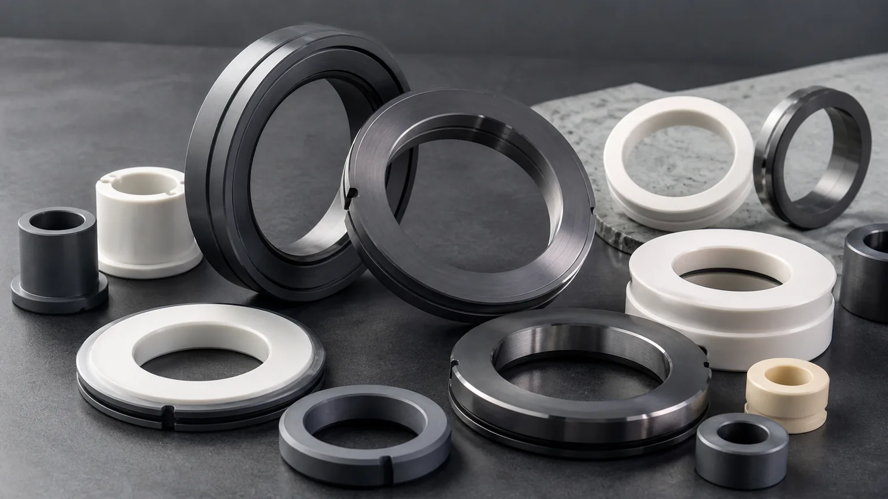
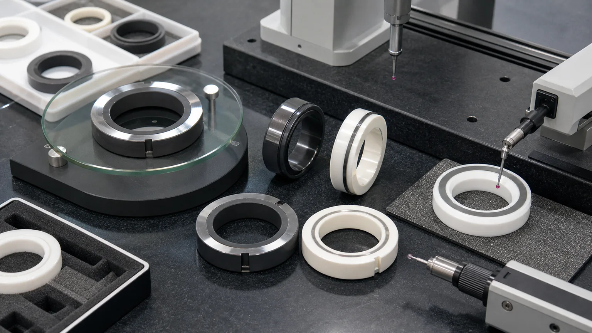
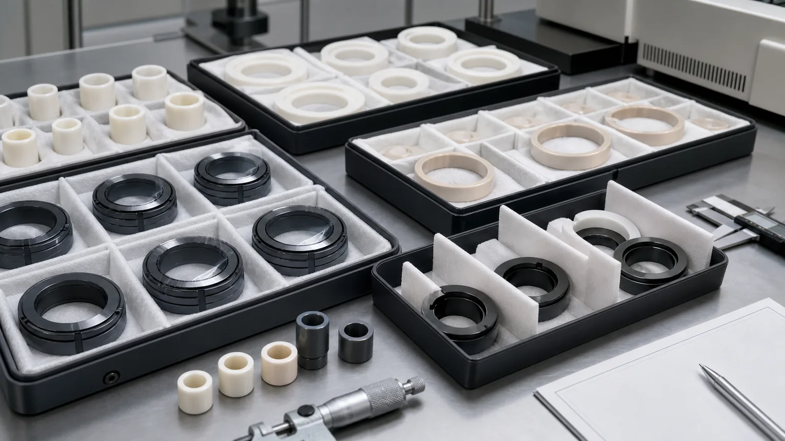

> A ceramic seal face for a pump or rotating shaft is not just a flat ring. It is a controlled tribological and sealing interface where material grade, mating face, media, speed, pressure, lapped band, flatness, Ra, edge quality, cleaning, packaging, and inspection evidence decide whether the part can be accepted.

Precision ceramic seal faces are used in centrifugal pumps, metering pumps, mixers, agitators, compressors, chemical process equipment, water and wastewater equipment, high-purity fluid systems, and rotating industrial machinery. Typical RFQs include silicon carbide mechanical seal faces, alumina seal rings, zirconia mating rings, ceramic stationary seats, rotating seal rings, lapped seal bands, and replacement ceramic hard-face components.

This article is narrower than the general [ceramic lapped seal faces RFQ guide](/posts/lapped-seal-faces/ceramic-lapped-seal-faces-rfq/) and more specific than the broader [ceramic pump and valve components guide](/posts/pump-valve-components/precision-ceramic-pump-valve-components-corrosive-fluid-control/). It focuses on ceramic seal faces and mechanical seal rings for rotating equipment, where the buyer usually needs a part drawing, mating-face information, operating context, and acceptance evidence before a useful quotation is possible.

### Why Ceramic Seal Faces Are A High-Value Industrial RFQ Topic

Pumping systems are a long-term industrial reliability and energy topic, not a short-lived trend. The U.S. Department of Energy maintains [pump systems resources](https://www.energy.gov/cmei/ito/pump-systems) and links to the industry sourcebook for improving pumping system performance. Mechanical seals are also treated as a specialized pump engineering subject: the Hydraulic Institute lists a 2024 second edition of [Mechanical Seals for the Pump Industry](https://www.pumps.org/product/mechanical-seals-for-the-pump-industry-selection-installation-maintenance-and-troubleshooting/), covering selection, installation, maintenance, and troubleshooting for rotary and rotodynamic pumps.

For a precision ceramic machining website, the commercial value is direct. Buyers do not search only for "ceramic part." They search for:

- silicon carbide mechanical seal face
- ceramic pump seal ring
- SiC stationary seal ring
- alumina seal face
- zirconia mechanical seal ring
- lapped ceramic seal face
- hard face seal component
- ceramic seal ring flatness

Technical ceramic manufacturers also treat this as a defined application family. CoorsTek publishes application pages for [ceramic hard face seal components](https://www.coorstek.com/en/products-applications/hard-face-seal-components/) and [silicon carbide mechanical seals](https://www.coorstek.com/en/products-applications/silicon-carbide-mechanical-seals/). The RFQ opportunity is not to make a broad claim that ceramics are hard. It is to help buyers define the seal face, mating pair, material grade, lapped surface, edge condition, and inspection plan.

### What Counts As A Ceramic Seal Face

Ceramic seal RFQs often arrive as simple round parts, but the function can be different from one drawing to the next.

| Component name                      | Typical role in rotating equipment                    | RFQ issue that changes machining and inspection                                    |
| ----------------------------------- | ----------------------------------------------------- | ---------------------------------------------------------------------------------- |
| Rotating mechanical seal face       | Runs against a stationary face near a shaft           | Lapped face flatness, Ra, balance features, OD/ID, drive slot, and mating material |
| Stationary ceramic seal seat        | Provides the fixed contact face in a pump seal system | Seat face flatness, anti-rotation feature, gasket land, OD fit, and edge chips     |
| Silicon carbide hard face seal ring | Handles abrasive, corrosive, or high-duty media       | SiC grade, lapped band, parallelism, chip limit, media exposure, and packaging     |
| Alumina or zirconia mating ring     | Serves as a ceramic contact or support face           | Material match, edge toughness, surface finish, and contact stress                 |
| Cartridge-seal ceramic insert       | Fits into a metal holder or seal assembly             | OD fit, thermal expansion concern, notch geometry, and assembly stress             |
| Pump wear ring with sealing face    | Combines wear guidance and seal-adjacent function     | Bore/OD relationship, runout, contact band, and counterface                        |
| Mixer or agitator seal component    | Works around process-side rotating equipment          | Media, shaft speed, flush plan, edge chips, and protected lapped face              |

The useful sourcing question is:

**Which face actually seals, what does it run against, and how will the buyer judge leakage, wear, contact marks, or incoming inspection?**

Without that answer, a supplier can quote the outside diameter but miss the real risk.

### Material Choice: SiC, Alumina, Zirconia, And Other Ceramic Options

Material choice should follow the seal system, not a single hardness number.

| Material family                                                                                                              | Where it is often reviewed                                                                 | RFQ notes                                                                                        |
| ---------------------------------------------------------------------------------------------------------------------------- | ------------------------------------------------------------------------------------------ | ------------------------------------------------------------------------------------------------ |
| [Silicon carbide SiC](/posts/industrial-ceramic-machining/silicon-carbide-ceramic-machining-harsh-environment-applications/) | Mechanical seal faces, harsh media, slurry, chemical-duty pumps, abrasive rotating service | Grade, lapped surface, flatness, edge chips, media, speed, and mating material dominate review   |
| [Alumina Al2O3](/posts/industrial-ceramic-machining/precision-machined-alumina-ceramic-parts-industrial-applications/)       | General industrial seal faces, ceramic seats, pump-adjacent wear and insulation parts      | Purity, density, chip criteria, seal band width, and lapped or ground surface need definition    |
| [Zirconia ZrO2](/posts/industrial-ceramic-machining/zirconia-ceramic-machining-high-strength-precision-components/)          | Smaller mating rings, seats, plungers, and precision wear components                       | Toughness, edge stability, polish, temperature, and counterface should be reviewed               |
| [Silicon nitride Si3N4](/posts/industrial-ceramic-machining/silicon-nitride-ceramic-machining-structural-wear-parts/)        | Selected high-strength wear, rolling, or thermally cycled rotating equipment components    | Useful when structural load and thermal shock matter; not a default substitute for every seal    |
| [Macor](/posts/industrial-ceramic-machining/macor-machinable-glass-ceramic-parts-applications-design-guide/)                 | Lab prototypes, geometry trials, and non-production proof-of-fit parts                     | Easy to machine compared with fired ceramics, but usually not the material for hard seal service |

Counterface matters as much as the ceramic. A silicon carbide ring running against carbon, another SiC face, tungsten carbide, alumina, or a customer-specified mating part can require different finish, flatness, lubrication, and wear assumptions. If the drawing only names one ceramic ring and not the mating face, the RFQ is incomplete.

Use the broader [ceramic material selection guide](/posts/materials-grade-selection/ceramic-material-selection-cnc-machining/) before substituting one ceramic for another. A material change may affect machining cost, edge behavior, thermal response, and final qualification.

### Seal Face Geometry That Should Be Marked On The Drawing

A ceramic seal ring is often controlled by a few functional zones, not by every surface.

Mark these features clearly:

- Lapped seal face or annular seal band.
- ID, OD, and thickness control.
- Parallelism between the lapped face and mounting face.
- Flatness over the functional band, not only the full outside face.
- Groove, drive slot, notch, pin hole, or anti-rotation feature.
- Gasket land, O-ring support surface, or metal holder fit.
- Inner and outer edge break near the seal path.
- Chip criteria for sealing edges and non-sealing edges.
- Datum face or bore used for CMM, optical, flatness, or runout inspection.

The [ceramic CNC machining design rules guide](/posts/design-rules-dfm/ceramic-cnc-machining-design-rules-advanced-ceramic-parts/) is useful before adding sharp notches, deep grooves, close holes, thin sections, or aggressive press fits around the seal ring. Fired ceramics do not behave like metal after heat treatment. Tool access, grinding force, chipping risk, and edge support all matter.

### Flatness, Ra, And Lapped Bands

Seal face RFQs are often over-specified and under-defined at the same time. A drawing may call for "polish all over" but fail to say where the seal land is. That can raise cost without protecting the leak path.

Define:

- Whether the face is lapped, ground, polished, or customer-lapped after assembly.
- Whether flatness applies to the full face or the annular seal band.
- Ra target and the measurement method.
- Whether waviness or contact pattern matters.
- Whether both faces of a pair are supplied by the same supplier.
- Whether the buyer wants a flatness report, roughness report, microscope photo, or incoming inspection sample.

The [surface finish and subsurface damage guide](/posts/surface-finish-functional/ceramic-ssd-surface-finish-specify-control-price/) explains why finish requirements should be assigned by surface and function. The [lapped ceramic seal faces guide](/posts/lapped-seal-faces/ceramic-lapped-seal-faces-rfq/) goes deeper into flatness, Ra, leak risk, and edge conditions for sealing interfaces.

### Operating Inputs That Change The RFQ

The machining supplier may not own the complete seal design, but it still needs enough context to avoid quoting the wrong risk.

Send what you know:

- Pump, mixer, agitator, compressor, or other rotating equipment type.
- Rotating or stationary face position.
- Mating face material.
- Fluid, slurry, gas, solvent, water, chemical media, or high-purity process condition.
- Temperature, pressure, speed, and start-stop pattern if available.
- Wet, dry, boundary-lubricated, flushed, or intermittent running condition.
- Abrasive particles, solids content, crystallization risk, or corrosion concern.
- Final leak, pressure, vibration, or life test boundary.
- Whether the part is a replacement seal face, a prototype, or a production repeat order.

This information does not turn the machining supplier into the seal designer. It helps the supplier review material, geometry, edge condition, lapping route, packaging, and evidence. Final equipment performance still depends on the complete seal assembly and customer qualification.

### Common Failure Modes That Start At The Drawing

Many ceramic seal face problems are created before production starts.

| Drawing or RFQ issue                 | Why it causes trouble                                                   | Better RFQ approach                                                                       |
| ------------------------------------ | ----------------------------------------------------------------------- | ----------------------------------------------------------------------------------------- |
| "Mirror polish all surfaces"         | Adds cost to non-functional surfaces and may ignore flatness            | Mark the seal band and define Ra, flatness, and inspection by face                        |
| No mating material                   | Contact behavior and finish choice are unclear                          | State carbon, SiC, tungsten carbide, ceramic, metal, or customer mating face if known     |
| Sharp drive slots near the seal path | Creates chip initiation and inspection dispute                          | Add ceramic-friendly radii or review notch geometry before machining                      |
| Tight OD and ID with no datum        | Supplier cannot know how the ring is assembled or inspected             | Define datum face, bore, OD, holder fit, and runout or concentricity only where needed    |
| Edge break not defined               | Too sharp chips; too large can reduce seal width                        | Define max chamfer/radius and chip limit by sealing and non-sealing zones                 |
| Lapped face touches packaging        | Contact marks or particles can ruin the accepted surface                | Specify separated trays, face protection, and clean handling                              |
| Customer leak test not stated        | Supplier may quote only dimensions while buyer expects functional proof | Clarify whether machining evidence or customer assembly testing controls final acceptance |

### Inspection Evidence For Ceramic Seal Faces

Inspection should prove the seal-ring function, not create a long report on irrelevant features.

| Functional requirement         | Evidence to discuss                                                       | Why it matters                                                |
| ------------------------------ | ------------------------------------------------------------------------- | ------------------------------------------------------------- |
| Lapped seal face flatness      | Optical flat, interferometry, CMM, flatness map, or agreed lapping record | Controls contact, leakage risk, heat generation, and wear     |
| Surface roughness on seal band | Contact or optical roughness measurement on the named face                | Controls friction, film behavior, mating wear, and acceptance |
| Parallelism and thickness      | CMM, micrometer, height gauge, or fixture check                           | Controls assembly stack and face loading                      |
| ID, OD, and ring fit           | Bore gauge, micrometer, CMM, roundness, or runout setup                   | Controls holder fit, shaft clearance, and rotating balance    |
| Groove, slot, or anti-rotation | CMM, profile, optical inspection, or sample fit check                     | Controls assembly location and drive feature integrity        |
| Edge chips near seal path      | Visual standard, magnification, microscope photos, or max chip size       | Prevents leak paths, particles, and crack initiation          |
| Cleaning and packaging         | Cleaning note, separated trays, protected faces, bagging method           | Prevents contact marks and contamination before installation  |
| Material and traceability      | Material certificate, grade confirmation, lot record, or CoC              | Supports qualification and repeat orders                      |

If the buyer will perform final leak, pressure, vibration, or life testing in the assembled seal, state that boundary. The ceramic machining package can then focus on dimensions, flatness, finish, edge condition, cleaning, packaging, and traceability.

### Packaging Is Part Of Seal Face Quality

Lapped ceramic seal faces can be damaged after inspection. Contact marks, grit, edge knocks, or parts rubbing together can create incoming quality failures.

For seal faces, packaging should define:

- Whether rings are packed face-up, face-down, or face-protected.
- Whether matched pairs are separated but kept in the same labeled set.
- Whether lapped faces require film, soft separators, trays, or single-part bags.
- Whether each ring needs orientation control.
- Whether cleanroom-adjacent or high-purity handling is required.
- Whether inspection records, material certificates, or lot labels travel with the shipment.

This is especially important for silicon carbide hard-face components and high-purity fluid systems. The part may pass lapping and inspection, then fail incoming review because the sealing face was marked during shipping.

### Cost Drivers In Ceramic Seal Face Machining

The main cost drivers are usually specific and controllable:

1. Material grade and blank availability, especially for SiC.
2. Fired ceramic hardness and diamond grinding time.
3. Lapped seal band flatness and low Ra requirement.
4. Parallelism and thickness control between faces.
5. ID/OD roundness, concentricity, and holder fit.
6. Drive slots, anti-rotation notches, grooves, and close edge features.
7. Chip limits near sealing edges.
8. Matched-pair inspection or sorting.
9. Cleaning and protective packaging.
10. Report scope: flatness, Ra, CMM, microscope, material certificate, and CoC.

The best cost control is not to remove all precision. It is to put precision where it controls the seal. Mark the contact band, fit diameters, datum face, critical edges, and required report. Let non-functional relief surfaces use practical ceramic machining tolerance and finish.

### RFQ Checklist For Ceramic Seal Faces

Send the following for a serious review:

- 2D drawing with revision and STEP or native CAD file.
- Part role: rotating face, stationary seat, mating ring, insert, wear ring, or replacement seal component.
- Material grade: SiC, alumina, zirconia, silicon nitride, or customer-specified ceramic.
- Mating face material and whether the pair is supplied together.
- Equipment type: pump, mixer, agitator, compressor, dosing system, or other rotating equipment.
- Media, temperature, pressure, speed, lubrication, flush, slurry, or dry-running condition if known.
- Marked seal face, lapped band width, flatness, Ra, and edge-chip requirement.
- ID/OD, thickness, parallelism, runout, concentricity, and datum requirements by function.
- Groove, slot, notch, pin hole, O-ring, holder fit, or anti-rotation feature details.
- Inspection report requirements: flatness, Ra, CMM, microscope, material certificate, CoC.
- Cleaning, packaging, matched-set, traceability, and incoming inspection requirements.
- Quantity, target timing, prototype or production stage, and whether equivalent material review is allowed.

Use the [custom ceramic CNC machining RFQ checklist](/posts/rfq-preparation/custom-ceramic-cnc-machining-rfq-checklist/) to prepare the full package. If the drawing includes narrow grooves, small holes, or thin features, also review the [ceramic tolerance capability map](/posts/tolerances-gdt/ceramic-tolerance-capability-map-by-feature-process/) and the [DFM design rules guide](/posts/design-rules-dfm/ceramic-cnc-machining-design-rules-advanced-ceramic-parts/).

### How This Page Fits The Internal Selection Path

Use this page when the search intent is a ceramic mechanical seal face, hard-face seal ring, stationary seat, rotating seal component, or pump seal face. Use related pages when the dominant issue changes:

- For general lapped-face specification, use the [ceramic lapped seal faces RFQ guide](/posts/lapped-seal-faces/ceramic-lapped-seal-faces-rfq/).
- For full pump and valve assemblies with balls, seats, plungers, sleeves, and ports, use the [ceramic pump and valve components guide](/posts/pump-valve-components/precision-ceramic-pump-valve-components-corrosive-fluid-control/).
- For harsh chemical and SiC material review, use the [silicon carbide machining guide](/posts/industrial-ceramic-machining/silicon-carbide-ceramic-machining-harsh-environment-applications/).
- For broader wear families, use the [industrial ceramic machining for wear-resistant components guide](/posts/industrial-ceramic-machining/industrial-ceramic-machining-wear-resistant-components/).
- For surface finish, lapping, and subsurface-damage language, use the [surface finish and SSD guide](/posts/surface-finish-functional/ceramic-ssd-surface-finish-specify-control-price/).

### Practical Takeaway

Precision ceramic seal faces for pumps and rotating equipment should be sourced as sealing interfaces, not as simple ceramic rings. The drawing should identify the lapped band, mating material, functional edges, fit diameters, grooves or notches, flatness, Ra, chip criteria, packaging, and inspection evidence. The RFQ should also explain the operating context enough for material and machining review: media, temperature, pressure, speed, lubrication, abrasive condition, and final test boundary.

Send drawings, CAD, ceramic grade, mating face information, functional surface requirements, inspection needs, packaging expectations, quantity, and qualification stage before expecting price, lead time, tolerance, or feasibility confirmation.

### FAQ

**Which ceramic is best for mechanical seal faces?**
There is no universal best ceramic. Silicon carbide is often reviewed for harsh mechanical seal service, alumina for many industrial ceramic seats and faces, and zirconia for selected precision mating components. Media, counterface, speed, pressure, temperature, and inspection requirements decide the review.

**Does every ceramic seal face need lapping?**
No. Lapping should be specified for the functional seal face or band when flatness and surface condition require it. Non-sealing faces may only need ground or practical machining finish.

**Can a supplier quote a ceramic seal ring from outside dimensions only?**
Only for a rough budget. A useful RFQ needs the seal face, mating material, material grade, flatness, Ra, edge condition, fit diameters, operating context, inspection method, and packaging requirement.

**Who is responsible for final leak testing?**
Often the buyer performs final leak, pressure, vibration, or life testing in the assembled pump or seal cartridge. The machining supplier should know whether it is responsible for dimensional and surface evidence only or for an agreed functional test.

> RFQ note: Final feasibility, tolerance, price, lead time, cleaning method, packaging, and inspection scope depend on drawing review, material grade, blank state, mating face, operating environment, quantity, and acceptance method.
