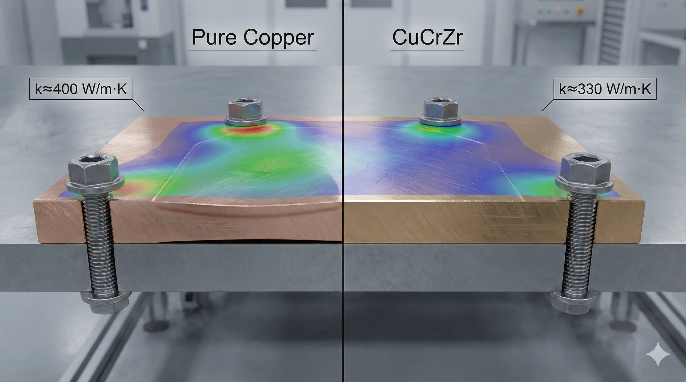
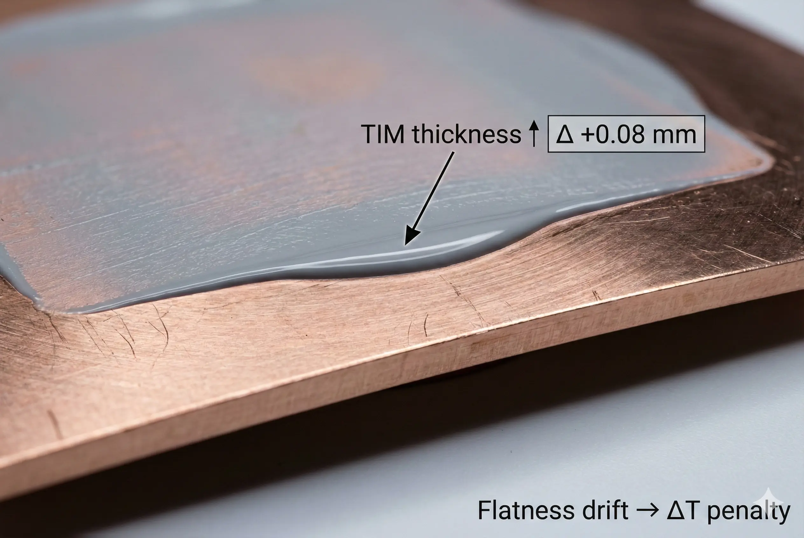
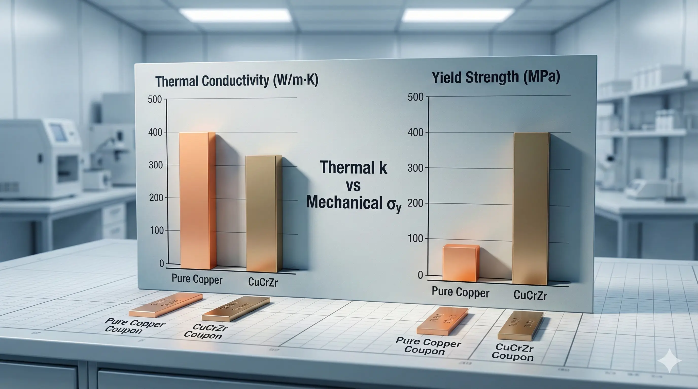

> **Pure Copper vs CuCrZr for high-performance heat sinks is conditionally feasible**depending on whether your dominant constraint is**bulk conduction (W/m·K)**or**mechanical integrity under load/temperature (MPa, °C)**. While pure copper maximizes thermal conductivity (~390–400 W/m·K), engineering teams must account for its low yield strength and rapid softening above ~150–200°C, which often makes CuCrZr (typically ~320–360 W/m·K) the more reliable choice for thin features, high clamp loads, and repeatable assembly in production.

### Pure Copper vs CuCrZr Heat Sinks in High-Power Builds

We repeatedly see the same RFQ pattern: “We need the best thermal performance—use pure copper.” The intent is rational: when heat flux is high, every °C matters, and copper’s headline conductivity looks like the obvious lever.

The mismatch usually appears later, during execution: the heat sink is not just a thermal block—it is also a**structural interface**that must survive**clamp load, thermal cycling, thread torque, and rework**. In practice, a 10–20% gain in bulk conductivity can be erased by**contact resistance**, while a 3×–6× loss in yield strength shows up immediately as bowed bases, stripped threads, distorted fins, or shifting flatness after brazing.

### Pure Copper Is a Type of High-Conductivity Base Metal

Pure copper (typical heat-sink grades such as C101/C102/C110 variants) is a type of**high-conductivity copper**optimized for heat flow. In finished heat sinks, we usually see room-temperature thermal conductivity on the order of**~390–400 W/m·K**when purity and processing are controlled.

Where pure copper becomes fragile is mechanical performance in the exact conditions heat sinks live in:

- **Low yield strength** in annealed or stress-relieved conditions (commonly **< ~100 MPa** class, depending on temper and product form).
- **Fast softening** : copper’s strength drops sharply as temperature rises; by **~150–200°C** , many assemblies start to lose dimensional stability if they rely on copper’s strength rather than geometry.

### CuCrZr Is a Type of Precipitation-Hardened Copper Alloy

CuCrZr (commonly designated as C18150 family) is a type of**precipitation-hardened copper alloy**. It trades some thermal conductivity for major gains in mechanical robustness:

- Typical thermal conductivity used in real designs: **~320–360 W/m·K** (processing dependent).
- Typical yield strength after proper solution + aging: often **~350–500 MPa** class (product form and heat-treat dependent).
- Better strength retention at elevated temperature: many builds remain mechanically stable through **~250–300°C** exposure where pure copper starts to behave like a soft gasket.

That “strength reserve” is what makes thin fins, dense pins, threaded features, press-fits, and repeatable clamping viable without turning your drawing into a “do not touch” artifact.

### Engineering Reality: The Dominant Bottleneck Is Often Not Bulk Copper k

When a heat sink underperforms, the root cause is frequently one of these:

- **Interface resistance** (TIM thickness, voiding, pump-out, surface roughness): a few microns of TIM can dominate more than the k difference between 400 and 330 W/m·K.
- **Spreading resistance vs geometry** : base thickness and heat-source footprint drive gradients more than alloy choice once k is “high enough.”
- **Mechanical distortion** : warped bases or bowed mounts increase TIM thickness, which can destroy the theoretical advantage of pure copper.

Rule we use during design reviews: if the stack-up includes**high clamp load**or**tight flatness**plus**thermal cycling**, then “maximum k” is rarely the highest-leverage variable.

### Execution Log: Where Pure Copper Failed, and What We Paid to Fix It

We ran a program for a compact high-power module with an aggressive target: minimize junction temperature while keeping Z-height low. The initial prototype used**machined pure copper**with a thin base and dense fin field. Early thermal data looked promising on the bench.

The failure appeared during assembly trials:

- After repeated torque cycles, the **mounting face lost flatness** and the base started to “dish.”
- The distortion increased TIM thickness and shifted thermal performance by **multiple °C** , eclipsing the conductivity advantage we thought we had bought.

**Pivot point:**we stopped treating the heat sink as “just a thermal conductor” and treated it as a**precision structural member**.

**Resolution:**we migrated the part to**CuCrZr with controlled heat treatment**and tightened the process window around post-machining stress relief and final surfacing.

**The tax we paid (Price of Success):**

- Added heat treatment steps (solution + aging) and control coupons, increasing lead time by **~3–7 days** depending on queue and validation.
- Accepted a bulk conductivity reduction of roughly **~10–20%** in exchange for significantly higher yield strength and assembly repeatability.
- Increased QA scope: hardness verification and flatness after thermal exposure became mandatory gate checks.

### Data Forensics Table: What Actually Moves the Needle

| Parameter | Standard Approach | Advanced Approach | The Trade-off |
| --- | --- | --- | --- |
| Bulk thermal conductivity (W/m·K) | Pure copper: ~390–400 | CuCrZr: ~320–360 | CuCrZr gives up ~10–20% k for major strength reserve |
| Yield strength (MPa, typical class) | Pure copper: often <~100 (annealed/stress-relieved) | CuCrZr: often ~350–500 (properly aged) | Pure copper needs geometry to carry loads; CuCrZr carries loads intrinsically |
| Softening / strength retention | Copper softens rapidly above ~150–200°C | Better retention through ~250–300°C range | CuCrZr tolerates thermal soak and cycling with less distortion |
| Threaded features / inserts | Risk of stripping or creep under torque | More robust threads; better torque repeatability | CuCrZr reduces assembly fallout, but demands heat-treat discipline |
| Thin fins / pins | Fins deform during handling and ultrasonic cleaning | Fins survive handling; less “fin smear” | CuCrZr improves yield in manufacturing lines |
| Joining / brazing exposure | Copper tolerates heat but distorts easily | CuCrZr properties can shift if over-aged | You must manage brazing/thermal cycles to avoid property drift |
| Cost & lead time | Lower process complexity | Extra heat treat + verification | Typically +10–25% cost and schedule risk if not planned early |

*Test method: thermal conductivity per ASTM E1225 (or equivalent), tensile per ASTM E8, hardness per ASTM E92/E384; verify on your actual product form and temper.*

### Feasibility Verdict: Pure Copper vs CuCrZr Heat Sinks

#### Clearly Feasible: Pure Copper Heat Sinks

Go ahead if all conditions below are true:

- Your dominant bottleneck is **bulk spreading** , not interface resistance (measurably low TIM sensitivity).
- Clamp loads are modest, or load is carried by a separate stiffener.
- Operating temperature stays mostly below **~150°C at the heat sink** and flatness stability is not a yield-limiting requirement.
- No thin threaded features are load-bearing, or inserts/standoffs isolate torque from copper.

#### Conditionally Feasible (High-Cost Route): “Pure Copper, But With Structural Compensation”

Possible, but expect added cost/complexity when any are true:

- You require tight flatness after thermal cycling, or you torque directly into copper.
- You run thin bases, microfins, or fragile fin geometries that see handling and cleaning.
- You must survive rework, multiple assembly cycles, or field servicing.

In this zone, we typically pay the “bill” using at least one: thicker bases, steel backplates, helicoils/inserts, process controls for stress relief, and post-assembly flatness control. Those mitigations can erase the simplicity that motivated pure copper in the first place.

#### Structurally Mismatched: Pure Copper Where Mechanics Dominate

Not recommended when:

- High clamp load + tight flatness + thermal cycling are simultaneous requirements.
- The part must function as a precision structural interface with repeated torque cycles.
- You have elevated soak temperatures in the **~200°C+** regime where softening becomes the governing failure mode.

**Alternative:**CuCrZr (with verified heat treat state) or a hybrid architecture (Cu base + structural frame) when both k and stiffness are critical.

> **Project Readiness Check**- Before committing, ask yourself (or your supplier):
>   - What is the maximum clamp load and torque cycle count, and what flatness change (µm) is acceptable after thermal cycling?
>     - What is your worst-case thermal exposure (°C × hours) including brazing, soldering, burn-in, and field fault conditions?

### FAQ: Pure Copper vs CuCrZr for Heat Sinks

**When does pure copper actually outperform CuCrZr in the real product?**

When the thermal stack is dominated by bulk spreading (large heat flux into a relatively thick base) and interface resistance is already minimized. If your TIM and contact plan are not controlled, the ~10–20% k advantage is commonly consumed by thicker/less stable interface layers.

**Is CuCrZr “always better” because it is stronger?**

No. If you do not need mechanical reserve (low clamp loads, stable geometry, minimal handling risk), pure copper can deliver lower thermal gradients. CuCrZr is selected when mechanical stability is the constraint that destroys thermal repeatability.

**What is the most common failure mode when teams pick pure copper for a high-performance heat sink?**

Loss of flatness and distortion under torque and thermal exposure, which increases effective TIM thickness. The thermal penalty from interface growth can exceed the k benefit of pure copper.

**What is the main process risk with CuCrZr?**

Property drift from thermal exposure: if the part sees high-temperature processes (brazing, soldering, uncontrolled stress relief), CuCrZr can over-age or otherwise shift hardness/strength state. You manage this by locking the process sequence and verifying hardness/strength on witness coupons.

**How do we decide quickly without running a full simulation?**

Use a two-check shortcut: (1) estimate whether interface resistance is the dominant term (TIM thickness/quality sensitivity), and (2) compute whether assembly loads require a yield strength reserve. If interface dominates and loads are high, CuCrZr usually wins on system performance repeatability.

> *Disclaimer: All scenarios described are based on real or closely analogous executed projects. If you choose to implement any of the examples described in this article, please conduct a careful evaluation first. This site assumes no responsibility for losses resulting from implementations made without prior evaluation.*
