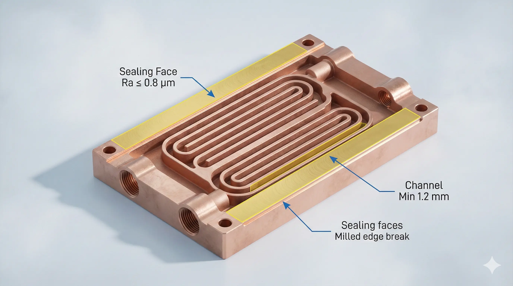
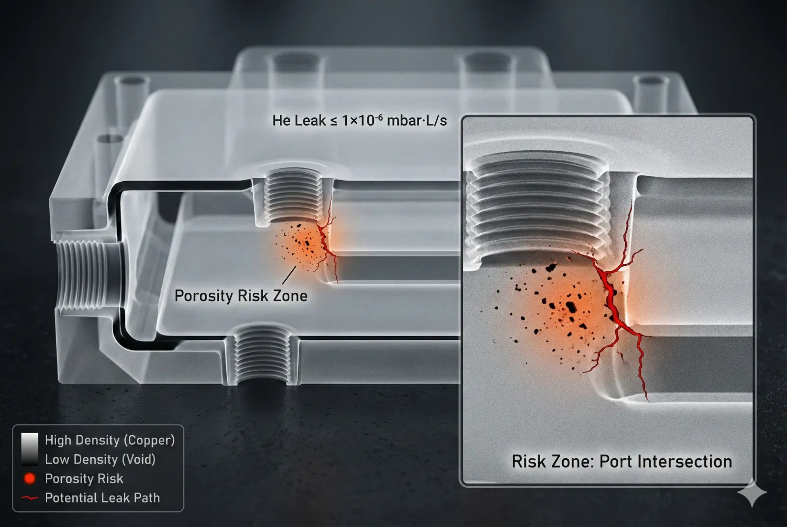
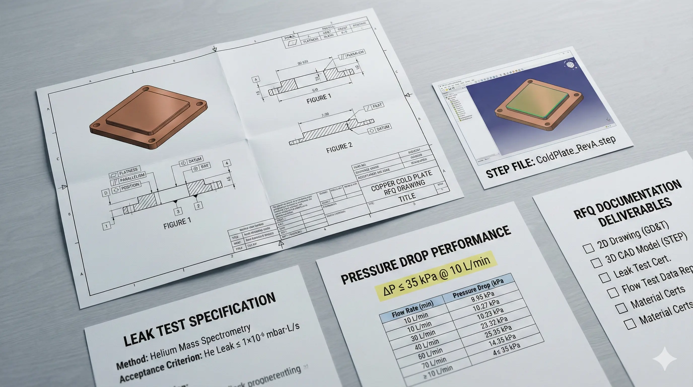

> Our experience shows that most “failed” custom 3D printed copper cold plate programs fail at the RFQ stage, not in production: missing channel specs, ambiguous acceptance criteria, and unbudgeted post-processing can add 2–6 weeks and 15–40% cost. This checklist is the fastest way to make the quote accurate and the first article schedule realistic.

A custom 3D printed copper cold plate RFQ is not a request for a price; it is a request for a controlled thermal-fluid device with a measurable risk profile. When an RFQ arrives with only a STEP file and “no leaks” as the acceptance criteria, the supplier must price uncertainty. In our quotes, that uncertainty usually shows up as higher NRE (often $1,500–$8,000), longer lead time (typically +2–4 weeks), or conservative post-processing (extra machining, extra inspection, extra test margin).

What changes the outcome is not “more detail” in general. It is the right detail: interfaces, coolant conditions, channel intent, and verification. Below is the RFQ checklist we use internally when we want the quotation to be a commitment rather than a guess.

#### Why copper cold plate RFQs go sideways (and how to prevent it)

Copper additive manufacturing is unforgiving because the failure modes are coupled. A minor porosity increase can become a leak after machining; a small flatness deviation can become a contact-resistance problem; a slightly high pressure drop can force a pump change late in the system build. The most common root cause we see is that the thermal requirement is provided (e.g., heat load and inlet temperature), but the fluidic and verification requirements are not (e.g., allowable ΔP at a specified flow, and leak test method with thresholds).

A practical way to think about the RFQ is that it must define three things with hard numbers: (1) what the part must do (thermal + flow), (2) how it must interface (mechanical + sealing), and (3) how success is proven (inspection + test). If one of those is missing, the project’s “price of success” becomes unpredictable—usually in rework cycles that cost days, not hours.

#### Scope alignment: define the manufacturing chain you are actually buying

Before the checklist, align on scope. For copper cold plates, “3D printed” rarely means “ship as-printed.” A realistic chain often includes 4–7 operations:

1. LPBF build (copper alloy)
2. Stress relief and/or HIP (optional but often decisive for leak risk)
3. Support removal + rough machining (datum creation)
4. Sealing surface finishing (O-ring grooves, lapped faces, threaded ports)
5. Cleaning (particulate + ionic contamination control)
6. Leak test + proof pressure test
7. Final inspection + documentation pack

If your RFQ expects a supplier to own this entire chain, state it. If you expect to do machining, plating, or testing in-house, state that too, because it changes machining allowances and inspection strategy by millimeters, not microns.

#### RFQ checklist for custom 3D printed copper cold plates

##### A) Commercial and program constraints (the “quote boundary”)

1. Target quantity and ramp plan

- Prototype quantity (e.g., 1–5 pcs), pilot (e.g., 10–50 pcs), production (e.g., 100+ pcs).
- Expected reorder cadence (monthly/quarterly) and revision tolerance (how often geometry changes). Hard metric: define at least one firm lot size; without it, per-piece price can swing 20–60% due to setup amortization.

2. Required lead time by phase

- First article needed date; acceptable lead time window (e.g., 4–6 weeks).
- Whether schedule risk is acceptable (yes/no). Hard metric: name a date and a penalty mechanism (e.g., schedule is critical vs flexible).

3. IP and data handling

- NDA required (yes/no), export controls if any, and drawing revision control method. Hard metric: specify revision naming rule and single source of truth (PLM link or PDF rev).

4. Incoterms and delivery preference

- EXW/FCA/DAP/DDP and required carrier (DHL/FedEx/UPS). Hard metric: destination and required delivery window (e.g., “deliver by 2026-03-15”).

##### B) Functional requirements (thermal + fluid)

5. Heat load and allowed temperature rise

- Total power (W), heat flux region (mm²), max surface temperature (°C), inlet temperature (°C). Hard metric formats: W, W/cm², °C.

6. Coolant type and chemistry envelope

- Water/glycol %, dielectric fluid (name), pH range, conductivity, chloride limit if known. Hard metric: pH range (e.g., 7–9) and max chloride (ppm) if corrosion risk matters.

7. Operating pressure and flow targets

- Nominal flow (L/min), allowable pressure drop at that flow (kPa or bar). Hard metric formats: L/min and kPa at temperature. Without ΔP, channel optimization becomes speculative.

8. Temperature cycling and duty profile

- Operating temperature band (e.g., 20–70°C), cycle count, and ramp rate if relevant. Hard metric: number of thermal cycles (e.g., 500 cycles) and dwell time (minutes).

9. Filtration assumptions

- Upstream filtration rating (e.g., 25 µm) and particulate tolerance. Hard metric: filter micron rating; it strongly influences minimum channel feature choice.

##### C) Geometry package (what the supplier must build)

10. Data pack completeness

- 3D model (STEP) + 2D drawing (PDF) with GD&T, not one or the other. Hard metric: include at least two datums and a coordinate system definition.

11. Channel intent, not only shape

- Minimum channel size (mm), target hydraulic diameter, expected roughness sensitivity.
- Identify “no-support” constraints or allow internal supports (most customers do not want internal supports). Hard metric: minimum internal feature size (e.g., ≥1.2 mm) and min wall thickness (e.g., ≥0.8–1.5 mm, depending on alloy and build strategy).

12. Port specification

- Thread type (NPT/BSPP/metric), depth, torque limit, and sealing method (O-ring, gasket, cone). Hard metric: thread callout and depth; ambiguity here creates scrap risk during final machining.

13. Sealing face definition

- Flatness requirement (e.g., ≤0.05 mm across sealing zone).
- Surface finish requirement (e.g., Ra ≤ 1.6 µm for gasket, Ra ≤ 0.8 µm for some O-ring faces). Hard metric formats: flatness in mm and Ra in µm.

14. Datum strategy and inspection access

- Which faces are functional datums vs sacrificial machining stock. Hard metric: machining allowance (e.g., +0.5 mm stock) on sealing faces or port bosses.

##### D) Material and process requirements (what “copper” means)

15. Alloy selection and rationale Common RFQ options:

- CuCrZr (often chosen for strength + thermal conductivity balance)
- GRCop-42 (higher temperature capability; confirm supplier capability)
- OFHC / pure copper variants (highest conductivity, more build/handling constraints) Hard metric: minimum thermal conductivity target (W/m·K) if it is a driver, or minimum yield strength (MPa) if mechanical integrity dominates.

16. Build process declaration

- LPBF (laser powder bed fusion) parameters controlled by supplier; ask for process class rather than proprietary settings. Hard metric: state whether HIP is required (yes/no). HIP can reduce leak risk but adds lead time (commonly +7–14 days) and cost.

17. Post-processing requirements

- Stress relief, HIP, machining, optional plating (Ni, NiP), passivation, coating. Hard metric: coating thickness if required (e.g., NiP 10–25 µm), and mask/no-mask regions.

18. Powder and traceability

- Powder spec (if you have one) and traceability expectations (lot/batch). Hard metric: require material cert and powder lot ID in the documentation pack.

##### E) Acceptance criteria (where most RFQs are under-specified)

19. Leak test method and threshold (non-negotiable to define) Choose one and state it explicitly:

- Helium mass spectrometer leak test: threshold (e.g., ≤ 1×10⁻⁶ mbar·L/s)
- Pressure decay: test pressure, stabilization time, allowable decay
- Bubble test: only acceptable for low-risk prototypes, not production validation Hard metric: test pressure (bar) and hold time (minutes). “No leak” is not a test method.

20. Proof pressure / burst margin

- Proof pressure (e.g., 1.5× operating pressure) and hold time. Hard metric: proof pressure value and acceptance (no visible leak, no permanent deformation beyond X).

21. CT scanning or alternative internal verification

- If internal geometry is critical, specify whether CT is required and what it must prove (e.g., blockage-free channels, minimum wall thickness). Hard metric: minimum resolvable defect size target (mm) or acceptance based on “no occlusions > X% cross-section.”

22. Dimensional inspection scope

- Critical-to-function dimensions list (CTFs): ports, sealing faces, mounting holes, overall envelope. Hard metric: tolerance bands for each CTF (±0.02 mm, ±0.05 mm, etc.), not “tight tolerance.”

23. Surface condition requirements

- As-printed internal roughness often drives ΔP; if you have a ΔP cap, internal roughness becomes a hidden acceptance parameter. Hard metric: define maximum ΔP at flow; then surface becomes bounded by performance.

24. Cleanliness and packaging

- State cleanliness expectation (e.g., “no loose particulate > 200 µm,” “bagged and sealed,” “dry nitrogen purge” if required). Hard metric: particulate limit and packaging requirement.

##### F) Documentation deliverables (what procurement can audit)

25. Minimum documentation pack

- Certificate of Conformance (CoC)
- Material certificate / chemistry
- Inspection report (CTFs)
- Leak test report (method, pressure, time, threshold, result)
- Traceability: build ID, powder lot, heat treat batch ID Hard metric: define file format and required fields; missing fields are a common rework loop.

26. Change control and requalification triggers

- Define which changes force requalification: alloy change, build orientation change, HIP change, machining datum change. Hard metric: “Any change to items A–D triggers leak revalidation and one CT scan on first article.”

#### A decision matrix procurement can actually use

Most teams request additive copper because channels are complex. Sometimes CNC or a hybrid (3D printed core + machined cover) is lower risk. Use this matrix to choose the RFQ path.

| Decision driver | Full 3D printed copper cold plate | CNC copper + brazed/bolted cover | Hybrid (AM core + machined interfaces) |
| --- | --- | --- | --- |
| Internal geometry freedom | High (true 3D manifolds) | Medium (mostly 2.5D) | High (core freedom, machined sealing) |
| Leak risk without added controls | Medium–High | Medium (brazing quality dominates) | Medium (interfaces controlled by machining) |
| Verification complexity | High (CT/leak testing critical) | Medium (channels inspectable pre-join) | High (still needs leak test, some CT) |
| Lead time variability | Medium–High (post-process queue) | Medium | Medium |
| Best fit scenario | Tight envelope + complex manifolds | Flat plates + simpler paths | Tight envelope + strict sealing interface |

Interpretation rule: if the sealing interface is the highest risk (large gasket face, high clamp load sensitivity), hybrid often reduces the “unknowns” by forcing datums and surface finishes into machining where inspection is straightforward (Ra and flatness are measurable in minutes).

#### Execution log: what changed when the RFQ got specific

In one project, we initially received only a model and an operating pressure note. We quoted conservatively because we could not bound the leak acceptance method or the ΔP limit. The first clarification call changed three lines in the RFQ, and the quote changed materially.

- We added a helium leak criterion of ≤ 1×10⁻⁶ mbar·L/s at 6 bar with a 10-minute hold. That allowed us to price one defined test rather than a generic “no leak” guarantee.
- We set allowable pressure drop to ≤ 35 kPa at 10 L/min (water, 25°C). That forced channel strategy: we avoided a too-small lattice-like path that looked elegant on CAD but would have violated ΔP.
- We defined sealing face flatness ≤ 0.05 mm and Ra ≤ 0.8 µm on the gasket region. That triggered an explicit lapping step (added ~0.5 day) but removed the downstream risk of thermal contact complaints.

Hidden cost signal: the fixture and lapping setup saved roughly 2 hours per part in assembly debugging, but added about $2,000 in upfront tooling and inspection setup. We would rather pay that once than pay in field failures where root cause is ambiguous.

Tool + limit signal: we used CT scanning to verify internal continuity, but CT alone could not certify leak-tightness; the leak test still carried the final gate because micro-porosity and machining-induced openings do not always correlate cleanly with CT grayscale thresholds.

#### Readiness check: what to include before you send the RFQ

If you can answer these eight questions with numbers, the first quote is usually within ±10–20% of the final, and schedule risk reduces meaningfully.

1. What is the allowable pressure drop (kPa) at a stated flow (L/min) and temperature (°C)?
2. What is the leak test method and threshold, and at what pressure and hold time?
3. What is the operating pressure range and proof pressure requirement?
4. What are the sealing interface requirements (flatness in mm, Ra in µm, groove standards)?
5. Which alloy is acceptable (CuCrZr / GRCop-42 / pure copper), and what property is driving that choice (W/m·K or MPa)?
6. Do you require HIP or can the supplier propose it based on risk?
7. Which dimensions are CTFs with explicit tolerances (±mm)?
8. What documentation pack fields are mandatory for procurement acceptance?

#### Verdict: a procurement-safe way to issue an RFQ

 Proceed with a “commitment-grade” RFQ if you can lock leak testing (method + threshold), ΔP at flow, and sealing surface requirements. In that case, suppliers can price a defined verification plan and avoid padding uncertainty.

 Proceed with a “prototype-grade” RFQ if the goal is learning and you accept a looser verification plan (e.g., pressure decay only, no CT) for 1–3 pieces. Expect at least one design iteration and treat the first build as a process trial.

 Avoid issuing the RFQ as “3D printed copper cold plate, no leaks” with no ΔP, no test method, and no sealing specs. In our experience, that format forces hidden assumptions, and the downstream dispute risk is higher than the part cost.

Worst-case failure scenario (to plan around): the part passes dimensional checks, but leaks after final machining because a pore string intersects a machined port feature. This can scrap the part, force a rebuild, and reset the schedule by 3–6 weeks when CT/HIP strategy was not agreed upfront.

Rollback plan: if the first article fails leak, do not immediately redesign channels. First, isolate whether failure is (a) process porosity (mitigate via HIP or build parameter class change), (b) machining intersection (adjust machining allowance or port geometry), or (c) sealing interface (improve flatness/finish). A controlled rework plan often recovers the program without changing the thermal design.

#### FAQ (the questions we see on real RFQs)

**What is a realistic first-article lead time for a custom 3D printed copper cold plate?**

For a commitment-grade RFQ with machining and leak testing included, a common range is 4–8 weeks depending on post-processing queues. If HIP and CT are mandatory, plan for additional scheduling sensitivity because those steps are often shared resources.

**Should we require CT scanning on every part?**

Not always. CT is most valuable on first article and on change events (new build orientation, new powder lot strategy, new post-processing chain). For stable production, leak test + dimensional CTF inspection is often the higher ROI gate, unless internal blockage is a known risk.

**Is helium leak testing overkill for a cold plate?**

It depends on consequences. If coolant leakage can damage electronics or create safety risk, helium mass spectrometer testing with a defined threshold is a rational control. Pressure decay can be sufficient for low-risk prototypes, but it must be specified with pressure and time to be meaningful.

**Which copper alloy should we specify: CuCrZr, GRCop-42, or pure copper?**

CuCrZr is frequently chosen when you need a balance of strength and conductivity; pure copper prioritizes conductivity but tightens process and handling constraints; GRCop-42 is often considered when elevated temperature capability matters. The RFQ should name the acceptable set and the property that matters (conductivity vs strength) so the supplier can propose the lowest-risk option within that constraint.

**What is the most common RFQ mistake?**

Leaving acceptance criteria ambiguous. “No leaks” without method, pressure, and threshold creates pricing padding and schedule risk. The second most common is omitting sealing surface flatness and finish requirements; that problem shows up during assembly when it is expensive to diagnose.

> *Disclaimer: All scenarios described are based on real or closely analogous executed projects. If you choose to implement any of the examples described in this article, please conduct a careful evaluation first. This site assumes no responsibility for losses resulting from implementations made without prior evaluation.*

---
