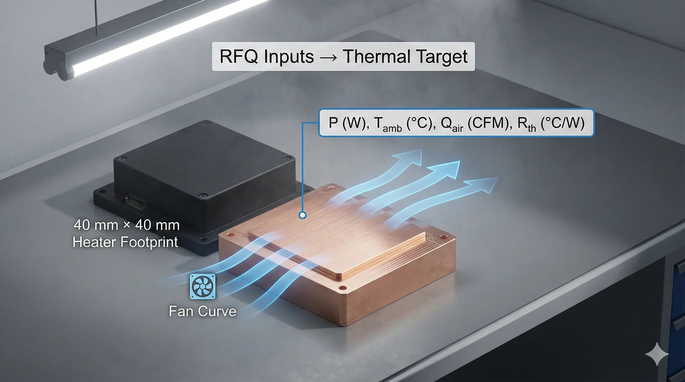
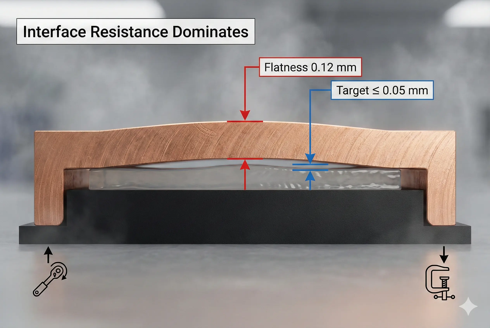
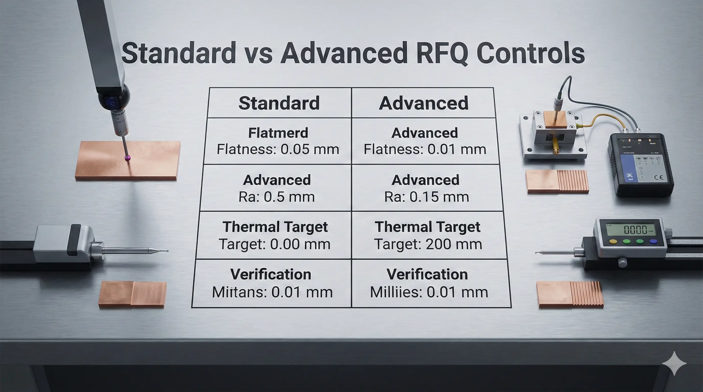

> **An RFQ specification for a custom copper heat sink is conditionally feasible for high-power electronics when the thermal target is defined as a measurable thermal resistance (°C/W) under a stated airflow or coolant condition. While copper offers high thermal conductivity (≈390–400 W/m·K for high-purity grades), engineering teams must account for interface flatness, oxide control, manufacturability limits, and verification methods to avoid expensive redesign loops.**

### RFQ Scope for Custom Copper Heat Sinks

We regularly see RFQs that say “copper heat sink, highest conductivity, smallest size,” but omit the two numbers that drive everything:**heat load (W)**and**allowable temperature rise (°C)**. In copper, the material is rarely the bottleneck; the bottleneck is typically**contact resistance at the interface**,**air-side convection**, or**coolant-side pressure drop**.

A usable RFQ frames the requirement as**system performance in a defined test condition**, not as a generic “best possible” part.

**Minimum RFQ scope (non-negotiable inputs):**

- Heat load at the sink base: **P = ___ W** (steady-state and transient duty cycle, e.g., 300 W continuous + 600 W for 10 s)
- Maximum base temperature or junction-to-ambient budget: **T_base,max = ___ °C** (or allowed ΔT)
- Boundary condition: **forced air** (CFM + fan curve) or **liquid** (flow rate + inlet temperature)
- Envelope constraints: **L × W × H = ___ mm** , keep-out zones, weight limit (g)
- Interface definition: **TIM type** , mounting torque (N·m), contact area (mm²)

### Thermal Requirement Definition for Copper Heat Sink Performance

A “custom copper heat sink” is a type of**thermal solution**where copper is used to move heat from a source to a larger convection surface. The RFQ must translate “cool enough” into a**thermal resistance target**under a known condition.

**Specify performance in one of these equivalent forms:**

- **R_th,base-to-ambient (°C/W)** at airflow **Q_air (CFM)** , ambient **T_amb (°C)**
- **ΔT_base (°C)** at **P (W)** with specified airflow/coolant
- For liquid cold plates: **R_th,base-to-fluid (°C/W)** at **flow (L/min)** and **ΔP (kPa)**

**Hard metric anchor (typical ranges):**

- High-density forced-air assemblies often land in **0.05–0.30 °C/W** depending on volume, fin geometry, and airflow.
- Liquid plates commonly target **0.01–0.10 °C/W** depending on microchannel scale, flow, and pumping power.

If the RFQ does not include at least one thermal resistance metric plus boundary conditions, suppliers will quote a geometry guess, and your first prototype becomes a thermal experiment.

### Copper Material Specification for Heat Sink Procurement

Copper is not a single material in practice; it is a family with conductivity and process constraints.

**Material callouts you can put directly into the RFQ:**

- **C101 (OFHC / high-purity copper)** : used when conductivity is prioritized; expect **k ≈ 390–400 W/m·K** depending on temper and verification method.
- **C110 (ETP copper)** : commonly available, good conductivity, often lower cost; specify minimum conductivity if critical.
- **CuCrZr** : used when you need higher strength at temperature or better stability; conductivity is lower than pure copper, so specify the trade explicitly.

**What to specify (and why):**

- **Minimum conductivity** (e.g., “≥ 360 W/m·K”) if performance is tight.
- **Temper / hardness** if you have machining stability or deformation concerns.
- **Traceability** : heat/lot, CoC, and (if applicable) RoHS/REACH declarations.

If you do not specify conductivity verification, you may receive a compliant “copper” that still misses the performance budget due to alloy selection or heat treatment.

### Geometry and Tolerance Definition for Copper Heat Sink Manufacturability

Copper’s high thermal conductivity does not compensate for poor**flatness**,**parallelism**, or**fin manufacturability**. Many failures we see are interface-driven.

**Critical drawing callouts (typical engineering defaults):**

- Base flatness: **≤ 0.05 mm** over the interface area for TIM-based mounting (tighter if direct-die or phase-change constraints exist)
- Surface roughness on interface: **Ra ≤ 1.6 µm** (Ra ≤ 0.8 µm if you are minimizing TIM thickness)
- Mounting hole position: **±0.05–0.10 mm** depending on assembly stack-up
- Overall dimensions: **±0.10–0.20 mm** unless downstream fit requires tighter

**Fin geometry constraints (forced-air):**

- Fin thickness below **0.5 mm** can be feasible but drives cost and yield risk (tooling, burr control, fin damage).
- Fin pitch below **1.0–1.5 mm** increases pressure drop; the RFQ should state allowable **ΔP** or fan curve.

**Microchannel constraints (liquid):**

- Channel hydraulic diameter below **0.5–1.0 mm** drives clogging sensitivity; specify filtration (e.g., **≤ 50–100 µm** ) and coolant cleanliness expectations.

### Manufacturing Process Selection for Custom Copper Heat Sinks

A copper heat sink is a type of**manufactured thermal hardware**, and the process determines both achievable geometry and cost.

**RFQ: require the supplier to declare the process and associated limits:**

- **CNC machining** : robust, good tolerances; limited fin density without specialized tooling.
- **Skiving** : high fin density in copper; good for forced-air; requires process capability on fin height/spacing.
- **Brazed assemblies** : enables complex stacks; introduces joint integrity as a reliability variable.
- **Additive manufacturing (AM)** : enables complex internal channels; introduces porosity, surface roughness, and QA overhead; verify with CT or pressure testing.
- **Extrusion** : economical for volume, but copper extrusion options can be constrained and geometry-limited.

In the RFQ, treat process choice as a controlled variable: ask for**two quotes**(standard vs advanced) with stated performance assumptions and risks.

### Interface and Assembly Requirements for Copper Heat Sink Integration

The interface is where copper projects often fail because the true thermal bottleneck becomes**contact resistance**.

**RFQ interface block (copy/paste):**

- Mounting method: screws / spring clips / clamp frame
- Target clamp load: **___ N** or torque **___ N·m**
- TIM: grease / pad / phase-change / solder / graphite, thickness **___ mm**
- Electrical isolation required: yes/no (if yes, specify dielectric withstand, e.g., **1–3 kV** , and allowable added thermal resistance)

**Mechanical reliability callouts:**

- Maximum mass for shock/vibration: **___ g** (e.g., < 300 g if board-mounted without secondary supports)
- Operating temperature: ****_ °C to _**°C**
- Thermal cycling: **___ cycles** from **T_low to T_high** (if field reliability is critical)

### Validation Method Requirements for Heat Sink Acceptance

If you do not define acceptance tests, the supplier will validate “to their method,” which may not match your boundary conditions.

**RFQ acceptance test requirements (choose what applies):**

- Thermal test: specify **heater footprint (mm²)** , **power (W)** , airflow/coolant conditions, sensor type (TC/RTD), and where temperature is measured.
- Pressure drop test (liquid or high-density air): report **ΔP (kPa)** vs **flow (L/min)** or airflow.
- Leak test (liquid): **pressure (bar)** , hold time (min), allowable leak rate.
- Surface inspection: base flatness and Ra measured with stated instruments and sampling plan.

### Execution Log from a 600 W Power Module Copper Heat Sink RFQ

**Client context (anonymized):**A power electronics team needed to cool a**600 W**module in a compact enclosure. The initial RFQ asked for “OFHC copper heat sink, max height 35 mm,” with no airflow data and no interface definition.

**The attempt:**We translated the requirement into a measurable target:**T_base ≤ 85 °C at T_amb = 35 °C**and obtained the system fan curve. We modeled a skived fin copper sink targeting**R_th,base-to-ambient ≈ 0.08–0.10 °C/W**at the available airflow.

**The friction (failure mode):**Prototype #1 met airflow constraints but missed temperature by**~10–12 °C**. The root cause was not copper conductivity; it was**interface flatness + clamp load variation**. The base flatness came in at**~0.12 mm**over the footprint, and clamp load scatter pushed TIM thickness higher than assumed.

**The resolution:**We tightened the RFQ to enforce:

- Base flatness **≤ 0.05 mm**
- Surface finish **Ra ≤ 0.8–1.6 µm**
- Specified clamp load and torque procedure

We also added a “standard vs advanced” quote: standard machining/skiving, and an advanced variant with a brazed spreader to reduce base temperature gradient.

**The “tax” paid:**

- Lead time increased by **~2–3 weeks** due to added metrology and rework controls
- Unit cost increased by **~15–30%** depending on sampling plan
- Incoming inspection expanded to include flatness and Ra verification

The project succeeded when the RFQ made the interface a first-class requirement rather than an assumption.

### Data Forensics Table for Copper Heat Sink RFQ Parameters

| Parameter | Standard Approach | Advanced Approach | The Trade-off |
| --- | --- | --- | --- |
| Thermal target | Specify ΔT at a single power point (e.g., 600 W) | Specify R_th (°C/W) vs airflow/flow curve | Advanced approach prevents “pass by luck,” increases test effort |
| Copper grade | C110 with generic CoC | C101 or CuCrZr with minimum k requirement | Higher purity/controlled alloy raises cost and availability risk |
| Base flatness | “Machine finish” | ≤ 0.05 mm flatness on interface | Tight flatness increases scrap/rework probability |
| Surface finish (interface) | Ra not specified | Ra ≤ 1.6 µm (or tighter) | Better finish improves interface resistance, increases machining time |
| Fin geometry | Conservative fin pitch | High-density fin pitch with stated ΔP/fan curve | Higher density can reduce °C/W but may starve airflow |
| Joining method | Monolithic | Brazed/spreader assembly with joint QA | Higher performance potential, adds joint reliability and inspection cost |
| Liquid channels (if applicable) | Macro channels | Microchannels with filtration requirement | Better performance, higher clogging sensitivity and pumping power |
| Verification | Supplier internal method | Defined test rig + acceptance criteria | Better comparability, more upfront engineering time |

*Test method: Thermal per a defined heater footprint and boundary condition; dimensional per CMM; roughness per contact profilometer; pressure drop per calibrated flow/ΔP instrumentation.*

> **Project Readiness Check**- Before committing, ask yourself (or your supplier):
>   - Do we have a measured **fan curve / airflow** (or coolant flow + inlet temperature) that will exist in the final enclosure, not on an open bench?
>     - Is the **interface** fully specified (flatness, Ra, clamp load, TIM type/thickness), or are we assuming “copper fixes it”?

### Feasibility Verdict for Custom Copper Heat Sinks

**Clearly Feasible**

- Go ahead if the RFQ includes **P (W)** , boundary conditions (airflow or flow), and a measurable target such as **R_th (°C/W)** or **T_base,max** .
- Go ahead if base flatness and interface controls are specified (e.g., **≤ 0.05 mm** , **Ra ≤ 1.6 µm** ) and acceptance tests are defined.

**Conditionally Feasible (High-Cost Route)**

- Possible, but expect higher cost/lead time if you require **very high fin density** , **microchannels** , **extreme flatness** (e.g., ≤ 0.02 mm), or **tight thermal margins** (< 5 °C headroom).
- The tax typically shows up as added inspection (CMM/roughness), lower yield, and more prototypes to converge.

**Structurally Mismatched**

- Not recommended when the real limitation is **air-side convection** (low airflow, high recirculation, clogged filters) and you are trying to “material upgrade” your way out.
- Not recommended when you cannot control mounting pressure or flatness, and the interface resistance dominates; consider **heat pipes/vapor chambers** , a different enclosure airflow strategy, or a **liquid cold plate** instead.

### FAQ on RFQ Specifications for Copper Heat Sinks

**What is the single most important number to include in a copper heat sink RFQ?**

A thermal resistance target (°C/W) or a base temperature limit (°C) at a defined heat load (W) and boundary condition (airflow/flow, ambient/inlet temperature). Without that, geometry quotes are guesses.

**Should we always specify OFHC (C101) copper for best performance?**

Only when the performance margin is tight enough that conductivity is a meaningful lever. Many designs are interface- or convection-limited; in those cases, flatness, surface finish, fin design, and airflow dominate the outcome more than moving from C110 to C101.

**How do we prevent “prototype passes on the bench but fails in the enclosure”?**

Lock the boundary condition in the RFQ: fan curve, system impedance, filter state, recirculation constraints, and measurement locations. Acceptance testing must mimic the enclosure, not open-air conditions.

**What inspection items should be on the receiving checklist?**

At minimum: material certification, base flatness, interface surface roughness, critical dimensions (hole locations, overall envelope), and (if liquid) pressure/leak tests at stated conditions.

**When does a liquid cold plate become the better RFQ path than a copper air-cooled heat sink?**

When airflow is constrained and the required °C/W is below what forced-air can achieve in the available volume, or when noise/power limits prevent higher airflow. In those cases, specify R_th and ΔP vs flow, plus filtration and coolant requirements.

---

> *Disclaimer: All scenarios described are based on real or closely analogous executed projects. If you choose to implement any of the examples described in this article, please conduct a careful evaluation first. This site assumes no responsibility for losses resulting from implementations made without prior evaluation.*
