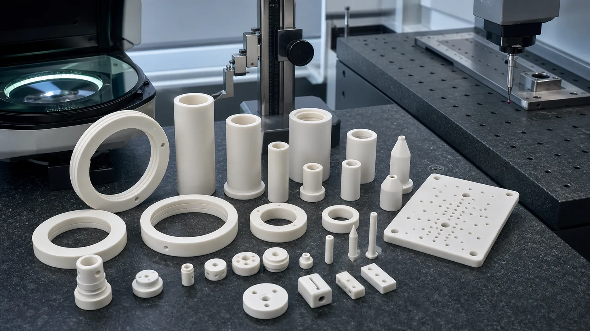
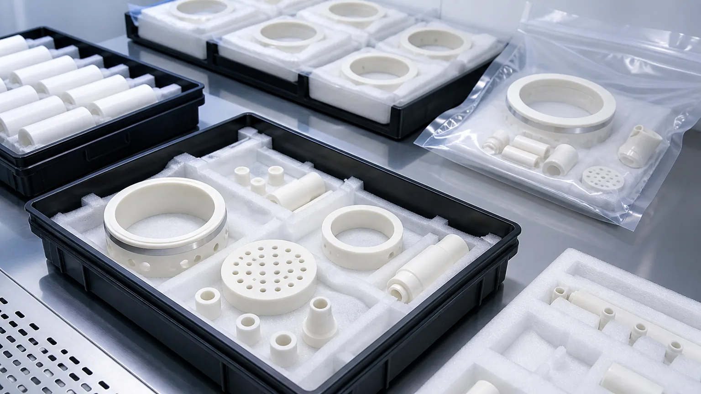

> Alumina ceramic parts for semiconductor processing equipment should be specified by function, grade, finished surfaces, edge quality, cleaning, packaging, and inspection evidence. A drawing that only says "alumina ceramic" is not enough for reliable quotation when the part sits near plasma, vacuum, gas flow, wafer handling, electrical insulation, or high-purity assembly.

Alumina, or aluminum oxide Al2O3, is one of the most common technical ceramics used around semiconductor manufacturing equipment. It is not always the highest-performing ceramic for every tool zone. Silicon carbide may be preferred for severe wear or process-side exposure, aluminum nitride may be preferred for high thermal conductivity, and specialty plasma-resistant ceramics may be required in some chamber environments. Alumina remains important because it offers a practical combination of electrical insulation, hardness, chemical stability, wear resistance, availability, and machinability by diamond grinding after firing.

This guide focuses on precision machined alumina ceramic parts used in semiconductor processing equipment: insulating rings, chamber-adjacent spacers, feedthrough sleeves, standoffs, nozzles, orifice inserts, gas distribution plates, support pins, fixture plates, metrology parts, clean automation hardware, and high-purity packaging-sensitive components. It complements the broader [precision ceramic components for semiconductor equipment guide](/posts/semiconductor-equipment/precision-ceramic-components-semiconductor-equipment/) and the focused pages for [ceramic insulators in plasma etching and deposition equipment](/posts/semiconductor-equipment/ceramic-insulators-plasma-etching-deposition-equipment/), [precision ceramic rings for process chambers](/posts/semiconductor-equipment/precision-ceramic-rings-semiconductor-process-chambers/), and [precision ceramic nozzles for semiconductor and vacuum equipment](/posts/semiconductor-equipment/precision-ceramic-nozzles-semiconductor-vacuum-equipment/).

### What This Guide Helps You Decide

Use this page when a semiconductor equipment RFQ includes an alumina part but the drawing does not yet make the manufacturing risk clear. The goal is to help engineering and sourcing teams decide:

- Whether alumina is the right ceramic family or whether AlN, SiC, silicon nitride, zirconia, or a specialty ceramic should be reviewed.
- Which surfaces are functional enough to justify diamond grinding, lapping, polishing, tight flatness, or special edge criteria.
- Which features should drive the quotation: bore quality, lapped annular bands, micro-hole cleanliness, matched spacer height, or protected packaging.
- Which acceptance evidence should be requested before production: CMM, optical inspection, flatness, Ra, microscopy, material certificate, first article report, or packaging photos.
- What information must be supplied before a responsible supplier can quote price, lead time, and feasibility.

That decision path is more useful for long-term search traffic than a generic "alumina ceramic part" article because it matches how semiconductor equipment buyers actually source custom ceramic components.

### Why Alumina Still Matters In Semiconductor Equipment

The semiconductor equipment supply chain keeps increasing pressure on clean, stable, insulating, and precisely machined components. [SEMI projected global 300mm fab equipment spending to rise 18% to $133 billion in 2026 and 14% to $151 billion in 2027](https://www.semi.org/en/semi-press-release/semi-projects-double-digit-growth-in-global-300mm-fab-equipment-spending-for-2026-and-2027), driven by AI chip demand, advanced manufacturing investment, and regional capacity expansion. That growth does not make every alumina part process-critical, but it increases the value of RFQ-ready ceramic component pages that speak the language of semiconductor equipment buyers.

The material choice is supported by mainstream ceramic suppliers. [Kyocera describes alumina](https://global.kyocera.com/prdct/fc/material-property/material/alumina/index.html) as a widely used fine ceramic with high electrical insulation and mechanical strength, and lists semiconductor-relevant product examples such as ceramic wafer boats, polishing plates, handling arms, electrostatic chucks, vacuum chucks, domes, chambers, and feedthrough-related components. Kyocera also describes ceramic vacuum chucks as high-precision parts with surface profiles and patterns used for wafer holding and transport. [CoorsTek describes alumina](https://www.coorstek.com/en/materials/alumina/) as a broad technical ceramic family with grade choices from general industrial alumina to higher-purity alumina, including semiconductor examples such as chamber domes, windows, lids, liners, nozzles, insulators, sleeves, plates, tubes, and cylinders.

The useful engineering step is to translate an alumina semiconductor component into RFQ-ready machining details: grade, blank route, surface finish, bore quality, lapped faces, edge-chip criteria, cleaning, packaging, and inspection evidence.

### RFQ Decision Map For Alumina Semiconductor Parts

The most reviewable inquiries usually include one of four signals: semiconductor equipment location, precision feature, acceptance requirement, or supply-chain replacement need.

| Component requirement                              | What the buyer is usually trying to solve                            | Information needed for engineering review                                |
| -------------------------------------------------- | -------------------------------------------------------------------- | ------------------------------------------------------------------------ |
| Alumina ceramic insulator for plasma equipment     | Electrical isolation with particle-sensitive or chamber-adjacent use | Link to insulation, edge quality, cleaning, and RFQ review requirements  |
| Alumina feedthrough sleeve or insulating tube      | Bore fit, wall thickness, dielectric spacing, and vacuum assembly    | Ask for conductor size, sealing surface, bore tolerance, and inspection  |
| Alumina gas plate, nozzle, or orifice insert       | Controlled gas flow, purge, blockage risk, and outlet edge quality   | Link to micro-hole, nozzle, bore inspection, and cleaning requirements   |
| Alumina spacer, ring, or support pin set           | Stack height, matched sets, flatness, and repeat lot consistency     | Ask for matched height groups, lapped bands, edge criteria, and reports  |
| Alumina replacement part for semiconductor tooling | Qualified geometry must be repeated without drawing ambiguity        | Ask for revision, sample history, material grade, and acceptance records |

This is also why the page should link outward to feature-specific guides instead of trying to answer every ceramic machining issue in one article. A buyer with a micro-hole plate needs the [ceramic micro-hole machining RFQ guide](/posts/micro-hole-machining/ceramic-micro-hole-machining-rfq/). A buyer with a precision spacer or sleeve needs the [thin-wall ceramic sleeve machining guide](/posts/thin-wall-sleeves/ceramic-thin-wall-sleeve-bore-concentricity-rfq/). A buyer with lapped contact bands needs the [ceramic lapped seal faces guide](/posts/lapped-seal-faces/ceramic-lapped-seal-faces-rfq/).

### Common Alumina Component Families

Alumina ceramic components appear in semiconductor equipment where insulation, cleanliness, stable geometry, and wear resistance matter. The same material can serve different jobs, so the RFQ must explain the functional interface.

| Alumina component family                       | Semiconductor equipment role                                             | RFQ risk to define before quotation                                      |
| ---------------------------------------------- | ------------------------------------------------------------------------ | ------------------------------------------------------------------------ |
| Insulating rings and spacer rings              | Electrical isolation, chamber spacing, electrode-adjacent hardware       | ID/OD control, flatness, lapped bands, edge chips, creepage path         |
| Feedthrough sleeves and insulating tubes       | Electrical isolation around conductors, vacuum or chamber-adjacent zones | Bore straightness, wall thickness, sealing interface, cleaning boundary  |
| Alumina nozzles and orifice inserts            | Gas purge, dispensing, vacuum, flow restriction, process support         | Bore diameter, outlet edge, taper, blockage, microscope inspection       |
| Gas plates, baffles, and micro-hole plates     | Gas distribution, purge control, fixture or tool-side flow management    | Hole pitch, breakout, flatness, blind features, cleaning of small holes  |
| Standoffs, spacers, and support pins           | Stack height, fixture spacing, insulation, clean automation              | Parallelism, end-face finish, chip criteria, matched height groups       |
| Alumina plates and fixture blocks              | Metrology support, clean fixtures, inspection hardware, tool support     | Datum strategy, hole position, CMM access, flatness, protected packaging |
| Polishing, CMP, or wear-adjacent ceramic parts | Wear-resistant contact, support, dressing or tool-side hardware          | Surface finish, flatness, wear surface, cleaning, lot repeatability      |
| Clean handling and assembly support components | Holders, guides, guides plates, sensor or inspection supports            | Edge condition, contact zones, particle-sensitive surfaces, packaging    |

If the drawing only calls out "99.5% alumina" without explaining whether the part is an insulator, seal land, gas plate, spacer, fixture, or wafer-adjacent support, the supplier cannot reliably judge which surfaces deserve precision finishing.

### When Alumina Is A Good Choice

Alumina is usually a strong candidate when the part needs electrical insulation, moderate-to-high wear resistance, dimensional stability, practical cost control, and good availability. It is often considered for:

- Insulating rings, spacers, and sleeves near semiconductor process equipment.
- Ceramic nozzles, purge inserts, and gas-flow components where Al2O3 is compatible with the process environment.
- Clean fixture plates, datum blocks, and support parts that need stable geometry and low wear.
- Feedthrough-adjacent components where insulation and ceramic-to-metal assembly constraints matter.
- Metrology, inspection, and clean automation hardware around semiconductor tools.
- Replacement parts where an existing alumina grade and geometry are already qualified.

Alumina is not automatically the best material for every semiconductor zone. Use [AlN ceramic parts for semiconductor thermal management](/posts/semiconductor-equipment/aluminum-nitride-ceramic-parts-semiconductor-thermal-management/) when thermal conductivity is the main driver. Use [silicon carbide wafer handling components](/posts/semiconductor-equipment/silicon-carbide-wafer-handling-components-semiconductor-manufacturing/) when stiffness, wear, and contact-edge behavior dominate. Use the [ceramic material selection guide](/posts/materials-grade-selection/ceramic-material-selection-cnc-machining/) when the failure mode is still unclear.

### When Alumina Should Be Challenged

Alumina is popular, available, and often cost-effective, but a professional RFQ review should challenge it when the environment or function points elsewhere.

| If the main risk is...                                    | Review this before locking alumina                                    |
| --------------------------------------------------------- | --------------------------------------------------------------------- |
| High thermal conductivity or heater-adjacent spreading    | Aluminum nitride or another thermal ceramic may be more appropriate   |
| Severe sliding wear, wafer-contact stiffness, or abrasion | Silicon carbide or silicon nitride may deserve comparison             |
| Plasma chemistry beyond ordinary alumina capability       | A specialty high-purity or coated material may be required by the OEM |
| High fracture toughness under mechanical impact           | Zirconia or silicon nitride may need to be reviewed                   |
| Prototype speed with conventional machining               | MACOR or machinable ceramics may help early validation, not final use |
| Qualified legacy material already exists                  | Do not substitute without customer approval and test evidence         |

The RFQ should state whether material substitution is allowed. If a drawing is already qualified in a semiconductor tool, the supplier should not quietly change grade, blank route, surface finish, cleaning, or packaging simply to reduce cost.

### Alumina Grade And Purity Should Be Specified

"Alumina" is a material family, not a complete RFQ. Grade affects color, density, grain size, strength, finishability, dielectric behavior, corrosion resistance, wear resistance, cost, and availability. Semiconductor-adjacent parts often require higher-purity or application-specific grades, but over-specifying purity without defining function can raise cost without reducing the real risk.

| RFQ choice                      | When it matters                                                         | What to send                                                       |
| ------------------------------- | ----------------------------------------------------------------------- | ------------------------------------------------------------------ |
| Alumina purity or grade         | Existing qualified part, semiconductor chamber-adjacent use, insulation | Exact grade, purity, material standard, approved equivalent policy |
| Fired state and blank route     | Precision grinding allowance, yield, flatness, surface condition        | Sintered blank, pressed blank, tube, rod, plate, customer blank    |
| Dense vs porous or special form | Vacuum, gas flow, support, chuck-adjacent or fixture applications       | Whether porosity is allowed, controlled, or prohibited             |
| Surface finish by face          | Lapped bands, seal faces, sliding fits, gas exposure, clean contact     | Ra target per functional face, not one global note                 |
| Edge-chip criteria              | Particle-sensitive zones, bores, micro-holes, wafer-adjacent handling   | Maximum chip size by zone, visual standard, microscopy expectation |
| Cleaning and packaging          | Cleanroom receiving, lapped faces, micro-holes, high-purity assembly    | Cleaning scope, separators, individual bags, tray orientation      |
| Inspection evidence             | First article approval, repeat lot control, incoming QA                 | CMM report, flatness, Ra, microscopy, bore report, material CoC    |

For a quotation, include the drawing revision, STEP file, target quantity, prototype or production stage, material grade, functional surfaces, cleaning expectation, and inspection method. The [custom ceramic CNC machining RFQ checklist](/posts/rfq-preparation/custom-ceramic-cnc-machining-rfq-checklist/) is the best internal template when the buyer has not prepared a full package yet.

### Machining Features That Drive Cost And Risk

Fired alumina is hard and brittle. Precision semiconductor parts usually require diamond grinding, lapping, polishing, or controlled abrasive finishing after sintering. Cost and risk rise when the drawing combines tight tolerances with difficult geometry, small features, and clean packaging requirements.

High-risk features include:

- Thin-wall insulating sleeves with tight ID/OD control.
- Alumina rings with lapped annular bands and tight flatness.
- Small nozzles, orifice inserts, and micro-bores with outlet edge requirements.
- Gas plates with many holes, blind features, or cleaning-sensitive cavities.
- Long slots, internal corners, narrow ribs, and unsupported thin sections.
- Tight perpendicularity or parallelism across multiple faces without stable datums.
- Large flat plates with flatness, thickness, and hole-position requirements.
- Feedthrough-related bores where sealing, insulation, and cleaning all matter.
- Edge-chip limits on airflow, plasma-adjacent, or particle-sensitive surfaces.

Inspection should follow the functional risk: lapped bands, bores, micro-holes, outlet edges, matched heights, flatness, and packaging-sensitive contact zones should receive more attention than non-functional outside faces.

If the part includes micro-holes, use the [ceramic micro-hole machining RFQ guide](/posts/micro-hole-machining/ceramic-micro-hole-machining-rfq/). If the part is a sleeve, use the [thin-wall ceramic sleeve machining guide](/posts/thin-wall-sleeves/ceramic-thin-wall-sleeve-bore-concentricity-rfq/). If the part has a lapped seal or annular contact face, use the [ceramic lapped seal faces guide](/posts/lapped-seal-faces/ceramic-lapped-seal-faces-rfq/). For tolerance planning, use the [ceramic tolerance capability map](/posts/tolerances-gdt/ceramic-tolerance-capability-map-by-feature-process/).

### Cost Drivers That Buyers Should Not Hide

For semiconductor equipment alumina parts, quote variance is usually caused by risk that is missing from the drawing. The most common cost drivers are:

- **Blank route and allowance:** oversized fired blanks, near-net sintered forms, tube stock, plate stock, and customer-supplied blanks create different grinding risk.
- **Functional face count:** one lapped annular band is different from all faces marked as precision surfaces.
- **Datum strategy:** unclear datums can force conservative inspection assumptions or rework.
- **Small feature density:** many micro-holes, blind holes, slots, and bore intersections add cleaning and edge-control risk.
- **Matched set requirements:** spacer sets, pin sets, and ring sets may need grouping, traceability, and additional inspection.
- **Edge-chip criteria:** particle-sensitive semiconductor parts need zone-specific visual criteria, not a vague "no chips" note.
- **Clean packaging:** trays, separators, individual bags, and protected lapped faces should be quoted as part of the supply scope.
- **Report package:** CMM, flatness, Ra, microscopy, material certificate, and first article reports can change both cost and lead time.

This is why CERAMIC CNC's RFQ path asks for drawings, material grade, quantity, target timing, functional surfaces, cleaning expectations, and acceptance evidence before confirming feasibility, price, or schedule.

### Cleaning And Packaging Are Part Of The Alumina RFQ

Semiconductor processing equipment parts should not be treated like ordinary industrial ceramic blocks after machining. Alumina components may pass dimensional inspection but still create receiving problems if lapped faces touch each other, bore edges chip during shipment, micro-holes trap residue, or loose packaging creates particles.

Define:

- Which faces must not touch tray walls or other parts.
- Whether rings need separators to protect lapped annular bands.
- Whether sleeves need bore protection or fixed orientation.
- Whether nozzles and micro-hole plates need blockage inspection before packaging.
- Whether standard industrial cleaning is enough or the customer owns final cleanroom cleaning.
- Whether the parts require individual bags, separated pockets, lot labels outside inner packaging, material certificates, or inspection reports.
- Whether final particle, outgassing, leak, flow, chemical compatibility, or plasma validation belongs to the customer qualification plan.

For broader high-purity handling requirements, use the [cleanroom and high-purity ceramic components guide](/posts/high-purity-cleanroom/precision-ceramic-components-cleanroom-high-purity-manufacturing-systems/). For plasma chamber-adjacent alumina insulation, use the [ceramic insulators for plasma etch and deposition guide](/posts/semiconductor-equipment/ceramic-insulators-plasma-etching-deposition-equipment/).

### Inspection Evidence For Alumina Semiconductor Components

Inspection should prove the functional risk, not just the easiest dimensions.

| Requirement                    | Useful evidence                                                         | Why it matters                                                  |
| ------------------------------ | ----------------------------------------------------------------------- | --------------------------------------------------------------- |
| Ring flatness and annular band | Flatness map, lapping note, surface plate method, Ra by face            | Controls contact, sealing, spacing, and assembly stability      |
| ID/OD and bore relationships   | CMM, bore gauge, roundness, concentricity, cylindricity                 | Controls fit, feedthrough alignment, leakage, and assembly load |
| Micro-holes and orifices       | Optical inspection, microscope image, pin gauge, flow-test boundary     | Controls gas flow, purge, blockage, and edge quality            |
| Spacer height and parallelism  | Height report, parallelism, matched set record                          | Controls stack-up, insulation spacing, and repeatability        |
| Edge quality                   | Zone-specific chip criteria, microscopy, sample photos, visual standard | Reduces particles, crack origins, and handling damage           |
| Surface finish                 | Ra report, lapping or polishing note, face-specific finish requirement  | Prevents over-specification and protects functional surfaces    |
| Cleaning and packaging         | Cleaning note, tray layout, separator logic, individual bagging         | Reduces receiving risk before customer final qualification      |
| Material and lot traceability  | Material certificate, CoC, grade record, revision and lot history       | Supports qualification, repeat procurement, and audits          |

The inspection plan should be agreed before production. If the customer needs a specific report format, sampling plan, measurement method, or first article package, state that in the RFQ. A supplier can quote geometry and inspection evidence, but final process tool qualification usually depends on customer-side testing.

### Supplier Capability Questions Before You Send A Production RFQ

Before placing a repeat or production RFQ for alumina semiconductor equipment parts, ask questions that reveal manufacturing discipline instead of generic catalog capability:

1. Which alumina grades can be sourced or machined repeatedly, and are approved equivalents allowed?
2. Will the part be machined after firing by diamond grinding, lapping, polishing, or another controlled finishing route?
3. Which features will be inspected by CMM, optical measurement, bore gauge, surface finish tester, flatness method, or microscope?
4. Can functional faces be separated from non-functional faces in the quotation?
5. How will lapped faces, bore edges, small holes, and particle-sensitive features be protected after machining?
6. What report package is included by default, and what must be quoted separately?
7. Can prototype findings be locked into a repeatable production revision before the next lot?
8. If the drawing is incomplete, will the supplier ask focused engineering questions before quoting?

These questions filter out low-value replies and help the buyer receive a technical quotation instead of a simple price for "white ceramic parts."

### Common RFQ Mistakes

Avoid these mistakes when sourcing alumina ceramic parts for semiconductor processing equipment:

1. Calling out "alumina ceramic" without grade, purity, density, or equivalent policy.
2. Marking every surface as critical instead of ranking functional faces.
3. Specifying a global Ra when only one annular band or bore needs special finish.
4. Leaving bore chips, micro-hole breakout, and outlet edge quality undefined.
5. Treating cleaning and packaging as shipping details rather than acceptance inputs.
6. Asking the machining supplier to guarantee final process performance without a test method.
7. Using alumina where AlN, SiC, silicon nitride, or a coated specialty ceramic should be reviewed.
8. Ignoring blank form, fired state, and grinding allowance.
9. Over-tightening non-functional outside faces while under-specifying seal, datum, and insulation surfaces.
10. Quoting a repeat production part from a drawing that does not match the previously qualified revision.

The [ceramic CNC machining design rules guide](/posts/design-rules-dfm/ceramic-cnc-machining-design-rules-advanced-ceramic-parts/) helps prevent these issues before the drawing is released.

### Practical RFQ Package

For alumina semiconductor processing equipment parts, send:

- 2D drawing with revision and STEP or native CAD file.
- Alumina grade, purity, density, certificate requirement, and approved equivalent policy.
- Application location: etch, deposition, vacuum, gas handling, feedthrough, wafer support, inspection, clean automation, or general tool fixture.
- Functional surfaces: lapped bands, bore fits, datum faces, thermal or electrical interfaces, gas holes, seal lands, and particle-sensitive edges.
- Tolerance priorities: flatness, parallelism, ID/OD, concentricity, roundness, hole position, Ra, and edge criteria.
- Cleaning and packaging: protected faces, separated trays, individual bags, tray orientation, final clean responsibility.
- Inspection evidence: CMM, optical, flatness, Ra, microscopy, bore report, material certificate, CoC, or first article report.
- Quantity, prototype or production status, target schedule, and qualification constraints.

If the buyer does not yet know how to classify the part, start from the [custom ceramic CNC machining RFQ checklist](/posts/rfq-preparation/custom-ceramic-cnc-machining-rfq-checklist/), then use this alumina semiconductor page to refine grade, functional surfaces, and clean packaging. If the drawing is still early, use the [ceramic CNC machining design rules guide](/posts/design-rules-dfm/ceramic-cnc-machining-design-rules-advanced-ceramic-parts/) before freezing tiny holes, thin walls, sharp internal corners, or over-tight tolerances.

### Practical Takeaway

Alumina ceramic parts remain a high-value semiconductor equipment sourcing category because they combine insulation, wear resistance, chemical stability, availability, and practical precision machining routes. But the material name alone does not create a manufacturable RFQ.

The best RFQ defines the alumina grade, fired blank route, functional surfaces, lapped or ground faces, small-feature requirements, edge-chip criteria, cleaning, packaging, inspection evidence, and customer qualification boundary. That allows the part to be reviewed as a semiconductor equipment component instead of a generic white ceramic shape, and it gives the buyer a better chance of receiving a useful technical response on the first inquiry.

### FAQ

**Is alumina suitable for semiconductor processing equipment?**  
Often yes, especially for insulating rings, spacers, sleeves, nozzles, fixture parts, and clean support hardware. Suitability still depends on the exact process environment, grade, surfaces, cleaning, and qualification requirements.

**What alumina purity should be used?**  
There is no universal purity. General industrial alumina may be enough for some fixtures, while higher-purity alumina may be needed for cleaner, hotter, more wear-sensitive, or semiconductor-adjacent environments. Send the grade requirement or the operating environment for review.

**Can alumina replace AlN or SiC in semiconductor tools?**  
Sometimes, but not by default. AlN is usually reviewed when thermal conductivity matters, while SiC is often reviewed for severe wear, stiffness, or process-side exposure. Alumina is strongest when insulation, stability, availability, and cost-performance are central.

**What makes an alumina semiconductor RFQ higher quality?**  
A high-quality RFQ identifies the tool zone, alumina grade, fired blank route, functional faces, edge-chip criteria, cleaning scope, packaging scope, and required inspection evidence. It should also explain whether the part is a prototype, replacement item, or repeat production component.

**What is the most important drawing note?**  
Mark the functional surfaces first: lapped bands, bores, datum faces, gas holes, insulation paths, seal lands, and particle-sensitive edges. Then define cleaning, packaging, and inspection evidence.

**Can the supplier guarantee final semiconductor process performance?**  
The machining supplier can quote geometry, surface condition, edge quality, cleaning notes, packaging, and inspection evidence. Final process qualification, particle testing, leak testing, plasma behavior, or tool-level performance usually requires customer-defined validation.
