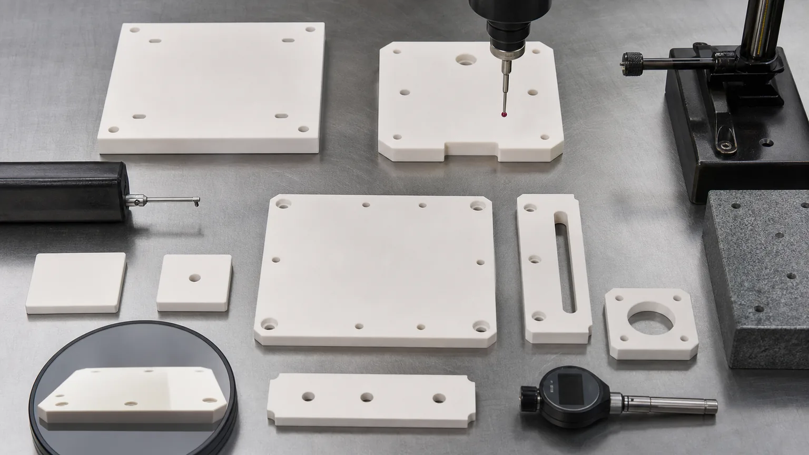
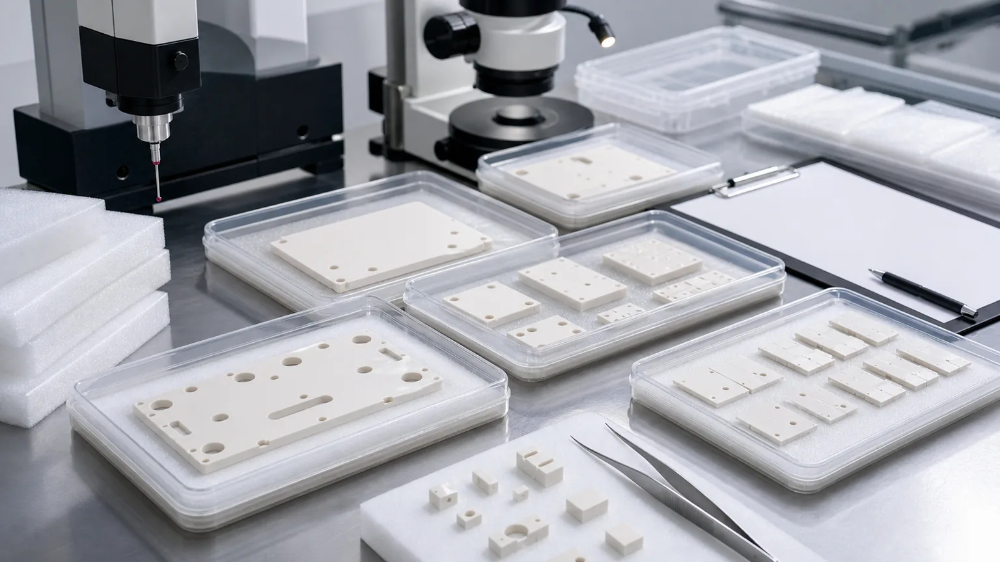

> Aluminum nitride ceramic parts used for semiconductor thermal management should be reviewed as engineered interfaces, not generic ceramic plates. The value of AlN is created only when the drawing, finished faces, flatness, thickness control, surface finish, clean handling, and inspection evidence match the heat path and electrical isolation requirement.

Semiconductor equipment is adding more thermal, cleanliness, and precision pressure to ceramic components. AI accelerators, high-density logic, advanced packaging, 300mm capacity expansion, wafer inspection, etch, deposition, and thermal process tools all depend on stable hardware around the wafer and process module. Some of those parts are silicon carbide or alumina. Some are quartz or fused silica. When the component must move heat while maintaining electrical insulation, aluminum nitride, often written as AlN, becomes an important material direction.

This article is a precision machining case guide for AlN ceramic semiconductor thermal management components. It is not a duplicate of the broader [aluminum nitride ceramic machining guide](/posts/industrial-ceramic-machining/aluminum-nitride-ceramic-machining-thermal-management-components/). That page explains AlN as a general industrial thermal-management material. This page focuses on semiconductor-adjacent use: heater-adjacent plates, insulating thermal spacers, ceramic carriers, heat spreaders, sensor supports, power-module-adjacent fixtures, and clean precision plates where flatness, Ra, edge quality, cleaning, and packaging can decide acceptance.

For a wider map of semiconductor ceramic components, start with the [precision ceramic components for semiconductor equipment guide](/posts/semiconductor-equipment/precision-ceramic-components-semiconductor-equipment/). For plasma and deposition tool insulation paths, use the [ceramic insulators for plasma etch and deposition guide](/posts/semiconductor-equipment/ceramic-insulators-plasma-etching-deposition-equipment/). For vacuum support and wafer holding surfaces, use the [machined ceramic vacuum chuck components guide](/posts/semiconductor-equipment/machined-ceramic-vacuum-chuck-components-semiconductor-tools/).

### Why AlN Semiconductor Thermal Management Is A High-Value Topic Now

The industry signal is durable enough for long-term SEO, not only a short news cycle. [SEMI reported](https://www.semi.org/en/semi-press-release/semi-projects-double-digit-growth-in-global-300mm-fab-equipment-spending-for-2026-and-2027) expected worldwide 300mm fab equipment spending growth for 2026 and 2027, with AI chip demand identified as a key driver. More fab equipment spending means more wafer handling, vacuum, etch, deposition, thermal, metrology, inspection, and advanced packaging hardware.

Technical ceramic suppliers also show why this search intent is real. [Kyocera lists electrostatic chucks](https://global.kyocera.com/prdct/fc/industries/products/008.html) for wafer holding, flatness correction, and cooling in semiconductor manufacturing. Kyocera's semiconductor catalog includes ceramic heaters, vacuum chucks, nozzles, end effectors, plasma rings, and inspection equipment components. [CoorsTek describes ceramic wafer handling and processing components](https://www.coorstek.com/jp/eng/products/detail/detail_04.html) used in semiconductor equipment environments.

For a precision ceramic machining website, this is a stronger topic than a generic phrase like "ceramic parts." Buyers searching for AlN semiconductor thermal plates, aluminum nitride heat spreaders, heater-adjacent ceramic spacers, or AlN insulating thermal components often already have a drawing problem, qualification path, or RFQ package. They need material and machining logic, not marketing language.

### What Counts As An AlN Semiconductor Thermal Management Part

AlN is usually considered where heat transfer and electrical insulation must be solved together. In semiconductor equipment, that can mean process-tool thermal hardware, clean test fixtures, power electronics inside tool subsystems, heater-adjacent support plates, sensor mounts, insulating thermal spacers, or precision ceramic carriers.

| AlN part family                          | Semiconductor-adjacent role                                              | RFQ issue that changes the quote                                                |
| ---------------------------------------- | ------------------------------------------------------------------------ | ------------------------------------------------------------------------------- |
| Heat spreader or thermal plate           | Spreads heat while maintaining electrical isolation                      | Thermal-interface flatness, thickness, Ra, hole position, and protected packing |
| Heater-adjacent insulating plate         | Separates heated, grounded, powered, or cooled assemblies                | Temperature cycling, clamp pattern, face finish, and dielectric path            |
| Ceramic carrier or support plate         | Holds sensor, module, package, wafer-adjacent, or fixture hardware       | Datum scheme, pocket geometry, mounting holes, edge quality, and clean handling |
| Thermal spacer or standoff set           | Controls stack height while reducing electrical path risk                | Matched height, parallelism, bore chamfer, chip criteria, and lot consistency   |
| Sensor, RF, laser, or inspection mount   | Holds a device where thermal stability and insulation affect performance | Mounting datum, flatness, surface finish, bore location, and assembly stress    |
| Power-module-adjacent ceramic fixture    | Supports high-density power conversion inside semiconductor tool systems | Voltage path, thermal-interface material, clamp load, and inspection evidence   |
| Vacuum-side or clean manufacturing plate | Provides stable ceramic interface near vacuum or clean process equipment | Cleaning method, particle-sensitive edges, face protection, and documentation   |

Two parts can both be called "AlN ceramic plates" and still require different manufacturing routes. A simple insulating spacer, a lapped heat spreader, a slotted heater-adjacent plate, and a pocketed ceramic carrier are not the same RFQ.

The useful RFQ question is not "Can you machine aluminum nitride?" The better question is:

**Which faces transfer heat, which faces insulate, which edges are particle-sensitive, which holes or pockets control assembly, and what inspection evidence proves the part can enter the tool build?**

### Why AlN Is Different From A Normal Ceramic Plate

Aluminum nitride is valued because it can combine thermal conductivity and electrical insulation in one ceramic material direction. That does not make the finished part easy. Fired AlN is hard and brittle. It may require diamond grinding, abrasive machining, drilling, lapping, polishing, edge finishing, cleaning, and careful packaging depending on the drawing.

AlN also should not be selected only because the phrase "high thermal conductivity" appears in a datasheet. Thermal performance depends on the full interface:

- Which face touches the heat source, cold plate, heater, module, or fixture.
- Whether the part is free-state, clamped, bonded, greased, metallized, or compressed.
- Whether flatness is controlled across the whole face or only selected pads.
- Whether surface finish supports contact, bonding, or cleanliness.
- Whether holes, pockets, and slots reduce contact area or create stress.
- Whether packaging protects the lapped face before assembly.

For many designs, [precision machined alumina](/posts/industrial-ceramic-machining/precision-machined-alumina-ceramic-parts-industrial-applications/) remains a practical insulation material. For harsh process-side exposure, [silicon carbide ceramic machining](/posts/industrial-ceramic-machining/silicon-carbide-ceramic-machining-harsh-environment-applications/) may be a stronger direction. For structural thermal shock and wear, [silicon nitride ceramic machining](/posts/industrial-ceramic-machining/silicon-nitride-ceramic-machining-structural-wear-parts/) may need review. AlN earns its place when the assembly needs heat transfer and electrical isolation at the same interface.

### Thermal-Interface Flatness, Ra, And Thickness Control

Most AlN semiconductor thermal-management RFQs become serious when a thermal-interface face appears on the drawing. A heat path can be limited by interface contact long before it is limited by the bulk material.

Define the thermal interface in the drawing package:

- Primary thermal-contact face or local contact pads.
- Opposite face and whether parallelism is required.
- Thickness tolerance and stack-height impact.
- Flatness value and measurement condition.
- Surface finish only where it affects thermal contact, bonding, metallization, sealing, or cleanability.
- Allowable edge break around the contact zone.
- Mating material: metal, ceramic, graphite, thermal pad, grease, adhesive, metallized layer, or customer assembly.
- Clamp force, screw pattern, support condition, or bonded condition if known.

The [ceramic tolerance capability map](/posts/tolerances-gdt/ceramic-tolerance-capability-map-by-feature-process/) is useful here because global tolerance language can overprice the wrong surfaces. The [surface finish and subsurface damage guide](/posts/surface-finish-functional/ceramic-ssd-surface-finish-specify-control-price/) helps separate ground, lapped, polished, and non-functional faces.

### Machining Route For Precision AlN Thermal Components

A practical machining route depends on grade, blank condition, geometry, finished faces, and inspection scope. The review is usually built around finished surfaces first, then features.

Typical process considerations include:

1. Select an AlN blank form that avoids unnecessary fired-material removal.
2. Establish stable datums before precision grinding or hole location work.
3. Grind or lap thermal-interface faces only where the function requires it.
4. Machine holes, slots, pockets, and counterbores with edge breakout in mind.
5. Control chamfers and small radii around handling and particle-sensitive zones.
6. Clean and protect lapped faces, holes, and thin edges before final packing.
7. Match the inspection packet to the actual functional risk.

The [ceramic CNC machining design rules guide](/posts/design-rules-dfm/ceramic-cnc-machining-design-rules-advanced-ceramic-parts/) should be used before releasing metal-style AlN drawings. Sharp internal corners, deep narrow pockets, thin unsupported tabs, very small hole-to-edge distances, and blanket low Ra requirements are common cost and yield triggers.

### Holes, Slots, Pockets, And Edge Quality

Semiconductor thermal-management plates often include mounting holes, sensor holes, vacuum relief slots, locator pockets, counterbores, clamp features, and clearance windows. These details make the part useful in the assembly, but they also create brittle-machining risk.

Good RFQ inputs include:

- Hole diameter, depth, position, and whether the hole is through, blind, or counterbored.
- Distance from holes to edges, slots, pockets, lapped bands, and thin webs.
- Minimum internal radius for pockets and reliefs.
- Slot width, length, end radius, and cleaning access.
- Whether hole exits are particle-sensitive or hidden inside assembly.
- Chamfer or radius requirement by feature zone.
- Whether cosmetic chips are acceptable on non-contact clearance edges.
- Whether optical, CMM, pin gauge, or visual inspection is required.

Avoid vague notes such as "no chips" unless the drawing defines where, how large, and how it will be inspected. A particle-sensitive edge near a wafer, vacuum channel, thermal-contact face, or dielectric path is different from a clearance corner on the back side.

For dense holes or small features, the [ceramic micro-hole machining RFQ guide](/posts/micro-hole-machining/ceramic-micro-hole-machining-rfq/) is the right supporting page. For thin plates or sleeve-like spacers, the [thin-wall ceramic sleeve machining guide](/posts/thin-wall-sleeves/ceramic-thin-wall-sleeve-bore-concentricity-rfq/) helps clarify wall stability, concentricity, and edge risk.

### Semiconductor Clean Handling And Packaging

Clean handling is part of the deliverable for semiconductor-adjacent AlN parts. A lapped AlN thermal plate can pass dimensionally and still fail incoming review if it arrives with rubbed faces, chipped edges, trapped dust in small holes, or packaging contact marks on a functional surface.

Discuss these requirements before quoting:

- Whether the part is process-side, vacuum-side, clean fixture-side, or general equipment-side.
- Whether the buyer needs cleaning notes, bagging, separated trays, or non-contact face protection.
- Which faces must not be touched, rubbed, or stacked.
- Whether holes, slots, pockets, and counterbores require blockage review.
- Whether visual inspection should be performed under defined magnification.
- Whether material certificate, lot traceability, or certificate of conformity is required.

For plasma or deposition environments, the [ceramic plasma etch and deposition insulator guide](/posts/semiconductor-equipment/ceramic-insulators-plasma-etching-deposition-equipment/) covers dielectric paths, chamber-adjacent surfaces, thermal cycling, cleaning, and protected packaging in more detail.

### Inspection Evidence For AlN Semiconductor Thermal Parts

Inspection should prove the function, not create paperwork for every non-critical face. A useful inspection plan connects the drawing requirement to a measurement method and report format.

| Functional requirement         | Evidence to discuss                                                   | Why it matters                                                        |
| ------------------------------ | --------------------------------------------------------------------- | --------------------------------------------------------------------- |
| Thermal-interface flatness     | CMM, optical method, flatness map, or agreed surface plate method     | Controls real contact, thermal transfer, and assembly stress          |
| Thickness and parallelism      | Micrometer, height gauge, CMM, or thickness map                       | Controls stack height, clamp force, and interface pressure            |
| Surface finish on contact face | Ra reading, lapping note, or agreed finish method                     | Supports contact, bonding, metallization, sealing, or cleanability    |
| Hole and slot geometry         | CMM, optical measurement, pin gauge, microscope, or sampling plan     | Controls mounting, alignment, cleaning, and edge breakout risk        |
| Edge quality                   | Visual criterion by zone, microscopy, chip limit, and sample evidence | Reduces particle risk, crack origins, and handling failures           |
| Clean packaging                | Tray method, separators, cleaning note, and face-protection method    | Protects lapped faces, thin edges, and precision features             |
| Material and lot identity      | Material certificate, grade confirmation, lot record, or CoC          | Supports qualification, repeat orders, and incoming quality paperwork |

If the final thermal test, electrical test, vacuum test, plasma exposure review, or tool-level qualification is performed by the customer, state that clearly. The machining supplier can then focus on geometry, surface condition, cleaning, packaging, and inspection evidence before that final test.

### Cost Drivers In AlN Semiconductor Thermal Components

AlN semiconductor parts are often quoted incorrectly when the supplier treats the drawing as a simple plate. The cost drivers are usually more specific:

1. Approved AlN grade, purity, blank size, and source restrictions.
2. Area of lapped or fine-finished thermal-interface surfaces.
3. Flatness, thickness, and parallelism on large or thin plates.
4. Small holes, counterbores, slots, pockets, and close edge distances.
5. Thin walls, unsupported windows, or fragile protrusions.
6. Edge chip criteria near contact, dielectric, vacuum, or particle-sensitive zones.
7. Clean handling, protected trays, and packaging method.
8. Inspection report scope, material certificate, traceability, and special documentation.
9. Prototype validation before repeat production.
10. Downstream metallization, bonding, coating, or customer assembly requirements.

The best way to reduce unnecessary cost is not to loosen everything. It is to rank the drawing. Mark the thermal-interface face, datum face, insulation path, lapped area, and particle-sensitive edges. Then let non-critical clearance geometry use practical machining tolerance and finish.

### RFQ Checklist For Aluminum Nitride Semiconductor Thermal Parts

Send the following before expecting a reliable quotation:

- 2D drawing with revision and a STEP or native CAD file.
- Part function: heat spreader, heater-adjacent plate, insulating spacer, carrier, sensor mount, power-module fixture, vacuum-side plate, or other.
- Required AlN grade, purity, certificate requirement, and whether equivalent review is allowed.
- Blank source: customer-supplied, supplier-sourced, plate, sheet, near-net, fired, or prototype material.
- Tool location: process-side, vacuum-side, heater-adjacent, fixture-side, inspection-side, or general equipment-side.
- Thermal path and electrical insulation path.
- Thermal-interface faces, datum faces, lapped faces, particle-sensitive edges, and non-critical faces.
- Flatness, thickness, parallelism, Ra, and GD&T requirements by face.
- Hole, slot, pocket, counterbore, edge-break, and chip criteria by zone.
- Mating material, clamp method, thermal interface material, bonding, metallization, or coating if known.
- Cleaning, packaging, material certificate, lot traceability, inspection report, and sampling requirements.
- Quantity, target timing, prototype or repeat-order status, and qualification stage.

For a standard drawing package structure, use the [custom ceramic CNC machining RFQ checklist](/posts/rfq-preparation/custom-ceramic-cnc-machining-rfq-checklist/). For first-pass material comparison, use the [ceramic material selection guide](/posts/materials-grade-selection/ceramic-material-selection-cnc-machining/).

### Practical Takeaway

Aluminum nitride ceramic parts are valuable in semiconductor thermal management when the same component must support heat transfer, electrical insulation, dimensional stability, clean handling, and inspectable precision. The material name alone does not solve the application. The real work is in the interface: flatness, thickness, Ra, holes, pockets, edge quality, cleaning, packaging, and evidence.

For a serious AlN semiconductor RFQ, do not send only a STEP file and ask for a plate price. Send the drawing, CAD model, material requirement, tool location, thermal and electrical function, functional faces, edge criteria, inspection expectations, cleaning and packaging needs, quantity, and qualification stage. That allows the machining route to be reviewed as a semiconductor thermal-management component instead of a generic ceramic part.

### FAQ

**Why use aluminum nitride in semiconductor thermal-management parts?**  
AlN is reviewed when a component needs heat transfer and electrical insulation together. The final decision still depends on grade, geometry, surface finish, flatness, cleaning, and tool-level qualification.

**Is an AlN heat spreader just a flat ceramic plate?**  
No. The RFQ should define the thermal-interface face, thickness and parallelism, flatness measurement method, surface finish, holes, chamfers, cleaning, packaging, and inspection evidence.

**Can AlN replace alumina in semiconductor equipment?**  
Sometimes, but not automatically. Alumina may be enough for lower-cost insulation, while AlN is usually reviewed when thermal transfer and insulation must work together. The operating environment and tool specification decide.

**What inspection evidence should be requested?**  
Common evidence includes CMM reports, flatness maps, thickness measurements, Ra readings, optical edge review, material certificates, cleaning notes, and protected packaging confirmation. The scope should match the functional faces.

**Should every surface be lapped or polished?**  
Usually no. Apply lapping, polishing, tight Ra, and tight flatness to thermal-contact, bonding, sealing, or datum surfaces where the function requires it. Clearance faces can often use practical finish.

> RFQ note: Final feasibility, tolerance, price, lead time, cleaning method, packaging, and inspection scope depend on drawing review, AlN grade, blank state, functional surfaces, machining route, tool environment, and acceptance method.
