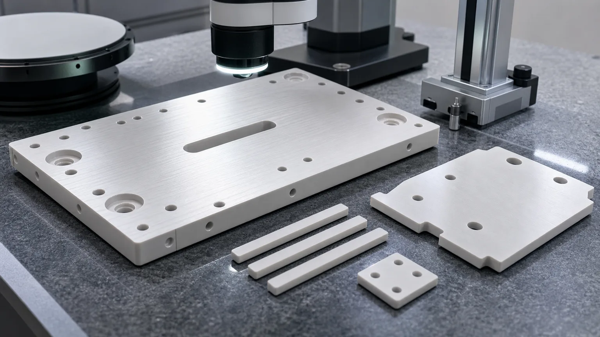
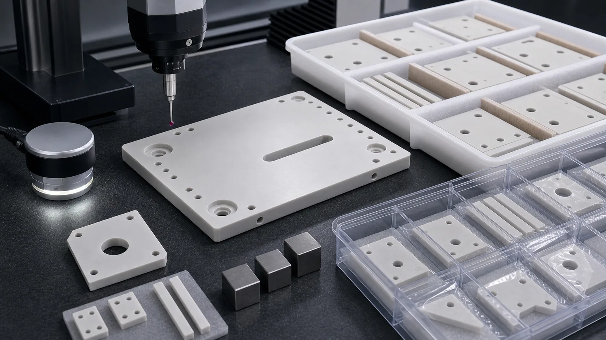

> Aluminum nitride ceramic parts for semiconductor thermal management should be reviewed as thermal and electrical interfaces, not as ordinary ceramic plates. The material value appears only when the finished faces, flatness, thickness, surface finish, edge quality, cleaning, packaging, and inspection evidence match the actual heat path in the tool or assembly.

Aluminum nitride, usually written as AlN, sits in a narrow but high-value zone for semiconductor equipment. It is considered when a component must help move heat while still acting as an electrical insulator. That combination can be useful around heater-adjacent hardware, wafer processing equipment, electrostatic chuck related assemblies, inspection fixtures, high-density power modules inside tool subsystems, thermal spacers, ceramic carriers, and clean precision plates.

This guide is written for engineers and sourcing teams preparing RFQs for custom machined AlN ceramic semiconductor parts. It is not a broad material encyclopedia and it is not a promise that every AlN drawing can be priced from the shape alone. It explains what must be reviewed before a reliable quote: material grade, blank state, thermal-interface faces, flatness, thickness, Ra, holes, pockets, edge criteria, cleaning, packaging, and inspection method.

For the wider component map, start with the [precision ceramic components for semiconductor equipment guide](/posts/semiconductor-equipment/precision-ceramic-components-semiconductor-equipment/). For AlN as a general industrial thermal-management material, use the [aluminum nitride ceramic machining guide](/posts/industrial-ceramic-machining/aluminum-nitride-ceramic-machining-thermal-management-components/). For plasma-adjacent insulation and creepage paths, use the [ceramic insulators for plasma etching and deposition equipment guide](/posts/semiconductor-equipment/ceramic-insulators-plasma-etching-deposition-equipment/). For flat wafer support and vacuum features, use the [machined ceramic vacuum chuck components guide](/posts/semiconductor-equipment/machined-ceramic-vacuum-chuck-components-semiconductor-tools/).

## Why AlN Thermal Interfaces Need Application-Specific Review

AlN heat spreaders, aluminum nitride heater plates, AlN insulating thermal spacers, and semiconductor AlN ceramic plates usually enter sourcing with a drawing, a tool build, a qualification problem, or a thermal-interface requirement. That context is more useful than a generic request for a ceramic part.

The industry signal is current and also durable. In April 2026, [SEMI projected double-digit growth in global 300mm fab equipment spending for 2026 and 2027](https://www.semi.org/en/semi-press-release/semi-projects-double-digit-growth-in-global-300mm-fab-equipment-spending-for-2026-and-2027), with AI chip demand named as an important driver. More 300mm equipment investment means more demand for wafer handling, deposition, etch, thermal processing, inspection, vacuum, power, and support hardware. Many of those systems use engineered ceramics where thermal stability, insulation, cleanliness, and dimensional control matter.

Material and component suppliers also show why AlN belongs in this search path. [Kyocera describes aluminum nitride](https://global.kyocera.com/prdct/fc/material-property/material/aluminum_nitride/index.html) as a ceramic used for heat dissipating and heat soaking components, including parts for semiconductor manufacturing equipment. [Kyocera also lists AlN wafer heaters](https://global.kyocera.com/prdct/fc/industries/products/009.html) for semiconductor processing equipment. [CoorsTek describes AlN](https://www.coorstek.com/en/materials/aluminum-nitride/) as combining high thermal conductivity with electrical resistance and lists semiconductor uses such as heater plates, chucks, sleeves, plates, pins, and tubes.

Those references do not replace drawing review. The engineering task is not to state that "AlN is good," but to turn an AlN thermal-part drawing into a quote-ready, inspection-ready package.

## What Counts As An AlN Semiconductor Thermal Management Part

Two drawings can both say "AlN ceramic plate" and still belong to very different manufacturing routes. A simple insulating spacer, a lapped heat spreader, a heater-adjacent plate with pockets, a ceramic carrier with counterbores, and a clean vacuum-side thermal interface do not carry the same risk.

| AlN part family                       | Semiconductor-adjacent function                                  | RFQ item that changes machining risk                                    |
| ------------------------------------- | ---------------------------------------------------------------- | ----------------------------------------------------------------------- |
| Heat spreader or thermal plate        | Spreads heat while preserving electrical isolation               | Thermal-contact face, flatness, Ra, thickness, and protected packing    |
| Heater-adjacent insulating plate      | Separates heated, grounded, powered, or cooled hardware          | Temperature cycling, clamp pattern, lapped face, and dielectric path    |
| Ceramic carrier or support plate      | Holds sensor, package, module, or tool hardware                  | Datum strategy, pockets, bores, counterbores, and edge-chip criteria    |
| Thermal spacer or standoff set        | Controls stack height while limiting electrical path risk        | Matched height, parallelism, bore finish, and lot consistency           |
| ESC or chuck related support part     | Sits near wafer holding, cooling, or thermal uniformity hardware | Flatness, contact face, cleaning, and tool-level qualification boundary |
| Inspection or metrology fixture plate | Keeps thermal and dimensional stability during measurement       | Datum pads, hole location, plate stability, and surface protection      |
| Power-module-adjacent ceramic fixture | Supports high-density tool power or SiC/GaN module hardware      | Thermal path, voltage path, clamp load, and inspection evidence         |

The drawing should name the real function. "AlN plate" is a shape description. "Lapped AlN thermal-interface plate with electrically insulating mounting holes and clean tray packaging" is a sourcing description.

## The Core Decision: Heat Path Plus Electrical Isolation

AlN is usually selected when thermal transfer and electrical insulation must work at the same time. That is the reason it can compete with alumina, silicon nitride, silicon carbide, quartz, or metal-backed solutions in selected equipment zones.

The decision should not be based on one datasheet phrase. It should be reviewed as an assembly problem:

- Which face receives or rejects heat.
- Which opposite face, spacer height, or mounting feature controls the stack.
- Which surfaces must remain electrically insulating.
- Which holes, slots, and counterbores interrupt the contact area.
- Whether the part is clamped, bonded, greased, metallized, held in a carrier, or free-standing.
- Whether the final acceptance is dimensional inspection, thermal test, electrical test, vacuum qualification, tool-level qualification, or a customer assembly test.

For lower-cost electrical insulation, [precision machined alumina ceramic parts](/posts/industrial-ceramic-machining/precision-machined-alumina-ceramic-parts-industrial-applications/) may be enough. For harsher process-side exposure, [silicon carbide ceramic machining](/posts/industrial-ceramic-machining/silicon-carbide-ceramic-machining-harsh-environment-applications/) may deserve review. For structural thermal shock and wear, [silicon nitride ceramic machining](/posts/industrial-ceramic-machining/silicon-nitride-ceramic-machining-structural-wear-parts/) may be more relevant. AlN becomes attractive when the drawing asks the same part to support heat transfer and insulation.

## Thermal-Interface Flatness, Ra, And Thickness Control

Most serious AlN semiconductor RFQs are controlled by one or two functional faces. These faces may touch a heater, cold plate, module package, sensor, ceramic stack, thermal pad, grease, adhesive, metallized layer, or clamped interface.

A quote-ready drawing should separate the following surfaces:

- Primary thermal-contact face.
- Opposite face and whether it controls parallelism.
- Datum face or local datum pads.
- Lapped or fine-ground zone.
- Bonding or metallization surface if applicable.
- Clearance faces that do not need the same finish.
- Particle-sensitive edges near the thermal or wafer-adjacent area.

Flatness and surface finish should be assigned by function, not sprayed across every surface. A global fine Ra note can make a practical part unnecessarily expensive. A local flatness zone on the real contact face is more useful than a blanket tight value that covers clearance pockets and non-contact edges.

Useful RFQ inputs include:

1. Free-state or clamped-state flatness requirement.
2. Measurement area: full face, local pads, annular band, or selected zones.
3. Surface finish requirement and where it applies.
4. Thickness tolerance and how it affects stack height or clamp load.
5. Parallelism requirement between functional faces.
6. Mating material and thermal interface material if known.
7. Final customer test boundary, if thermal or electrical qualification is not performed by the machining supplier.

Use the [ceramic tolerance capability map](/posts/tolerances-gdt/ceramic-tolerance-capability-map-by-feature-process/) when the drawing has tight dimensions but no feature ranking. Use the [surface finish and subsurface damage guide](/posts/surface-finish-functional/ceramic-ssd-surface-finish-specify-control-price/) when lapped, ground, and polished faces are being mixed in one drawing.

## Machining Route For Precision AlN Thermal Parts

The machining route starts with material and blank review. Aluminum nitride grade, blank size, fired state, thickness stock, and supplier restrictions can change the quote before the first tool path is planned.

A typical review sequence looks like this:

1. Confirm AlN grade, certificate requirement, and whether equivalent material review is allowed.
2. Check blank availability, oversize stock, warp risk, and material removal required after firing.
3. Establish datums that protect the thermal-interface face and critical stack height.
4. Grind or lap functional faces only where the application needs it.
5. Machine holes, pockets, slots, windows, and counterbores with edge breakout in mind.
6. Apply chamfers or radii by zone instead of using vague "break all edges" notes.
7. Clean, inspect, and package the part so lapped faces and thin edges arrive protected.

Fired AlN is a hard brittle ceramic. Features are usually produced with diamond grinding, abrasive machining, drilling, lapping, polishing, or related finishing operations. A metal-style design with sharp internal corners, deep narrow pockets, thin unsupported tabs, close hole-to-edge distances, or blanket low-Ra requirements can create unnecessary cost and yield risk.

Before releasing an AlN part drawing, review the [ceramic CNC machining design rules for advanced ceramic parts](/posts/design-rules-dfm/ceramic-cnc-machining-design-rules-advanced-ceramic-parts/). If the part is moving from a prototype fixture to a repeat semiconductor build, the [green machining vs hard machining guide](/posts/process-routes-control/green-machining-vs-hard-machining/) helps clarify which features belong before firing and which features must be finished after sintering.

## Holes, Slots, Pockets, And Edge Quality

AlN thermal plates rarely stay as plain rectangles. Semiconductor-adjacent drawings often include mounting holes, sensor holes, vacuum relief slots, counterbores, locating pockets, clearance windows, alignment holes, or thin spacer strips. These features can be more important to quote risk than the outside profile.

Good drawings define:

- Hole diameter, depth, position, and through or blind condition.
- Counterbore diameter, depth, bottom finish, and edge break.
- Slot width, end radius, and minimum internal radius.
- Distance from holes to edges, lapped bands, thin webs, and pockets.
- Which hole exits are particle-sensitive.
- Which edges are wafer-adjacent, vacuum-side, electrical-path related, or non-critical.
- Acceptable chip criteria by zone and inspection magnification if required.
- Whether pin gauge, CMM, optical measurement, microscopy, or sampling inspection is expected.

Avoid the note "no chips" unless the acceptance method is defined. In a semiconductor tool, a small uncontrolled chip near a wafer-adjacent edge, thermal-contact face, vacuum channel, dielectric path, or clean assembly surface can matter. A tiny cosmetic mark on a hidden clearance edge may not have the same meaning.

For dense small holes, use the [ceramic micro-hole machining RFQ guide](/posts/micro-hole-machining/ceramic-micro-hole-machining-rfq/). For thin spacers or sleeve-like geometry, use the [thin-wall ceramic sleeve machining guide](/posts/thin-wall-sleeves/ceramic-thin-wall-sleeve-bore-concentricity-rfq/) to clarify wall stability, concentricity, and edge criteria.

## Clean Handling, Moisture Review, And Packaging

AlN parts used near semiconductor equipment should be treated as clean engineered components. The final part can pass dimensional inspection and still create an incoming quality issue if a thermal face is rubbed, a tray touches a lapped surface, holes retain debris, or parts are stacked without separators.

AlN cleaning and handling should be reviewed rather than assumed. The buyer should state whether the component is process-side, vacuum-side, heater-adjacent, fixture-side, inspection-side, or general equipment-side. If the drawing has a lapped face, thin strip, fragile corner, or high-value contact surface, packaging can be part of the specification.

Discuss the following before quotation:

- Cleaning expectation and any restricted cleaning chemistry.
- Whether moisture exposure is a concern for the approved AlN grade or downstream process.
- Whether parts should be individually bagged, tray packed, separated, or protected from face contact.
- Which faces must not be touched, rubbed, stacked, or taped.
- Whether holes, slots, and counterbores need blockage review.
- Whether material certificate, lot traceability, certificate of conformity, or inspection report is required.

For clean manufacturing beyond AlN, use the [cleanroom and high-purity ceramic components guide](/posts/high-purity-cleanroom/precision-ceramic-components-cleanroom-high-purity-manufacturing-systems/). For chamber-adjacent insulation, deposition, and plasma tool concerns, use the [plasma etch and deposition ceramic insulator guide](/posts/semiconductor-equipment/ceramic-insulators-plasma-etching-deposition-equipment/).

## Inspection Evidence For AlN Semiconductor Thermal Parts

Inspection should prove the function. It should not create paperwork for features that do not control the thermal path, assembly, cleanliness, or qualification gate.

| Functional requirement          | Evidence to discuss                                                   | Why it matters                                                        |
| ------------------------------- | --------------------------------------------------------------------- | --------------------------------------------------------------------- |
| Thermal-contact flatness        | CMM, optical method, flatness map, or agreed surface plate method     | Controls real contact, thermal transfer, and assembly stress          |
| Thickness and parallelism       | Micrometer, height gauge, CMM, or thickness map                       | Controls stack height and interface pressure                          |
| Surface finish on contact face  | Ra reading, lapping note, or agreed finish method                     | Supports contact, bonding, metallization, sealing, or cleanability    |
| Hole, slot, and pocket geometry | CMM, optical measurement, pin gauge, microscope, or sampling plan     | Controls mounting, alignment, cleaning, and edge breakout risk        |
| Edge quality                    | Visual criterion by zone, microscopy, chip limit, and sample evidence | Reduces particle risk, crack origins, and handling failures           |
| Clean packaging                 | Tray method, separators, bagging, and face-protection method          | Protects lapped faces, thin edges, and precision features             |
| Material and lot identity       | Material certificate, grade confirmation, lot record, or CoC          | Supports qualification, repeat orders, and incoming quality paperwork |

If the final thermal test, dielectric test, vacuum test, plasma exposure test, or tool-level qualification is performed by the customer, state that boundary in the RFQ. The machining supplier can then focus on geometry, surface condition, cleaning, protected packaging, and inspection evidence before that final test.

## Cost Drivers In AlN Semiconductor Thermal Components

AlN semiconductor components are often underquoted when they are treated as simple ceramic plates. The cost usually comes from the functional surface and risk structure.

Common cost drivers include:

1. Approved AlN grade, purity, blank source, and certificate requirements.
2. Size, thickness, warp allowance, and fired-material removal.
3. Lapped or fine-ground area on thermal-interface faces.
4. Flatness, parallelism, and thickness control on large or thin plates.
5. Small holes, counterbores, slots, pockets, windows, or close edge distances.
6. Particle-sensitive edge criteria and defined chip limits.
7. Clean handling, individual trays, separators, bagging, and face protection.
8. Inspection report scope, material certificate, lot traceability, and CoC.
9. Prototype validation before repeat production.
10. Downstream metallization, bonding, coating, or customer assembly requirements.

The best way to reduce unnecessary cost is not to loosen every requirement. It is to rank the drawing. Mark the thermal-contact face, datum face, electrical isolation path, lapped area, and particle-sensitive edges. Then allow clearance geometry to use practical ceramic machining tolerances and finishes.

## Common Design Mistakes In AlN Thermal RFQs

Many AlN RFQs become slow because the drawing looks complete but the functional intent is hidden. These mistakes are common:

1. Calling the part an "AlN plate" without identifying the heat path.
2. Applying tight flatness to every face instead of the contact face.
3. Applying fine Ra to pockets, edges, and clearance surfaces that do not need it.
4. Leaving thickness tolerance disconnected from stack height or clamp load.
5. Placing holes too close to lapped faces, edges, thin webs, or slots.
6. Requesting "no chips" with no zone, size, magnification, or acceptance method.
7. Ignoring clean packaging until after the part is finished.
8. Treating AlN as interchangeable with alumina because both are ceramics.
9. Treating a prototype material or supplier sample as proof that production AlN will machine the same way.
10. Expecting final thermal or electrical qualification from a machining supplier when the test belongs to the full customer assembly.

These problems are avoidable. A well-ranked drawing and a short RFQ note usually save more time than a broad tolerance block.

## RFQ Checklist For Aluminum Nitride Semiconductor Thermal Parts

Send the following before expecting a reliable quotation:

- 2D drawing with revision and a STEP or native CAD file.
- Part function: heat spreader, heater-adjacent plate, thermal spacer, carrier, sensor mount, ESC-related support, inspection fixture, or power-module-adjacent ceramic.
- Required AlN grade, purity, certificate requirement, and whether equivalent review is allowed.
- Blank source: customer-supplied, supplier-sourced, plate, sheet, near-net, fired blank, or prototype blank.
- Tool location: process-side, vacuum-side, heater-adjacent, fixture-side, inspection-side, power subsystem, or general equipment-side.
- Thermal path and electrical insulation path.
- Functional faces: thermal-contact face, datum face, lapped face, bonding face, metallization face, and non-critical faces.
- Flatness, thickness, parallelism, Ra, GD&T, and edge requirements by feature zone.
- Hole, slot, pocket, counterbore, chamfer, radius, and chip criteria.
- Mating material, clamp method, thermal interface material, bonding, metallization, or coating if known.
- Cleaning, packaging, material certificate, lot traceability, inspection report, and sampling requirements.
- Quantity, target timing, prototype or repeat-order status, and qualification stage.

For a standard RFQ package, use the [custom ceramic CNC machining RFQ checklist](/posts/rfq-preparation/custom-ceramic-cnc-machining-rfq-checklist/). For early-stage material comparison, use the [ceramic material selection guide](/posts/materials-grade-selection/ceramic-material-selection-cnc-machining/).

## Internal Decision Path For Related Semiconductor Ceramic Parts

Use this page when the part is specifically an AlN thermal-management component. Use related pages when the dominant function changes:

| Dominant problem                                                         | Better supporting page                                                                                                                                       |
| ------------------------------------------------------------------------ | ------------------------------------------------------------------------------------------------------------------------------------------------------------ |
| Wafer-contact support, vacuum holes, or chuck flatness                   | [Machined ceramic vacuum chuck components](/posts/semiconductor-equipment/machined-ceramic-vacuum-chuck-components-semiconductor-tools/)                     |
| Process chamber rings, lapped bands, and ID/OD control                   | [Precision ceramic rings for semiconductor process chambers](/posts/semiconductor-equipment/precision-ceramic-rings-semiconductor-process-chambers/)         |
| Plasma, deposition, creepage, feedthrough spacing, or insulating sleeves | [Ceramic insulators for plasma etching and deposition equipment](/posts/semiconductor-equipment/ceramic-insulators-plasma-etching-deposition-equipment/)     |
| Wafer handling blades, forks, or automation contact pads                 | [Ceramic end effectors for wafer handling and automation](/posts/semiconductor-equipment/ceramic-end-effectors-wafer-handling-automation/)                   |
| Gas flow, dispensing, vacuum, or micro-orifice geometry                  | [Precision ceramic nozzles for semiconductor and vacuum equipment](/posts/semiconductor-equipment/precision-ceramic-nozzles-semiconductor-vacuum-equipment/) |
| General semiconductor ceramic part family selection                      | [Precision ceramic components for semiconductor equipment](/posts/semiconductor-equipment/precision-ceramic-components-semiconductor-equipment/)             |

This internal-link structure keeps the page focused. AlN thermal management should not absorb every semiconductor ceramic topic. It should answer the thermal-interface sourcing problem well and connect the buyer to the correct next page.

## Practical Takeaway

Aluminum nitride ceramic parts are valuable in semiconductor thermal management when a component must support heat transfer, electrical insulation, dimensional stability, clean handling, and inspectable precision. The material name alone does not make the part ready to quote. The real work sits in the interface: flatness, thickness, Ra, holes, pockets, edge quality, cleaning, packaging, and acceptance evidence.

For a serious AlN semiconductor RFQ, do not send only a STEP file and ask for a plate price. Send the drawing, CAD model, AlN grade or allowed equivalent, tool location, thermal and electrical function, functional faces, edge criteria, inspection expectations, cleaning and packaging needs, quantity, and qualification stage. That allows the machining route to be reviewed as a semiconductor thermal-management component instead of a generic ceramic plate.

## FAQ

**Why use aluminum nitride in semiconductor thermal-management parts?**  
AlN is reviewed when a component needs heat transfer and electrical insulation together. It can be useful for heater-adjacent plates, thermal spacers, heat spreaders, carriers, and clean tool hardware, but the final choice depends on grade, geometry, environment, surface finish, and qualification.

**Is an AlN heat spreader just a flat ceramic plate?**  
No. The RFQ should define the thermal-interface face, thickness, parallelism, flatness measurement method, surface finish, holes, chamfers, cleaning, packaging, and inspection evidence. A lapped thermal plate and a simple clearance spacer should not be quoted as the same part.

**Can AlN replace alumina in semiconductor equipment?**  
Sometimes, but not automatically. Alumina may be sufficient for many insulation parts. AlN is usually reviewed when thermal transfer and electrical insulation must work at the same interface. The operating environment and drawing requirements decide.

**What inspection evidence should be requested?**  
Common evidence includes CMM reports, flatness maps, thickness measurements, Ra readings, optical edge review, material certificates, cleaning notes, and protected packaging confirmation. The scope should match the functional faces and acceptance gate.

**Should every AlN surface be lapped or polished?**  
Usually no. Apply lapping, polishing, tight Ra, and tight flatness to thermal-contact, bonding, sealing, or datum surfaces where the function requires it. Clearance faces can often use practical ceramic machining finish.

**Who verifies final thermal performance?**  
Often the customer verifies final thermal performance in the full assembly or tool-level qualification. The machining supplier should define and prove geometry, surface condition, cleaning, packaging, and inspection evidence unless a specific thermal test is included in the purchase requirement.

> RFQ note: Final feasibility, tolerance, price, lead time, cleaning method, packaging, inspection scope, and material route depend on drawing review, AlN grade, blank state, functional surfaces, machining route, tool environment, and acceptance method.
