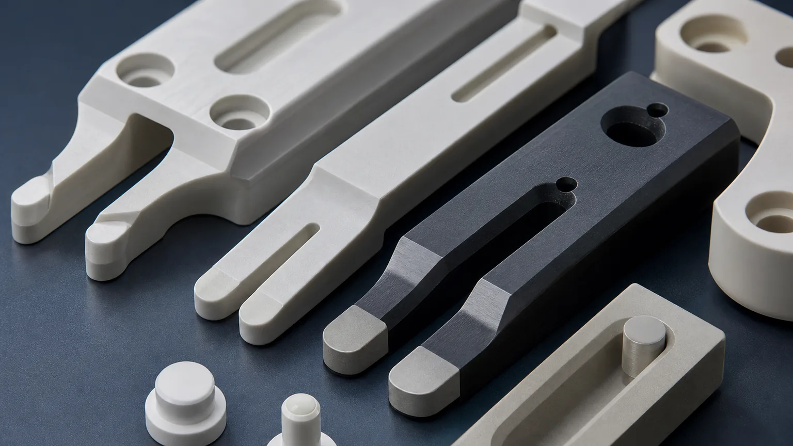
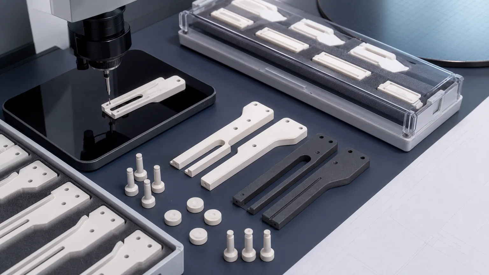

> Ceramic end effectors for wafer handling are not ordinary robot fingers. They are precision ceramic contact interfaces that must support, transfer, locate, or pick a fragile wafer while controlling flatness, edge quality, particle risk, stiffness, mounting alignment, cleaning, packaging, and inspection evidence.

In semiconductor tools and clean automation systems, an end effector may look like a simple fork, blade, gripper, paddle, vacuum pick, or support arm. The RFQ risk is rarely the outside shape alone. The real questions are where the wafer touches, how load is distributed, whether the ceramic arms stay stiff, which edges are particle-sensitive, how the robot mounting datum is controlled, and what evidence proves the part can be accepted.

This guide focuses on ceramic end effectors used for wafer handling and automation. For a broader map of semiconductor ceramic parts, use the [precision ceramic components for semiconductor equipment guide](/posts/semiconductor-equipment/precision-ceramic-components-semiconductor-equipment/). For SiC-only wafer handling blades, lift pins, support pads, and edge-contact parts, use the [silicon carbide wafer handling components guide](/posts/semiconductor-equipment/silicon-carbide-wafer-handling-components-semiconductor-manufacturing/).

### Why Ceramic End Effectors Need A Dedicated RFQ Review

End effectors sit at the point where automation accuracy meets ceramic brittleness. A metal end effector can sometimes absorb local stress, minor edge abuse, or redesign through conventional machining. Fired ceramics are different. The design must respect material grade, blank state, diamond grinding access, edge-break strategy, and inspection method before price or lead time is treated as reliable.

High-value ceramic end effector RFQs usually involve at least one of these constraints:

- Thin fork arms, long unsupported blades, or narrow slots.
- Wafer-contact pads that need controlled flatness, surface finish, or height relationship.
- Edge-contact zones where chip size and radius affect particle risk.
- Mounting holes, counterbores, slots, or datum faces that set robot repeatability.
- Vacuum passages, suction holes, or vent holes near fragile ceramic sections.
- Low mass or inertia requirements for fast automation motion.
- Cleaning, protected packaging, and incoming inspection requirements.
- Matched sets where multiple end effectors or pads must behave the same way.

A STEP file can start review, but it normally cannot replace a drawing that marks contact surfaces, critical edges, datum faces, surface finish, and inspection evidence. Without those details, a supplier may quote the visible shape while missing the surfaces that decide wafer handling performance.

### Where Ceramic End Effectors Fit In Wafer Handling Automation

Ceramic end effectors may appear in wafer transfer robots, load locks, inspection tools, vacuum handling stations, metrology fixtures, process-adjacent automation, and custom clean handling systems. The same general word can describe several different functional designs.

| End effector type                | Typical function                                            | RFQ issue that changes the machining route                                 |
| -------------------------------- | ----------------------------------------------------------- | -------------------------------------------------------------------------- |
| Fork-style ceramic wafer blade   | Supports a wafer from below during transfer                 | Fork arm thickness, contact pad location, edge chip criteria, mounting fit |
| Paddle or flat ceramic blade     | Carries wafer or substrate across a larger support surface  | Flatness, profile, low-Ra contact face, stiffness, and weight              |
| Edge-contact ceramic gripper     | Locates or holds a wafer, carrier, or ring at the edge      | Contact radius, chip limit, surface finish, and localized wear zone        |
| Ceramic vacuum pick end effector | Uses holes, ports, or suction zones for temporary holding   | Hole geometry, vacuum path, cleaning, flatness, and leakage expectation    |
| Ceramic support fingers or pads  | Provide small localized support points                      | Height matching, lapped contact pads, tip geometry, and packaging          |
| Hybrid automation interface      | Combines ceramic contact parts with metal or robot hardware | Datum relationship, fastener stress, inserts, isolation, and assembly fit  |

The RFQ should state whether the part touches a bare wafer, carrier, ring, glass substrate, ceramic substrate, or another fragile workpiece. Contact mode changes the material choice and inspection focus.

### Material Selection For Ceramic End Effectors

There is no universal ceramic for every wafer handling end effector. The correct route depends on stiffness, weight, thermal exposure, chemical environment, wear, electrical behavior, qualification status, and how much machining is needed after firing.

| Material family                                                                                                                      | When it may fit end effectors                                         | RFQ notes                                                                                         |
| ------------------------------------------------------------------------------------------------------------------------------------ | --------------------------------------------------------------------- | ------------------------------------------------------------------------------------------------- |
| [Alumina Al2O3](/posts/industrial-ceramic-machining/precision-machined-alumina-ceramic-parts-industrial-applications/)               | Insulating blades, support fingers, spacers, clean automation parts   | Specify purity, grade, fired state, contact faces, edge criteria, and cleaning expectations       |
| [Silicon carbide SiC](/posts/industrial-ceramic-machining/silicon-carbide-ceramic-machining-harsh-environment-applications/)         | High-stiffness, wear-resistant, process-adjacent, or harsh-zone parts | Hard finishing, lapped pads, thin forks, chip criteria, and inspection evidence can dominate cost |
| [Silicon nitride Si3N4](/posts/industrial-ceramic-machining/silicon-nitride-ceramic-machining-structural-wear-parts/)                | Structural wear parts, guide features, selected gripper elements      | Review load path, thin sections, shock risk, sliding contact, and grade                           |
| [Zirconia ZrO2](/posts/industrial-ceramic-machining/zirconia-ceramic-machining-high-strength-precision-components/)                  | Tougher local pads, pins, grippers, or contact features               | Useful where chipping risk matters, but temperature and environment still need review             |
| [Aluminum nitride AlN](/posts/industrial-ceramic-machining/aluminum-nitride-ceramic-machining-thermal-management-components/)        | Heater-adjacent or thermal-interface automation hardware              | Thermal-interface faces, moisture handling, flatness, and cleaning must be specified              |
| [Macor and machinable ceramics](/posts/industrial-ceramic-machining/macor-machinable-glass-ceramic-parts-applications-design-guide/) | Prototype insulating fixtures or lab automation trials                | Useful for fast iteration when service limits fit; not a default substitute for production SiC    |

If the material is locked by a tool qualification, state the exact grade and whether equivalent review is allowed. If the material is open, send the operating environment, wafer size, contact mode, load, cleaning method, and acceptance requirements so the supplier can review the route.

For broader material trade-offs, use the [ceramic material selection guide](/posts/materials-grade-selection/ceramic-material-selection-cnc-machining/).

### Wafer Contact Geometry Is The Main Control Point

The functional value of a ceramic end effector usually sits in small contact areas. A fork blade may only touch the wafer on two pads near the tips. A paddle may require a broader support face. An edge gripper may contact a narrow radius. A vacuum pick may combine small suction openings with a lapped land.

Define contact geometry before asking for a firm quotation:

- Wafer size, substrate size, or carrier size.
- Contact mode: underside support, edge contact, vacuum hold, temporary lift, or fixture support.
- Contact area location, width, length, radius, and spacing.
- Whether contact marks are allowed.
- Flatness, profile, or height matching on the contact zone.
- Surface finish target on the contact face only.
- Edge break, radius, chamfer, and chip limit near the wafer.
- Whether the end effector is measured free-state, supported, or in an assembly fixture.

Applying strict finish to the entire body may add cost without improving handling. A better RFQ marks the contact pads and allows standard finish on clearance faces where function does not require lapping or low Ra.

End effector RFQs should identify wafer-contact pads, edge-break zones, slots, datum faces, mounting bores, and inspection method before price or timing is treated as reliable.

### Fork Arms, Slots, And Thin Ceramic Sections

Long fork arms are one of the most difficult areas in ceramic end effector design. They must be light enough for automation, stiff enough for stable transfer, and robust enough to survive machining, cleaning, inspection, packaging, and installation.

Review these features early:

- Minimum arm width and unsupported length.
- Blade thickness and local thickness tolerance.
- Slot width, slot depth, and internal corner radius.
- Transition radius between blade arms and mounting body.
- Hole-to-edge distance around mounting bores and lightening holes.
- Distance between wafer-contact pads and outer edges.
- Allowable edge break on fork tips and slot edges.
- Whether sharp CAD corners can be replaced with ceramic-friendly radii.

The [ceramic CNC machining design rules](/posts/design-rules-dfm/ceramic-cnc-machining-design-rules-advanced-ceramic-parts/) explain why metal-style sharp corners, thin webs, and blanket tight tolerances often need review before ceramic machining. If the end effector uses thin sleeves, fingers, or tubular support features, the [thin-wall ceramic sleeve guide](/posts/thin-wall-sleeves/ceramic-thin-wall-sleeve-bore-concentricity-rfq/) is also useful for bore, wall, and concentricity risk.

### Mounting Datums And Robot Interface Control

An end effector is only as accurate as its interface to the robot or fixture. Mounting holes, counterbores, slots, dowel locations, datum pads, and backside faces must be controlled in a way that matches assembly.

Useful RFQ details include:

- Primary datum face and whether it is ground or lapped.
- Mounting bore diameter, counterbore depth, and hole position.
- Dowel or pin location relative to wafer-contact pads.
- Parallelism or profile requirement between contact face and robot mounting face.
- Slot geometry for adjustment and whether slot edges are functional.
- Fastener torque, washer style, isolation needs, or clamping direction if known.
- Whether ceramic is clamped directly or bonded, inserted, or assembled into a metal holder.

Avoid using rough as-sintered surfaces as tight datum references unless the supplier confirms that route. For high-value automation tools, the datum scheme should be measurable with CMM, optical, fixture gauge, or agreed key-dimension inspection. Use the [ceramic tolerance capability map](/posts/tolerances-gdt/ceramic-tolerance-capability-map-by-feature-process/) when deciding which features need post-sinter grinding, lapping, or special inspection.

### Edge Quality And Particle-Sensitive Zones

For wafer handling, edge quality is not cosmetic. Chips and uncontrolled sharp edges can create particles, wafer marks, handling damage, or assembly stress. A drawing note such as "no chips" is usually too vague to quote or inspect.

Separate edge zones by function:

| Edge zone                         | What to define                                                     | Why it matters                                             |
| --------------------------------- | ------------------------------------------------------------------ | ---------------------------------------------------------- |
| Wafer-facing tips and pad edges   | Radius or chamfer, maximum chip size, finish, and magnification    | Controls wafer contact, particle risk, and contact marks   |
| Slot and fork inner edges         | Minimum edge break, chip limit, and whether edges are inspected    | Reduces crack initiation and handling damage               |
| Mounting hole and counterbore rim | Practical chamfer, breakout limit, and assembly stress expectation | Protects fastener interfaces and repeatable mounting       |
| Non-functional outside profile    | General edge break and standard visual acceptance                  | Avoids overpricing surfaces that do not affect performance |

The [surface finish and subsurface damage guide](/posts/surface-finish-functional/ceramic-ssd-surface-finish-specify-control-price/) explains why Ra, lapping, polishing, microscopy, and surface integrity should be assigned by functional face instead of applied broadly across the whole part.

### Vacuum Pick Features And Suction End Effectors

Some ceramic end effectors use vacuum holes, shallow grooves, micro-passages, or suction pads to hold a wafer or substrate temporarily. These are not simply decorative holes. The suction path can become the dominant machining and cleaning risk.

For vacuum-related end effectors, specify:

- Hole diameter, depth, pitch, and pattern.
- Whether holes are through, blind, angled, or connected to internal channels.
- Groove width, depth, edge radius, and distance to wafer-contact pads.
- Port geometry and backside connection method.
- Whether flow, leakage, or vacuum holding evidence is required.
- Cleaning method and blockage inspection expectation.
- Whether the suction face must be lapped after holes are made.

If the design behaves like a chuck or suction plate, use the [ceramic vacuum chuck RFQ guide](/posts/vacuum-chucks/ceramic-vacuum-chuck-flatness-rfq/). For semiconductor tool chuck plates, porous inserts, and SiC support components, use the [machined ceramic vacuum chuck components guide](/posts/semiconductor-equipment/machined-ceramic-vacuum-chuck-components-semiconductor-tools/). For small holes, vent paths, and gas or vacuum features, use the [ceramic micro-hole machining RFQ guide](/posts/micro-hole-machining/ceramic-micro-hole-machining-rfq/).

### Inspection, Cleaning, And Protected Packaging

For semiconductor automation, the machining route does not end when a dimension passes. Finished ceramic end effectors must be cleaned, protected, and packaged so wafer-contact faces and chip-sensitive edges survive shipment and installation.

Inspection planning should connect each functional surface to an evidence method, acceptance criterion, and packaging requirement.

| Requirement                          | Evidence to discuss                                           | RFQ note                                                                     |
| ------------------------------------ | ------------------------------------------------------------- | ---------------------------------------------------------------------------- |
| Contact pad flatness or height       | Flatness map, CMM, optical method, or matched-set report      | State whether measured free-state, supported, or in fixture                  |
| Mounting hole and datum relationship | CMM report, key-dimension report, or assembly gauge           | Datums must be stable, finished, and physically inspectable                  |
| Fork arm thickness and slot geometry | CMM, optical scan, caliper method, or fixture check           | Long thin arms may need practical acceptance rather than only nominal CAD    |
| Edge chip control                    | Visual inspection under defined magnification or sample photo | Define zone and maximum chip size; avoid relying on "no chips" alone         |
| Surface finish on contact areas      | Ra measurement, lapping note, or approved process method      | Apply to wafer-contact faces, not every clearance face                       |
| Vacuum or suction features           | Optical check, flow check, leakage check, or blockage review  | Decide whether dimensional evidence, functional evidence, or both are needed |
| Cleaning and packaging               | Cleaning note, separators, custom trays, or protected wrap    | Protect fork tips, lapped pads, pin tips, and particle-sensitive edges       |

The [custom ceramic CNC machining RFQ checklist](/posts/rfq-preparation/custom-ceramic-cnc-machining-rfq-checklist/) can help organize drawing, CAD, material, quantity, timing, and acceptance requirements before the end effector is sent for review.

### Cost Drivers In Ceramic End Effectors

The cost of a ceramic end effector is usually driven by functional precision and yield risk, not by outside dimensions alone.

Common cost drivers include:

1. Material grade, qualification requirements, and blank availability.
2. Fired ceramic hardness and diamond grinding time.
3. Long thin fork arms, narrow slots, pockets, and unsupported geometry.
4. Lapped wafer-contact pads or low-Ra support faces.
5. Tight mounting bore position relative to contact surfaces.
6. Edge chip criteria in wafer-facing or particle-sensitive zones.
7. Vacuum holes, suction grooves, or internal passages.
8. Matched sets, height matching, or repeatability evidence.
9. Cleaning, protected packaging, and traceability expectations.
10. Prototype validation before repeat production.

Cost can often be controlled by placing strict tolerance and finish only on the features that affect wafer handling. Non-functional outside surfaces, cosmetic faces, and clearance geometry should not automatically receive the same finish as wafer-contact pads.

### RFQ Checklist For Ceramic End Effectors

Before expecting a reliable quotation, send:

- 2D drawing with revision and STEP or native CAD file.
- End effector type: fork blade, paddle, gripper, vacuum pick, support finger, pad, or hybrid assembly.
- Material family, grade, purity, and whether equivalent grade review is allowed.
- Blank source and blank state: customer-supplied, supplier-sourced, fired, green, plate, rod, near-net, or prototype material.
- Wafer or substrate size, supported area, load, contact mode, and automation environment.
- Wafer-facing surfaces, contact pads, edge-contact zones, and particle-sensitive edges marked on the drawing.
- Critical tolerances, GD&T, datum faces, mounting bores, and inspection basis.
- Surface finish, lapping, flatness, profile, or height matching by face.
- Edge break, radius, chamfer, and chip criteria by zone.
- Holes, slots, grooves, vacuum paths, thin arms, and wall-thickness details.
- Cleaning, packaging, traceability, certificate, and inspection report needs.
- Quantity, prototype or production intent, target timing, and qualification stage.

If some requirements are still open, identify them clearly. A supplier can still review feasibility risk, but a quotation built on unknown contact surfaces or unknown edge criteria should not be treated as final.

### Practical Takeaway

Ceramic end effectors for wafer handling and automation should be sourced as engineered contact interfaces. The important questions are specific: where does the wafer touch, which edge can create particles, which surface controls height or flatness, which holes set alignment, whether vacuum features need functional testing, how the robot interface is inspected, and how the finished part is protected before use.

Good RFQs separate material grade, contact geometry, edge criteria, datum strategy, tolerance scope, cleaning, packaging, and inspection evidence before price and lead time are confirmed. That approach helps engineering and procurement compare suppliers on manufacturable risk instead of on an under-specified blade drawing.

For a direct project review, use the [RFQ input page](/rfq/) and include the drawing, CAD file, material requirement, quantity, target timing, wafer-contact zones, automation interface, and acceptance evidence.

### FAQ

**What are ceramic end effectors used for in wafer handling?**  
They are used to support, transfer, locate, grip, or pick wafers and substrates in semiconductor automation, clean handling systems, inspection tools, and process-adjacent equipment.

**Which ceramic material is best for wafer handling end effectors?**  
There is no universal answer. Alumina, SiC, silicon nitride, zirconia, AlN, and machinable ceramics can fit different functions. The choice depends on wafer contact, stiffness, temperature, chemistry, wear, qualification, and machining risk.

**Can a ceramic end effector be quoted from a STEP file only?**  
A STEP file can start review, but a reliable RFQ usually needs a drawing, material grade, contact surfaces, edge chip criteria, surface finish, datum scheme, quantity, and inspection requirements.

**What surfaces matter most on ceramic wafer blades?**  
Wafer-contact pads, fork tips, edge-contact zones, mounting datums, slot edges, vacuum holes, and lapped support faces usually matter more than non-functional outside surfaces.

**Should every surface on a ceramic end effector be polished?**  
No. Finish should be assigned by function. Wafer-contact pads, sliding zones, vacuum lands, or datum faces may need controlled finish, while clearance surfaces often do not.

**What inspection evidence should be requested?**  
Common options include CMM reports, optical checks, flatness maps, surface finish readings, visual edge-chip criteria, matched-set height reports, vacuum or flow checks, cleaning notes, and protected packaging confirmation.

> RFQ note: Final feasibility, tolerance, price, lead time, cleaning method, packaging, and inspection scope depend on drawing review, ceramic grade, blank state, functional surfaces, machining route, and acceptance method.
