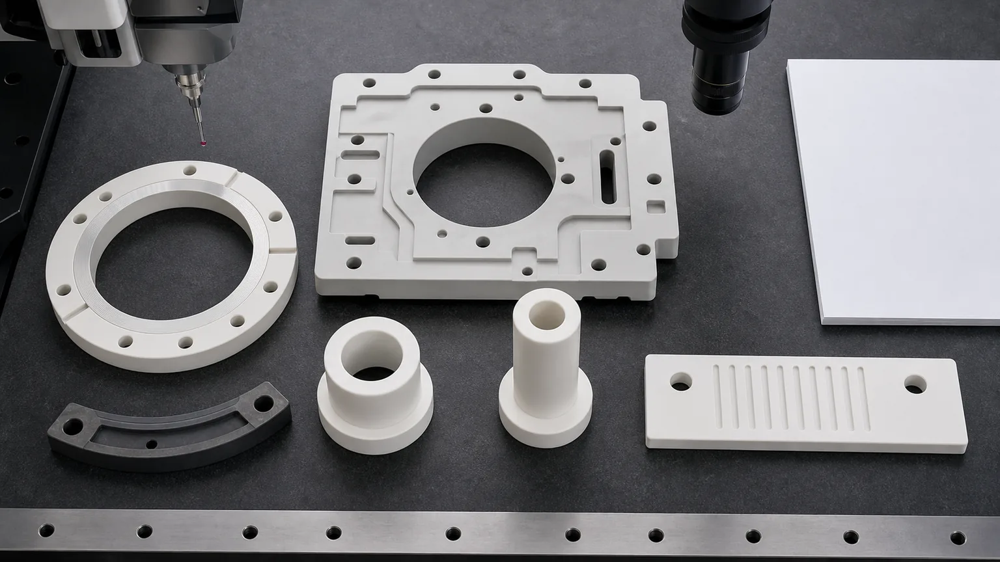
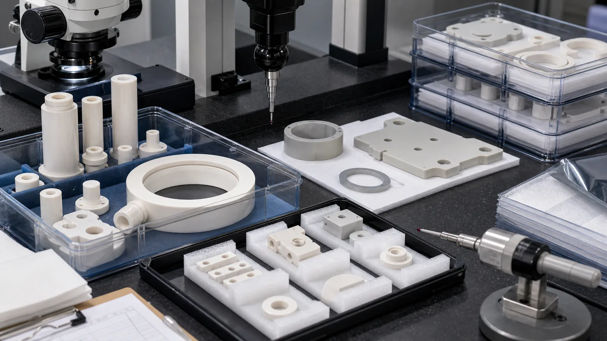

> Ceramic insulators for plasma etching and deposition equipment are not generic electrical spacers. They are chamber-adjacent interfaces where dielectric function, plasma exposure, vacuum cleanliness, thermal cycling, holes, grooves, lapped faces, edge chips, and inspection evidence must be reviewed together before quotation.

Plasma etching and deposition tools use ceramic parts where metals or polymers would create electrical paths, particle risk, thermal drift, chemical exposure issues, or poor dimensional stability. Typical RFQs include alumina insulating rings, ceramic sleeves, standoffs, spacers, feedthrough-adjacent parts, AlN thermal-insulating plates, showerhead-adjacent insulators, electrode spacers, chamber support blocks, and custom vacuum-side isolation hardware.

The search term sounds simple: ceramic insulator. The engineering question is more specific:

**Which surfaces carry the insulation path, which faces are plasma- or vacuum-adjacent, which edges are particle-sensitive, which holes control assembly, and what evidence proves the part is acceptable?**

This guide focuses on custom machined ceramic insulators used around plasma etch and deposition equipment. For the wider component context, start with the [precision ceramic components for semiconductor equipment guide](/posts/semiconductor-equipment/precision-ceramic-components-semiconductor-equipment/). For AlN heat spreaders, heater-adjacent thermal plates, insulating thermal spacers, and clean thermal-interface inspection evidence, use the [AlN ceramic parts for semiconductor thermal management guide](/posts/semiconductor-equipment/aluminum-nitride-ceramic-parts-semiconductor-thermal-management/). For ring-specific chamber hardware, use the [precision ceramic rings for semiconductor process chambers guide](/posts/semiconductor-equipment/precision-ceramic-rings-semiconductor-process-chambers/). For general electrical spacing, creepage, and clearance logic, use the [high-voltage ceramic insulator RFQ guide](/posts/high-voltage-insulation/ceramic-high-voltage-insulators-rfq/).

### Why Plasma Etch And Deposition Insulators Are A High-Value RFQ Topic

The industry signal is durable, not only seasonal. [SEMI reported](https://www.semi.org/en/semi-press-release/semi-projects-double-digit-growth-in-global-300mm-fab-equipment-spending-for-2026-and-2027) that worldwide 300mm fab equipment spending is expected to grow 18% to 133 billion USD in 2026 and another 14% to 151 billion USD in 2027, with AI-era capacity as a major driver. Those tools do not only need wafers and process recipes. They need stable, clean, high-precision hardware inside wafer handling, vacuum, etch, deposition, thermal, metrology, and chamber-support systems.

The long-term search value is also clear. [Lam Research describes](https://www.lamresearch.com/products/our-processes/) thin film deposition, plasma etch, wafer cleaning, and process monitoring as complementary semiconductor manufacturing steps. [Kyocera lists](https://global.kyocera.com/prdct/fc/wp/catalog/semiconductor/index.html) fine ceramic components for semiconductor manufacturing equipment, including plasma-related rings, heaters, vacuum chucks, nozzles, and end effectors. This is the right kind of SEO target for a precision ceramic machining site because buyers often search with a part family, drawing problem, or equipment environment already in mind.

The article should not be read as a universal material promise. Plasma etching and deposition applications are usually tied to tool qualification, material grade, cleaning rules, and acceptance requirements. A quote becomes useful only after the drawing and operating context are reviewed.

### What Counts As A Ceramic Insulator In Etch And Deposition Equipment

Ceramic insulation is not limited to one simple standoff. In plasma and deposition equipment, insulation may be combined with vacuum spacing, thermal stability, chamber support, high-voltage isolation, particle control, or process-side protection.

| Insulator type                         | Typical role                                                        | RFQ issue that changes the route                                              |
| -------------------------------------- | ------------------------------------------------------------------- | ----------------------------------------------------------------------------- |
| Alumina insulating ring                | Electrical isolation, chamber spacing, electrode-adjacent support   | ID/OD control, lapped face, hole edges, dielectric path, and cleaning         |
| Feedthrough-adjacent ceramic sleeve    | Insulates a conductor, pin, shaft, or vacuum interface              | Bore concentricity, wall thickness, chamfer, surface condition, and packaging |
| AlN thermal-insulating plate           | Moves heat while maintaining electrical isolation                   | Flatness, thickness, thermal-interface finish, moisture handling, and edge QC |
| Ceramic spacer or standoff             | Controls stack height, isolation, and clamp spacing                 | Parallelism, matched height, hole quality, clamp load, and chip criteria      |
| Showerhead or gas-path insulator       | Isolates gas distribution or chamber hardware                       | Hole quality, grooves, cleaning, blockage review, and particle-sensitive edge |
| Electrode or chuck-adjacent insulator  | Separates powered, grounded, heated, or cooled assemblies           | Voltage path, creepage geometry, flatness, assembly load, and surface finish  |
| Chamber support block or isolation pad | Provides stable insulating support in vacuum or process-side areas  | Datum faces, pockets, slots, mounting holes, and thermal cycling              |
| Prototype machinable ceramic fixture   | Lab iteration, test hardware, or non-final insulating trial fixture | Service limits and transition to fired alumina, AlN, or another final ceramic |

Two parts can both be called "ceramic insulators" but quote very differently. A plain alumina spacer, a lapped insulating ring, a feedthrough sleeve, and a heater-adjacent AlN plate are different manufacturing problems.

### Material Selection For Plasma And Deposition Insulators

Material selection should follow the tool location and failure mode. Do not select by color, catalog name, or a generic "advanced ceramic" note.

| Material direction                                                                                                                       | Where it may fit                                                                        | RFQ caution                                                                                    |
| ---------------------------------------------------------------------------------------------------------------------------------------- | --------------------------------------------------------------------------------------- | ---------------------------------------------------------------------------------------------- |
| [Alumina Al2O3](/posts/industrial-ceramic-machining/precision-machined-alumina-ceramic-parts-industrial-applications/)                   | General insulating rings, sleeves, spacers, standoffs, feedthrough-adjacent hardware    | Purity, fired state, dielectric path, edge quality, and clean packaging should be defined      |
| [Aluminum nitride AlN](/posts/industrial-ceramic-machining/aluminum-nitride-ceramic-machining-thermal-management-components/)            | Thermal plates, heater-adjacent insulators, insulating heat spreaders, sensor supports  | Flatness, thickness, moisture exposure, thermal-interface finish, and handling need review     |
| [Silicon carbide SiC](/posts/industrial-ceramic-machining/silicon-carbide-ceramic-machining-harsh-environment-applications/)             | Plasma-facing shields, rings, wear or chemical exposure zones where insulation is mixed | Some grades are conductive; function and approved material route must be reviewed carefully    |
| [Silicon nitride Si3N4](/posts/industrial-ceramic-machining/silicon-nitride-ceramic-machining-structural-wear-parts/)                    | Structural support, wear-adjacent spacers, thermally cycled features                    | Load path, thermal shock, bore geometry, and grade drive feasibility                           |
| [Macor or machinable glass ceramic](/posts/industrial-ceramic-machining/macor-machinable-glass-ceramic-parts-applications-design-guide/) | Prototype fixtures, lab insulators, fast-turn trial parts                               | Useful for iteration, but not a direct substitute for fired production ceramics without review |
| [Boron nitride BN](/posts/industrial-ceramic-machining/boron-nitride-ceramic-machining-high-temperature-insulation-parts/)               | Selected high-temperature insulating or release-contact hardware                        | Grade, atmosphere, mechanical load, and handling sensitivity must be reviewed                  |

If the tool specification already controls the material, provide the exact grade, purity, vendor restriction, and whether equivalent review is allowed. If the material is still open, send the operating environment: plasma exposure, process gas, cleaning chemistry, vacuum condition, temperature range, voltage, load, and required inspection evidence. The broader [ceramic material selection guide](/posts/materials-grade-selection/ceramic-material-selection-cnc-machining/) is the right starting point when the failure mode is known but the material is not fixed.

### Insulation Is A Geometry And Surface Problem

Bulk dielectric properties matter, but a machined ceramic insulator succeeds or fails at surfaces, edges, holes, and assembly interfaces. A drawing that only says "alumina insulator" does not define the quote.

Important insulation-related geometry includes:

- Creepage and clearance path through ribs, grooves, slots, holes, shoulders, and edge breaks.
- Wall thickness around conductors, bores, counterbores, and mounting holes.
- Surface condition along the insulation path.
- Edge radius near high-field areas or particle-sensitive zones.
- Distance from holes to edges, grooves, seal lands, or lapped faces.
- Whether metallization, clamps, fasteners, seals, or coatings change the electrical path.
- Whether the insulator is exposed to vacuum, plasma, gas, heat, cleaning, or condensation.

This is why the [ceramic CNC machining design rules](/posts/design-rules-dfm/ceramic-cnc-machining-design-rules-advanced-ceramic-parts/) matter for plasma-tool insulators. A metal-style sharp internal corner, deep narrow slot, thin rib, or hole close to an edge may be acceptable in CAD but risky in fired ceramic machining.

Ceramic plasma-tool insulator RFQs should identify insulation paths, functional faces, holes, grooves, lapped surfaces, chip-sensitive edges, cleaning needs, and inspection methods before quotation.

### Rings, Sleeves, Plates, And Spacers Have Different Risk Profiles

The part shape changes the machining route. A ceramic ring is not quoted like a plate, and a sleeve is not quoted like a standoff.

**Insulating rings** often need ID/OD control, parallel faces, lapped annular bands, grooves, bolt holes, counterbores, and chip-sensitive chamfers. If the ring is chamber-adjacent, also review the [process chamber ceramic ring guide](/posts/semiconductor-equipment/precision-ceramic-rings-semiconductor-process-chambers/) for flatness, concentricity, lapped bands, cleaning, and protected packaging.

**Feedthrough sleeves and insulating tubes** depend on bore quality, ID/OD concentricity, wall thickness, end-face parallelism, chamfer quality, and whether the sleeve carries clamp load. The [ceramic thin-wall sleeve machining guide](/posts/thin-wall-sleeves/ceramic-thin-wall-sleeve-bore-concentricity-rfq/) is useful when bore concentricity, wall stability, and edge chips control acceptance.

**AlN insulating plates** may be judged by flatness, thickness, parallelism, thermal-contact face finish, hole edges, pocket geometry, and clean handling. If the AlN part transfers heat while insulating electrically, the [AlN ceramic machining guide](/posts/industrial-ceramic-machining/aluminum-nitride-ceramic-machining-thermal-management-components/) should be part of the RFQ review. If it is used in semiconductor thermal management, heater-adjacent spacing, or clean wafer-tool hardware, use the focused [AlN semiconductor thermal-management guide](/posts/semiconductor-equipment/aluminum-nitride-ceramic-parts-semiconductor-thermal-management/) to define flatness, Ra, packaging, and inspection evidence.

**Small spacers and standoffs** can look low-risk, but stack height, bore quality, end-face parallelism, clamp load, and edge chips often decide whether the assembly passes. Matched sets should be stated before production, not after parts arrive.

### Plasma, Vacuum, And Cleaning Exposure Must Be Stated

Etch and deposition tool hardware may see process gases, RF power, plasma-adjacent fields, thermal cycling, vacuum, purge gas, cleaning chemistry, and clean packaging requirements. The machining supplier cannot infer those conditions from geometry alone.

Include:

- Whether the part is plasma-facing, plasma-adjacent, shielded, or fixture-side.
- Process gas, cleaning chemistry, bake, plasma cleaning, or wet-clean exposure if known.
- Vacuum level or vacuum cleanliness requirement where relevant.
- Temperature range, ramp rate, thermal cycling, and heater proximity.
- Whether the part is near powered electrodes, grounded hardware, sensors, or conductors.
- Particle-sensitive surfaces, edges, holes, and packaging constraints.
- Whether material certificates, lot traceability, or cleaning notes are required.

For micro-holes, gas passages, or showerhead-adjacent features, use the [ceramic micro-hole machining RFQ guide](/posts/micro-hole-machining/ceramic-micro-hole-machining-rfq/) to define hole diameter, depth, taper, breakout, cleaning, and inspection method. A blocked or chipped gas-path feature can matter more than an outside dimension that is easy to measure.

### Surface Finish, Lapping, And Edge Quality

Surface finish should be assigned by function. Plasma and deposition insulators may need controlled finish on a lapped face, sealing surface, thermal-contact pad, dielectric path, bore, or chip-sensitive edge. They usually do not need the same finish everywhere.

| Surface or feature              | What to define                                             | Why it matters                                                          |
| ------------------------------- | ---------------------------------------------------------- | ----------------------------------------------------------------------- |
| Lapped annular face             | Flatness, band width, Ra, edge break, and inspection       | Controls stack height, seal contact, or chamber interface stability     |
| Bore or sleeve ID               | Diameter, roundness, taper, chamfer, and surface condition | Controls conductor, shaft, feedthrough, or alignment fit                |
| Creepage path surface           | Finish, contamination, chips, and cleaned packaging        | Supports insulation performance and incoming visual acceptance          |
| Holes and counterbores          | Diameter, depth, edge break, breakout, and position        | Controls assembly, clamp load, and chip risk                            |
| Slots, ribs, and relief grooves | Width, depth, inside radius, edge condition, and cleanout  | Controls creepage geometry, stress concentration, and particle behavior |
| Non-functional clearance faces  | General finish and practical edge break                    | Avoids overpricing areas that do not drive tool function                |

Use the [ceramic surface finish and subsurface damage guide](/posts/surface-finish-functional/ceramic-ssd-surface-finish-specify-control-price/) when Ra, lapping, polishing, microscopy, or surface integrity affects acceptance. Use the [ceramic tolerance capability map](/posts/tolerances-gdt/ceramic-tolerance-capability-map-by-feature-process/) when deciding whether flatness, parallelism, concentricity, profile, or position should be applied to each feature.

### Thermal Cycling And Heater-Adjacent Insulators

Deposition equipment and plasma tools may include heater-adjacent ceramic insulators, thermal spacers, sensor supports, electrode spacers, and insulating plates. These parts can fail because the thermal interface and assembly load were not defined, even when the material name is reasonable.

Clarify:

- Which face transfers heat and which face only provides clearance.
- Whether AlN is required for thermal conductivity with insulation.
- Whether alumina is sufficient for insulation and cost efficiency.
- Thickness, parallelism, and flatness under the actual support condition.
- Clamp method, fastener pattern, gasket or thermal-interface material.
- Maximum temperature, ramp rate, and cycling.
- Whether the part will be cleaned, baked, metallized, bonded, or coated after machining.

Avoid designing a thin ceramic plate with metal-style sharp pockets and point loads unless the fracture risk has been reviewed. A thermal plate can be dimensionally accurate and still fail if clamping concentrates stress on a sharp corner or chipped edge.

### Inspection Evidence And Packaging Are Part Of The Deliverable

For plasma etch and deposition ceramic insulators, final size is only one acceptance gate. Clean handling, edge protection, and report scope can be just as important.

Useful evidence options include:

| Requirement                    | Evidence to discuss                                                | RFQ note                                                              |
| ------------------------------ | ------------------------------------------------------------------ | --------------------------------------------------------------------- |
| Ring ID/OD, sleeve bore, holes | CMM report, bore gauge, pin gauge, optical measurement, or fixture | Tie the report to inspectable datums                                  |
| Flatness or parallelism        | Flatness map, CMM, surface plate method, lapping record            | State whether the part is measured free-state, supported, or fixtured |
| Surface finish                 | Ra measurement, lapping note, or approved finish method            | Apply to named functional faces only                                  |
| Edge chip control              | Visual criterion by zone, microscopy, or sample acceptance image   | Replace broad "no chips" notes with zones and limits                  |
| Cleanliness and packaging      | Cleaning note, separators, protective trays, non-contact handling  | Protect lapped faces, bore chamfers, slots, and particle zones        |
| Material and traceability      | Material certificate, grade confirmation, lot record, or CoC       | State whether tool qualification requires exact grade evidence        |

If the final plasma, vacuum, or electrical test is performed by the customer, state that. The machining RFQ can then focus on the geometry, surface condition, cleaning, packaging, and inspection evidence needed before that test.

### Cost Drivers In Plasma Etch And Deposition Ceramic Insulators

The cost of a ceramic insulator is usually driven by feature risk and evidence scope, not only by outside size.

Common cost drivers include:

1. Material grade, purity, blank availability, and approved-source restrictions.
2. Fired ceramic hardness and diamond grinding time.
3. Lapped faces, low-Ra bands, and flatness requirements.
4. Bore concentricity, ring ID/OD control, and parallelism.
5. Holes, counterbores, grooves, slots, ribs, and thin-wall features.
6. Edge chip criteria near dielectric paths, holes, lapped faces, and plasma-adjacent zones.
7. AlN thermal-interface flatness and protected handling.
8. Cleaning, packaging, and particle-sensitive protection.
9. Inspection reports, material certificates, traceability, and documentation scope.
10. Prototype qualification before repeat production.

The best cost control is not to remove all precision. It is to place precision on the insulation path, datum face, thermal interface, chamber interface, bore, or lapped surface that controls function, then allow practical tolerances and finish on non-critical clearance geometry.

### RFQ Checklist For Ceramic Insulators In Etch And Deposition Equipment

Before expecting a reliable quote, send:

- 2D drawing with revision and STEP or native CAD file.
- Part type: insulating ring, sleeve, spacer, standoff, AlN plate, feedthrough-adjacent part, electrode spacer, showerhead-adjacent insulator, or chamber support.
- Material family, exact grade, purity, density, and whether equivalent grade review is allowed.
- Blank source and state: customer-supplied, supplier-sourced, fired, green, plate, tube, rod, near-net, or ring blank.
- Tool location: plasma-facing, plasma-adjacent, vacuum-side, heater-adjacent, electrode-adjacent, fixture-side, or clean handling part.
- Electrical function: voltage class, creepage path, clearance path, conductor locations, grounding relationship, or insulation test context.
- Thermal, vacuum, plasma, chemistry, cleaning, and temperature exposure.
- Functional surfaces: dielectric path, lapped face, thermal-interface face, mounting datum, bore, groove, hole pattern, or particle-sensitive edge.
- Critical tolerances and GD&T tied to measurable datums.
- Surface finish, lapping, polishing, and cleaning requirements by face.
- Edge break, chamfer, radius, and maximum chip criterion by zone.
- Inspection report scope, material certificate, traceability, cleaning note, and packaging requirement.
- Quantity, prototype or production intent, target timing, and qualification stage.

Use the [custom ceramic CNC machining RFQ checklist](/posts/rfq-preparation/custom-ceramic-cnc-machining-rfq-checklist/) to organize the drawing package. For a direct project review, use the [RFQ input page](/rfq/) and include the drawing, CAD file, ceramic grade, chamber environment, functional surfaces, quantity, target timing, and acceptance evidence.

### Practical Takeaway

Ceramic insulators for plasma etching and deposition equipment should be sourced as engineered chamber interfaces, not generic ceramic spacers. The important questions are specific: which surface insulates, which edge is particle-sensitive, which face is lapped, which bore controls assembly, whether AlN is needed for thermal transfer, whether alumina is enough for insulation, whether SiC is process-side or conductive, how the part is cleaned, and what evidence proves acceptance.

Good RFQs separate material grade, tool environment, insulation path, functional faces, holes, grooves, edge criteria, surface finish, cleaning, packaging, and inspection method before price and lead time are confirmed. That approach helps engineering and procurement compare suppliers on manufacturable risk instead of on an under-specified ceramic insulator.

### FAQ

**What ceramic materials are used for plasma etch and deposition insulators?**  
Common directions include alumina for electrical insulation, AlN for thermal management with insulation, Macor for some prototypes, BN for selected high-temperature insulation, and SiC for harsh process-side parts where material grade and conductivity are reviewed carefully. The final choice depends on tool specification, environment, and feature risk.

**Can alumina insulators be used near plasma equipment?**  
They may be reviewed for insulating rings, sleeves, spacers, and chamber-adjacent hardware, but the RFQ should state purity, fired state, plasma or vacuum exposure, surface condition, cleaning, edge criteria, and inspection requirements.

**When does AlN make sense instead of alumina?**  
AlN is usually reviewed when the part must move heat while maintaining electrical isolation. Flatness, thickness, thermal-interface finish, moisture exposure, chip-sensitive edges, and clean handling should be defined before quotation.

**Can SiC be used as an electrical insulator?**  
Do not assume that. Some SiC grades are conductive or semi-conductive, and SiC is often selected for process-side wear, plasma, chemical, or thermal stability rather than insulation alone. State the electrical function and approved material route.

**What inspection evidence should be requested?**  
Common options include CMM reports, bore or pin-gauge checks, flatness maps, Ra readings, optical edge inspection, material certificates, cleaning notes, and protected packaging confirmation. The report scope should match the functional surfaces.

**Can these parts be quoted from a STEP file only?**  
A STEP file can start geometry review, but a reliable RFQ usually needs a 2D drawing, material grade, tool environment, functional surfaces, tolerance and finish notes, edge criteria, cleaning, packaging, inspection requirements, quantity, and timing.

> RFQ note: Final feasibility, tolerance, price, lead time, cleaning method, packaging, and inspection scope depend on drawing review, ceramic grade, blank state, functional surfaces, machining route, tool environment, and acceptance method.
