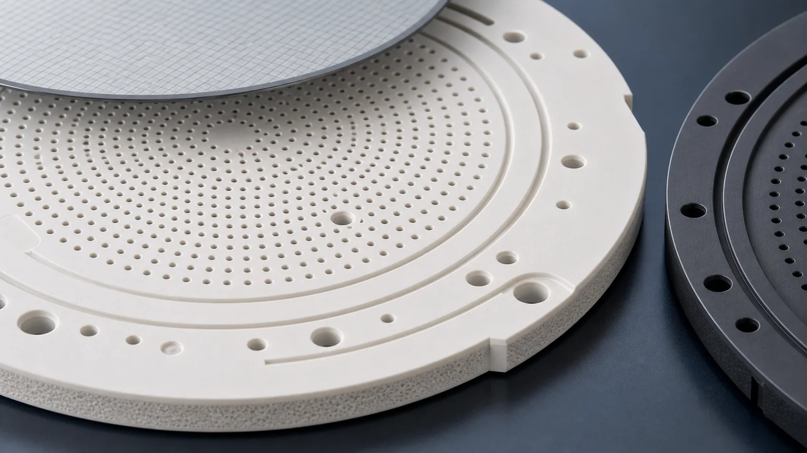
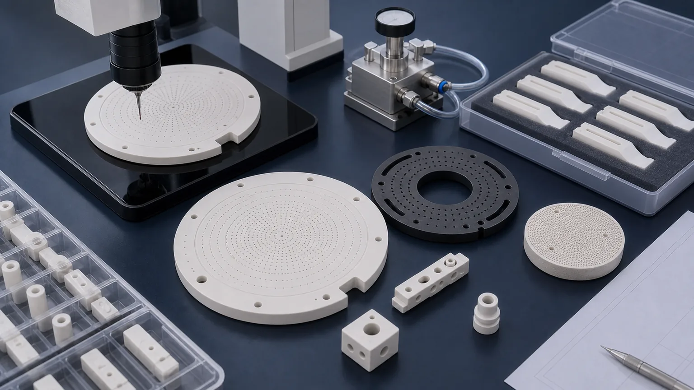

> Machined ceramic vacuum chuck components for semiconductor tools are not just round ceramic plates with holes. They are wafer-support interfaces where flatness, suction distribution, hole quality, groove edges, datum control, surface finish, cleaning, packaging, and inspection evidence decide whether the part can be accepted.

A vacuum chuck component may be a dense alumina suction plate, a porous ceramic insert, a silicon carbide chuck ring, a grooved support table, a vacuum manifold block, a chuck segment, or a metrology support component. In CAD, these parts can look clean and simple. In production, the risk sits in the working face, support condition, vacuum path, hole field, pore structure, lapped surfaces, and the way the finished ceramic part is protected after inspection.

This article focuses on semiconductor tool RFQs for machined ceramic vacuum chuck components. For a broader chuck preparation checklist, use the [ceramic vacuum chuck RFQ guide](/posts/vacuum-chucks/ceramic-vacuum-chuck-flatness-rfq/). For the larger semiconductor component map, use the [precision ceramic components for semiconductor equipment guide](/posts/semiconductor-equipment/precision-ceramic-components-semiconductor-equipment/). If the ring is a process chamber ring rather than a vacuum support or chuck component, use the [precision ceramic rings for semiconductor process chambers guide](/posts/semiconductor-equipment/precision-ceramic-rings-semiconductor-process-chambers/).

### What Counts As A Ceramic Vacuum Chuck Component

The word "vacuum chuck" can describe a complete assembly or one machined ceramic component inside the assembly. Before quoting, the RFQ should make clear which part is being sourced and what the part must prove in use.

| Component type                      | Typical role                                                 | RFQ issue that changes the route                                             |
| ----------------------------------- | ------------------------------------------------------------ | ---------------------------------------------------------------------------- |
| Dense ceramic suction plate         | Supports wafers, substrates, or fixtures through hole fields | Flatness, micro-hole quality, groove geometry, cleaning, and vacuum behavior |
| Porous ceramic chuck insert         | Provides distributed suction across a porous working area    | Porosity, pore opening condition, machining allowance, cleaning, and testing |
| Ceramic chuck segment or ring       | Supports partial wafer or process-side geometry              | Concentricity, lapped bands, hole-to-edge distance, and edge chip criteria   |
| Silicon carbide chuck component     | Adds stiffness, wear resistance, or process-side durability  | Hard grinding, lapped surfaces, edge condition, and inspection evidence      |
| Ceramic manifold or port block      | Connects vacuum path to chuck face or fixture system         | Internal channels, ports, bores, seals, leak path, and cleaning              |
| Metrology or inspection chuck plate | Holds wafer or substrate during measurement                  | Flatness map, datum strategy, surface finish, and repeatability evidence     |

The supplier should know whether the component touches a bare wafer, a carrier, a substrate, a protective film, or another fixture. The working surface, not the outside profile, usually drives the quotation.

### Why Semiconductor Tool Vacuum Chucks Need A Separate Review

Vacuum chuck components in semiconductor tools combine several high-risk requirements in one ceramic part. A typical RFQ may include flatness, hole fields, grooves, low particle risk, clean packaging, and documentation at the same time. That combination cannot be reviewed as a general ceramic plate.

Common review triggers include:

- A wafer-facing working face that needs flatness, low Ra, or lapping.
- Dense micro-hole fields for suction distribution or venting.
- Concentric grooves that sit on a flatness-critical surface.
- Porous ceramic regions that must stay open after machining and cleaning.
- Mounting holes, ports, or backside features that control vacuum connection.
- Large diameter parts where support condition changes measured flatness.
- Edge chip criteria near wafer contact, grooves, holes, or seal bands.
- Cleaning, packaging, traceability, and inspection evidence requirements.

A STEP model can show hole positions and outer shape, but it does not explain the acceptance logic. The RFQ should define whether the part is judged by flatness, vacuum holding, flow, leakage, hole size, surface finish, edge quality, or a combination of these.

### Material Options For Machined Vacuum Chuck Components

Material choice depends on the tool environment, suction method, contact surface, cleaning route, and whether the ceramic is dense or porous.

| Material family                                                                                                                      | Where it may fit                                                        | RFQ notes                                                                                         |
| ------------------------------------------------------------------------------------------------------------------------------------ | ----------------------------------------------------------------------- | ------------------------------------------------------------------------------------------------- |
| [Alumina Al2O3](/posts/industrial-ceramic-machining/precision-machined-alumina-ceramic-parts-industrial-applications/)               | Dense suction plates, insulating chuck components, metrology supports   | Specify purity, density, fired state, lapped faces, hole quality, and cleaning expectation        |
| Porous ceramic                                                                                                                       | Distributed vacuum surfaces and porous inserts                          | Define pore region, pore behavior, machining limits, cleaning, flow, and vacuum test expectations |
| [Silicon carbide SiC](/posts/industrial-ceramic-machining/silicon-carbide-ceramic-machining-harsh-environment-applications/)         | Process-side or wear-resistant chuck rings, stiff supports, harsh zones | Hard finishing, edge chips, low-defect surfaces, and inspection evidence can dominate cost        |
| [Aluminum nitride AlN](/posts/industrial-ceramic-machining/aluminum-nitride-ceramic-machining-thermal-management-components/)        | Heater-adjacent or thermal-interface support components                 | Thermal-interface flatness, moisture handling, and cleaning require review                        |
| [Macor and machinable ceramics](/posts/industrial-ceramic-machining/macor-machinable-glass-ceramic-parts-applications-design-guide/) | Prototype vacuum fixtures or lab handling trials                        | Useful for fast iteration when service limits fit; not a default substitute for production chucks |

If a tool specification locks the material grade, state the exact grade and whether equivalent grade review is allowed. If the material is open, send the wafer size, support condition, vacuum function, temperature, cleaning chemistry, contact sensitivity, and inspection expectations.

For material comparison across ceramic families, use the [ceramic material selection guide](/posts/materials-grade-selection/ceramic-material-selection-cnc-machining/).

### Flatness Must Be Tied To Support Condition

Flatness is often the most expensive and most misunderstood requirement on ceramic vacuum chuck components. A number such as 0.005 mm or 0.010 mm does not mean much unless the drawing also defines how the part is supported and measured.

Clarify these points before quotation:

- Which face is the working face.
- Whether flatness is global, local, radial, zoned, or limited to pads.
- Whether the part is measured free-state, supported, clamped, or in a fixture.
- Whether the face is measured before or after holes and grooves are finished.
- Whether parallelism to a backside datum or mounting surface matters.
- Whether the report needs a flatness map, CMM output, optical method, or agreed fixture measurement.

A large ceramic chuck can pass one measurement setup and fail another. Supported measurement is not a small detail; it can decide whether the part is manufacturable and whether two suppliers are quoting the same acceptance gate.

Use the [ceramic tolerance capability map](/posts/tolerances-gdt/ceramic-tolerance-capability-map-by-feature-process/) when deciding which surfaces need grinding, lapping, CMM evidence, or a fixture-specific method.

### Hole Fields, Grooves, And Working Surface Details

Vacuum chuck components are often dominated by the working surface. Dense ceramic chucks may use drilled holes, micro-holes, radial or concentric grooves, backside channels, vacuum ports, or a mixed design. Porous ceramic chucks add pore behavior to the same flatness and cleaning problem.

Define the working-surface features clearly:

- Hole diameter, tolerance, depth, pitch, and pattern.
- Whether holes are through, blind, angled, stepped, or connected to channels.
- Entry and exit edge condition on the working face and backside.
- Groove width, depth, corner radius, and distance to holes or outer edges.
- Port position, manifold connection, or backside vacuum path.
- Whether grooves or holes are made before or after lapping.
- Whether lapping is allowed to alter hole entry edges.
- Whether the acceptance basis is dimensional, functional, or both.

If the hole field is small, dense, deep, or close to a lapped face, use the [ceramic micro-hole machining RFQ guide](/posts/micro-hole-machining/ceramic-micro-hole-machining-rfq/) to define diameter, depth, taper, breakout, cleaning, and inspection method.

Semiconductor vacuum chuck RFQs should identify the working face, hole field, groove geometry, flatness support condition, cleaning method, and acceptance evidence before quotation.

### Dense Ceramic Chucks Versus Porous Ceramic Inserts

Dense and porous ceramic chuck components should not be quoted with the same assumptions.

Dense ceramic parts are usually reviewed around machining access, hole quality, groove edge condition, flatness, lapping, cleaning, and vacuum connection. The material may be alumina, SiC, or another qualified dense ceramic. The route usually depends on fired-state machining, diamond grinding, micro-drilling, and careful finishing around hole entries and edges.

Porous ceramic inserts add different questions:

- What pore size or pore behavior is required?
- Is the porous region supplied as a separate blank, bonded part, or machined region?
- Can machining close or smear pore openings?
- How is the porous surface cleaned without leaving residue or blockage?
- Is acceptance based on flow, pressure drop, vacuum holding, or visual surface condition?
- Does the drawing require dense mounting features around a porous working area?

If the RFQ only says "porous ceramic chuck" without test conditions, the supplier cannot know whether dimensional inspection alone is enough. A porous chuck component normally needs a functional acceptance discussion.

### Datum Strategy And Mounting Interface

The vacuum chuck component must interface with the tool, not only with the wafer. Mounting bores, counterbores, backside faces, dowel holes, seal grooves, vacuum ports, and alignment features decide how the chuck sits inside the tool.

Useful RFQ details include:

- Primary datum face and whether it is lapped, ground, or as-sintered.
- Backside mounting surface flatness and parallelism.
- Mounting hole position relative to working face and vacuum port.
- Dowel hole or slot position relative to the chuck center.
- Port diameter, counterbore, sealing face, and leak path.
- Whether fasteners create local stress near thin ceramic features.
- Whether the chuck is measured as a standalone part or mounted in an assembly.

The [ceramic CNC machining design rules](/posts/design-rules-dfm/ceramic-cnc-machining-design-rules-advanced-ceramic-parts/) explain why internal radii, hole-to-edge distance, thin sections, and metal-style CAD corners should be reviewed before committing to a ceramic route.

### Surface Finish, Edge Quality, And Particle Risk

Surface finish should be assigned by face. A vacuum chuck may need a controlled working face, but not every clearance surface should receive the same lapping or Ra requirement.

Separate at least these zones:

| Zone                            | What to define                                                 | Why it matters                                           |
| ------------------------------- | -------------------------------------------------------------- | -------------------------------------------------------- |
| Wafer-facing working surface    | Flatness, Ra, lapping, contact marks, cleaning, and inspection | Controls support behavior, particle risk, and acceptance |
| Hole and groove entry edges     | Edge break, chip limit, breakout, and inspection magnification | Controls debris, leakage paths, and wafer-facing quality |
| Seal lands and vacuum ports     | Flatness, surface finish, edge condition, and leak expectation | Controls vacuum connection and assembly reliability      |
| Mounting and backside datums    | Parallelism, flatness, bore position, and practical chamfer    | Controls tool fit and repeatability                      |
| Non-functional outside surfaces | General edge break and visual acceptance                       | Avoids overpricing surfaces that do not affect function  |

Use the [surface finish and subsurface damage guide](/posts/surface-finish-functional/ceramic-ssd-surface-finish-specify-control-price/) when Ra, lapping, polishing, microscopy, or surface integrity affects the working surface.

A vague note such as "no chips" is not enough. Define the chip-sensitive zones and the maximum allowable chip size or visual criterion. The edge at a vacuum hole on the working face should not be treated the same as a non-contact outside corner.

### Cleaning, Vacuum Testing, And Inspection Evidence

Semiconductor vacuum chuck components often need both dimensional evidence and functional evidence. The correct evidence depends on how the part will be accepted by the buyer or tool owner.

Inspection planning should connect each functional requirement to a measurement or test method.

| Requirement                     | Evidence to discuss                                             | RFQ note                                                                      |
| ------------------------------- | --------------------------------------------------------------- | ----------------------------------------------------------------------------- |
| Working face flatness           | Flatness map, optical method, CMM, or agreed fixture method     | State free-state or supported measurement condition                           |
| Hole field quality              | Optical measurement, microscope image, pin gauge, or sampling   | Define diameter, depth, pitch, taper, entry edge, and breakout requirements   |
| Groove geometry                 | CMM, optical scan, profile measurement, or key dimensions       | Include width, depth, radius, and edge condition                              |
| Vacuum or flow behavior         | Flow check, leakage check, vacuum holding test, or fixture test | Define medium, pressure, support condition, and acceptance limit              |
| Porous insert behavior          | Flow, pressure drop, visual pore review, or cleaning record     | Dimensional inspection alone may not prove function                           |
| Cleanliness and packaging       | Cleaning note, blockage review, separators, or custom trays     | Protect lapped faces, hole entries, porous surfaces, and chip-sensitive edges |
| Datum and mounting relationship | CMM report, fixture gauge, or key-dimension report              | Datums must be stable and physically inspectable                              |

The [custom ceramic CNC machining RFQ checklist](/posts/rfq-preparation/custom-ceramic-cnc-machining-rfq-checklist/) is a useful base for organizing drawing, CAD, material, quantity, timing, and acceptance requirements.

### Cost Drivers In Semiconductor Vacuum Chuck Components

The cost of a ceramic vacuum chuck component is rarely driven by outside diameter alone. The expensive parts of the RFQ are usually concentrated in surface control, holes, grooves, cleaning, and inspection.

Common cost drivers include:

1. Ceramic grade, blank size, and dense or porous material route.
2. Large working-face flatness and support-condition measurement.
3. Lapping or low-Ra finishing area.
4. Micro-hole count, diameter, aspect ratio, taper, and breakout criteria.
5. Groove geometry, corner radius, and proximity to holes or edges.
6. Backside ports, internal channels, counterbores, and seal lands.
7. Tight datum relationship between working face and mounting features.
8. Edge chip criteria in wafer-facing or vacuum-facing zones.
9. Cleaning, blockage review, protected packaging, and documentation.
10. Functional vacuum, leakage, flow, or customer fixture testing.

The best cost control is not to remove all precision. It is to define which surfaces control wafer support and vacuum performance, then allow standard finish and practical tolerance where the geometry is only clearance or handling.

### RFQ Checklist For Machined Ceramic Vacuum Chuck Components

Before expecting a reliable quotation, send:

- 2D drawing with revision and STEP or native CAD file.
- Component type: dense suction plate, porous insert, chuck ring, chuck segment, manifold block, support table, or metrology chuck.
- Material family, grade, purity, density, porosity, and whether equivalent grade review is allowed.
- Blank source and blank state: customer-supplied, supplier-sourced, fired, green, porous, plate, ring, or near-net.
- Wafer or substrate size, supported area, vacuum function, and tool environment.
- Working face, backside datum, mounting face, seal lands, ports, and particle-sensitive zones marked on the drawing.
- Flatness, parallelism, profile, or height requirements with support and measurement condition.
- Hole diameter, depth, pitch, pattern, taper, entry and exit edge requirements.
- Groove width, depth, radius, pattern, and edge condition.
- Surface finish, lapping, polishing, and cleaning requirements by face.
- Vacuum test, leakage test, flow test, or blockage review expectation if required.
- Inspection report scope, traceability, certificate, packaging, and clean handling needs.
- Quantity, prototype or production intent, target timing, and qualification stage.

If the project is still being designed, state which requirements are open. A supplier can still review risk, but a quote built on unknown flatness support condition or unknown vacuum acceptance should not be treated as final.

### Practical Takeaway

Machined ceramic vacuum chuck components for semiconductor tools should be sourced as precision support and vacuum interfaces. The important questions are specific: which face supports the wafer, how flatness is measured, how suction is distributed, which hole and groove edges are particle-sensitive, whether the porous region must be functionally tested, how the part mounts into the tool, and what inspection evidence proves acceptance.

Good RFQs separate material route, dense or porous construction, working face flatness, hole and groove details, datum strategy, edge criteria, cleaning, packaging, and functional test expectations before price and lead time are confirmed. That approach helps engineering and procurement compare suppliers on manufacturable risk instead of on an under-specified ceramic plate.

For a direct project review, use the [RFQ input page](/rfq/) and include the drawing, CAD file, material requirement, quantity, target timing, working face definition, vacuum function, and acceptance evidence.

### FAQ

**What ceramic materials are used for semiconductor vacuum chuck components?**  
Common directions include alumina, porous ceramic, silicon carbide, and selected application-specific ceramics. The final route depends on wafer contact, flatness, vacuum behavior, cleaning, temperature, qualification, and inspection requirements.

**Can a ceramic vacuum chuck component be quoted from a STEP file only?**  
A STEP file can start geometry review, but a reliable quote usually needs a drawing, material grade, working face definition, flatness support condition, hole and groove details, surface finish, quantity, and inspection requirements.

**What is the most important tolerance on a ceramic vacuum chuck?**  
Often it is working-face flatness, but only when the support and measurement condition are defined. Hole field quality, groove geometry, datum relationship, and surface finish may be just as important depending on the chuck function.

**Are porous ceramic chucks inspected like dense ceramic plates?**  
No. Porous ceramic parts may need flow, pressure drop, pore opening, cleaning, or vacuum behavior review. Dimensional inspection alone may not prove the working surface will function.

**Should the entire chuck be polished or lapped?**  
Usually no. Lapping or low-Ra finish should be assigned to the functional working face, seal lands, datum pads, or contact surfaces. Clearance and non-functional faces often do not need the same finish.

**What inspection evidence should be requested?**  
Common options include flatness maps, CMM reports, optical hole checks, groove profile checks, surface finish readings, visual edge criteria, cleaning notes, leakage or flow tests, and protected packaging confirmation.

> RFQ note: Final feasibility, tolerance, price, lead time, cleaning method, vacuum test, packaging, and inspection scope depend on drawing review, ceramic grade, blank state, functional surfaces, machining route, and acceptance method.
