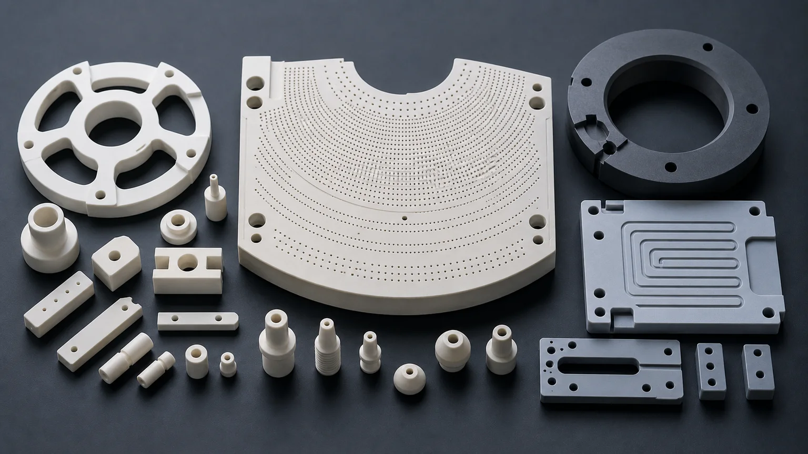
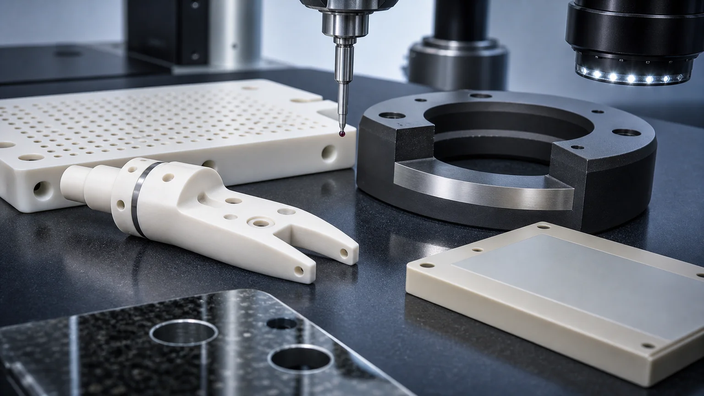

> Precision ceramic components for semiconductor equipment are not purchased as generic ceramic parts. They are functional interfaces inside wafer handling, vacuum, etch, deposition, inspection, thermal management, and clean automation systems. The RFQ should define material grade, finished faces, edge condition, flatness, surface finish, micro-features, cleaning, and inspection evidence before price or lead time is treated as reliable.

Semiconductor equipment uses technical ceramics because metals and polymers often cannot provide the same combination of electrical insulation, dimensional stability, wear resistance, plasma resistance, thermal behavior, chemical stability, and clean surface performance. But a ceramic component only becomes useful after the drawing, blank state, machining route, and acceptance method are clear.

A wafer support pin, ceramic end effector, vacuum chuck segment, SiC process ring, AlN heat spreader, alumina insulator, micro-hole gas plate, nozzle, spacer, or metrology fixture may look simple in CAD. In production, the risk usually sits in the interfaces: the wafer-facing surface, vacuum groove, lapped band, bore relationship, hole field, datum pad, chip-sensitive edge, thermal contact face, or plasma-exposed surface.

This guide is written for engineering and sourcing teams preparing RFQs for custom precision ceramic components used in semiconductor equipment. It complements the broader [AI semiconductor equipment ceramic parts guide](/posts/semiconductor-equipment/ai-semiconductor-equipment-ceramic-parts/) by focusing on component families, material routes, machining risks, and inspection requirements. For SiC and alumina process chamber rings, lapped annular bands, ID/OD control, groove edges, cleaning, and ring inspection evidence, use the [precision ceramic rings for semiconductor process chambers guide](/posts/semiconductor-equipment/precision-ceramic-rings-semiconductor-process-chambers/).

### Where Precision Ceramic Components Fit In Semiconductor Equipment

Semiconductor ceramic components are used where a part must remain stable, clean, insulating, wear-resistant, or chemically compatible while supporting tight geometry. The same machine may use several ceramic families for different reasons.

| Equipment area               | Ceramic component examples                                                    | Why ceramic is used                                                  | RFQ risk to clarify                                                                 |
| ---------------------------- | ----------------------------------------------------------------------------- | -------------------------------------------------------------------- | ----------------------------------------------------------------------------------- |
| Wafer handling and transfer  | End effectors, blades, lift pins, support pins, spacers, grippers             | Low particle risk, stiffness, insulation, dimensional stability      | Wafer-facing edge quality, flatness, weight, slots, mounting holes, and packaging   |
| Vacuum chucking and support  | Dense vacuum chucks, porous ceramic chucks, suction plates, support tables    | Flatness, vacuum distribution, wear resistance, clean contact        | Hole field, groove geometry, porous region, flatness map, cleaning, and test method |
| Etch and deposition hardware | SiC rings, alumina insulators, nozzles, gas baffles, chamber-adjacent parts   | Plasma exposure, chemical resistance, insulation, erosion resistance | Grade, edge chips, lapped surfaces, particle-sensitive zones, and documentation     |
| Thermal management           | AlN plates, heat spreaders, insulating thermal spacers, heater-adjacent parts | Thermal conductivity with electrical insulation                      | Thermal-interface flatness, Ra, thickness control, moisture handling, and cleaning  |
| Gas and flow control         | Micro-hole plates, nozzles, restrictors, manifolds, orifice inserts           | Stable flow, insulation, corrosion resistance, cleanability          | Hole diameter, pitch, depth, taper, breakout, blockage, and inspection              |
| Inspection and metrology     | Ceramic reference plates, holders, alignment fixtures, vacuum support parts   | Dimensional stability, low wear, nonmagnetic or insulating behavior  | Datum strategy, flatness, CMM access, report method, and packaging                  |

The important point is that "semiconductor ceramic component" is not a manufacturing route. It is an application environment. The route still depends on whether the part is fired alumina, silicon carbide, aluminum nitride, zirconia, silicon nitride, Macor, boron nitride, fused silica, porous ceramic, or another qualified material.

Precision semiconductor ceramic RFQs should separate part function, material family, finished surfaces, edge requirements, cleaning needs, and inspection evidence.

### Common Materials For Semiconductor Ceramic Components

Material choice should follow tool environment and feature risk. A part that touches a wafer, supports a plasma-facing assembly, transfers heat, insulates a high-voltage area, or distributes gas should not be selected by material name alone.

| Material family                                                                                                               | Typical semiconductor use                                                               | Machining and RFQ notes                                                                          |
| ----------------------------------------------------------------------------------------------------------------------------- | --------------------------------------------------------------------------------------- | ------------------------------------------------------------------------------------------------ |
| [Alumina Al2O3](/posts/industrial-ceramic-machining/precision-machined-alumina-ceramic-parts-industrial-applications/)        | Insulators, spacers, lift pins, fixture parts, nozzles, general clean hardware          | Specify purity, density, fired state, functional faces, edge break, and cleaning expectations    |
| [Silicon carbide SiC](/posts/industrial-ceramic-machining/silicon-carbide-ceramic-machining-harsh-environment-applications/)  | Process rings, chamber-adjacent parts, wafer support hardware, seals, wear parts        | Hard finishing, lapped faces, edge quality, grade, and documentation can dominate cost           |
| [Aluminum nitride AlN](/posts/industrial-ceramic-machining/aluminum-nitride-ceramic-machining-thermal-management-components/) | Heat spreaders, insulating thermal plates, power module fixtures, heater-adjacent parts | Flatness, thickness, Ra, moisture exposure, handling, and thermal-interface surfaces need review |
| Zirconia ZrO2                                                                                                                 | Pins, wear features, precision guide parts, selected mechanisms                         | Toughness can help some features, but temperature and environment still matter                   |
| Silicon nitride Si3N4                                                                                                         | Structural wear parts, rollers, guide features, thermally cycled components             | Load path, sliding contact, roundness, and grade should be clarified                             |
| Macor and machinable ceramics                                                                                                 | Prototype insulating fixtures, lab fixtures, test hardware                              | Useful for fast iteration, not a default substitute for production-grade structural ceramics     |
| Boron nitride BN                                                                                                              | High-temperature insulation, source fixtures, thermal process spacers                   | Grade, atmosphere, temperature, and contact load are more important than shape alone             |
| Fused silica / quartz-related materials                                                                                       | Thermal shock, optical-adjacent, clean fixtures, selected process hardware              | Edge quality, thermal exposure, surface condition, and handling are key                          |

For a broad decision path, use the [ceramic material selection guide](/posts/materials-grade-selection/ceramic-material-selection-cnc-machining/) before locking the RFQ. If the part is already tied to an approved material or tool qualification, say whether equivalent grade review is allowed or prohibited.

### Component Geometry That Changes Feasibility

Semiconductor components often fail quotation review because the drawing defines geometry but not function. The supplier can see the model, but cannot know which surface touches the wafer, which edge is particle-sensitive, which bore is only clearance, or which face must be lapped unless the RFQ says so.

High-impact geometry includes:

- Wafer-facing contact surfaces with flatness, parallelism, profile, or low Ra requirements.
- Micro-hole arrays for vacuum, gas distribution, dosing, or venting.
- Thin ceramic arms, blades, ribs, slots, and unsupported sections.
- Precision bores, mounting holes, counterbores, and datum relationships.
- Lapped seal lands, vacuum grooves, and chamber-facing bands.
- Internal radii and pocket corners that were copied from metal parts.
- Sharp edges near wafer, seal, gas, plasma, or clean-contact zones.
- Large flat ceramic plates that may warp, bow, or require supported measurement.

The [ceramic CNC machining design rules](/posts/design-rules-dfm/ceramic-cnc-machining-design-rules-advanced-ceramic-parts/) explain why metal-style features often need radius, edge-break, support, and inspection review before machining. For legacy DFM context, the [ceramic DFM design rules](/posts/design-rules-dfm/ceramic-dfm-design-rules/) are still useful for holes, slots, thin walls, and measurable acceptance.

### Wafer Handling Parts: Edges, Flatness, And Weight

Ceramic wafer handling components include end effectors, blades, lift pins, support pins, spacer pads, grippers, carriers, and fixture parts. The usual goal is not simply strength. The goal is stable contact, low particle risk, controlled edge condition, and repeatable positioning.

Useful RFQ details include:

- Wafer or substrate size and contact area.
- Which surfaces touch the wafer or support a carrier.
- Maximum allowable edge chip or visual criterion on contact zones.
- Flatness or profile requirement on support faces.
- Mounting hole relationship and datum scheme.
- Weight or stiffness constraint for moving tools.
- Cleaning, packaging, and handling requirement.
- Prototype versus qualified production intent.

If the wafer-facing surface is critical, mark it directly on the drawing. If only small pads touch the wafer, do not apply tight flatness to the entire body unless that is truly needed. This reduces grinding, lapping, and inspection cost while keeping the functional contact under control.

For SiC-specific blades, lift pins, support pads, and edge-contact parts, use the focused [silicon carbide wafer handling components guide](/posts/semiconductor-equipment/silicon-carbide-wafer-handling-components-semiconductor-manufacturing/) before defining contact zones, chip criteria, cleaning, and packaging. For material-neutral end effector geometry across alumina, SiC, silicon nitride, zirconia, and prototype ceramics, use the [ceramic end effectors for wafer handling guide](/posts/semiconductor-equipment/ceramic-end-effectors-wafer-handling-automation/).

### Vacuum Chucks And Suction Plates

Vacuum chucks and suction plates are among the highest-value semiconductor ceramic RFQs because they combine flatness, vacuum behavior, hole or pore geometry, cleaning, and inspection. Dense ceramic chucks with drilled holes are not reviewed the same way as porous ceramic chucks or hybrid chuck assemblies.

For chuck-specific projects, use the dedicated [ceramic vacuum chuck RFQ guide](/posts/vacuum-chucks/ceramic-vacuum-chuck-flatness-rfq/). For semiconductor tool chuck plates, porous inserts, SiC chuck rings, support tables, and manifold blocks, use the [machined ceramic vacuum chuck components guide](/posts/semiconductor-equipment/machined-ceramic-vacuum-chuck-components-semiconductor-tools/). At minimum, the RFQ should define:

- Dense ceramic, porous ceramic, grooved suction plate, or hybrid design.
- Working surface and support condition.
- Flatness value and measurement method.
- Hole diameter, pitch, depth, and pattern.
- Groove width, depth, corner radius, and distance to edge.
- Vacuum port, manifold, or backside connection details.
- Flow, leakage, or vacuum holding test expectation.
- Cleaning method and blockage check.
- Whether the contact face is ground, lapped, polished, or otherwise controlled.

One common mistake is quoting a vacuum chuck as a plate with holes. That misses the real acceptance gate: flatness under the right support condition, suction uniformity, hole quality, groove edge condition, cleanability, and whether the buyer needs dimensional evidence, flow evidence, or both.

### Gas Plates, Nozzles, And Micro-Hole Ceramic Parts

Gas distribution plates, shower plates, nozzles, restrictors, orifice inserts, and ceramic manifolds can be difficult because small holes concentrate both machining and inspection risk. Diameter alone is not enough.

Define:

- Hole diameter and tolerance.
- Hole depth and aspect ratio.
- Pitch, pattern, and distance to edges or grooves.
- Through-hole, blind-hole, angled-hole, or intersecting-channel condition.
- Entry and exit edge requirement.
- Taper allowance.
- Cleaning and blockage expectations.
- Inspection method: optical, pin gauge, flow test, CT, section review, or sampling plan.

The [ceramic micro-hole machining RFQ guide](/posts/micro-hole-machining/ceramic-micro-hole-machining-rfq/) gives a focused checklist for this type of part. For semiconductor equipment, the hole field may be less about one perfect diameter and more about repeatable gas or vacuum behavior across a functional surface.

### SiC Rings, Chamber-Adjacent Parts, And Process Hardware

Silicon carbide ceramic components are often considered when the tool environment includes plasma exposure, chemical attack, abrasive wear, high temperature, or a need for high stiffness and clean surface behavior. Typical parts include SiC rings, support hardware, seal-related components, process-side plates, nozzles, sleeves, and wear surfaces.

SiC RFQs should state:

- Whether the part is process-side, fixture-side, or maintenance tooling.
- Grade or material route requirement.
- Plasma, chemical, thermal, or cleaning exposure.
- Which surfaces are lapped, ground, or non-critical.
- Edge chip criteria in particle-sensitive zones.
- Flatness, runout, profile, or concentricity requirements.
- Documentation, cleaning, packaging, or traceability expectations.

The [silicon carbide ceramic machining guide](/posts/industrial-ceramic-machining/silicon-carbide-ceramic-machining-harsh-environment-applications/) covers SiC material and finishing risk in more detail. In semiconductor projects, SiC cost often comes from the combination of hard material, low-defect surfaces, lapped bands, edge protection, and inspection evidence.

### AlN Thermal Plates And Electrically Insulating Heat Spreaders

Aluminum nitride is reviewed when thermal conductivity and electrical insulation must work together. Semiconductor equipment may use AlN or related ceramics in heater-adjacent parts, thermal plates, power module fixtures, carriers, spacers, and insulating heat spreaders.

AlN components are not just flat ceramic plates. The RFQ should separate:

- Thermal-interface faces.
- Electrical insulation paths.
- Mounting holes and counterbores.
- Thickness and parallelism requirements.
- Flatness under support condition.
- Surface finish on heat-transfer faces.
- Cleaning and moisture handling.
- Packaging to protect precision faces.

Use the [aluminum nitride ceramic machining guide](/posts/industrial-ceramic-machining/aluminum-nitride-ceramic-machining-thermal-management-components/) for material-specific guidance. A blanket fine finish on every face is usually not the best path. The functional thermal-contact faces should receive the strongest control.

### Tolerances, Surface Finish, And Inspection Evidence

Tight tolerances are not automatically wrong in semiconductor ceramic components. The problem is tight tolerance without a feature hierarchy.

Before quotation, separate:

- Primary datums.
- Wafer-facing contact surfaces.
- Vacuum or gas functional surfaces.
- Plasma-facing or chemically exposed faces.
- Thermal-interface faces.
- Precision bores and pin locations.
- Handling edges.
- Non-critical clearance geometry.

Use the [ceramic tolerance capability map](/posts/tolerances-gdt/ceramic-tolerance-capability-map-by-feature-process/) when deciding which features need grinding, lapping, or special inspection. Use the [surface finish and subsurface damage guide](/posts/surface-finish-functional/ceramic-ssd-surface-finish-specify-control-price/) when Ra, lapping, polishing, microscopy, or surface integrity affects acceptance.

Inspection should prove the functional requirement, not create paperwork for every surface. Common evidence options include:

| Requirement               | Typical evidence to discuss                                                  | RFQ note                                                           |
| ------------------------- | ---------------------------------------------------------------------------- | ------------------------------------------------------------------ |
| Flatness or parallelism   | Flatness map, CMM, optical method, surface plate method, or agreed fixture   | State support condition and measured face                          |
| Hole field or nozzle bore | Optical measurement, pin gauge, microscope image, flow test, CT, or sampling | Define whether dimensional or functional flow evidence is required |
| Edge quality              | Visual standard, microscopy, chip limit by zone, packaging note              | "No chips" is not enough without zone and criterion                |
| Surface finish            | Ra measurement, lapping note, method and location                            | Apply to functional faces only                                     |
| Datum and position        | CMM report, fixture gauge, key-dimension report                              | Datums must be measurable and stable                               |
| Cleanliness or blockage   | Cleaning record, optical review, air-flow check, packaging requirement       | Define incoming acceptance before production                       |

### Cost Drivers In Semiconductor Ceramic Components

Cost is often driven less by outside size and more by the precision logic around the part.

Important cost drivers include:

1. Material grade, purity, and blank availability.
2. Fired ceramic hardness and diamond grinding time.
3. Lapping or polishing area.
4. Flatness and support-condition measurement.
5. Micro-hole count, aspect ratio, taper, and inspection.
6. Thin walls, slots, and fragile unsupported geometry.
7. Edge-break and chip-control requirements.
8. Cleaning, packaging, and particle-sensitive handling.
9. Documentation, traceability, and report scope.
10. Prototype validation before repeat production.

The goal is not to make the drawing loose. The goal is to place precision where it creates tool performance. A well-prepared RFQ lets the supplier quote the functional surfaces accurately and avoid pricing uncertainty across the whole part.

### RFQ Checklist For Precision Semiconductor Ceramic Components

Send the following before expecting a reliable quotation:

- 2D drawing with revision and a STEP or native CAD file.
- Component function: wafer handling, vacuum chuck, gas plate, insulator, thermal plate, ring, nozzle, fixture, or other.
- Material family, grade, purity, and whether equivalent grade review is allowed.
- Blank source and state: customer-supplied, supplier-sourced, fired, green, porous, plate, tube, rod, or near-net.
- Quantity, prototype or production intent, target timing, and qualification stage.
- Functional surfaces: wafer-facing, vacuum-facing, plasma-facing, thermal-interface, datum, seal, bore, or flow-control.
- Critical tolerances and GD&T by feature.
- Surface finish, lapping, flatness, or polishing by face.
- Edge break, chamfer, radius, and chip criteria by zone.
- Micro-hole, groove, slot, bore, and thin-wall details.
- Cleaning, packaging, traceability, certificate, or inspection report needs.
- Operating environment: vacuum, gas, plasma, chemical, temperature, thermal cycling, voltage, wear, or cleanliness.

Use the [custom ceramic CNC machining RFQ checklist](/posts/rfq-preparation/custom-ceramic-cnc-machining-rfq-checklist/) to organize the drawing package. For broad feasibility review, start with the [precision ceramic machining overview](/posts/industrial-ceramic-machining/precision-ceramic-machining-high-performance-industrial-components/).

### Practical Takeaway

Precision ceramic components for semiconductor equipment should be reviewed as engineered interfaces, not generic ceramic shapes. The important questions are specific: which surface touches a wafer, which face controls vacuum, which ring sees plasma, which plate transfers heat, which hole controls flow, which datum controls assembly, which edge is particle-sensitive, and which inspection method proves acceptance.

Good semiconductor ceramic RFQs identify the material route, functional surfaces, feature risks, surface finish, tolerance scope, edge criteria, cleaning, packaging, and evidence package before price and lead time are confirmed. That approach helps engineering and procurement compare suppliers on manufacturing logic rather than on an under-specified number.

For a direct project review, use the [RFQ input page](/rfq/) and include the drawing, CAD file, material requirement, quantity, target timing, functional surfaces, and acceptance evidence.

### FAQ

**What are the most common ceramic components in semiconductor equipment?**  
Common examples include wafer handling blades, end effectors, lift pins, vacuum chucks, porous suction plates, SiC rings, alumina insulators, AlN thermal plates, micro-hole gas plates, nozzles, spacers, and precision fixtures.

**Which ceramic material is best for semiconductor components?**  
There is no universal answer. Alumina, SiC, AlN, zirconia, silicon nitride, Macor, BN, fused silica, and porous ceramics can all fit different tool locations. The operating environment and functional feature decide the material route.

**Why are semiconductor ceramic parts expensive to quote?**  
Cost usually comes from material grade, diamond grinding, lapping, flatness, micro-holes, chip-sensitive edges, cleaning, inspection, and documentation. Outside dimensions alone rarely explain the quote.

**Can a supplier quote from a STEP file only?**  
A STEP file can start discussion, but a formal quote usually needs a drawing, material note, quantity, functional surfaces, tolerances, surface finish, edge criteria, and inspection requirements.

**Should all semiconductor ceramic surfaces be polished?**  
No. Finish should be assigned by function. Wafer-facing, seal, sliding, thermal-interface, vacuum, or plasma-facing surfaces may need specific control, while clearance geometry often does not.

> RFQ note: Final feasibility, tolerance, price, lead time, and inspection scope depend on drawing review, material grade, blank state, machining route, functional surfaces, and acceptance method.
