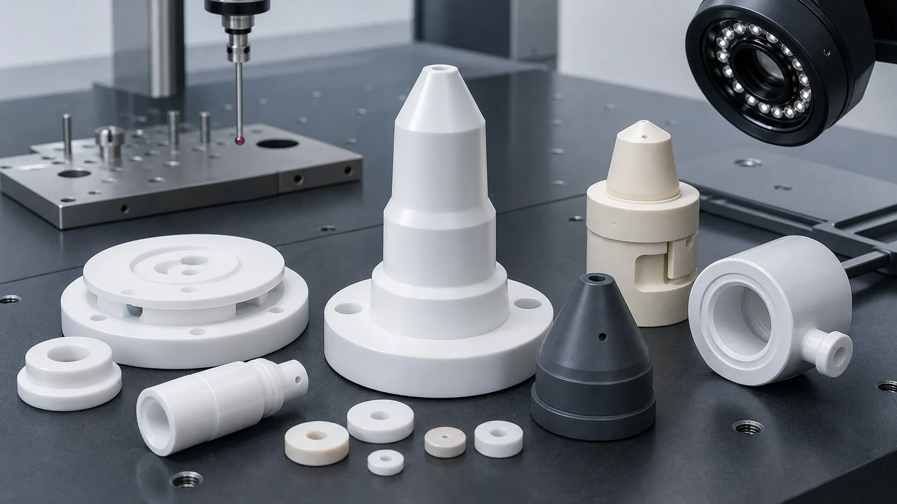
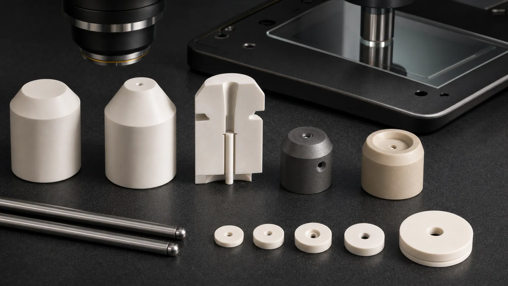
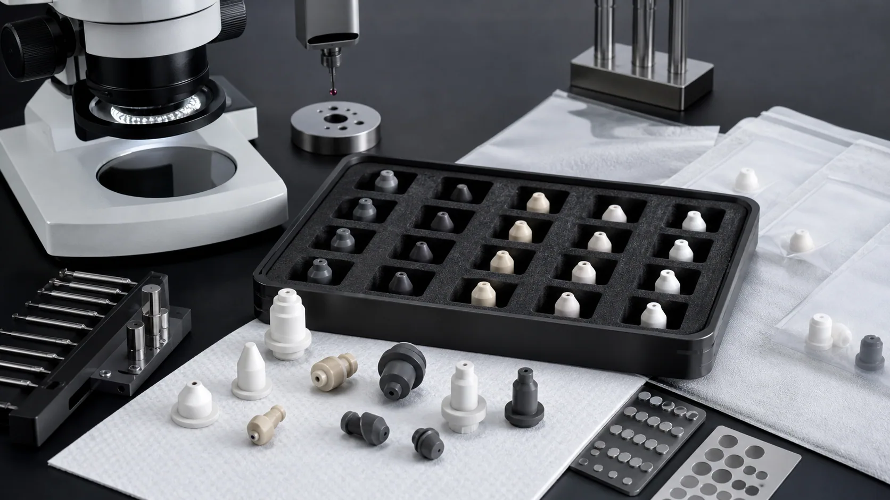

> Precision ceramic nozzles used in semiconductor, vacuum, dispensing, and clean industrial equipment should be reviewed as flow-control and interface components, not as simple ceramic tubes. The finished bore, exit edge, sealing face, material grade, cleaning method, and inspection evidence can decide whether the part is useful.

Ceramic nozzles are small parts with large RFQ consequences. A drawing may look like a cone, sleeve, insert, or small tube, but the functional risk usually sits in the orifice, bore, entry taper, exit edge, sealing face, mounting diameter, and cleaning path. That is why a ceramic nozzle quote should not be based only on outside shape or material name.

This article is a precision ceramic machining case guide for nozzle-style components used near semiconductor equipment, vacuum assemblies, gas delivery hardware, dispensing systems, inspection tools, chemical handling, and high-temperature industrial fixtures. It is not a 3D printing nozzle article. The focus is custom machined alumina, zirconia, silicon carbide, silicon nitride, boron nitride, Macor, and related technical ceramic nozzles where drawings, tolerances, edge quality, and inspection evidence matter.

For the closest supporting pages, use the [ceramic micro-hole machining RFQ guide](/posts/micro-hole-machining/ceramic-micro-hole-machining-rfq/), the [precision ceramic components for semiconductor equipment guide](/posts/semiconductor-equipment/precision-ceramic-components-semiconductor-equipment/), and the [custom ceramic CNC machining RFQ checklist](/posts/rfq-preparation/custom-ceramic-cnc-machining-rfq-checklist/). If the nozzle sits near a vacuum surface or wafer support module, also review the [machined ceramic vacuum chuck components guide](/posts/semiconductor-equipment/machined-ceramic-vacuum-chuck-components-semiconductor-tools/).

### Why Ceramic Nozzles Are A Strong Long-Term Case Topic

The current industry signal supports this topic, but the search value is not temporary. Semiconductor equipment investment, AI-driven fab expansion, advanced packaging, vacuum processing, high-precision dispensing, metrology, and clean automation all create demand for small ceramic components that control gas, liquid, suction, wear, temperature, or electrical isolation.

[SEMI reported in April 2026](https://www.semi.org/en/semi-press-release/semi-projects-double-digit-growth-in-global-300mm-fab-equipment-spending-for-2026-and-2027) that worldwide 300mm fab equipment spending is expected to grow in 2026 and 2027, with AI chip demand as a key driver. This matters for ceramic nozzles because tool expansion does not only increase demand for large chambers and wafer handling parts. It also increases the number of precision orifice, gas, vacuum, purge, dispensing, insulation, and clean handling components inside equipment supply chains.

Technical ceramic suppliers also show that the search intent is real. [Kyocera describes high precision ceramic nozzles with micro holes](https://global.kyocera.com/prdct/fc/technologies/008.html), including internal diameters starting from 0.1 mm in its reference example. For a machining website, the useful SEO angle is not simply "ceramic nozzle." The higher-value angle is the RFQ problem: which material, bore geometry, surface finish, edge quality, inspection method, and cleaning requirement make the nozzle acceptable.

### What Counts As A Precision Ceramic Nozzle

In procurement language, several part names can point to a nozzle-style ceramic component:

| Part name                            | Typical function                                                 | RFQ issue that changes the route                                      |
| ------------------------------------ | ---------------------------------------------------------------- | --------------------------------------------------------------------- |
| Ceramic gas nozzle                   | Controls clean gas, purge gas, carrier gas, or process flow      | Bore size, taper, exit edge, cleaning, and flow evidence              |
| Ceramic vacuum nozzle or suction tip | Provides pickup, suction, or localized vacuum interface          | Face flatness, hole edge, particle risk, and wear at the contact zone |
| Ceramic dispensing nozzle            | Controls adhesive, reagent, chemical, or precision fluid         | Internal surface, residue risk, bore finish, and chemical resistance  |
| Ceramic orifice insert               | Restricts or meters flow through a small hole                    | Diameter, roundness, burr-free/chip-free edge, and inspection method  |
| High-temperature BN nozzle           | Guides molten, hot, or reactive media where BN is suitable       | Atmosphere, load, handling sensitivity, and thermal shock review      |
| SiC nozzle or wear insert            | Resists abrasion, corrosion, plasma-adjacent wear, or harsh flow | Fired hardness, diamond grinding, edge integrity, and cleaning        |
| Zirconia precision nozzle            | Provides tough, fine-bore wear resistance in small geometry      | Bore concentricity, thin wall, ID finish, and straightness            |
| Alumina insulating nozzle            | Combines flow path and electrical insulation                     | Purity, dielectric path, mounting face, and chip criteria             |

Two parts can both be called ceramic nozzles but require different manufacturing logic. A zirconia suction tip, a SiC gas nozzle, a boron nitride high-temperature nozzle, an alumina purge insert, and a Macor prototype nozzle should not be quoted with the same assumptions.

The practical RFQ question is:

**Which feature controls function: bore diameter, flow path, contact face, exit edge, chemical exposure, temperature, insulation path, wear surface, or cleaning requirement?**

### Case Pattern: A Clean Gas Or Vacuum Ceramic Nozzle

A typical high-value case is a small ceramic nozzle used in a semiconductor-adjacent gas, vacuum, inspection, or dispensing module. The customer may send a STEP file showing a tapered nozzle body, a central bore, a mounting shoulder, and one lapped face. The first quote risk is not the outside cone. It is the bore and the acceptance gate.

Important review questions include:

- Is the bore a simple through hole, stepped bore, blind feature, taper, counterbore, or side port?
- Is the functional dimension the nominal hole size, the flow result, or the relationship between ID and OD?
- Does the exit edge need a controlled chamfer, sharp edge, radius, or chip limit?
- Is the bore inspected by pin gauge, optical method, microscope, air flow, liquid flow, or customer functional test?
- Is the nozzle used dry, wet, hot, chemically exposed, vacuum-side, process-side, or fixture-side?
- Are particles, residue, chips, or trapped media an acceptance risk?
- Does the mounting face need lapping, flatness, parallelism, or protected packaging?

If these points are missing, the supplier can machine a dimensionally plausible ceramic part and still miss the real function.

### Material Selection For Ceramic Nozzles

Material should be selected by function and environment, not by a generic ranking table. The same bore geometry may point to different materials depending on wear, temperature, chemical exposure, dielectric need, and whether a prototype must be machined quickly.

| Material family                                                                                                               | Where it may fit                                                                        | RFQ notes                                                                                                        |
| ----------------------------------------------------------------------------------------------------------------------------- | --------------------------------------------------------------------------------------- | ---------------------------------------------------------------------------------------------------------------- |
| [Alumina Al2O3](/posts/industrial-ceramic-machining/precision-machined-alumina-ceramic-parts-industrial-applications/)        | Insulating nozzles, gas nozzles, clean fixtures, wear-resistant inserts                 | Specify purity, density, fired state, dielectric path, bore edge, and lapped faces                               |
| [Zirconia ZrO2](/posts/industrial-ceramic-machining/zirconia-ceramic-machining-high-strength-precision-components/)           | Fine-bore suction tips, dispensing nozzles, thin-wall tubes, wear-resistant small parts | Review bore concentricity, thin wall, toughness benefit, temperature limit, and surface finish                   |
| [Silicon carbide SiC](/posts/industrial-ceramic-machining/silicon-carbide-ceramic-machining-harsh-environment-applications/)  | Abrasive, corrosive, plasma-adjacent, or harsh gas-flow nozzles                         | Diamond machining, edge quality, cleaning, and grade selection can dominate cost                                 |
| [Silicon nitride Si3N4](/posts/industrial-ceramic-machining/silicon-nitride-ceramic-machining-structural-wear-parts/)         | Structural wear nozzles, impact-sensitive or thermal-shock-sensitive assemblies         | Load path, bore relationship, and grade should be clarified before quotation                                     |
| [Boron nitride BN](/posts/industrial-ceramic-machining/boron-nitride-ceramic-machining-high-temperature-insulation-parts/)    | High-temperature insulation, non-wetting contact, molten or hot handling where suitable | Grade, atmosphere, contact load, moisture handling, and edge fragility need review                               |
| [Macor](/posts/industrial-ceramic-machining/macor-machinable-glass-ceramic-parts-applications-design-guide/)                  | Fast prototype nozzles, lab fixtures, vacuum prototypes, proof-of-geometry parts        | Useful for machining speed, but not a substitute for fired alumina, SiC, Si3N4, or zirconia in every environment |
| [Aluminum nitride AlN](/posts/industrial-ceramic-machining/aluminum-nitride-ceramic-machining-thermal-management-components/) | Selected thermal-interface nozzle-adjacent components or insulating thermal supports    | Usually reviewed for thermal and electrical function, not as the default nozzle material                         |

If the part must match an already qualified tool, send the exact material grade. If the material is open, send the environment, media, temperature, pressure or vacuum condition, wear condition, and cleaning requirement. The [ceramic material selection guide](/posts/materials-grade-selection/ceramic-material-selection-cnc-machining/) is the correct starting point when the failure mode is known but the material is not fixed.

### Bore Geometry, Orifice Size, And Exit Edge Quality

The bore is usually the value of the nozzle. In ceramics, it is also where many quote failures begin.

Define the bore package clearly:

- Nominal bore diameter and tolerance.
- Bore length and length-to-diameter ratio.
- Straight bore, taper, counterbore, stepped bore, slot, side port, or blind feature.
- Bore concentricity to OD, mounting diameter, sealing face, or nozzle tip.
- Entry chamfer, exit chamfer, edge radius, or sharp-edge requirement.
- Allowable chip size by zone, especially at the exit edge.
- Internal surface finish requirement if residue, flow stability, or cleaning matters.
- Inspection method and whether the supplier or customer verifies final flow.

For small bores, do not assume that a metal-style hole note is enough. A "0.20 mm hole" in fired alumina, zirconia, or SiC may require a different route from a 2.0 mm clearance hole. Hole depth, exit edge, and inspection method matter as much as the nominal diameter.

If the design includes dense holes, very small orifices, or flow plates, use the [ceramic micro-hole machining guide](/posts/micro-hole-machining/ceramic-micro-hole-machining-rfq/) before releasing the drawing. That page covers diameter, depth, taper, breakout, cleaning, and inspection method in more detail.

### Sealing Faces, Mounting Shoulders, And Datum Strategy

Many ceramic nozzles do more than create a flow path. They also seal, locate, insulate, or contact another surface. A nozzle body may include a shoulder, flange, OD fit, lapped face, ceramic-to-metal interface, O-ring seat, or threaded-adjacent feature.

Clarify these surfaces before quotation:

- Primary sealing face and whether it needs lapping or controlled Ra.
- Mounting shoulder diameter and perpendicularity to the bore.
- OD fit, roundness, straightness, and insertion length.
- Flange thickness, parallelism, and face flatness.
- O-ring, gasket, metal fitting, adhesive, clamp, or bonded interface.
- Datum used to inspect bore position and face relationship.
- Whether the ceramic component is supplied alone or assembled into a metal holder.

For nozzles that seal against a flat surface, the [lapped ceramic seal faces RFQ guide](/posts/lapped-seal-faces/ceramic-lapped-seal-faces-rfq/) is useful. For nozzles that act as pickup or suction components, the [ceramic vacuum chuck RFQ guide](/posts/vacuum-chucks/ceramic-vacuum-chuck-flatness-rfq/) helps define face flatness, hole fields, porous surfaces, and cleanliness expectations.

### Machining Route For Precision Ceramic Nozzles

The route depends on material, blank state, bore size, wall thickness, and finished surfaces. A practical review often follows this order:

1. Confirm material grade, fired state, blank form, and whether customer-supplied blanks are required.
2. Identify functional surfaces: bore, nozzle exit, sealing face, mounting diameter, and handling edges.
3. Decide whether features are machined before sintering, after sintering, or by a mixed route.
4. Establish datums that allow bore-to-OD and face-to-bore inspection.
5. Machine, grind, drill, lap, or polish only the surfaces that need it.
6. Control chip-sensitive edges around the bore exit, side ports, and sealing face.
7. Clean, inspect, and package the part so the finished bore and face are protected.

The [green machining vs hard machining guide](/posts/process-routes-control/green-machining-vs-hard-machining/) explains why process route affects risk and cost. The [ceramic CNC machining design rules guide](/posts/design-rules-dfm/ceramic-cnc-machining-design-rules-advanced-ceramic-parts/) helps avoid sharp internal corners, thin unsupported walls, unrealistic hole-to-edge distances, and unnecessary blanket tolerances.

### Cleaning, Residue, And Particle Risk

Nozzle parts can pass dimensional inspection and still fail if the bore is blocked, contaminated, chipped, or hard to clean. This is especially important for semiconductor, vacuum, analytical, chemical, and clean automation applications.

Discuss:

- Whether the nozzle carries dry gas, wet liquid, reagent, chemical, slurry, powder, vacuum suction, hot media, or only air.
- Whether internal surfaces must avoid residue buildup.
- Whether holes and side ports are inspectable after machining.
- Whether cleaning is dimensional, visual, particle-sensitive, or functional.
- Whether the buyer requires clean bagging, separated trays, non-contact face protection, or lot traceability.
- Whether final functional testing is performed by the machining supplier or by the customer assembly.

If the final flow, spray pattern, dispense result, vacuum pickup, or chemical performance is validated by the customer, say so in the RFQ. The machining supplier can then focus on geometry, bore condition, edge quality, cleaning, packaging, and inspection evidence.

### Inspection Evidence For Ceramic Nozzle RFQs

Inspection should prove the nozzle function, not create reports for every non-critical outside surface.

| Functional requirement     | Evidence to discuss                                                    | Why it matters                                                  |
| -------------------------- | ---------------------------------------------------------------------- | --------------------------------------------------------------- |
| Bore diameter and geometry | Pin gauge, optical measurement, microscope, CMM, or sampling plan      | Controls flow, suction, dispense volume, and assembly function  |
| Bore-to-OD concentricity   | CMM, optical method, or agreed fixture gauge                           | Controls alignment, sealing, pickup, and nozzle tip consistency |
| Exit edge and chamfer      | Microscope review, visual criterion, chip limit by zone                | Reduces particle risk, flow disturbance, and crack initiation   |
| Sealing or mounting face   | Flatness, parallelism, Ra, lapping note, or contact inspection         | Controls leak path, stack height, and face contact              |
| Internal surface condition | Ra requirement, visual bore inspection, process note, or customer test | Reduces residue and carryover risk where it is relevant         |
| Cleaning and packaging     | Cleaning note, tray method, separators, protected bagging              | Protects micro-bores, exits, lapped faces, and fragile edges    |
| Material and traceability  | Material certificate, grade confirmation, lot record, or CoC           | Supports qualification, repeat orders, and incoming QA          |

For tolerance planning, use the [ceramic tolerance capability map](/posts/tolerances-gdt/ceramic-tolerance-capability-map-by-feature-process/). For surface quality, use the [surface finish and subsurface damage guide](/posts/surface-finish-functional/ceramic-ssd-surface-finish-specify-control-price/).

### Cost Drivers In Precision Ceramic Nozzles

Ceramic nozzles are often small, but that does not make them cheap. Cost usually comes from feature risk, inspection, cleaning, and yield.

Common cost drivers include:

1. Material grade, fired hardness, blank size, and blank source restriction.
2. Bore diameter, depth, taper, straightness, and length-to-diameter ratio.
3. Bore-to-OD concentricity and thin-wall stability.
4. Exit edge chip limit, chamfer size, and particle-sensitive criteria.
5. Lapped sealing faces, face flatness, and low-Ra requirements.
6. Side ports, counterbores, steps, slots, or complex internal geometry.
7. Cleaning, blockage review, protected packaging, and separated trays.
8. Inspection method, sampling level, report scope, material certificate, and traceability.
9. Prototype iteration before repeat production.
10. Customer-side functional tests such as flow, suction, dispense, vacuum leak, or chemical validation.

The most effective cost control is not to remove all precision. It is to assign precision where function needs it. Mark the bore, exit edge, sealing face, mounting datum, particle-sensitive zones, and non-critical clearance surfaces separately.

### RFQ Checklist For Precision Ceramic Nozzles

Send the following before expecting a reliable quote:

- 2D drawing with revision and STEP or native CAD file.
- Part function: gas nozzle, vacuum suction tip, dispensing nozzle, flow restrictor, high-temperature nozzle, or orifice insert.
- Material grade, purity, fired state, certificate requirement, and whether equivalent review is allowed.
- Media and environment: dry gas, liquid, chemical, slurry, powder, vacuum, temperature, pressure, plasma-adjacent, or cleanroom side.
- Bore diameter, length, taper, counterbore, side ports, and required inspection method.
- Exit edge, chamfer, radius, or chip criteria by zone.
- Functional faces: sealing face, mounting shoulder, lapped face, OD fit, flange, or contact tip.
- GD&T, concentricity, roundness, straightness, flatness, parallelism, and Ra requirements by feature.
- Cleaning, blockage review, packaging, traceability, and inspection report expectations.
- Quantity, target timing, prototype or repeat-order status, and qualification stage.
- Whether final flow, dispense, suction, vacuum, chemical, or tool-level testing is performed by the customer.

For the general submission format, use the [custom ceramic CNC machining RFQ checklist](/posts/rfq-preparation/custom-ceramic-cnc-machining-rfq-checklist/). For a broader procurement path across materials and applications, use the [precision ceramic machining guide](/posts/industrial-ceramic-machining/precision-ceramic-machining-high-performance-industrial-components/).

### Practical Takeaway

A precision ceramic nozzle is not just a small ceramic part with a hole. It is a controlled interface where material, bore geometry, exit edge quality, sealing face, cleaning, packaging, and inspection evidence decide acceptance. The search term may be simple, but the RFQ should be specific.

For a serious ceramic nozzle quote, do not send only a STEP file and ask for a unit price. Send the drawing, material or environment, media, functional bore, edge criteria, sealing or mounting surfaces, inspection method, cleaning expectation, quantity, and qualification stage. That gives the machining route a chance to be reviewed as a precision ceramic nozzle instead of a generic ceramic shape.

### FAQ

**What is the best ceramic material for precision nozzles?**
There is no universal best material. Alumina, zirconia, SiC, Si3N4, BN, AlN, and Macor each fit different temperature, wear, chemical, electrical, prototype, and machining conditions. The drawing and environment decide.

**Can a ceramic nozzle have a 0.1 mm bore?**
Some ceramic nozzle suppliers publish examples with very small internal diameters, but feasibility depends on material, bore depth, wall thickness, tolerance, exit edge, inspection method, and quantity. Review the drawing before assuming a value is practical.

**Should the nozzle be flow tested by the machining supplier?**
Not always. Many RFQs separate dimensional inspection from customer-side flow, dispense, suction, or tool-level testing. State who owns final functional testing before quotation.

**Why do ceramic nozzle quotes vary so much?**
The price can change with bore size, length-to-diameter ratio, concentricity, lapped faces, chip criteria, cleaning, inspection evidence, material grade, and prototype yield risk.

**Can Macor be used for ceramic nozzle prototypes?**
Macor can be useful for quick geometry checks, lab fixtures, and prototype concepts, but it should not be treated as a direct substitute for fired alumina, zirconia, SiC, Si3N4, or BN without environment review.

> RFQ note: Final feasibility, tolerance, price, lead time, cleaning method, packaging, and inspection scope depend on drawing review, material grade, blank state, bore geometry, functional surfaces, tool environment, quantity, and acceptance method.
