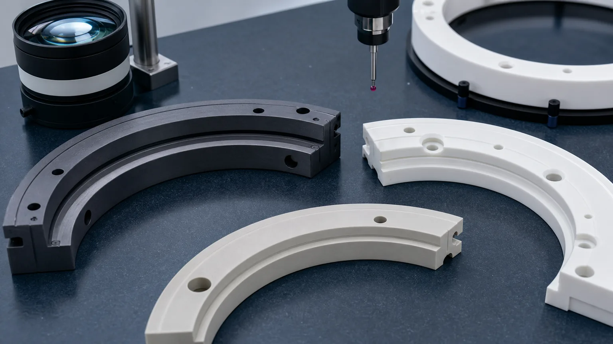
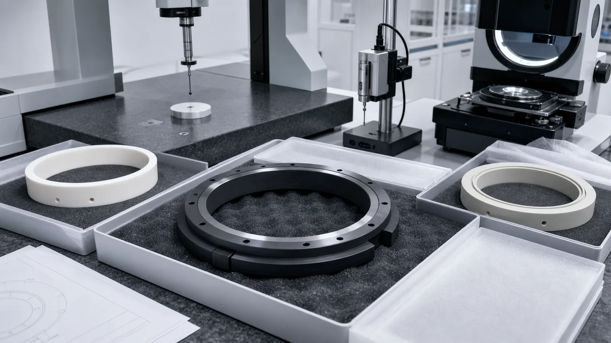

> Precision ceramic rings for semiconductor process chambers are not just circular ceramic parts. They are chamber interfaces where material grade, ID/OD geometry, flatness, lapped annular bands, groove details, edge quality, cleaning, packaging, and inspection evidence decide whether the ring can be accepted.

Ceramic rings appear around process chambers, wafer support areas, plasma-adjacent hardware, insulating interfaces, gas paths, vacuum interfaces, and maintenance tooling. Depending on the tool location, the part may be described as a silicon carbide process ring, alumina insulating ring, chamber ring, edge ring, support ring, spacer ring, seal ring, gas distribution ring, or focus-ring-adjacent ceramic component.

The search term is simple. The RFQ is not. A ring can be rejected because a lapped band is not flat enough under the agreed support condition, because the ID and OD are not concentric to the right datum, because a groove edge chips, because a mounting hole breaks out near a particle-sensitive face, or because cleaning and packaging do not protect the finished surface.

This guide focuses on custom machined ceramic rings for semiconductor process chambers. For the wider equipment context, use the [precision ceramic components for semiconductor equipment guide](/posts/semiconductor-equipment/precision-ceramic-components-semiconductor-equipment/). When the ring functions as an electrical isolation part, heater-adjacent spacer, or plasma etch/deposition insulator, use the [ceramic insulators for plasma etching and deposition equipment guide](/posts/semiconductor-equipment/ceramic-insulators-plasma-etching-deposition-equipment/) alongside the ring drawing. For SiC material and hard-finishing risk, use the [silicon carbide ceramic machining guide](/posts/industrial-ceramic-machining/silicon-carbide-ceramic-machining-harsh-environment-applications/).

### What Counts As A Semiconductor Ceramic Ring

The word "ring" can describe several different ceramic components. Before quotation, the RFQ should identify what the ring does inside the tool and which surfaces are functional.

| Ring type                      | Typical role                                                    | RFQ issue that changes the route                                            |
| ------------------------------ | --------------------------------------------------------------- | --------------------------------------------------------------------------- |
| SiC process chamber ring       | Chamber-adjacent support, wear, or process-side interface       | Grade, lapped bands, edge chips, flatness, grooves, and cleaning            |
| Alumina insulating ring        | Electrical insulation, spacing, or chamber hardware isolation   | Purity, dielectric path, hole edges, creepage geometry, and surface quality |
| Edge or support ring           | Supports wafer-adjacent or fixture-adjacent stack geometry      | ID/OD concentricity, support face flatness, band width, and packaging       |
| Spacer or leveling ring        | Controls height, parallelism, or stack relationship             | Thickness, parallelism, matched set logic, lapping, and report scope        |
| Seal or vacuum interface ring  | Interfaces with gasket, vacuum, purge, or chamber hardware      | Seal land finish, groove shape, leak path, edge break, and cleanliness      |
| Segmented ceramic chamber ring | Allows assembly, replacement, or thermal movement in ring zones | Segment ends, matched geometry, arc length, gap control, and marking method |
| Gas or purge distribution ring | Provides gas passages, holes, ports, or annular flow features   | Hole size, groove depth, blockage, cleaning, and functional evidence        |

Two rings with similar outside diameter can have very different manufacturing risk. A simple insulating spacer, a lapped SiC ring, a grooved purge ring, and a segmented chamber ring should not be reviewed with the same quotation assumptions.

### Why Process Chamber Rings Need A Separate RFQ Review

Process chamber ceramic rings combine circular precision with ceramic material risk. The difficult areas are not always obvious from the outside profile.

Common review triggers include:

- Large diameter rings where support condition affects flatness or roundness measurement.
- Tight ID/OD concentricity, circularity, profile, or runout requirements.
- Lapped annular bands that must remain clean and low-defect.
- Grooves, steps, pockets, or seal lands on a ring face.
- Mounting holes, counterbores, slots, ports, or dowel features close to edges.
- Particle-sensitive chamfers and groove edges.
- Plasma, vacuum, chemical, thermal, or cleaning exposure.
- Segmented rings that must match at arc ends and stack into an assembly.
- Inspection evidence beyond a basic dimensional report.

A STEP model shows nominal ring geometry. It does not tell the supplier which band seals, which face is plasma-exposed, which edge is particle-sensitive, whether the ring is measured free-state or supported, or whether the part must be supplied in matched sets.

### Material Choices For Ceramic Chamber Rings

Material choice should follow process environment, approved tool specification, and machining risk. "Ceramic ring" is not a material specification.

| Material family                                                                                                               | Where it may fit                                                        | RFQ notes                                                                                       |
| ----------------------------------------------------------------------------------------------------------------------------- | ----------------------------------------------------------------------- | ----------------------------------------------------------------------------------------------- |
| [Silicon carbide SiC](/posts/industrial-ceramic-machining/silicon-carbide-ceramic-machining-harsh-environment-applications/)  | Process chamber rings, chamber-adjacent support rings, harsh-zone parts | Hard finishing, lapped bands, edge quality, grade, cleaning, and report scope can dominate cost |
| [Alumina Al2O3](/posts/industrial-ceramic-machining/precision-machined-alumina-ceramic-parts-industrial-applications/)        | Insulating rings, spacers, chamber hardware isolation, support rings    | Specify purity, density, fired state, dielectric path, hole edges, and functional faces         |
| [Aluminum nitride AlN](/posts/industrial-ceramic-machining/aluminum-nitride-ceramic-machining-thermal-management-components/) | Thermal-interface spacer rings or heater-adjacent ceramic rings         | Thermal-contact flatness, moisture handling, thickness, and cleaning require review             |
| [Silicon nitride Si3N4](/posts/industrial-ceramic-machining/silicon-nitride-ceramic-machining-structural-wear-parts/)         | Selected structural or wear ring applications                           | Load path, shock risk, roundness, bore relationship, and grade should be clarified              |
| [Zirconia ZrO2](/posts/industrial-ceramic-machining/zirconia-ceramic-machining-high-strength-precision-components/)           | Selected tough precision rings, guide rings, and wear features          | Toughness may help some edge-risk cases, but environment and temperature still matter           |
| [Boron nitride BN](/posts/industrial-ceramic-machining/boron-nitride-ceramic-machining-high-temperature-insulation-parts/)    | High-temperature insulating or non-wetting ring features where suitable | Grade, atmosphere, contact load, and handling sensitivity must be reviewed                      |

If the part is tied to an existing tool qualification, provide the exact material grade and state whether equivalent grade review is allowed. If the material is open, send the tool environment, temperature, chemistry, vacuum condition, plasma exposure, load path, and inspection expectations. The [ceramic material selection guide](/posts/materials-grade-selection/ceramic-material-selection-cnc-machining/) is the better starting point when the failure mode is known but the material is not.

### Ring Geometry That Drives Machining Risk

The expensive features in a ceramic ring usually sit in functional annular zones, not in the fact that the part is circular. A useful RFQ separates ring geometry into inspection-ready features.

Important geometry includes:

- Inner diameter, outer diameter, circularity, and ID/OD concentricity.
- Face flatness, parallelism, and thickness control.
- Annular seal lands, contact bands, and lapped surfaces.
- Grooves, steps, undercuts, pockets, or relief features.
- Mounting holes, counterbores, slots, and dowel holes.
- Segment ends, arc length, and joint faces on segmented rings.
- Edge break at ID, OD, holes, grooves, and seal lands.
- Datum surfaces used for CMM or fixture inspection.

If a drawing applies the same tolerance to every face, the quote becomes less predictable. A better drawing marks the functional band, assembly datum, seal surface, particle-sensitive edge, and clearance surfaces separately.

Process chamber ring RFQs should identify the functional annular bands, grooves, ID/OD datums, mounting features, edge criteria, cleaning requirement, and inspection method before quotation.

### Flatness, Parallelism, And Support Condition

Flatness on a ring is not the same as flatness on a small rectangular part. The measurement can change with support condition, ring diameter, thickness, fixture method, and whether the ring has grooves, holes, or segmented geometry.

Clarify these points:

- Which face is the primary functional face.
- Whether flatness applies globally, locally, or only to an annular band.
- Whether the ring is measured free-state, supported, clamped, or in a fixture.
- Whether parallelism is to the opposite face, a mounting face, or a datum band.
- Whether lapping is required on one face or both faces.
- Whether the report needs a flatness map, CMM output, optical method, or agreed fixture measurement.

For large rings, a single tight flatness number without measurement context can create quoting disagreement. Use the [ceramic tolerance capability map](/posts/tolerances-gdt/ceramic-tolerance-capability-map-by-feature-process/) when deciding which features need grinding, lapping, CMM evidence, or a fixture-specific method.

### ID/OD Concentricity, Roundness, And Runout

Ceramic rings often need a stable relationship between ID, OD, bolt circle, seal band, and mounting face. These requirements should be tied to datums that can actually be held and inspected.

Useful RFQ details include:

- Primary datum: ID, OD, face, annular band, bolt circle, or fixture surface.
- Whether ID/OD concentricity is functional or only for clearance.
- Circularity or profile requirement on ID and OD.
- Runout between ring face and diameter.
- Position of holes relative to ID, OD, or a datum axis.
- Whether a ring is inspected as a standalone part or as part of a matched assembly.

Avoid assigning ultra-tight concentricity to rough as-sintered surfaces unless they will be finished and used as stable datums. The [ceramic CNC machining design rules](/posts/design-rules-dfm/ceramic-cnc-machining-design-rules-advanced-ceramic-parts/) explain why ceramic-friendly datum selection matters before post-sinter grinding begins.

### Grooves, Holes, And Particle-Sensitive Edges

Many semiconductor process chamber rings include grooves, holes, ports, counterbores, stepped faces, or relief pockets. These features can dominate quote risk because ceramic edges are chip-sensitive.

Define:

- Groove width, depth, bottom radius, sidewall condition, and edge break.
- Hole diameter, depth, tolerance, counterbore, and breakout limit.
- Bolt circle position relative to ID, OD, and functional face.
- Slot or port geometry and minimum wall thickness.
- Distance from holes or grooves to ID, OD, and lapped bands.
- Which edges are particle-sensitive and which are standard handling edges.
- Whether cleaning or blockage review is required after machining.

For small gas, purge, or vacuum holes, use the [ceramic micro-hole machining RFQ guide](/posts/micro-hole-machining/ceramic-micro-hole-machining-rfq/) to define diameter, depth, taper, breakout, cleaning, and inspection method. For rings that behave as part of a vacuum support or chuck system, also review the [machined ceramic vacuum chuck components guide](/posts/semiconductor-equipment/machined-ceramic-vacuum-chuck-components-semiconductor-tools/).

### Surface Finish And Lapped Bands

Surface finish should be assigned by face and by function. A process chamber ceramic ring may need a lapped annular band, a controlled seal land, a clean plasma-facing surface, or a precise mounting face. It usually does not need the same finish everywhere.

| Surface zone                    | What to define                                                  | Why it matters                                                  |
| ------------------------------- | --------------------------------------------------------------- | --------------------------------------------------------------- |
| Lapped annular band             | Flatness, width, Ra, edge condition, inspection method          | Controls sealing, contact, stack height, or process-side fit    |
| ID and OD surfaces              | Diameter tolerance, roundness, profile, chamfer, and chip limit | Controls assembly clearance, concentricity, and edge integrity  |
| Grooves and steps               | Width, depth, corner radius, sidewall finish, and edge break    | Controls fit, gas/vacuum path, cleanability, and particle risk  |
| Mounting holes and counterbores | Position, diameter, depth, chamfer, breakout, and stress relief | Controls assembly repeatability and prevents local edge damage  |
| Non-functional outside faces    | General ground finish, edge break, and visual acceptance        | Avoids overpricing surfaces that do not affect chamber function |

The [surface finish and subsurface damage guide](/posts/surface-finish-functional/ceramic-ssd-surface-finish-specify-control-price/) is useful when Ra, lapping, polishing, microscopy, or surface integrity affects the acceptance gate. A vague drawing note such as "polish all surfaces" often increases cost without improving chamber performance.

### Segmented Ceramic Rings And Matched Sets

Some chamber ring designs use segments instead of one full ring. Segments may reduce assembly constraints or fit replacement strategies, but they introduce additional RFQ questions.

Clarify:

- Number of segments and whether they are supplied as a matched set.
- Segment arc length and joint-face tolerance.
- Gap condition after assembly.
- Whether segment ends are functional, clearance, or particle-sensitive.
- Whether ID/OD profile is measured per segment or after assembly.
- Whether markings are allowed and where they can be placed.
- How the parts are protected so segments do not chip against each other.

If a segmented ring is treated as independent pieces with no matched-set logic, assembly gaps and height mismatch can become late problems. State the acceptance basis before production starts.

### Cleaning, Packaging, And Inspection Evidence

For semiconductor chamber rings, the machining route is not finished when size passes. Clean handling, edge protection, and inspection evidence are part of the deliverable.

Inspection should prove the functional requirement, not simply produce paperwork for every surface.

| Requirement                | Evidence to discuss                                             | RFQ note                                                                    |
| -------------------------- | --------------------------------------------------------------- | --------------------------------------------------------------------------- |
| ID/OD and concentricity    | CMM report, roundness/profile method, or fixture gauge          | State the datum used to inspect the ring                                    |
| Ring face flatness         | Flatness map, optical method, lapping record, or agreed fixture | State free-state, supported, or clamped measurement condition               |
| Lapped bands and seal land | Ra reading, flatness report, visual check, or process note      | Define face, band width, and edge condition                                 |
| Groove and step geometry   | CMM, optical scan, profile check, or key dimensions             | Include groove bottom, corner radius, and edge-break requirements           |
| Edge chip control          | Visual inspection at defined zones or sample acceptance photo   | Replace broad "no chips" notes with zone and criterion                      |
| Cleanliness and packaging  | Cleaning note, separators, protected trays, or custom packaging | Protect lapped bands, ID/OD chamfers, segment ends, and particle zones      |
| Material and traceability  | Material certificate, grade confirmation, lot record, or CoC    | State whether tool qualification requires an exact grade or supplier record |

The [custom ceramic CNC machining RFQ checklist](/posts/rfq-preparation/custom-ceramic-cnc-machining-rfq-checklist/) can help organize drawing, CAD, material, quantity, timing, and acceptance requirements.

### Cost Drivers In Process Chamber Ceramic Rings

The cost of a ceramic chamber ring is usually driven by material route, finished surface area, feature risk, and inspection scope.

Common cost drivers include:

1. Material grade, purity, blank size, and ring blank availability.
2. Fired ceramic hardness and diamond grinding time.
3. Large diameter flatness, parallelism, and support-condition measurement.
4. ID/OD concentricity, circularity, and runout requirements.
5. Lapped annular bands and low-Ra functional faces.
6. Grooves, steps, counterbores, holes, slots, and segment-end geometry.
7. Edge chip criteria near ID, OD, holes, grooves, and lapped bands.
8. Cleaning, protected packaging, and particle-sensitive handling.
9. Documentation, traceability, and inspection report scope.
10. Prototype qualification before repeat production.

The best cost control is not to remove all precision. It is to put tight tolerance, lapping, and documentation on the surfaces that control chamber function, then allow practical finish and tolerance on clearance geometry.

### RFQ Checklist For Precision Ceramic Process Chamber Rings

Before expecting a reliable quotation, send:

- 2D drawing with revision and STEP or native CAD file.
- Ring type: process chamber ring, insulating ring, support ring, spacer ring, seal ring, edge ring, segmented ring, or gas/purge ring.
- Material family, grade, purity, density, and whether equivalent grade review is allowed.
- Blank source and blank state: customer-supplied, supplier-sourced, fired, near-net, full ring, or segment blank.
- Tool environment: vacuum, plasma, process gas, cleaning chemistry, temperature, thermal cycling, load, or insulation requirement.
- Functional surfaces: lapped band, seal land, mounting face, ID, OD, groove, step, hole pattern, or segment joint.
- Critical tolerances and GD&T tied to inspectable datums.
- Flatness, parallelism, circularity, concentricity, profile, or runout requirements with measurement condition.
- Groove width, depth, radius, step height, hole diameter, counterbore depth, and edge requirements.
- Surface finish, lapping, polishing, and cleaning requirements by face.
- Edge break, chamfer, radius, and maximum chip criterion by zone.
- Inspection report scope, material certificate, traceability, cleaning note, and packaging requirement.
- Quantity, prototype or production intent, target timing, and qualification stage.

If the drawing is still under development, identify which requirements are open. A supplier can review risk, but a quote built on unknown material grade, unknown support condition, or unknown particle-sensitive edges should not be treated as final.

### Practical Takeaway

Precision ceramic rings for semiconductor process chambers should be sourced as chamber interfaces, not generic circular parts. The important questions are specific: which surface seals, which band is lapped, which diameter controls assembly, which edge is particle-sensitive, which groove or hole must be cleaned, whether the ring is measured free-state or supported, and what inspection evidence proves acceptance.

Good RFQs separate material grade, ring function, functional annular bands, ID/OD datums, grooves, holes, edge criteria, cleaning, packaging, and inspection method before price and lead time are confirmed. That approach helps engineering and procurement compare suppliers on manufacturable risk instead of on an under-specified ceramic ring.

For a direct project review, use the [RFQ input page](/rfq/) and include the drawing, CAD file, material requirement, quantity, target timing, functional surfaces, chamber environment, and acceptance evidence.

### FAQ

**What ceramic materials are used for semiconductor process chamber rings?**  
Common directions include silicon carbide, alumina, aluminum nitride, silicon nitride, zirconia, boron nitride, and other qualified ceramics. The final choice depends on tool specification, chamber environment, material qualification, and feature risk.

**Can a ceramic chamber ring be quoted from a STEP file only?**  
A STEP file can start geometry review, but a reliable quote usually needs a drawing, material grade, functional surfaces, datums, tolerances, surface finish, edge criteria, quantity, and inspection requirements.

**What surfaces matter most on a ceramic process ring?**  
Lapped annular bands, seal lands, ID/OD reference surfaces, groove edges, mounting holes, segment ends, and particle-sensitive chamfers usually matter more than non-functional clearance faces.

**Should every surface on a ceramic chamber ring be polished or lapped?**  
Usually no. Lapping and low-Ra finish should be assigned to the functional band, seal land, mounting datum, or process-facing surface that needs it. Clearance faces often do not need the same finish.

**How should edge chips be specified on ceramic rings?**  
Define chip-sensitive zones and acceptance criteria by location. ID/OD edges, groove edges, seal lands, holes, and segment ends may need different rules from non-functional outside edges.

**What inspection evidence should be requested?**  
Common evidence includes CMM reports, roundness or profile checks, flatness maps, Ra readings, groove profile checks, visual edge criteria, material certificates, cleaning notes, and protected packaging confirmation.

> RFQ note: Final feasibility, tolerance, price, lead time, cleaning method, packaging, and inspection scope depend on drawing review, ceramic grade, blank state, functional surfaces, machining route, tool environment, and acceptance method.
