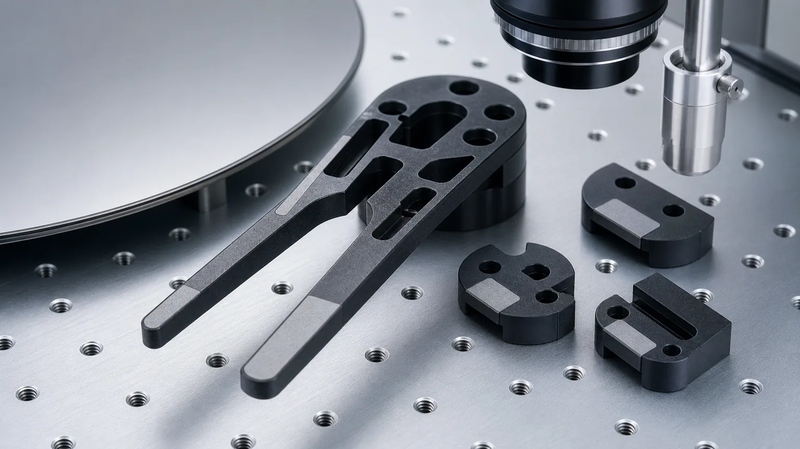
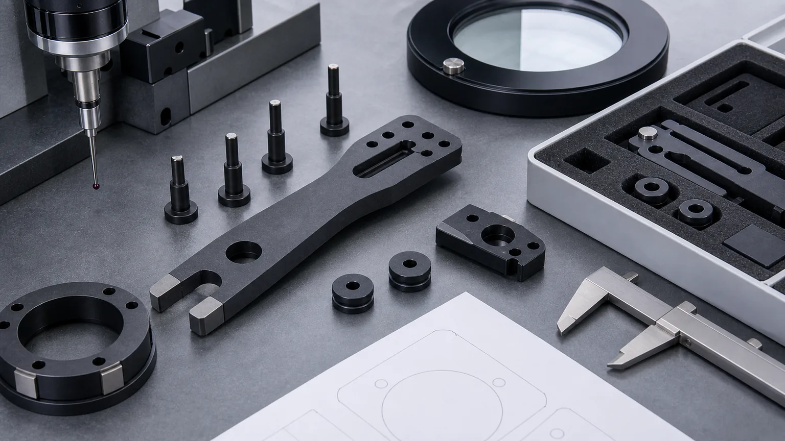

> Silicon carbide wafer handling components are not just dark ceramic shapes inside semiconductor tools. They are wafer-contact interfaces. Their value depends on SiC grade, contact geometry, flatness, edge quality, surface finish, cleaning, protected packaging, and inspection evidence that matches the way the component will touch, support, transfer, or locate a wafer.

Semiconductor manufacturing uses ceramic components wherever the equipment needs dimensional stability, clean handling, wear resistance, chemical resistance, electrical insulation, or controlled contact with fragile substrates. Silicon carbide, often written as SiC, is especially relevant when a wafer handling part must combine stiffness, wear resistance, thermal stability, and clean process-side behavior.

But SiC does not make a wafer handling design automatically safe. A thin end effector blade, lift pin, support pad, edge-contact gripper, ring, carrier segment, or wafer support fixture still needs a ceramic-friendly drawing. The RFQ should identify which faces touch the wafer, which edges are particle-sensitive, which bores set assembly location, which surfaces are lapped or ground, and how acceptance will be inspected.

This article focuses on SiC wafer handling components for semiconductor manufacturing. For a wider map of semiconductor ceramic parts, use the [precision ceramic components for semiconductor equipment guide](/posts/semiconductor-equipment/precision-ceramic-components-semiconductor-equipment/). For material-specific SiC machining risks beyond wafer handling, use the [silicon carbide ceramic machining guide](/posts/industrial-ceramic-machining/silicon-carbide-ceramic-machining-harsh-environment-applications/).

### Why SiC Wafer Handling Components Need A Dedicated RFQ Review

A wafer handling part can look simple in CAD: one blade, several holes, a few slots, and a flat surface. In semiconductor manufacturing, the risk is not the outline alone. The real risk is how the part behaves at the wafer interface.

High-value SiC wafer handling RFQs usually involve at least one of these constraints:

- A wafer-facing contact surface that needs controlled flatness, Ra, and edge condition.
- Thin arms or blade sections that must remain stiff without becoming fragile.
- Lift pins or support pads that need matched height, tip geometry, and low chip risk.
- Mounting bores or slots that define repeatable tool alignment.
- Particle-sensitive edges near wafer contact, vacuum, or handling zones.
- Cleaning and packaging requirements that protect finished ceramic surfaces.
- Inspection evidence that proves the functional geometry, not just nominal outside size.

This is why a STEP file alone is usually not enough. A STEP file shows shape, but it does not explain which surfaces carry the wafer, which edges must be protected, or whether a visual chip standard applies only to contact zones or to the entire part.

### Where SiC Fits In Wafer Handling

Silicon carbide is normally reviewed when the handling component needs more than general ceramic insulation. It may be considered for stiffness, wear resistance, thermal stability, process compatibility, and clean handling behavior in demanding tool locations.

| Component family                         | Typical function                                              | RFQ issue that changes the route                                                |
| ---------------------------------------- | ------------------------------------------------------------- | ------------------------------------------------------------------------------- |
| SiC end effectors and blades             | Transfer, support, or position a wafer during handling        | Thin arms, contact pads, flatness, edge chip criteria, weight, and mounting fit |
| SiC lift pins and support pins           | Raise, lower, or locate wafers and carriers                   | Tip geometry, height matching, runout, surface finish, and edge radius          |
| SiC support pads and contact blocks      | Provide localized wafer contact or fixture support            | Lapped contact area, parallelism, chip-sensitive edges, and packaging           |
| SiC wafer support rings or carrier parts | Support circular substrates, fixtures, or process-side stacks | Flatness, concentricity, lapped bands, holes, slots, and cleaning               |
| SiC gripper or edge-contact elements     | Touch wafer edge or carrier features during automation        | Edge radius, contact pressure, surface finish, wear zone, and assembly datum    |
| SiC tooling fixtures                     | Hold, locate, or protect parts during process or inspection   | Datum strategy, pockets, pin locations, and evidence package                    |

SiC is not always the only possible material. Alumina, zirconia, silicon nitride, aluminum nitride, quartz-related materials, and qualified proprietary ceramics can all appear in semiconductor equipment. The [ceramic material selection guide](/posts/materials-grade-selection/ceramic-material-selection-cnc-machining/) is useful when the material is not locked by a tool specification or approved vendor list.

### Material Grade And Blank Route

"Silicon carbide" is not a complete material specification. Wafer handling components may have qualification requirements, purity expectations, density requirements, traceability needs, or tool-specific grade constraints. Some projects allow equivalent grade review. Others require the exact material route already approved by the equipment owner.

Clarify these inputs before quotation:

- Required SiC grade or approved material reference.
- Whether equivalent grade review is allowed.
- Blank form: plate, near-net blank, ring, rod, customer-supplied blank, or supplier-sourced blank.
- Fired state and whether only post-sinter diamond grinding is acceptable.
- Required material certificate, lot traceability, or incoming inspection record.
- Operating exposure: vacuum, process gas, plasma-adjacent area, cleaning chemistry, temperature, or thermal cycling.
- Whether the part is production-qualified, prototype, maintenance tooling, or engineering validation.

If grade is open, provide the tool environment and functional requirement instead of asking for generic SiC. The supplier can then review whether SiC is the right direction and which machining route is realistic.

### Wafer Contact Surfaces Are The Main Control Point

The most important surfaces on SiC wafer handling components are usually small, not large. A blade may have localized contact pads, rounded tips, or support lands. A lift pin may have a tiny top contact surface. A ring may only support the wafer on a narrow band. Applying strict finish to every surface is rarely the best RFQ strategy.

Define wafer-contact zones by face and by function:

- Which surfaces touch the wafer directly.
- Whether the contact is static support, transfer support, edge contact, or temporary lift.
- Whether contact marks are allowed.
- Required flatness, profile, parallelism, or height matching.
- Surface finish target on the contact zone.
- Edge break or radius near the wafer.
- Maximum edge chip criteria by zone.
- Cleaning and packaging requirement after final inspection.

If the contact zone is small, mark it clearly. That allows grinding, lapping, and inspection effort to focus on the surfaces that actually control wafer handling behavior.

Wafer handling RFQs should identify contact pads, edge breaks, lapped surfaces, datum faces, mounting holes, and inspection method before price or lead time is treated as reliable.

### SiC End Effectors And Wafer Blades

SiC end effectors and wafer blades are often difficult because the part combines thin geometry, stiffness, low particle risk, mounting accuracy, and protected contact surfaces. The CAD may resemble a metal blade, but fired SiC cannot be handled like a ductile metal after machining.

Review these points early:

- Minimum arm width and unsupported length.
- Slot width, pocket corner radii, and internal radii.
- Blade thickness and thickness tolerance.
- Contact pad location and size.
- Flatness or profile requirement on support areas.
- Mounting bores, counterbores, and datum relationship.
- Edge break on outside edges, slot edges, and wafer-facing tips.
- Mass or inertia constraint for moving automation.
- Packaging method to prevent edge damage.

The [ceramic CNC machining design rules](/posts/design-rules-dfm/ceramic-cnc-machining-design-rules-advanced-ceramic-parts/) explain why metal-style sharp corners, thin webs, and blanket tight tolerances often need review before a ceramic quotation is meaningful.

### Lift Pins, Support Pins, And Local Contact Pads

Lift pins and support pads concentrate wafer handling risk into small features. A pin can pass diameter inspection but still create a handling issue if the tip geometry, height match, surface finish, or edge condition is wrong.

Useful RFQ details include:

- Pin diameter, length, shoulder geometry, and tip shape.
- Tip flatness, radius, dome, chamfer, or lapped contact surface.
- Height matching across pin sets.
- Runout, straightness, or concentricity if the pin rotates or locates.
- Surface finish on the wafer-contact tip.
- Edge chip criteria at the tip and shoulder.
- Packaging that prevents tip-to-tip contact during shipment.

If pins are supplied as matched sets, say so. If one pin can be replaced independently, define the inspection basis for each individual part. Matched-set logic changes both inspection and packaging.

### Holes, Slots, Grooves, And Vacuum-Related Features

Many SiC wafer handling parts include mounting holes, elongated slots, vacuum passages, small vent holes, recesses, or lightening pockets. These features can dominate quote risk because SiC is hard, brittle, and often finished after firing.

For holes and slots, specify:

- Diameter, depth, and tolerance.
- Through-hole, blind-hole, counterbore, or slot condition.
- Hole-to-edge distance and local wall thickness.
- Allowed entry and exit edge condition.
- Internal radius or tool access expectation.
- Whether the hole sits near a wafer-contact surface.
- Whether cleaning, blockage review, or flow testing is needed.

If the part includes small gas or vacuum holes, the [ceramic micro-hole machining RFQ guide](/posts/micro-hole-machining/ceramic-micro-hole-machining-rfq/) gives a more focused checklist. If the design is a chuck, suction plate, or vacuum support surface, use the [ceramic vacuum chuck RFQ guide](/posts/vacuum-chucks/ceramic-vacuum-chuck-flatness-rfq/) before treating the part as a simple plate.

### Edge Quality And Particle-Sensitive Zones

Edge quality is one of the most important RFQ topics for SiC wafer handling components. A vague note such as "no chips" is not enough. SiC can chip at edges, especially around thin arms, holes, slots, and sharp transitions. The drawing should say which edges are critical and how they are judged.

Separate at least three edge classes:

| Edge zone                     | Typical requirement to define                                 | Why it matters                                          |
| ----------------------------- | ------------------------------------------------------------- | ------------------------------------------------------- |
| Wafer-facing or contact edges | Chip size, radius or chamfer, finish, and inspection method   | Controls particle risk, wafer marks, and contact damage |
| Mounting and assembly edges   | Practical chamfer, burr-free condition, and hole edge quality | Controls assembly stress and handling damage            |
| Non-functional outside edges  | General edge break or standard visual acceptance              | Avoids overpricing areas that do not affect performance |

For surface finish, apply control by face. The [ceramic surface finish and subsurface damage guide](/posts/surface-finish-functional/ceramic-ssd-surface-finish-specify-control-price/) explains why Ra, lapping, polishing, and surface integrity should be tied to function instead of applied broadly across the whole drawing.

### Tolerances And Datum Strategy

Tight tolerances can be justified on SiC wafer handling parts, but only when they match functional surfaces and inspection access. A useful drawing separates the surfaces that control wafer contact from those that only provide clearance.

Review tolerance requirements by feature:

- Contact pad flatness or height relationship.
- Blade thickness and support face parallelism.
- Mounting hole position relative to the robot or fixture datum.
- Slot width and internal radius where tool access matters.
- Pin diameter, runout, and set height.
- Ring ID/OD concentricity and support band flatness.
- Local edge radius or chamfer on wafer-contact zones.

Use the [ceramic tolerance capability map](/posts/tolerances-gdt/ceramic-tolerance-capability-map-by-feature-process/) to decide which features need diamond grinding, lapping, CMM evidence, optical inspection, or a fixture-specific method. The datum scheme should match how the part will be assembled and measured.

### Cleaning, Handling, And Packaging

For semiconductor manufacturing, the machining route is not finished when the part passes dimension inspection. Cleaning, handling, and packaging can decide whether a precision SiC component arrives in usable condition.

Clarify:

- Final cleaning expectation.
- Whether ultrasonic cleaning, cleanroom packaging, or customer-defined cleaning is required.
- Whether any residues, oils, dust, or handling marks are unacceptable.
- Whether finished faces need protective film, separators, or custom trays.
- Whether lift pins and contact pads must be individually protected.
- Whether parts are shipped as matched sets.
- Whether incoming inspection will include visual edge review under magnification.

Packaging should not be treated as an afterthought. A lapped contact pad or chip-sensitive blade edge can be damaged by simple part-to-part contact after inspection.

### Inspection Evidence For SiC Wafer Handling Components

Inspection should prove the feature that controls wafer handling. A generic dimensional report may not be enough if the real requirement is contact flatness, edge quality, height matching, or clean packaging.

Inspection planning should connect each functional surface to an evidence method, acceptance criterion, and protected packaging requirement.

| Requirement                       | Evidence to discuss                                           | RFQ note                                                                      |
| --------------------------------- | ------------------------------------------------------------- | ----------------------------------------------------------------------------- |
| Contact pad flatness or height    | Flatness map, CMM, optical method, or matched-set report      | State whether the feature is measured free-state, supported, or in a fixture  |
| Mounting bore or slot position    | CMM report, fixture gauge, or key-dimension report            | Datum faces must be stable and physically inspectable                         |
| Edge chip control                 | Visual inspection under defined magnification or sample photo | Define zone and maximum chip size; do not rely on "no chips" alone            |
| Surface finish on contact areas   | Ra measurement, lapping note, or approved surface method      | Apply to wafer-contact surfaces, not every clearance face                     |
| Pin tip geometry and set matching | Height measurement, radius review, or set report              | Important when multiple pins support one wafer                                |
| Holes or vacuum-related features  | Optical check, pin gauge, flow check, or sampling plan        | Define whether dimensional or functional evidence is required                 |
| Cleanliness and packaging         | Cleaning note, packaging method, or incoming acceptance plan  | Protect lapped pads, blade edges, lift pin tips, and particle-sensitive zones |

The [custom ceramic CNC machining RFQ checklist](/posts/rfq-preparation/custom-ceramic-cnc-machining-rfq-checklist/) can help organize these requirements before the drawing is sent.

### Cost Drivers In SiC Wafer Handling Parts

The cost of a SiC wafer handling component is usually driven by geometry, finishing, and inspection, not only by outside dimensions.

Common cost drivers include:

1. Material grade, blank availability, and qualification requirements.
2. Fired SiC hardness and diamond grinding time.
3. Thin arms, slots, pockets, and unsupported blade sections.
4. Lapped or low-Ra wafer-contact pads.
5. Tight mounting bore position and datum relationship.
6. Height matching across lift pin sets or support pads.
7. Edge chip criteria in particle-sensitive zones.
8. Cleaning and protected packaging.
9. CMM, optical, flatness, surface finish, or visual report scope.
10. Prototype validation before repeat production.

The best way to control cost is not to remove all precision. It is to place precision where it affects wafer handling, then allow standard finish and standard visual acceptance where the part only needs clearance.

### RFQ Checklist For Silicon Carbide Wafer Handling Components

Before expecting a reliable quotation, send:

- 2D drawing with revision and STEP or native CAD file.
- Component function: end effector, blade, lift pin, support pad, ring, edge gripper, fixture, or chuck-related part.
- Required SiC grade and whether equivalent grade review is allowed.
- Blank source and blank state: customer-supplied, supplier-sourced, fired, plate, rod, ring, or near-net.
- Wafer size, supported area, and contact mode.
- Wafer-facing surfaces and particle-sensitive zones marked on the drawing.
- Critical tolerances, GD&T, datum faces, and inspection basis.
- Surface finish, lapping, flatness, or height matching by face.
- Edge break, radius, chamfer, and chip criteria by zone.
- Holes, slots, grooves, vacuum features, and thin-wall details.
- Cleaning, packaging, traceability, certificate, and inspection report needs.
- Quantity, prototype or production intent, target timing, and qualification stage.

If you do not yet know the full requirement, say which items are open. A supplier can still review risk, but a quote built on unknown contact surfaces or unknown edge criteria should not be treated as final.

### Practical Takeaway

Silicon carbide wafer handling components for semiconductor manufacturing should be sourced as engineered contact interfaces. The important questions are specific: where does the wafer touch, which edge could create particles, which surface controls height or flatness, which holes set alignment, which features are fragile, how will the part be cleaned, and what evidence proves acceptance?

Good SiC wafer handling RFQs separate material grade, contact surfaces, edge criteria, tolerance scope, cleaning, packaging, and inspection evidence before price and lead time are confirmed. That approach helps engineering and procurement compare suppliers on manufacturable risk instead of on an under-specified drawing.

For a direct project review, use the [RFQ input page](/rfq/) and include the drawing, CAD file, SiC grade requirement, quantity, target timing, wafer-contact zones, and acceptance evidence.

### FAQ

**Why use silicon carbide for wafer handling components?**  
SiC may be reviewed when wafer handling parts need stiffness, wear resistance, thermal stability, clean contact behavior, or compatibility with demanding semiconductor tool environments. The final choice still depends on grade, geometry, contact surfaces, and qualification requirements.

**Can SiC wafer end effectors be quoted from a STEP file only?**  
A STEP file can start review, but a reliable quote usually needs a drawing, material grade, functional surfaces, edge chip criteria, surface finish, quantity, and inspection requirements.

**What surfaces matter most on SiC wafer handling parts?**  
Wafer-contact pads, lift pin tips, edge-contact areas, datum faces, mounting bores, slots, and particle-sensitive edges usually matter more than non-functional outside surfaces.

**Should every surface on a SiC wafer handling component be polished?**  
No. Finish should be assigned by function. Contact pads, sliding zones, support faces, or critical edges may need controlled finish, while clearance surfaces often do not.

**What inspection evidence should be requested?**  
Common options include CMM reports, flatness maps, optical checks, surface finish readings, edge chip visual criteria, matched-set height reports, cleaning notes, and protected packaging confirmation.

> RFQ note: Final feasibility, tolerance, price, lead time, cleaning method, packaging, and inspection scope depend on drawing review, SiC grade, blank state, functional surfaces, machining route, and acceptance method.
