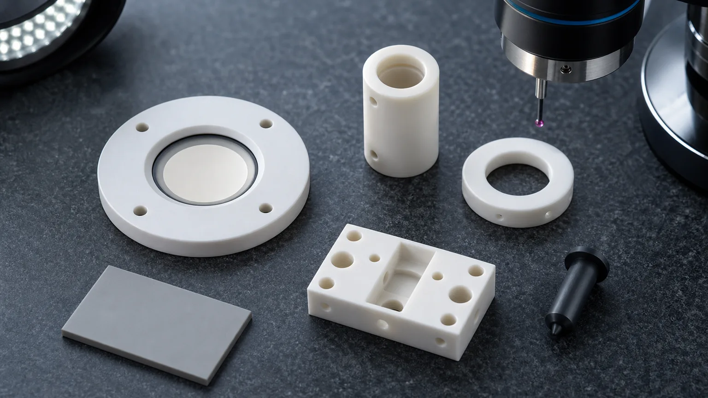
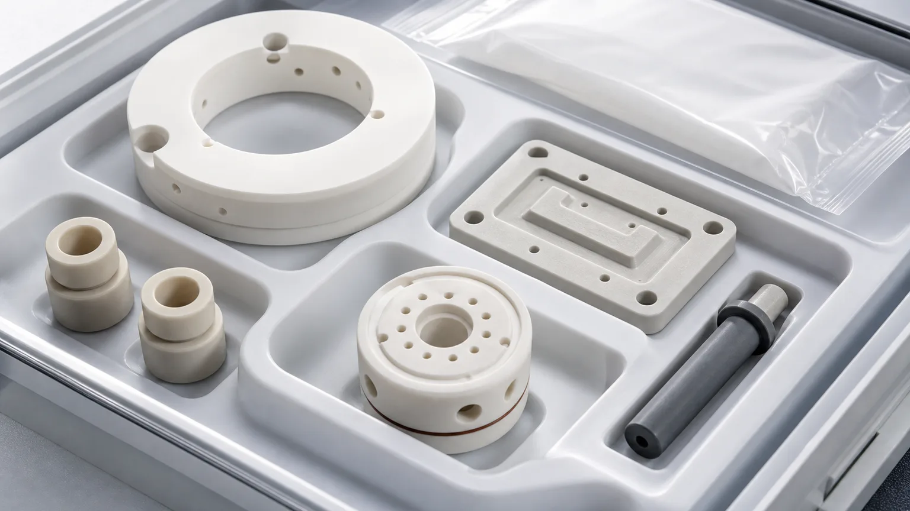

> Ceramic parts for sensors and measurement devices should be quoted as functional interfaces, not as generic insulating shapes. The accepted part depends on material grade, datum strategy, wall thickness, bore quality, thermal path, electrical isolation, media exposure, cleaning, packaging, and the inspection evidence that proves the feature can support the measurement function.

Sensor and measurement-device RFQs often look small: an alumina ring, a ceramic diaphragm, a zirconia sleeve, an aluminum nitride spacer, a dark silicon nitride pin, a micro-flow insert, or a compact insulating block with holes. The business risk is not small. These parts may sit close to pressure, temperature, fluid chemistry, voltage, vibration, optical alignment, vacuum, or a calibrated sensing element. A dimensional pass on the outside profile is not enough if the functional surface creates drift, leakage, particles, stress concentration, or assembly misalignment.

This article is a precision industrial ceramic machining case guide for sensor and measurement-device components. It connects to the broader [precision ceramic machining guide](/posts/industrial-ceramic-machining/precision-ceramic-machining-high-performance-industrial-components/) and the [ceramic material selection guide](/posts/materials-grade-selection/ceramic-material-selection-cnc-machining/), but the focus here is narrower:

**How should engineers define ceramic sensor parts so the supplier can review machining route, functional surfaces, cleanliness, and inspection before confirming feasibility, price, or schedule?**

### What A Real Sensor-Component RFQ Identifies

Sensor projects usually arrive as a defined component problem: a pressure-sensor ceramic body, alumina insulator, zirconia sleeve, ceramic flow cell, sensor housing, measurement spacer, AlN thermal spacer, guide pin, or analytical-instrument part. Each name points to different functional surfaces and acceptance risks.

There is also a current demand signal. [SEMI describes the MEMS and sensor market as growing around smart devices, IoT networks, autonomous systems, pressure sensors, environmental sensors, high-yield manufacturing, and advanced process control](https://www.semi.org/en/products-services/market-data/MEMS-report). [NIST frames smart manufacturing around measurement science, in-process sensing, monitoring, qualification, robotics, and connected manufacturing systems](https://www.nist.gov/topics/smart-manufacturing). These are not narrow consumer-electronics trends. They point to a long-term need for stable, clean, measurable components in industrial sensing, process control, laboratory systems, semiconductor-adjacent tools, medical instruments, and automated production equipment.

Technical ceramic suppliers also treat sensing as a defined ceramic application area. [CoorsTek lists ceramic sensor components for pressure, temperature, capacitive, proximity, fluid, and custom sensing applications](https://www.coorstek.com/en/industries/auto-and-transportation/automotive/automotive-sensors/). [CeramTec describes advanced ceramic components for measurement and sensor applications in harsh industrial environments](https://www.ceramtec-industrial.com/en/measurement-sensors). The engineering task is to translate the application into RFQ language: which faces are functional, which holes are risk-bearing, which material properties matter, and which inspection records should be requested.

### What Counts As A Sensor Or Measurement Ceramic Component

A sensor ceramic component is any ceramic part that helps isolate, support, expose, protect, align, seal, guide, or thermally manage a measurement function. The ceramic may not be the sensing element itself. It may be the stable interface that lets the sensing element work repeatedly.

Common families include:

| Component family                        | Typical role in sensor and measurement assemblies               | RFQ issue that changes the machining route                         |
| --------------------------------------- | --------------------------------------------------------------- | ------------------------------------------------------------------ |
| Alumina pressure diaphragms and plates  | Electrical insulation, pressure interface, stable substrate     | Thickness, flatness, membrane geometry, edge chips, surface finish |
| Alumina insulating rings and standoffs  | Isolation, spacing, feedthrough-adjacent support                | Bore chips, creepage path, parallelism, clean handling             |
| Zirconia sleeves and plungers           | Wear-resistant guide, dosing, sliding, or alignment feature     | ID/OD fit, roundness, straightness, Ra, counterface compatibility  |
| Aluminum nitride thermal spacers        | Thermal path plus electrical insulation                         | Flatness, thickness, thermal-contact face, edge protection         |
| Silicon nitride pins and guide elements | Stronger guide or wear component in compact mechanisms          | Contact stress, roundness, finish, chamfer, inspection method      |
| Ceramic flow cells and inserts          | Fluid, gas, purge, analytical, or micro-sampling path           | Micro-bore quality, outlet edge, cleaning, blockage risk           |
| Ceramic sensor housings and holders     | Stable insulating body for probe, optical, or electronic module | Datum strategy, mounting holes, slot radii, assembly stress        |
| Ceramic optical or metrology fixtures   | Alignment, reference, and thermal stability near optics         | Flatness, squareness, low-distortion mounting, surface protection  |

The same part may be easy in a general fixture and difficult in a measurement device. The difference is the measurement consequence. A small burr-like edge chip, an uncontrolled bore taper, or a stressed thin section can change repeatability even if the drawing's general profile dimensions pass.

When the part locates a lens barrel, aperture, fiber, detector, or laser subassembly, use the [machined ceramic components for optical and laser equipment guide](/posts/optical-laser-equipment/machined-ceramic-components-optical-laser-equipment/) to define the optical-axis reference, mounting boundary, clean handling, and customer-owned optical qualification.

### Case Pattern: Ceramic Parts Around A Measurement Module

A practical RFQ case is a small ceramic component set for a pressure, flow, analytical, or industrial measurement module:

- An alumina diaphragm or plate provides an electrically insulating pressure or support interface.
- A zirconia sleeve guides a pin, plunger, probe, or moving metering element.
- An AlN spacer helps control heat flow near a sensor, heater, or calibrated surface.
- A silicon nitride pin or guide component handles sliding or impact risk in a compact mechanism.
- A ceramic micro-flow insert routes gas, liquid, purge, or sample media through controlled bores.
- Alumina rings and spacers isolate voltage, protect creepage paths, and maintain stack height.

That component-level map leads directly to the RFQ. Buyers need to know what drawings must define, which surfaces should not be over-specified, and which acceptance checks make sense before the assembly is qualified.

### Material Selection For Sensor And Measurement Parts

Material choice should start from the measurement environment. The right ceramic for an insulating spacer may not be the right ceramic for a sliding sleeve, thermal plate, or fluid-exposed insert.

| Material family                                                                                                              | Where it may fit in sensor and measurement devices                         | RFQ notes                                                                                    |
| ---------------------------------------------------------------------------------------------------------------------------- | -------------------------------------------------------------------------- | -------------------------------------------------------------------------------------------- |
| [Alumina Al2O3](/posts/industrial-ceramic-machining/precision-machined-alumina-ceramic-parts-industrial-applications/)       | Insulators, substrates, diaphragms, rings, housings, standoffs             | Define purity, fired state, functional faces, bore chip criteria, and electrical environment |
| [Zirconia ZrO2](/posts/industrial-ceramic-machining/zirconia-ceramic-machining-high-strength-precision-components/)          | Sleeves, plungers, small guides, dosing parts, wear-resistant interfaces   | Review ID/OD fit, roundness, sliding counterface, finish, and temperature                    |
| [Aluminum nitride AlN](/posts/semiconductor-equipment/aluminum-nitride-ceramic-parts-semiconductor-thermal-management/)      | Thermal spacers, insulating heat spreaders, heater-adjacent sensor support | Protect thermal-contact faces and define flatness, thickness, Ra, and cleaning               |
| [Silicon nitride Si3N4](/posts/industrial-ceramic-machining/silicon-nitride-ceramic-machining-structural-wear-parts/)        | Pins, rollers, compact wear guides, stronger structural sensor supports    | Define load path, contact stress, edge condition, finish, and inspection method              |
| [Silicon carbide SiC](/posts/industrial-ceramic-machining/silicon-carbide-ceramic-machining-harsh-environment-applications/) | Harsh media, high-wear inserts, chemical-adjacent measurement hardware     | Lapped faces, edge chips, chemical exposure, and cleaning requirements usually dominate      |
| [Macor](/posts/industrial-ceramic-machining/macor-machinable-glass-ceramic-parts-applications-design-guide/)                 | Prototype insulating fixtures and fast geometry trials                     | Useful for validation, but confirm final temperature, strength, cleanliness, and media needs |

If the customer already has a material callout, send the exact grade and certificate requirement. If the material is open, send the measurement failure mode: drift, leakage, wear, electrical breakdown, heat flow, chemical exposure, vibration, optical misalignment, or contamination.

### Feature Controls That Matter More Than General Tolerance

Sensor and measurement-device parts often fail because the drawing controls the wrong features tightly and leaves functional interfaces vague. The supplier should know which dimensions affect measurement performance and which dimensions are only clearance or packaging geometry.

Define these zones clearly:

- Sensing-side faces, diaphragms, membranes, lands, or contact pads.
- ID/OD sliding fits for sleeves, plungers, pins, and guide bores.
- Micro-flow bores, outlet edges, counterbores, slots, and intersecting channels.
- Datum faces that align probes, optics, electrodes, seals, or calibrated surfaces.
- Thermal-contact faces on AlN or alumina support plates.
- Electrical creepage or clearance paths near high-voltage sensing elements.
- Edge-break requirements by zone, especially near flow, seal, and sliding interfaces.
- Surface roughness by face instead of a global Ra note.
- Cleanliness, handling, and packaging surfaces that must not touch each other.

The phrase "tight tolerance" is not enough. A strong RFQ says, for example, which bore is the functional guide bore, which face is the sensing datum, which edge is exposed to fluid, and which surfaces can remain standard-ground or as-sintered.

### Micro-Bores And Flow Paths Need Their Own Acceptance Logic

Ceramic flow cells, orifice inserts, sampling blocks, and purge components can overlap with [ceramic micro-hole machining](/posts/micro-hole-machining/ceramic-micro-hole-machining-rfq/) and [precision ceramic nozzles](/posts/semiconductor-equipment/precision-ceramic-nozzles-semiconductor-vacuum-equipment/). The sensor version adds a different question: does the feature support stable measurement, not just flow?

Useful RFQ inputs include:

- Bore diameter, depth, aspect ratio, and whether a slight taper is acceptable.
- Inlet and outlet edge criteria.
- Whether the bore is used for gas, liquid, vacuum, purge, sample media, or pressure reference.
- Whether a blockage check, microscope image, pin gauge, or flow-test boundary is required.
- Whether media residue, cleaning chemistry, or trapped abrasive creates risk.
- Whether intersecting holes or internal channels must be verified.

Do not assume that a ceramic supplier can prove flow performance from drawing inspection alone. If the assembly depends on calibrated flow, define whether the supplier only provides machined geometry or also participates in a customer-approved flow check.

### Thin Sections, Diaphragms, And Rings Need Stress Review

Thin alumina diaphragms, ring features, pockets, and sensor windows need a separate stress and handling review. Ceramics do not yield like metals. A thin feature may machine cleanly but chip during handling, assembly, press-fit, thermal cycling, or screw loading.

Review:

- Minimum wall thickness and local thickness transitions.
- Internal radii in pockets, grooves, and steps.
- Screw holes near thin sections.
- Whether the part is clamped, bonded, compressed, or free-supported.
- Whether surface finish or lapping removes too much safety margin.
- Whether the feature can be supported during grinding and inspection.

For sleeve-like sensor parts, use the [thin-wall ceramic sleeve RFQ guide](/posts/thin-wall-sleeves/ceramic-thin-wall-sleeve-bore-concentricity-rfq/) to define wall thickness, roundness, concentricity, and bore acceptance.

### Thermal And Electrical Interfaces Should Be Separated

Many sensor modules need electrical insulation and stable heat transfer at the same time. That does not mean one generic "insulating ceramic" solves both. Alumina may be a strong default for insulation and robust machining. AlN may be valuable when thermal conductivity matters. Zirconia may be chosen for wear and toughness rather than thermal performance. Si3N4 may support mechanical load better in selected designs.

The drawing should separate:

- The face that transfers heat.
- The face that insulates voltage.
- The face that locates the sensor or probe.
- The holes that only mount the part.
- The surfaces that contact media.

If one surface must do several jobs, say so. That is where flatness, Ra, parallelism, edge quality, and inspection evidence become worth paying for. Use the [ceramic surface finish and subsurface damage guide](/posts/surface-finish-functional/ceramic-ssd-surface-finish-specify-control-price/) to protect the real measurement surface without over-specifying the entire drawing.

### Cleaning And Packaging Affect Measurement Reliability

Sensor parts can pass dimensional inspection and still create problems if abrasive dust, oil, lapping residue, edge chips, or packaging contact damages the functional surface. For clean analytical, medical, semiconductor-adjacent, or laboratory equipment, cleaning and packaging should be part of the RFQ.

Discuss:

- Whether the component is fluid-side, vacuum-side, electronics-adjacent, optical, high-voltage, or general industrial.
- Whether surfaces can touch each other during shipping.
- Whether micro-bores or pockets require special drying or inspection.
- Whether the part needs individual bagging, tray pockets, separators, or protective caps.
- Whether the customer performs final cleaning and qualification after receipt.

Packaging is not a cosmetic request. It protects the inspection state that the buyer paid for.

### Inspection Evidence To Ask For

The right inspection plan depends on part size, material, and risk. A reasonable sensor ceramic RFQ may request:

| Feature or risk                | Possible evidence to discuss                     |
| ------------------------------ | ------------------------------------------------ |
| Critical OD/ID fit             | CMM, air gauge, bore gauge, pin gauge, roundness |
| Diaphragm or plate flatness    | Flatness map, optical measurement, CMM           |
| Micro-bores and outlet edges   | Microscope image, pin gauge, optical inspection  |
| Lapped or sealing faces        | Flatness, Ra, visual edge criteria               |
| Thermal-contact surface        | Thickness, flatness, Ra, protected packaging     |
| Electrical insulation geometry | Creepage path review, edge quality, material     |
| Cleanliness-sensitive geometry | Visual inspection, cleaning note, packaging plan |
| Thin-wall sleeve or ring       | Roundness, concentricity, wall thickness         |

Not every project needs every report. The point is to align evidence with the measurement function. Over-inspection wastes cost; under-inspection pushes risk into assembly.

### RFQ Checklist For Sensor Ceramic Parts

Send these items before asking for price and lead time:

1. 2D drawing with datums, tolerances, surface finish, and edge criteria.
2. STEP or other CAD model.
3. Material grade, purity, density, certificate requirement, or desired failure mode if the material is open.
4. Quantity, prototype or production status, target timing, and expected revision risk.
5. Functional description: pressure, flow, temperature, voltage, optical alignment, wear, or chemical exposure.
6. Media, temperature range, voltage, thermal cycling, vibration, vacuum, or cleanroom constraints where relevant.
7. Critical surfaces ranked by function.
8. Cleaning and packaging expectation.
9. Inspection evidence required at shipment.
10. Any customer-side qualification test that the machining supplier must understand but may not own.

For early-stage drawings, use the [custom ceramic CNC machining RFQ checklist](/posts/rfq-preparation/custom-ceramic-cnc-machining-rfq-checklist/) before locking tolerances. For feature feasibility, use the [ceramic CNC design rules guide](/posts/design-rules-dfm/ceramic-cnc-machining-design-rules-advanced-ceramic-parts/) and the [ceramic tolerance capability map](/posts/tolerances-gdt/ceramic-tolerance-capability-map-by-feature-process/).

### Practical Takeaway

Precision ceramic components for sensors and measurement devices are not bought like ordinary ceramic washers or blocks. They are bought as measurement-supporting interfaces. The valuable RFQ work is to define material, functional surfaces, micro-features, thermal and electrical roles, cleanliness, packaging, and inspection evidence before quotation.

If the drawing is still flexible, do not start by tightening every dimension. Start by identifying the surfaces that affect measurement repeatability, leakage, drift, alignment, wear, or contamination. Then let the ceramic machining review decide which features need diamond grinding, lapping, micro-drilling, protected handling, or special inspection.
