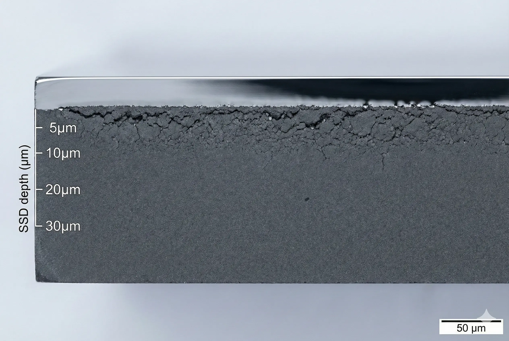
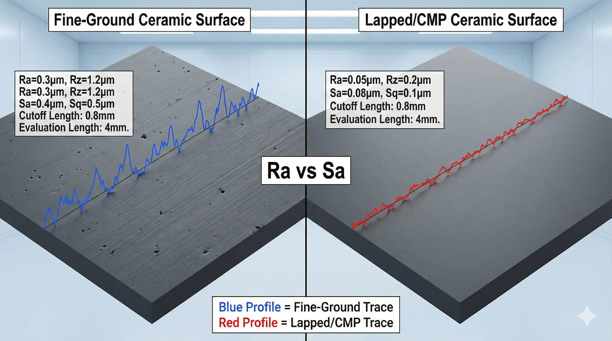
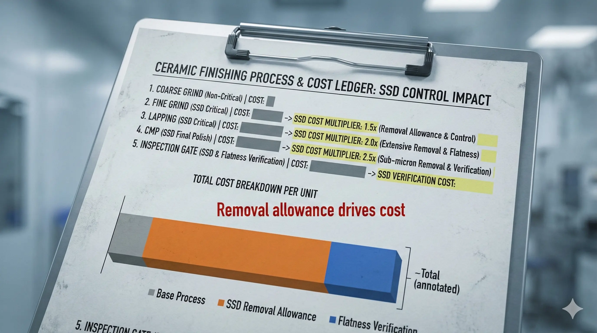

> Surface finish on ceramics is not just a number. Ra, flatness, waviness, edge condition, and subsurface damage all affect whether a part seals, wears, insulates, or survives handling.

### Why Ra Alone Is Not Enough

Ra can describe texture on a measured trace, but it does not prove that the surface is free from micro-cracks, pull-out, edge chips, embedded debris, or grinding damage below the surface.

This matters for:

- Sealing faces and valve seats.
- Wear surfaces and bearing-adjacent parts.
- Semiconductor and vacuum components.
- High-voltage ceramic interfaces.
- Parts exposed to thermal cycling or tensile stress.

### Specify Finish by Function

Do not specify polishing globally unless every surface is functional. A practical RFQ assigns finish by surface role:

| Surface role  | Typical intent          | Useful specification                    |
| ------------- | ----------------------- | --------------------------------------- |
| Seal face     | Leak or contact control | Flatness, Ra, edge break, report method |
| Datum pad     | Measurement stability   | Ground face, flatness, CMM reference    |
| Wear face     | Friction and life       | Ra, roundness, surface integrity        |
| Cosmetic face | Appearance only         | Visual acceptance, not precision finish |
| Handling edge | Chip control            | Chamfer or radius with max chip size    |

This prevents a quote from pricing the entire component as a lapped or polished part.

### What Drives Price

Surface-finish pricing is usually driven by:

1. Grinding wheel selection and dressing time.
2. Controlled removal rate and spark-out.
3. Lapping or polishing sequence.
4. Repeated cleaning and measurement.
5. Handling and edge protection.
6. Scrap risk from chips or cracks.
7. Extra evidence such as microscopy or profile reports.

### Subsurface Damage Risk

Aggressive grinding can leave damage below an apparently smooth surface. The part may pass size and Ra but fail later under load, heat, vibration, or sealing stress.

Risk increases when:

- Removal rate is too aggressive.
- Wheel dressing is poor.
- Coolant or support is insufficient.
- Sharp edges remain unprotected.
- Thin walls flex during finishing.
- Acceptance ignores crack or chip criteria.

When reliability matters, ask for process control, coupon evidence, microscopy, proof testing, or other validation rather than relying on Ra alone.

### RFQ Language That Helps

Use precise but localized language:

- "Seal face A: lapped, Ra target X, flatness target Y, report required."
- "Datum face B: ground and used for CMM reference."
- "Non-functional exterior faces: standard ground or as-sintered acceptable."
- "Edges around seal land: controlled chamfer; no visible chips in functional zone."

This gives the supplier a route and gives procurement a measurable acceptance gate.

### FAQ

**Can Ra 0.1 micrometer be quoted?**

It may be feasible on selected functional faces by controlled grinding, lapping, or polishing after material, geometry, and inspection method are reviewed. It should not be specified globally without a functional reason.

**Does polishing make a ceramic stronger?**  
Not automatically. Polishing can reduce surface flaws, but poor grinding before polishing can leave subsurface damage.

**What should be included in the quote?**  
State which faces need Ra evidence, whether flatness mapping is required, what chip criteria apply, and whether microscopy or process evidence is needed.
