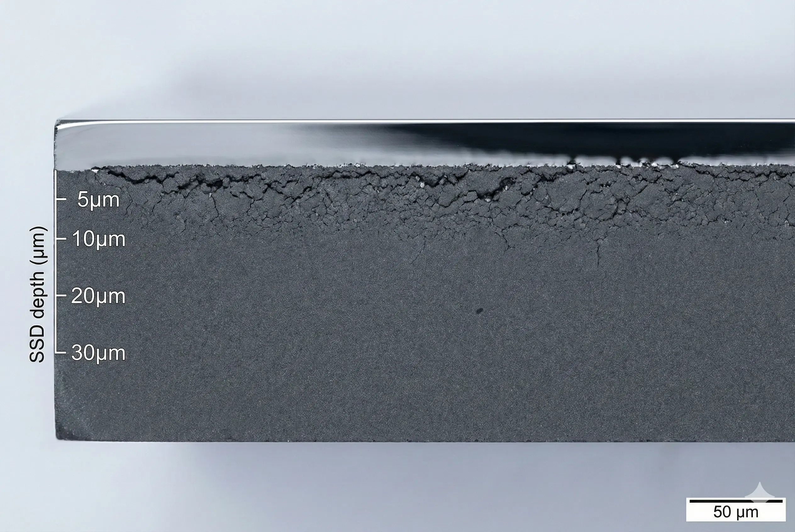
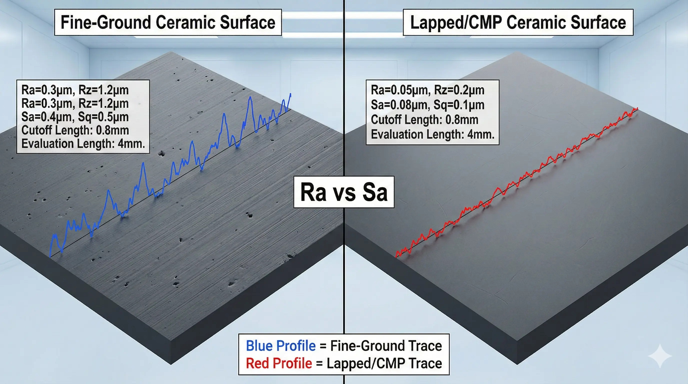
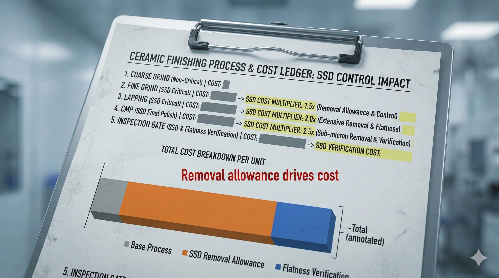

> Surface finish on ceramics is not just a number. Ra, flatness, waviness, edge condition, and subsurface damage all affect whether a part seals, wears, insulates, or survives handling.

## Why Ra Alone Is Not Enough

Ra can describe texture on a measured trace, but it does not prove that the surface is free from micro-cracks, pull-out, edge chips, embedded debris, or grinding damage below the surface.

This matters for:

- Sealing faces and valve seats.
- Wear surfaces and bearing-adjacent parts.
- Semiconductor and vacuum components.
- High-voltage ceramic interfaces.
- Parts exposed to thermal cycling or tensile stress.

## Specify Finish by Function

Do not specify polishing globally unless every surface is functional. A practical RFQ assigns finish by surface role:

| Surface role  | Typical intent          | Useful specification                    |
| ------------- | ----------------------- | --------------------------------------- |
| Seal face     | Leak or contact control | Flatness, Ra, edge break, report method |
| Datum pad     | Measurement stability   | Ground face, flatness, CMM reference    |
| Wear face     | Friction and life       | Ra, roundness, surface integrity        |
| Cosmetic face | Appearance only         | Visual acceptance, not precision finish |
| Handling edge | Chip control            | Chamfer or radius with max chip size    |

This prevents a quote from pricing the entire component as a lapped or polished part.

## What Drives Price

Surface-finish pricing is usually driven by:

1. Grinding wheel selection and dressing time.
2. Controlled removal rate and spark-out.
3. Lapping or polishing sequence.
4. Repeated cleaning and measurement.
5. Handling and edge protection.
6. Scrap risk from chips or cracks.
7. Extra evidence such as microscopy or profile reports.

## Subsurface Damage Risk

Aggressive grinding can leave damage below an apparently smooth surface. The part may pass size and Ra but fail later under load, heat, vibration, or sealing stress.

Risk increases when:

- Removal rate is too aggressive.
- Wheel dressing is poor.
- Coolant or support is insufficient.
- Sharp edges remain unprotected.
- Thin walls flex during finishing.
- Acceptance ignores crack or chip criteria.

When reliability matters, ask whether process control, coupon evidence, microscopy, proof testing, or other validation should be part of the agreed qualification route rather than relying on Ra alone.

## RFQ Language That Helps

Use precise but localized language:

- "Seal face A: lapped, Ra target X, flatness target Y, report required."
- "Datum face B: ground and used for CMM reference."
- "Non-functional exterior faces: standard ground or as-sintered acceptable."
- "Edges around seal land: specified edge break and chip-size limit, inspected in the defined zone under agreed lighting and magnification."

This gives the supplier a route and gives procurement a measurable acceptance gate.

## Roughness, Flatness, and Damage Need Different Evidence

A polished appearance is not an acceptance report. Treat each requirement as a separate question.

| Question                                           | Evidence to agree                                                                                                   | What that evidence does not establish                                             |
| -------------------------------------------------- | ------------------------------------------------------------------------------------------------------------------- | --------------------------------------------------------------------------------- |
| Is the texture within the required limit?          | Specified roughness parameter, measured location and direction, filtering, evaluation length, and instrument method | Whole-face flatness, crack depth, or seal performance                             |
| Is the functional face sufficiently flat?          | Defined face/zone, part support, measurement coverage, and agreed flatness method                                   | Surface texture or absence of local damage                                        |
| Are edges and exposed surfaces acceptable?         | Defined defect zones, chip/scratch limits, lighting, magnification, and reference images if useful                  | Absence of subsurface cracks                                                      |
| Is grinding damage controlled for the application? | Agreed process/qualification plan; representative specimens or destructive analysis where justified                 | A universal "damage-free" claim for untested parts                                |
| Does the finished assembly perform?                | Customer-defined leak, wear, electrical, thermal, or other functional test                                          | A conclusion that dimensional or Ra inspection alone proves equipment performance |

[NIST research on machining cracks in silicon nitride](https://www.nist.gov/publications/fractographic-analysis-machining-cracks-silicon-nitride-rods-and-bars) relates grinding procedures and measured machining cracks to flexural-strength behavior. That is evidence for keeping damage and surface texture separate; it does not supply a transferable damage limit or a strength guarantee for other grades and geometries.

## Make the Ra Report Reproducible

For profile-based surface specifications, identify the applicable standard and edition rather than requesting only "Ra inspection." [ISO 21920-1:2021](https://www.iso.org/standard/72196.html) covers indications in product documentation, [ISO 21920-2:2021](https://www.iso.org/standard/72226.html) covers terms and parameters, and [ISO 21920-3:2021](https://www.iso.org/standard/72228.html) covers specification operators. These references define the specification framework, not what every ceramic part can achieve. Do not silently reinterpret a legacy drawing using a different standard's defaults.

Agree the following with the supplier or inspection provider:

- Parameter and units: an Ra limit is not interchangeable with a different profile parameter or an areal parameter.
- Face and trace locations: exclude or include holes, grooves, edge zones, and interrupted lands explicitly.
- Trace direction relative to the machining lay and the functional contact direction.
- Filtering and evaluation length appropriate to the specified method and the available measurement area.
- Contact or optical method; for contact measurement, relevant stylus geometry and access.
- Number of traces, part sampling, reporting format, and acceptance rule.

[NIST's surface roughness calibration guidance](https://www.nist.gov/document/nistsurfcalibpdf) illustrates why filtering and stylus response affect measured profiles. Two reports carrying the same parameter name should not be treated as equivalent when the measurement setup differs. If a small seal land cannot accommodate the specified trace, resolve the method before accepting the quote.

## Subsurface-Damage Qualification Is Not Routine Visual Inspection

Surface microscopy can document exposed scratches, pits, pull-out, and edge defects. It cannot by itself certify that every hidden crack is absent. A CMM or roughness report also does not measure subsurface crack depth.

For a damage-sensitive application, define who owns the qualification and what evidence is proportionate to the risk. If coupons or witness specimens are used, agree how their grade, blank preparation, grinding orientation, removal sequence, and loading condition represent the actual part. Destructive sectioning, fractography, or proof testing needs an agreed method and acceptance basis; it should not be assumed to be included in a normal machining quotation.

A documented process can support repeat-order control, but process evidence is not the same as direct verification of every part. Keep part inspection, process qualification, and customer assembly testing separately identified.

## Compare Finish Scope, Not Just the Word "Polished"

Before comparing quotations, check that both cover the same:

- Grade and incoming blank condition.
- Ground, lapped, polished, and untouched zones.
- Final material removal and dimensional checks after finishing.
- Roughness and flatness methods, frequency, and reporting.
- Surface/edge defect acceptance and any damage-sensitive qualification.
- Cleaning, handling, separation of contact faces, and protective packaging.

For an illustrative lapped seal band, specify the band boundaries, required texture, flatness method, mating interface, edge acceptance, and whether leak testing belongs to customer qualification. Leave clearance faces at a less demanding finish only where function permits. This is a drawing-review example, not a claim of improved sealing or a guaranteed saving.

If the measurement method, defect criterion, or qualification owner is unresolved, ask for clarification rather than accepting an ambiguous "mirror finish" promise. Send the face-level requirements through the existing [ceramic RFQ path](/rfq/); the [lapped seal-face guide](/posts/lapped-seal-faces/ceramic-lapped-seal-faces-rfq/) supplies the component-specific follow-up.

## Related Guides

- Use the [ceramic tolerance capability map](/posts/tolerances-gdt/ceramic-tolerance-capability-map-by-feature-process/) when Ra, flatness, parallelism, or bore quality must be tied to a measurable feature.
- Use the [lapped ceramic seal face RFQ guide](/posts/lapped-seal-faces/ceramic-lapped-seal-faces-rfq/) when the surface is a seal band, valve seat, pump face, or paired flat.
- Use the [ceramic CNC machining design rules](/posts/design-rules-dfm/ceramic-cnc-machining-design-rules-advanced-ceramic-parts/) when low-Ra surfaces sit near holes, slots, thin walls, or fragile edges.
- Use the [custom ceramic CNC machining RFQ checklist](/posts/rfq-preparation/custom-ceramic-cnc-machining-rfq-checklist/) to state finish, edge, and inspection requirements before quotation.

## FAQ

**Can Ra 0.1 micrometer be quoted?**

Treat it as a buyer-specified texture target, not a universal capability. Review the grade, face geometry, blank state, finishing sequence, available measurement area, and inspection settings before confirmation. A low Ra target does not establish flatness or a subsurface-damage limit.

**Does polishing make a ceramic stronger?**  
Not automatically. Polishing can reduce surface flaws, but poor grinding before polishing can leave subsurface damage.

**What should be included in the quote?**  
State which faces need Ra evidence, whether flatness mapping is required, what chip criteria apply, and whether microscopy or process evidence is needed.
