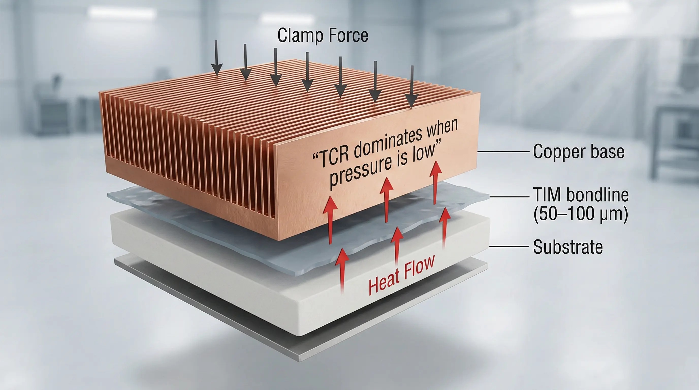
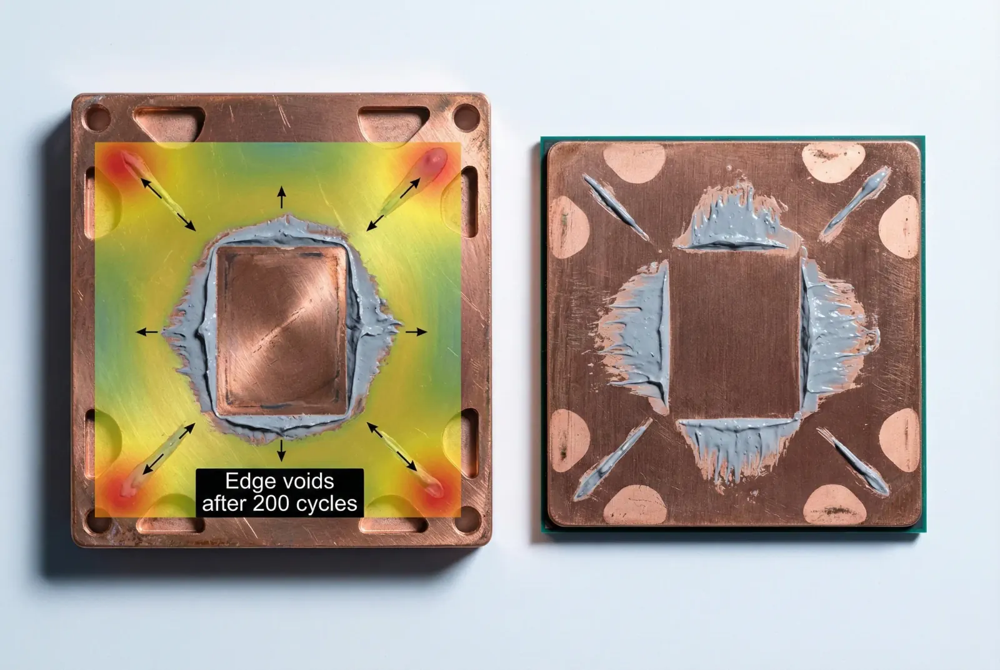
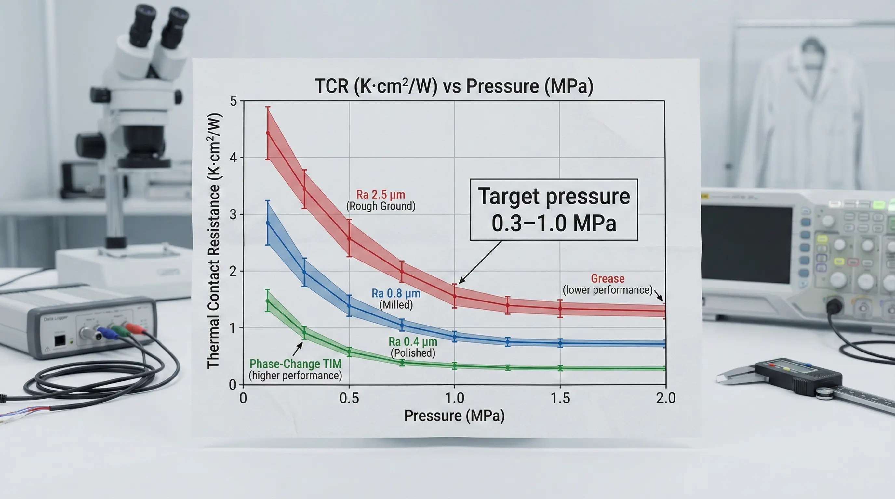

> Thermal contact and interface failures in copper heat sinks are**conditionally feasible**to prevent for electronics assemblies that can control flatness, clamp load, and TIM behavior. While copper offers bulk thermal conductivity ~390–400 W/m·K, teams must account for**thermal contact resistance (TCR)**that can dominate the stack-up when surface finish, pressure, and contamination are not engineered.

### Copper Heat Sink Interfaces: Where “Good Copper” Still Runs Hot

We routinely see a pattern: a copper heat sink meets the CAD thermal target, the CFD looks clean, and the prototype still fails junction temperature by**+8 to +25°C**under steady-state power. In most of those cases, the copper is not the problem. The interface is.

Thermal interfaces are a type of**series thermal resistance**. Even when copper’s bulk conduction is strong, a realistic interface can add**0.05–0.30 K/W**at module level depending on area, pressure, and TIM selection—enough to erase a heat sink redesign.

### Thermal Contact Resistance in Copper: The Physics That Causes Failures

Thermal contact resistance (TCR) is a type of resistance caused by**micro-asperity contact**and**interstitial films**(air, oxide, oils, TIM voids). Real contact area is typically**<5%**of apparent area without sufficient pressure and surface engineering, which is why “two flat plates” still behave like an insulator.

Two factors dominate TCR in production:

- **Surface topography** : Typical milled copper surfaces land around **Ra 0.8–3.2 µm** unless specified; lapped surfaces can reach **Ra 0.1–0.4 µm** .
- **Contact pressure** : Many TIMs and bare-metal contacts show large TCR improvement as pressure rises from **~0.1 MPa to 1.0 MPa** , then diminishing returns above that range.

(Interface stack concept with resistances and pressure path)

### Copper Interface Failure Modes: What Actually Breaks in the Field

#### Oxide Film Growth on Copper Contact Pads

Copper oxide is a type of interfacial barrier. Even a thin oxide layer increases interface resistance and makes TIM wetting less consistent. Unprotected copper can form visible oxidation in**days to weeks**depending on humidity and handling, and the effect is amplified when the system relies on metal-to-metal microcontacts.

**Typical symptom**: unit-to-unit thermal spread increases by**>10°C**at the same power because oxide/contamination varies by handling.

#### TIM Pump-Out Under Thermal Cycling

Pump-out is a type of TIM migration driven by CTE mismatch and cyclic shear. Copper’s CTE is about**16–17 ppm/°C**; silicon is about**2.6–3 ppm/°C**; common substrates (AlN, Al₂O₃, FR-4, IMS) sit between. That mismatch can shear greases during cycling (e.g.,**-40°C to +85°C**), thinning the bondline at edges and leaving voids.

**Typical symptom**: after**100–500 cycles**, hotspot appears near die edge; measured θJA drifts upward**10–30%**.

#### TIM Dry-Out and Oil Bleed

Some silicone-based greases are a type of dispersion that can lose volatiles or bleed oil at elevated temperature. Long dwell at**>100–125°C**can increase viscosity and raise bondline resistance, particularly if clamp load is low and the TIM cannot reflow.

**Typical symptom**: initial thermal pass, then slow degradation over**200–1000 hours**.

#### Flatness / Bow and the “Center-Only Contact” Trap

Copper heat sinks with pockets, thin floors, or aggressive machining can warp. If the mating face flatness is not controlled (e.g., drifting from**≤0.05 mm**to**0.15 mm**over the contact length), clamp load concentrates at peaks and leaves peripheral air gaps.

**Typical symptom**: thermal paste prints show a thick center blob and dry edges; IR shows ring-shaped heat pattern.

#### Clamp Load Loss: Creep, Relaxation, and Torque Scatter

Fastener torque is a type of proxy for clamp force, but scatter is large. With common screw joints, clamp force can vary**±25–40%**at the same torque due to friction variability. Over time, polymer standoffs, threadlock, and TIM creep can reduce load another**10–30%**.

**Typical symptom**: thermal performance depends on assembler and drifts after vibration/transport.

(Macro photo-style: TIM pump-out path + bolt pattern pressure map)

### The Execution Log: A Copper Cold Plate That “Should Have Worked” (But Didn’t)

A power electronics client asked us to support a copper heat sink interface for a**~300 W**module where the allowed case-to-ambient resistance budget was**≤0.20 K/W**. The copper block was CNC-machined, and the team used a standard silicone grease with a nominal conductivity around**3–6 W/m·K**and a target bondline thickness of**~100 µm**.

**What we tried (the attempt):**

- Milled copper base, “as-machined” finish (measured Ra around **~1.6–2.5 µm** ).
- Four-corner screw clamp, torque-controlled assembly.
- Grease applied by stencil.

**What went wrong (the friction):**

- Temperature rise exceeded target by **+14°C** at steady power.
- After **~200 thermal cycles** (customer profile similar to **-40/+85°C** ), the hotspot increased another **+8–10°C** .
- Post-teardown showed edge voids consistent with pump-out and a visible oxidation/handling film on copper.

**How we fixed it (the resolution):**

- We moved from “as-machined copper” to a controlled interface:
  - Base face finish tightened to **Ra ≤0.4 µm** (lapping).
    - Flatness tightened to **≤0.05 mm** over the footprint.
    - Introduced **Ni plating ~5–10 µm** on copper to stabilize the surface (oxide control and repeatable wetting).
    - Switched from grease to a **phase-change TIM** with controlled melt behavior and lower pump-out risk, targeting **~50–80 µm** effective bondline under load.
    - Added a **spring-loaded clamp** (Belleville washers) to reduce long-term clamp loss.

**The tax we paid (the “bill”):**

- Added process steps (lapping + plating) increased piece cost by **~15–35%** depending on volume.
- Lead time increased by **~1–2 weeks** due to plating queue and incoming inspection.
- Incoming QC expanded: surface roughness verification and flatness check per lot.

Net result: interface-driven thermal spread tightened; the same module ran within**+2–4°C**unit-to-unit at steady state, and cycling drift dropped below**~5%**over the qualification window.

### Data Forensics Table: Copper Interface Controls That Actually Move TCR

| Parameter | Standard Approach | Advanced Approach | The Trade-off |
| --- | --- | --- | --- |
| Copper base surface roughness | As-machined Ra 0.8–3.2 µm | Lapped Ra ≤0.4 µm | Adds lapping cost; requires flatness metrology |
| Flatness over footprint | Typical 0.10–0.20 mm | Controlled ≤0.05 mm | More restrictive machining + inspection time |
| Surface stability | Bare copper (oxide varies) | Ni plating ~5–10 µm (option: Au flash for low-force contacts) | Plating vendor dependency; adhesion/porosity control |
| TIM type | Silicone grease (pump-out risk) | Phase-change or gap pad with cycling data | Pads increase thickness; PCM needs reflow management |
| Bondline thickness control | Manual application; ~100–200 µm scatter | Stencil/dispense control; target ~50–100 µm | Process engineering + fixtures |
| Clamp load retention | Torque-only; load scatter ±25–40% | Springs/Bellevilles; controlled compression | More hardware; stack height constraints |
| Cleanliness | Wipe only | Solvent clean + handling control (gloves, caps) | EHS/process discipline; adds minutes per unit |
| Verification | “It assembled” | Thermal impedance tracking; lot sampling | Test time; requires stable fixtures |

*Test method: steady-state power step + interface pressure recording; validate with post-cycle re-test (e.g., 200–500 cycles) and teardown paste print inspection.*

(Data comparison: TCR vs pressure and roughness bands)

> **Project Readiness Check**- Before committing, ask yourself (or your supplier):
>   - Can we specify and verify **flatness ≤0.05 mm** and **Ra ≤0.4 µm** on the copper mating face at production volume?
>     - Do we have a clamp strategy that limits long-term clamp loss to **≤15%** after thermal cycling and vibration?

### Feasibility Verdict for Copper Heat Sink Interfaces

#### Clearly Feasible: Controlled Flatness + Stable Clamp Load + Proven TIM

Go ahead if:

- Mating face flatness is held to **≤0.05 mm** and roughness to **Ra ≤0.8 µm** (or better).
- Interface pressure is controlled in the **~0.3–1.0 MPa** range across the footprint (not corner-peaked).
- TIM has documented cycling performance for your profile (e.g., **200–500 cycles** minimum before design freeze).

#### Conditionally Feasible: “High-Cost Route” Where the Interface Becomes the Product

Possible, but expect higher cost/complexity if:

- You need low pressure (fragile dies, thin substrates) yet tight θ targets (interface must be “high performance” at **<0.2 MPa** ).
- You have aggressive cycling ( **-40/+125°C** , high dwell) where grease pump-out risk is high.
- Your assembly torque control is weak (large operator or supplier variation).

This zone is workable when you pay the tax: plated surfaces, controlled bondlines, spring clamps, and verification testing.

#### Structurally Mismatched: When Copper Bulk Performance Can’t Save the Interface

Not recommended if:

- You cannot control flatness/pressure (e.g., large footprints with thin copper floors that warp; uncontrolled fastener patterns).
- You rely on bare copper metal contact at low force (oxide and contamination dominate).
- Your system cannot tolerate interface drift over life, but you cannot afford cycle testing and teardown validation.

Consider alternatives:

- A thicker interface pad (accept higher bondline but stable behavior).
- A redesigned clamp architecture (springs, frame clamps).
- A different surface system (Ni-plated copper, or compatible coating stack).

> *Disclaimer: All scenarios described are based on real or closely analogous executed projects. If you choose to implement any of the examples described in this article, please conduct a careful evaluation first. This site assumes no responsibility for losses resulting from implementations made without prior evaluation.*

---
