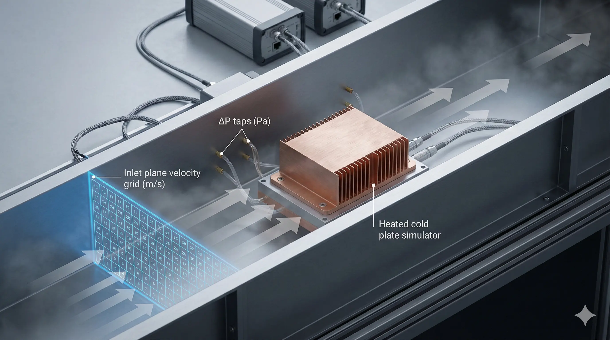
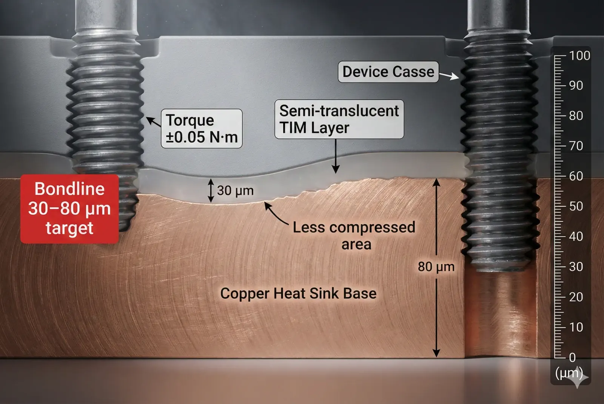
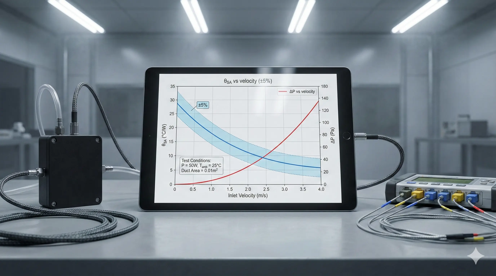

> **Thermal performance test methods for copper heat sinks are conditionally feasible for product decisions when the test fixture, airflow boundary conditions, and interface pressure are controlled.**While copper offers a measurable conductivity advantage (≈390–400 W/m·K for high-purity grades), engineering teams must account for fixture-induced contact resistance and airflow non-uniformity (often shifting apparent θSA by 10–30%) to make results decision-grade.

### Copper Heat Sink Thermal Resistance Metrics

When customers ask “What is the thermal performance of this copper heat sink?”, the real request is usually:**what θSA or θJA can we trust at our power level and airflow?**We see failures when a supplier reports a single “°C/W” number without stating**heat input (W), airflow (m/s), inlet temperature (°C), and mounting pressure (kPa)**—because each one can move the result by double digits.

In practice, we treat copper heat sink testing as a**metrology problem**: the test must separate**conduction through the base + interface**from**convection to air**, and it must do so with repeatability (typical internal target:**±5% on θSA across three builds**) before we accept it for design freeze.

### JEDEC JESD51 Boundary Conditions for Heat Sink Testing

Most “heat sink performance” disputes trace back to boundary conditions, not copper. JEDEC JESD51 methods (and fixtures derived from them) exist because small uncontrolled variables—like**inlet turbulence intensity**or**board-to-duct leakage**—can swing θ results by**0.05–0.20 °C/W**at**50–200 W**, which is the difference between passing and failing a junction limit.

**A copper heat sink test is a type of boundary-condition replication problem**: if the product lives in a 1U chassis at**2.5–4.0 m/s**ducted flow, an open-bench fan test at**0.8 m/s**is not “conservative”—it is often non-correlated.

### Wind Tunnel Airflow Test Setup for Copper Heat Sinks

A wind tunnel (ducted) setup is the most defensible method when your application is air-cooled. The minimum controls we use:

- **Inlet air temperature** held within **±0.5 °C** over the run.
- **Air velocity** measured at the heat sink inlet plane (not the fan label), typically **±3%** uncertainty.
- **Heater power** measured electrically with **±1%** uncertainty (true RMS and accounting for wiring losses).
- **Pressure drop** across the sink recorded (often **10–200 Pa** depending on fin density), because the same fan can land on different operating points.

**Failure mode we see:**teams report θSA at a quoted “10 CFM” but never record**static pressure**; two sinks can both be “10 CFM” in different test rigs while having**2×**difference in restriction.

### Calorimetric Heat Flow Method for Heat Sink Verification

If you need to validate the true heat flow into the sink (especially above**200 W**), calorimetric approaches reduce the “where did the watts go?” argument. A common implementation is a controlled air loop where:

- **Mass flow rate** is measured (e.g., via nozzle/flow element).
- **ΔT of air** is measured with matched sensors (target **±0.1–0.2 °C** ).
- Heat removed is computed by **Q = ṁ·cp·ΔT** .

The trade: calorimetry increases instrumentation cost and setup complexity, but it closes the loop on power accounting. If your electrical heater is**150 W**, calorimetry should recover**≈145–155 W**after losses are characterized; if it “recovers”**120 W**, your setup is leaking heat into fixtures.

### Interface Thermal Resistance RθCS in Copper Heat Sink Tests

Copper often “looks worse than expected” in testing because the**interface dominates**. Even with a strong copper base, a poorly controlled TIM bondline can add**0.05–0.20 °C/W**at realistic contact pressures.

Controls that materially change outcomes:

- **Mounting torque** recorded (example range **0.3–1.2 N·m** depending on fastener), because it changes contact pressure and bondline thickness.
- **TIM thickness** controlled (example **30–80 µm** for greases/PCMs in many fixtures).
- **Surface flatness** verified (practical acceptance in production contexts often **≤50 µm TIR** across the contact area, unless you explicitly lap).

If you do not control these, you are not measuring the heat sink; you are measuring the*test interface*.

### Execution Log: 150 W Power Module Copper Heat Sink Wind Tunnel Test

We previously supported a program with a**150 W**power module targeting**θSA ≤ 0.25 °C/W**at**3.0 m/s**ducted airflow. The first supplier report showed**0.31 °C/W**at “3 m/s,” which would have forced a major mechanical redesign.

**The attempt (what we did):**We repeated the test in a duct with velocity mapped across the inlet plane (9-point grid). Mean velocity was**3.0 m/s**, but non-uniformity was**±20%**, and the heater power measurement was off by**~4 W**due to lead losses.

**The friction (what went wrong):**The main error was**contact resistance drift**. The mounting stack used a spring plate with torque scatter of**±0.25 N·m**, causing case temperature shifts of**3–6 °C**at**150 W**. That translated to an apparent θSA swing of**0.02–0.04 °C/W**.

**The resolution (what fixed it):**

- We moved to controlled torque with a calibrated driver (repeatability **±0.05 N·m** ).
- We standardized TIM application by mass (e.g., **0.08–0.12 g** over the footprint) and verified bondline via witness coupons.
- We added a heat-loss characterization run (insulated dummy) and corrected power by **+2.5%** .

Result: θSA improved from**0.31 °C/W**reported to**0.26–0.27 °C/W**correlated across two fixtures.

**The tax (the real bill):**

- Added **1–2 days** of fixture iteration and uncertainty budgeting.
- Added instrumentation (extra thermocouples, differential pressure) and calibration time.
- Introduced a stricter assembly SOP; without it, correlation did not hold.

### Data Forensics Table for Copper Heat Sink Thermal Testing

| Parameter | Standard Approach | Advanced Approach | The Trade-off |
| --- | --- | --- | --- |
| Airflow definition (m/s) | Single-point anemometer at duct center | Inlet plane mapping (e.g., 9–25 points) and uniformity spec (e.g., ≤±10%) | More sensors + longer setup; reduces θSA error by ~0.02–0.05 °C/W at 50–200 W |
| Heater power (W) | PSU readout | True RMS power + lead-loss correction (±1%) | Requires power analyzer; closes power balance for >100 W |
| Temperature sensing | 1–2 thermocouples | Multipoint case + inlet/outlet air (target ±0.2 °C) | Higher channel count; identifies gradients that invalidate “single Ts” |
| Mounting pressure / torque | “Hand tight” | Calibrated torque + documented stack-up (±0.05 N·m) | Assembly discipline; prevents 3–6 °C drift on case temp |
| TIM control | “Apply paste” | Mass-controlled application + bondline witness (30–80 µm typical) | Process overhead; prevents hidden RθCS dominating results |
| Pressure drop (Pa) | Not recorded | Differential pressure across sink (10–200 Pa typical) | Extra transducer; enables fan curve correlation |
| Radiation / fixture losses | Ignored | Characterized loss run; correction factor (often 1–5%) | Additional runs; improves cross-lab agreement |
| Reporting output | Single °C/W number | θSA vs airflow curve + uncertainty (e.g., ±5%) | More reporting effort; decision-grade procurement comparisons |

*Test method: Ducted airflow test aligned to JEDEC-style boundary control (e.g., JESD51-derived fixture discipline) with power and interface uncertainty budgeting.*

### Feasibility Verdict for Copper Heat Sink Test Methods

**Clearly Feasible: Ducted wind tunnel θSA testing**

- Go ahead if your product airflow is known (e.g., **2–4 m/s** ) and you can lock inlet temperature within **±0.5 °C** and torque within **±0.05 N·m** .
- Output should be a curve: **θSA (°C/W) vs velocity (m/s)** plus pressure drop (Pa).

**Conditionally Feasible: Bench fan “CFM” testing**

- Possible, but expect **10–30%** non-correlation unless you also log static pressure and map inlet velocity.
- Use only for quick iteration, not for supplier selection or final thermal budget.

**Structurally Mismatched: “One-number” thermal claims without boundary conditions**

- Not recommended when decisions depend on **<0.05 °C/W** differences or when power is **>100 W** .
- Consider alternatives: a JEDEC-aligned fixture, a calorimetric loop, or an application-representative chassis test.

> **Project Readiness Check**- Before committing, ask yourself (or your supplier):
>   - Can we specify airflow as inlet velocity (m/s) and pressure drop (Pa), not just “fan CFM”?
>     - Is the interface stack (torque, TIM type, bondline target) controlled tightly enough that RθCS cannot dominate θSA?

### FAQ: Copper Heat Sink Thermal Performance Testing

**Which metric should we use: θSA or θJA?**

Use θSA when you are comparing heat sinks under defined airflow and mounting conditions; it isolates sink-to-ambient performance. Use θJA only when the full system (heater/package/board/sink/airflow) is fixed, because θJA changes if any part of that stack changes.

**What is a realistic repeatability target for θSA testing?**

For a controlled duct setup at 50–200 W, we treat ±5% as the minimum bar for supplier-to-supplier comparison. If the result shifts by >±10% across repeats, interface control (torque/TIM) or airflow uniformity is usually the culprit.

**How many temperature sensors are “enough”?**

At minimum: one near the heat source/case, one inlet air, one outlet air. For finned sinks, add at least 2–4 base locations to detect gradients; a 3–6 °C gradient across the base can invalidate single-point θ calculations at 100–200 W.

**Why does copper sometimes not outperform aluminum in reported tests?**

Copper’s conductivity advantage can be masked if convection dominates (high airflow) or if interface resistance dominates (poor TIM control). In those cases, a copper base can measure similarly to aluminum unless you reduce RθCS and keep airflow boundary conditions comparable.

**Should we test steady-state only, or include transient thermal impedance?**

Include transient if your load is pulsed (e.g., duty cycles <60 s). Steady-state θ can look acceptable while transient peaks exceed limits. A basic transient report is Zth(t) at defined power steps with time constants captured from seconds to minutes.

---

> *Disclaimer: All scenarios described are based on real or closely analogous executed projects. If you choose to implement any of the examples described in this article, please conduct a careful evaluation first. This site assumes no responsibility for losses resulting from implementations made without prior evaluation.*
