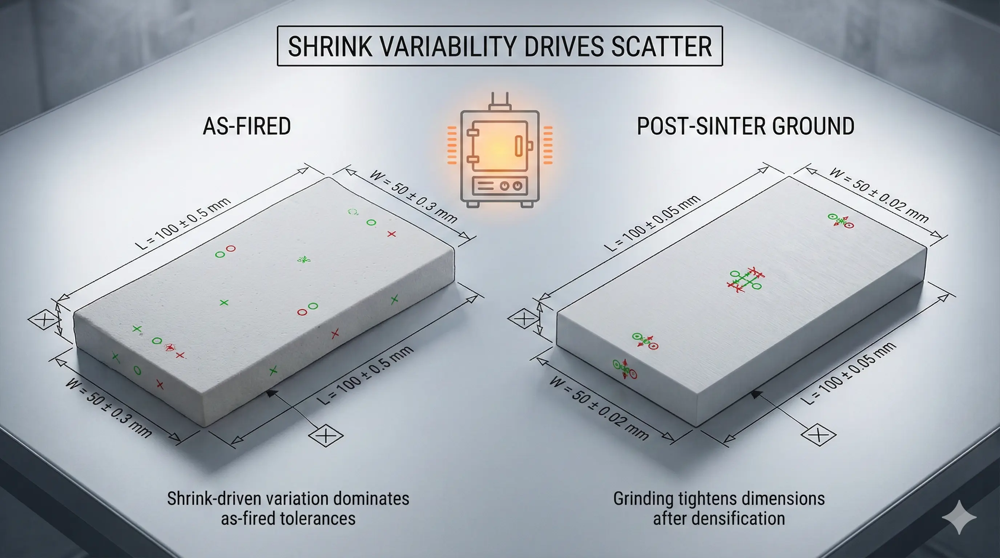
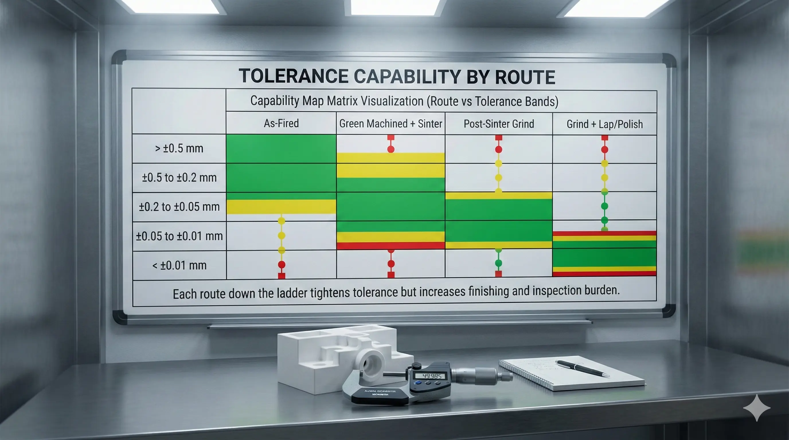
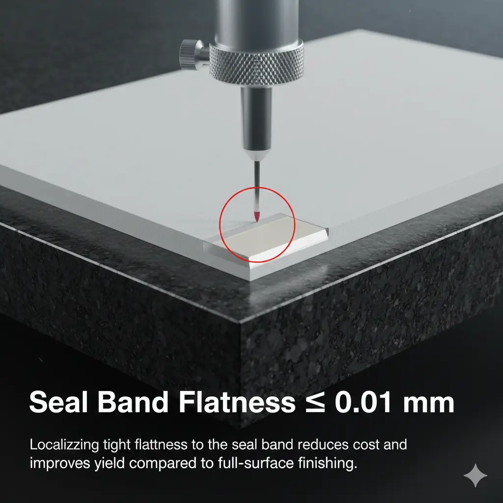

> A ceramic tolerance capability map is useful only when it is tied to feature type, datum strategy, process route, and measurement method. The expensive mistake is not asking for precision; it is asking for precision everywhere.

### Why Ceramic Tolerances Behave Differently

Ceramics are formed, fired, and often finished after densification. Shrinkage, warpage, grain structure, porosity, and brittleness all affect the route. A metal-style block tolerance can unintentionally force every surface into post-sinter grinding, even when only one seal band or bore is functional.

Two questions should be answered before quotation:

- Which surfaces are functional and must be finished?
- Which surfaces are references, cosmetic, or acceptable as-sintered?

### Process Route Ladder

Ceramic tolerance capability usually follows a route ladder:

| Route                              | Typical use                                | Main risk                               |
| ---------------------------------- | ------------------------------------------ | --------------------------------------- |
| As-sintered                        | Non-critical surfaces, moderate dimensions | Shrinkage scatter and rougher surfaces  |
| Green machining plus sinter        | Complex shapes before firing               | Shrinkage compensation and warpage      |
| Post-sinter diamond grinding       | Functional faces, bores, datums            | Setup, wheel wear, and edge damage      |
| Grinding plus lapping or polishing | Sealing, flatness, very low Ra             | Cost, handling, and repeated inspection |

Moving down this ladder is not a small price increment. It changes fixturing, cycle time, measurement time, scrap exposure, and lead time.

### Practical Tolerance Mapping

Use this as a procurement planning map, not as a guaranteed capability promise:

| Feature                   | Cost-aware requirement                  | Route trigger                               |
| ------------------------- | --------------------------------------- | ------------------------------------------- |
| Overall non-critical size | Moderate tolerance, as-sintered allowed | Forming plus sinter control                 |
| Datum face                | Finished and inspectable                | Grinding                                    |
| Seal face                 | Flatness, Ra, edge condition            | Grinding plus lapping                       |
| Precision bore            | Diameter, roundness, datum relation     | Internal grinding or lapping                |
| Micro-hole                | Diameter, position, taper, breakout     | Specialized drilling and optical inspection |
| Thin wall or slot         | Wall thickness, radius, edge break      | DFM review before quote                     |

If the drawing requires tight size, tight position, tight flatness, and low Ra on the same fragile feature, expect a route escalation.

### How to Avoid Over-Specification

A cost-aware drawing separates requirements into functional and non-functional zones:

- Primary datums: finished and measurable.
- Seal bands: flatness and Ra specified only where sealing occurs.
- Bores: diameter and roundness tied to datum faces.
- Handling edges: chamfer or radius specified to reduce chips.
- Cosmetic surfaces: not treated as inspection-critical unless required.

This lets the supplier quote the actual function rather than worst-case precision across the entire part.

### Execution Pattern

For a ceramic plate with a sealing band, a first drawing may ask for tight thickness and low Ra everywhere. A better drawing usually defines one ground datum face, one lapped seal band, controlled parallelism only between functional faces, and visual chip criteria on edges. The result can preserve performance while reducing unnecessary lapping and scrap exposure.

### RFQ Readiness Checklist

Send these details when tolerance matters:

- Material grade and fired state.
- STEP file and drawing revision.
- Functional datums and critical-to-quality features.
- Which faces are ground, lapped, polished, or as-sintered.
- Surface finish and flatness requirements per face.
- Edge break or chip criteria by zone.
- Inspection method and report expectations.

### FAQ

**Can ceramic parts hold tight tolerances?**  
It depends on material, geometry, datum strategy, finishing access, and inspection method. Applying tight tolerance everywhere is what drives cost and yield risk.

**Is +/-0.01 mm realistic?**  
It may be realistic on selected ground features after review. It is not a safe blanket tolerance for all surfaces, thin walls, slots, or as-sintered features.

**What should procurement ask first?**  
Ask which features are functional, how they will be finished, and how they will be measured.
