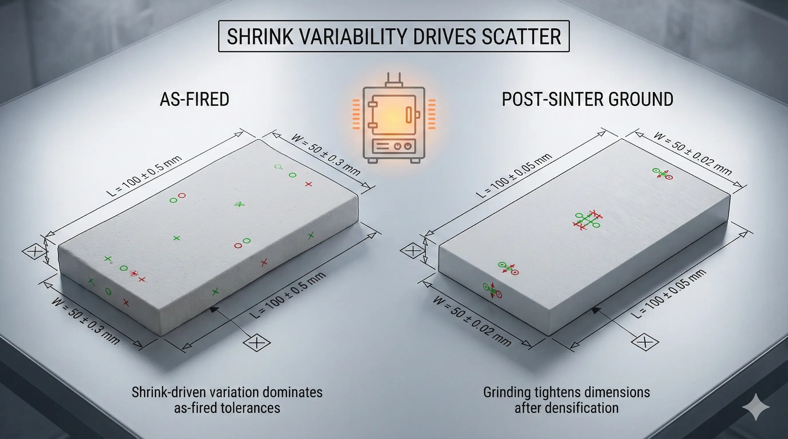
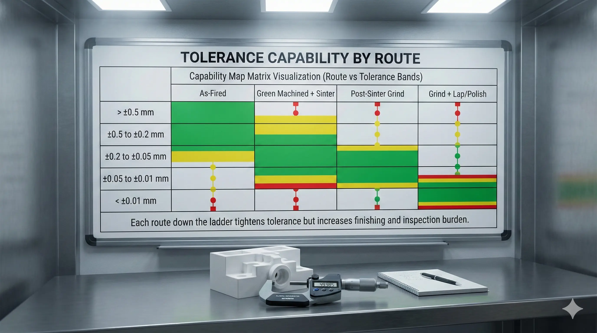
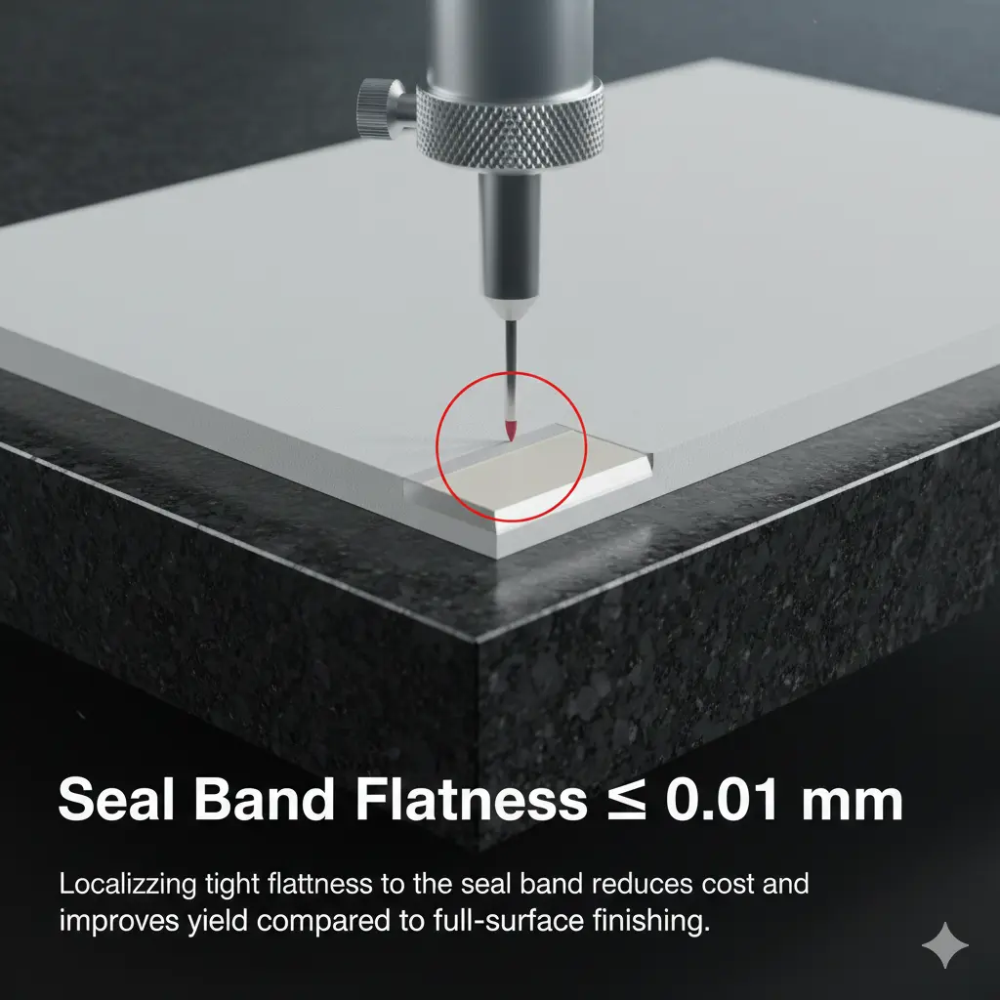

> A ceramic tolerance capability map is useful only when it is tied to feature type, datum strategy, process route, and measurement method. The expensive mistake is not asking for precision; it is asking for precision everywhere.

There is no single tolerance range that applies to every ceramic grade, part size, bore, thin wall, or as-sintered surface. This guide helps engineering and procurement teams define the evidence needed to review a tolerance request. It is not a table of guaranteed manufacturing limits.

## Why Ceramic Tolerances Behave Differently

Ceramics are formed, fired, and often finished after densification. Shrinkage, warpage, grain structure, porosity, and brittleness all affect the route. A metal-style block tolerance can unintentionally force every surface into post-sinter grinding, even when only one seal band or bore is functional.

Two questions should be answered before quotation:

- Which surfaces are functional and must be finished?
- Which surfaces are references, cosmetic, or acceptable as-sintered?

## Process Route Ladder

Ceramic tolerance capability usually follows a route ladder:

| Route                              | Typical use                                | Main risk                               |
| ---------------------------------- | ------------------------------------------ | --------------------------------------- |
| As-sintered                        | Non-critical surfaces, moderate dimensions | Shrinkage scatter and rougher surfaces  |
| Green machining plus sinter        | Complex shapes before firing               | Shrinkage compensation and warpage      |
| Post-sinter diamond grinding       | Functional faces, bores, datums            | Setup, wheel wear, and edge damage      |
| Grinding plus lapping or polishing | Sealing, flatness, very low Ra             | Cost, handling, and repeated inspection |

Moving down this ladder is not a small price increment. It changes fixturing, cycle time, measurement time, scrap exposure, and lead time.

## Practical Tolerance Mapping

Use this as a procurement planning map, not as a guaranteed capability promise:

| Feature                   | Cost-aware requirement                  | Route trigger                               |
| ------------------------- | --------------------------------------- | ------------------------------------------- |
| Overall non-critical size | Moderate tolerance, as-sintered allowed | Forming plus sinter control                 |
| Datum face                | Finished and inspectable                | Grinding                                    |
| Seal face                 | Flatness, Ra, edge condition            | Grinding plus lapping                       |
| Precision bore            | Diameter, roundness, datum relation     | Internal grinding or lapping                |
| Micro-hole                | Diameter, position, taper, breakout     | Specialized drilling and optical inspection |
| Thin wall or slot         | Wall thickness, radius, edge break      | DFM review before quote                     |

If the drawing requires tight size, tight position, tight flatness, and low Ra on the same fragile feature, expect a route escalation.

## How to Avoid Over-Specification

A cost-aware drawing separates requirements into functional and non-functional zones:

- Primary datums: finished and measurable.
- Seal bands: flatness and Ra specified only where sealing occurs.
- Bores: diameter and roundness tied to datum faces.
- Handling edges: chamfer or radius specified to reduce chips.
- Cosmetic surfaces: not treated as inspection-critical unless required.

This lets the supplier quote the actual function rather than worst-case precision across the entire part.

## Example Drawing Review, Not a Delivered Result

For an illustrative ceramic plate with a sealing band, a first drawing may ask for tight thickness and low Ra everywhere. A more reviewable drawing defines one ground datum face, one lapped seal band, parallelism only between functional faces, and measurable chip criteria on edges. Whether that change is acceptable depends on the assembly; this example does not establish a cost saving or a qualified part result.

The tolerance callout in this illustrative diagram is an example drawing input, not a measured part result or a CERAMIC CNC manufacturing limit. Any finishing, cost, or yield benefit must be evaluated for the actual grade, geometry, assembly, and inspection scope.

## Separate Size, Form, Orientation, and Position

A correct diameter does not prove a round bore, and a smooth face does not prove a flat face. Separate the requirements before asking whether a tolerance can be achieved.

| Requirement                     | What it controls                                             | What the RFQ should clarify                                                                                                          |
| ------------------------------- | ------------------------------------------------------------ | ------------------------------------------------------------------------------------------------------------------------------------ |
| Bore or outside diameter        | Feature size                                                 | Size limits, measured length, access, and whether form also matters                                                                  |
| Roundness or cylindricity       | Circular or cylindrical form                                 | Which surface is controlled and which form measurement is proposed                                                                   |
| Flatness                        | Form of the specified face                                   | Whole face or defined zone, support condition, and measurement coverage; flatness itself is not a datum-relative orientation control |
| Parallelism or perpendicularity | Orientation relative to a datum                              | Referenced datum, contact/support arrangement, and relevant face or axis                                                             |
| Hole position                   | Location of a feature relative to the datum reference system | Governing GD&T convention, datum sequence, any specified modifiers, and how the feature will be evaluated                            |
| Surface roughness               | Texture rather than overall size or form                     | Parameter, face, trace direction, filtering, and measurement method                                                                  |
| Edge-chip criterion             | Local surface or edge defects                                | Critical zone, permitted defect size, inspection conditions, and reporting                                                           |

State the drawing's governing convention and edition. [ASME Y14.5-2018 (R2024)](https://www.asme.org/codes-standards/find-codes-standards/y14-5-dimensioning-tolerancing/2018) defines the language for dimensioning and GD&T, not a ceramic supplier's achievable tolerance. Do not mix interpretations from different drawing conventions without agreement.

For bores and coaxial features, the [thin-wall ceramic sleeve guide](/posts/thin-wall-sleeves/ceramic-thin-wall-sleeve-bore-concentricity-rfq/) explains why wall thickness, access, roundness, and the ID/OD relationship need separate review. For dense hole patterns, use the [ceramic micro-hole RFQ guide](/posts/micro-hole-machining/ceramic-micro-hole-machining-rfq/).

## Agree the Measurement Before Comparing Quotes

The inspection method is part of the quotation scope, not a detail to choose after production. A statement such as "CMM report included" does not identify the datum setup, coverage, or acceptance decision.

For each critical feature, ask for:

- The measurement principle: contact, optical, form measurement, surface profiling, or another agreed method.
- Part support and restraint: free-state, defined supports, or a specified assembly condition.
- Datum establishment, measurement locations, point or trace coverage, and accessible depth.
- Temperature or conditioning requirements when they affect interpretation.
- Calibration and measurement uncertainty appropriate to the requested tolerance, plus the agreed rule for results near a limit.
- Whether the evidence is required for every part, an agreed sample, or a first article.

A few points can miss local face defects; a size gauge does not by itself establish hole position or cylindricity. The required evidence should match the failure consequence. If the geometry cannot be measured repeatably, clarify the acceptance basis before committing to production.

## A Feature-Level RFQ Matrix

Use a short matrix alongside the drawing. The labels below are placeholders, not engineering values or a substitute for formal GD&T.

| Drawing feature     | Function                      | Requirement supplied by buyer                              | Route and evidence to review                                       |
| ------------------- | ----------------------------- | ---------------------------------------------------------- | ------------------------------------------------------------------ |
| Face A              | Assembly reference            | Identified datum and support condition                     | Finished reference face and agreed datum setup                     |
| Face B or seal band | Sealing or stack height       | Required flatness, thickness/orientation, and local finish | Finishing allowance, lapping scope, flatness and roughness reports |
| Bore C              | Mating or guidance            | Size, form, position, engagement length, and counterpart   | Grinding access, form/position checks, and fit acceptance          |
| Edge zone D         | Handling or sensitive contact | Edge break and measurable chip criterion                   | Edge conditioning, visual method, and protected packaging          |
| Exterior relief     | Clearance only                | Minimum clearance and permitted surface state              | As-sintered or standard-ground allowance if function permits       |

Do not compare two unit prices until both quotes cover the same grade and blank state, finished zones, datum relationships, inspection frequency, documentation, cleaning, and packaging. A lower price may reflect a different scope rather than a more efficient process.

## When a Tolerance Request Needs Clarification

Pause the quote review when the material is unspecified, the datum is inaccessible or unstable, the requested finish conflicts with edge geometry, or there is insufficient stock for the required post-sinter finishing. Ask the supplier to identify the specific feature and assumption that prevents confirmation; "ceramic is difficult" is not a useful engineering response.

If a tolerance can be relaxed, state which function permits the change and ask for a separately identified alternative. The supplier should not silently change the drawing to obtain a lower price. Use the [machining and inspection capabilities page](/capabilities/) to frame the review, then send the feature matrix through the existing [RFQ path](/rfq/).

## RFQ Readiness Checklist

Send these details when tolerance matters:

- Material grade, fired state, and blank or sourcing requirement.
- STEP file and drawing revision.
- Functional datums and critical-to-quality features.
- Which faces are ground, lapped, polished, or as-sintered.
- Surface finish and flatness requirements per face.
- Edge break or chip criteria by zone.
- Inspection method and report expectations.

## Related Guides

- Use the [ceramic CNC machining design rules](/posts/design-rules-dfm/ceramic-cnc-machining-design-rules-advanced-ceramic-parts/) before locking tolerances around sharp corners, holes, slots, thin walls, and edge-sensitive geometry.
- Use the [surface finish and subsurface damage guide](/posts/surface-finish-functional/ceramic-ssd-surface-finish-specify-control-price/) when Ra, lapping, polishing, or seal-face integrity drives acceptance.
- Use the [green machining vs hard machining guide](/posts/process-routes-control/green-machining-vs-hard-machining/) when the tolerance depends on pre-sinter shaping versus post-sinter grinding.
- Use the [custom ceramic CNC machining RFQ checklist](/posts/rfq-preparation/custom-ceramic-cnc-machining-rfq-checklist/) to turn the tolerance map into a quote-ready drawing package.

## FAQ

**Can ceramic parts hold tight tolerances?**  
It depends on material, geometry, datum strategy, finishing access, and inspection method. Applying tight tolerance everywhere is what drives cost and yield risk.

**How should a tight tolerance request be reviewed?**

Identify the exact grade, feature, part size, blank state, finishing access, datum relationship, and measurement method. A numerical request on the drawing is an input for review, not proof of capability on every surface.

**What should procurement ask first?**  
Ask which features are functional, how they will be finished, and how they will be measured.
