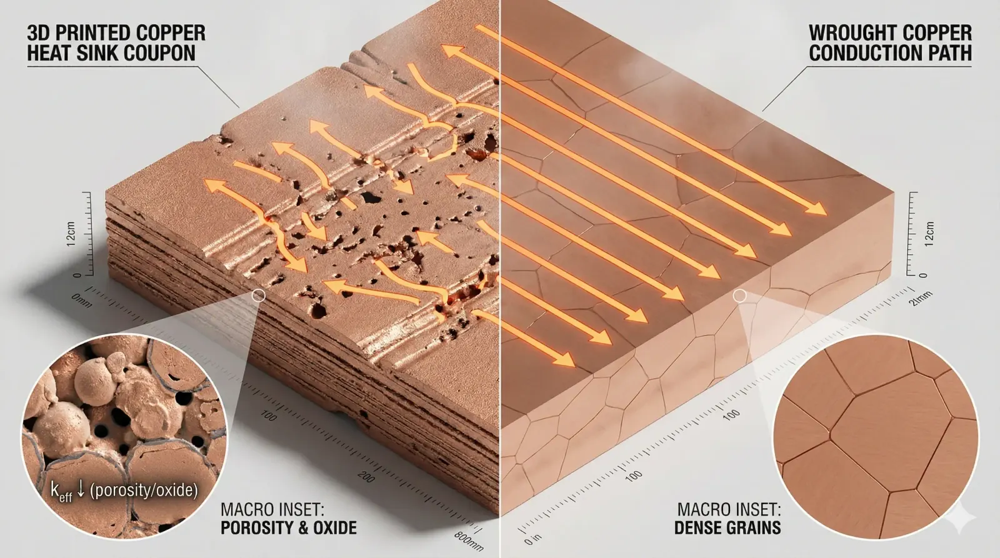
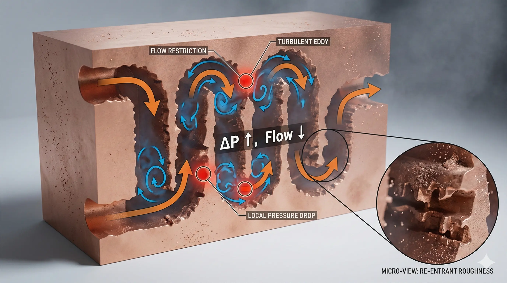
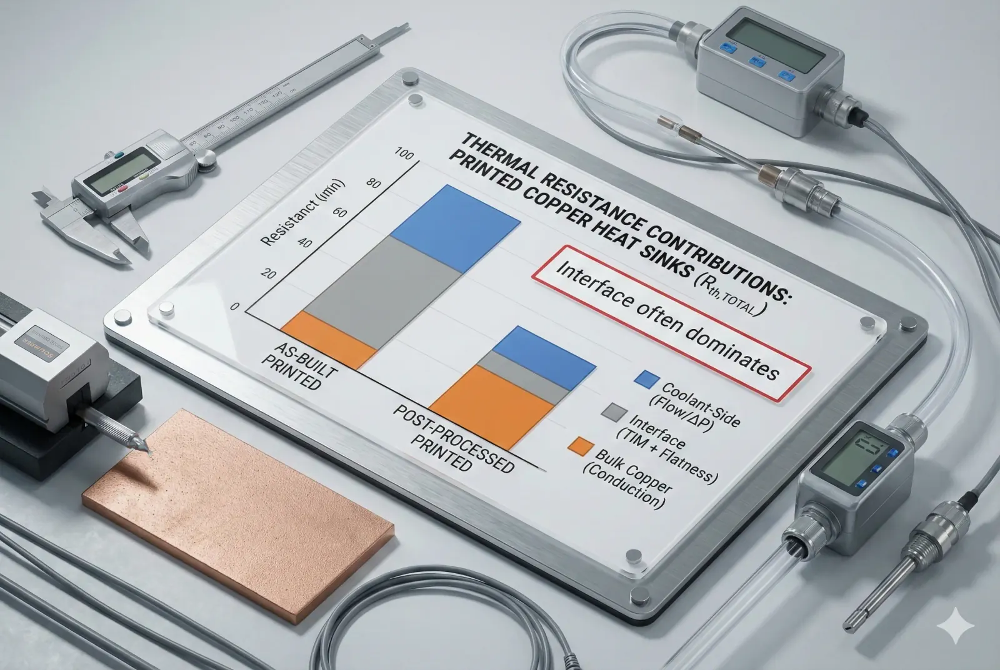

> 3D printed copper heat sinks are**conditionally feasible**for prototypes and low-contact-pressure assemblies. While they offer**geometry freedom**, engineering teams must account for**material property loss + interface resistance + surface/flow penalties**that often erase the theoretical thermal advantage.

### 3D Printed Copper Heat Sink Performance in Real Systems

We routinely receive the same request: “We want a copper heat sink with internal channels and pin-fins that cannot be machined—can we print it and beat our current design?” The attraction is rational: copper is a high-conductivity metal (≈385–400 W/m·K for high-purity wrought copper), and additive manufacturing enables shapes that conventional subtractive routes struggle to produce.

The surprise comes later—when the printed sink is installed into a real stack-up (TIM, clamp load, lid flatness, coolant fittings, contamination, vibration). In those environments,**the heat sink is not a standalone part**. It is one element inside a thermal-mechanical system, and that system amplifies the weaknesses of printed copper.

### Copper Thermal Conductivity Loss in Additively Manufactured Microstructures

A 3D printed copper heat sink is a type of**porous, microstructurally heterogeneous copper**unless it is aggressively post-processed. That matters because conduction through a sink is dominated by the effective thermal conductivity, not the datasheet value of bulk copper.

What we typically see across real builds is:

- **As-built effective conductivity** frequently lands in the **~120–220 W/m·K** range when porosity, oxide inclusions, and lack-of-fusion defects are present.
- **After HIP + solution/anneal** , effective conductivity can rise into the **~250–330 W/m·K** range—still commonly below wrought copper.

Those deltas are large enough that a printed sink can lose**20–60%**of the conduction benefit you thought you were buying before the first interface is even bolted together.

**Mechanism (why this happens):**

- **Porosity & lack-of-fusion** reduce density (e.g., **~97.5–99.5%** relative density depending on process control and alloy/powder condition).
- **Oxide films** on powder surfaces increase thermal resistance at particle boundaries.
- **Anisotropy** (scan strategy / build direction) makes in-plane vs through-thickness conduction diverge, which is exactly the wrong failure mode when heat must move normal to the mounting plane.

### Copper Surface Roughness and Flatness as Hidden Thermal Killers

In a real system, the dominant loss is often not the bulk copper—it is the**interface**.

A 3D printed copper mounting face is a type of**high-asperity contact surface**unless it is machined, lapped, or otherwise finished. Common outcomes:

- As-printed surfaces often measure **Ra ~10–25 µm** (process dependent).
- A conventional machined interface is commonly **Ra ≤ 1.6 µm** , and lapped surfaces can go lower.

When clamped to a heat source, higher roughness drives:

- **Higher TIM bondline thickness** , which increases thermal resistance.
- **Lower real contact area** , especially at modest clamp loads (e.g., **0.2–0.8 MPa** typical of many electronics fastener stacks).

Net effect: even if the printed sink has superior geometry, the**system-level θ (thermal resistance)**can degrade because the interface becomes the bottleneck.

### Internal Channel Roughness and Flow Regime Penalties in Printed Copper

A 3D printed copper heat sink with internal cooling is a type of**hydraulically rough microchannel device**unless internal surfaces are controlled.

Typical as-printed internal walls:

- Are not just “rough”—they are **partially sintered, re-entrant, and locally constricted** .
- Present effective roughness that can materially increase pressure drop.

In practice, that means:

- To hit the same flow rate, the pump works harder (ΔP increases).
- Or, at a fixed pump curve, **flow rate drops** , raising the coolant-side thermal resistance.
- Local constrictions can create **hotspots** by starving sections of the channel network.

If your design assumed smooth channels (or used CFD with smooth-wall models), the printed part can underperform even when the external form factor matches.

### Copper Oxidation, Contamination, and Joining Quality in Assembly Reality

Copper’s surface chemistry is unforgiving in production environments. Printed copper parts frequently arrive with:

- **Powder residues** , embedded particulates, or support-removal artifacts.
- **Oxide layers** that thicken with storage and thermal cycling.

These become performance problems when the sink must be joined or integrated:

- **Brazing/soldering** can suffer from wetting variability if oxide and contamination are not controlled.
- Press-fit or gasketed manifolds can leak if surface finish and geometric tolerances are not tightly managed.
- Nickel plating (often used to stabilize surfaces) adds **another interface** and can warp thin features if the process is not balanced.

In short: printed copper can be “thermally impressive” as a standalone coupon, then “thermally ordinary” after real-world handling and assembly steps.

### Execution Log of a Printed Copper Heat Sink Failure in a Real Stack-Up

**Client context (anonymized):**A power electronics team needed a compact cold plate / heat sink hybrid for a high-heat-flux module. The goal was to replace a machined copper base + brazed fin stack with a single printed copper monolith to eliminate joints and improve reliability.

**The attempt (what we built):**

- Printed copper heat sink with internal serpentine channels and dense pin-fin field above the heat source.
- Targeted thin base under the die region to reduce spreading resistance.

**The friction (what went wrong):**

1. **Mounting face flatness drifted** after stress relief—thin sections moved enough that the TIM bondline increased measurably (system-level penalty).
2. **Channel pressure drop** was higher than modeled; the pump curve forced a lower flow rate than expected.
3. **Performance scatter** between builds appeared, traceable to variability in density/defect population and internal surface condition.

**The pivot point:**The system could not hit the required thermal margin without either increasing clamp load (mechanical risk) or increasing pump power (system power budget risk).

**The resolution (what fixed it):**

- HIP + heat treatment to improve density and stabilize properties.
- CNC skim + lap on the mounting face to control flatness and surface roughness.
- Internal cleaning protocol (agitated flush + filtration validation) to remove powder residues.
- Design revision to enlarge hydraulic diameters where roughness dominated.

**The tax (the real bill):**

- Added **2–4 weeks** lead time (HIP + finishing + validation loop).
- Added **multiple secondary operations** (machining/lapping/cleaning).
- Increased cost per unit enough that, at volume, the client reverted to a hybrid: **machined base + printed fin insert** .

This is the common pattern: additive geometry solves one constraint, then post-processing recreates the cost structure you were trying to escape.

### Data Forensics Table for Printed Copper Heat Sink Underperformance

| Parameter | Standard Approach | Advanced Approach | The Trade-off |
| --- | --- | --- | --- |
| Effective thermal conductivity (W/m·K) | 120–220 (as-built) | 250–330 (HIP + HT) | HIP raises cost, adds schedule, can distort thin features |
| Relative density (%) | 97.5–99.0 | 99.0–99.9 | Higher density requires tighter process control + post-processing |
| Mounting face roughness Ra (µm) | 10–25 (as-printed) | ≤1.6 (machined), lower if lapped | Machining negates some “net-shape” benefit |
| Mounting face flatness (mm over 50 mm) | 0.05–0.20 typical drift risk | 0.01–0.05 with controlled finishing | Thin bases warp; fixturing and inspection overhead grows |
| Channel pressure drop at design flow | Often higher than smooth-wall model | Re-designed larger hydraulic diameters + verified cleaning | Larger channels can reduce surface area and raise θ if not balanced |
| Build-to-build performance scatter | Moderate to high without tight controls | Reduced with process controls + CT/QA sampling | QA (CT, metrology) increases unit cost materially |

*Test method: steady-state thermal resistance using controlled heat input, inlet/outlet coolant temperature tracking, calibrated flow/ΔP measurement, and interface condition held constant across samples.*

> **Project Readiness Check**- Before committing, ask yourself (or your supplier):
>   - Can we guarantee **mounting face flatness and Ra** after stress relief, and prove it with inspection data?
>     - Is the system limited by **bulk conduction** or by **interface + coolant-side resistance** once clamp load and pump curve are fixed?

### Feasibility Verdict for 3D Printed Copper Heat Sinks

**Clearly Feasible**
Go ahead if you are building a**prototype**or low-volume part where:

- The sink is not interface-dominated (high clamp load and controlled TIM), and
- You can accept secondary finishing (machining/lapping) as part of the baseline plan.

**Conditionally Feasible (High-Cost Route)**
Possible, but expect the “geometry win” to require a “process win”:

- HIP + thermal treatment, controlled finishing, validated cleaning, and inspection.
- Budget for **schedule tax (weeks)** and **cost tax (multiple ops)** . This path is chosen only when geometry is non-negotiable.

**Structurally Mismatched**
Not recommended when:

- You need **high-volume cost efficiency** , or
- Your system is **interface-limited** (low clamp load, tight Z-stack tolerance, sensitive TIM), or
- Your cooling loop cannot absorb extra ΔP (fixed pump curve / power budget). Consider: machined copper base + bonded/attached fins, or hybrid designs where only the complex fin/flow region is printed and the interface plane is machined copper.

**Why do printed copper heat sinks look good in simulation but fail in hardware?**

Simulations often assume bulk copper conductivity and smooth internal walls. Hardware includes reduced effective conductivity (porosity/oxides), rough channels (ΔP and flow loss), and real interfaces (TIM thickness, flatness, clamp load). If the model does not lock those to measured values, it overpredicts performance.

**Does HIP always fix thermal performance?**

HIP typically improves density and reduces lack-of-fusion, which helps conductivity and consistency. It does not automatically fix mounting face flatness, surface roughness, oxidation, internal residue, or coolant-side roughness penalties—those still require finishing, cleaning, and design compensation.

**What is the single most common root cause of underperformance?**

Interface dominance: rough/warped mounting faces drive thicker TIM and higher contact resistance. Even a geometrically superior sink loses if the heat cannot enter the sink efficiently.

**How do we make printed copper competitive in a real assembly?**

Treat additive as a preform, not a finished part: plan for machining/lapping of the interface, validated internal cleaning, and either (a) HIP/HT for material stabilization, or (b) a hybrid architecture with a machined copper interface plate.

**When is CNC copper still the better engineering choice?**

When the required geometry is achievable with machining/brazing and you need predictable conductivity, low interface risk, and controlled coolant hydraulics at production cost. CNC also makes it easier to guarantee Ra/flatness without the additive variability stack.

> *Disclaimer: All scenarios described are based on real or closely analogous executed projects. If you choose to implement any of the examples described in this article, please conduct a careful evaluation first. This site assumes no responsibility for losses resulting from implementations made without prior evaluation.*

---
