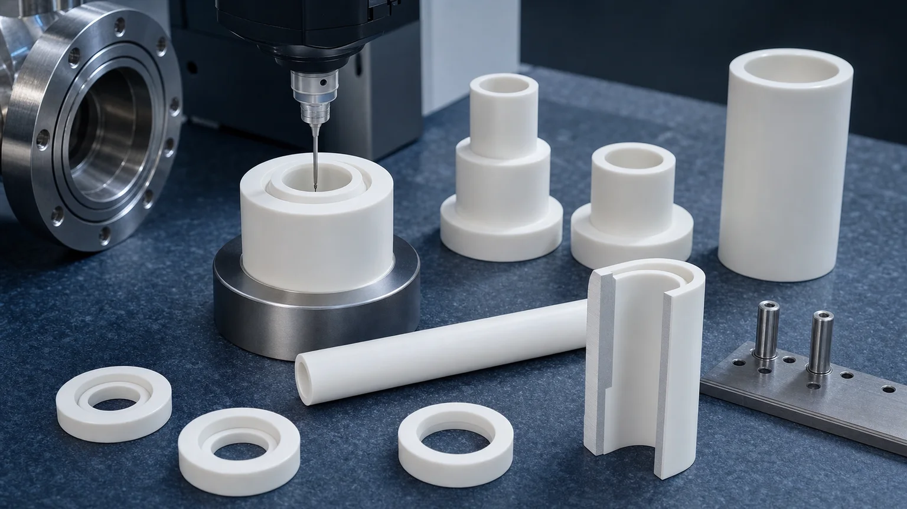
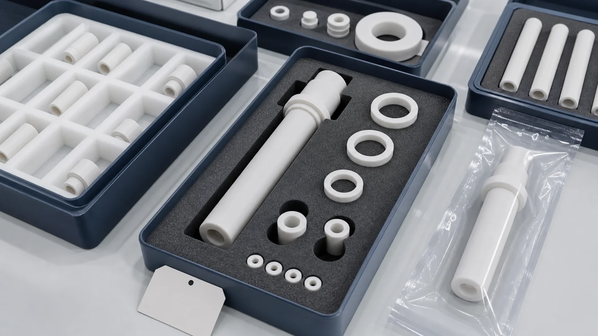

> Ceramic feedthrough insulators are not ordinary ceramic tubes. In vacuum and electrical systems, the finished part may control a conductor path, vacuum boundary, bore fit, sealing shoulder, creepage distance, edge quality, cleanliness, and inspection evidence at the same time. A useful RFQ should define the application, material, conductor or pin fit, sealing interface, voltage context, vacuum condition, functional surfaces, cleaning, packaging, and inspection scope before feasibility, price, or timing is confirmed.

Ceramic feedthrough insulators appear in vacuum chambers, semiconductor tools, plasma equipment, high-voltage test stands, analytical instruments, scientific systems, RF and microwave hardware, industrial sensors, power supplies, and laboratory fixtures. The buyer may call the part an alumina feedthrough sleeve, ceramic insulating tube, high-voltage feedthrough insulator, vacuum spacer, ceramic bushing, ceramic washer, metallization-ready insulator, or ceramic-to-metal assembly component.

Those names overlap, but they are not enough for quotation.

A feedthrough-related ceramic part can fail because the bore chips during assembly, the sealing land is not flat enough, a creepage surface is contaminated, a thin wall cracks after finishing, a chamfer changes the conductor fit, or the customer expected a full hermetic assembly when the machining scope only covered the ceramic body. The drawing must make that boundary clear.

## Where Vacuum And Electrical Insulators Are Used

Vacuum equipment and electrical isolation are not narrow niches. They sit inside semiconductor manufacturing, high-voltage testing, analytical instruments, thin-film deposition, plasma processing, clean manufacturing, power electronics, and scientific hardware. [SEMI projects double-digit global 300 mm fab equipment spending growth in 2026 and 2027](https://www.semi.org/en/semi-press-release/semi-projects-double-digit-growth-in-global-300mm-fab-equipment-spending-for-2026-and-2027), driven partly by AI chip demand and capacity investment. [SEMI also reported global semiconductor equipment billings of $135.1 billion in 2025](https://www.semi.org/en/SEMI-Reports-Global-Semiconductor-Equipment-Billings-Reached-135-Billion-in-2025), including strong test and assembly/packaging activity.

Those market signals become relevant to machining when the requirement is a ceramic feedthrough insulator, alumina insulating sleeve, vacuum ceramic tube, high-voltage ceramic bushing, vacuum-chamber spacer, precision alumina feedthrough body, or plasma-equipment insulator.

The practical article target is therefore specific: help engineers prepare quote-ready RFQs for precision machined ceramic insulators used around vacuum and electrical interfaces.

## What A Ceramic Feedthrough Insulator Usually Has To Do

In a simple drawing, a feedthrough insulator may look like a tube with a flange. In use, it may have several functions:

| Function                    | What the ceramic part may control                                            | RFQ detail that changes review                                            |
| --------------------------- | ---------------------------------------------------------------------------- | ------------------------------------------------------------------------- |
| Electrical insulation       | Separation between conductor, housing, flange, or grounded body              | Working voltage, creepage, clearance, edge condition, surface cleanliness |
| Vacuum-adjacent positioning | Location of a pin, tube, probe, electrode, or sensor path                    | Bore size, concentricity, wall thickness, shoulder geometry               |
| Sealing interface           | Ceramic shoulder, end face, annular band, or mating surface                  | Flatness, Ra, chip limit, lapping, protected packaging                    |
| Mechanical support          | Clamp load, stack height, alignment, vibration, or handling                  | End-face parallelism, OD/ID fit, chamfer, load path                       |
| Clean assembly              | Reduced residue, particles, chips, and handling damage                       | Cleaning requirement, bagging, trays, edge protection                     |
| Assembly boundary           | Ceramic body only, metallized ceramic, brazed assembly, or customer assembly | Scope owner, supplied hardware, acceptance test, documentation            |

For broad insulation context, use the [alumina ceramic insulator guide](/posts/electrical-insulation/alumina-ceramic-insulators-electrical-electronic-applications/). For voltage-driven geometry, use the [high-voltage ceramic insulator RFQ guide](/posts/high-voltage-insulation/ceramic-high-voltage-insulators-rfq/). This page is narrower: it focuses on feedthrough-adjacent ceramic insulators where vacuum, bore fit, sealing lands, and electrical spacing meet.

## Start By Separating The Ceramic Scope From The Assembly Scope

The most important RFQ question is:

**Are you asking for a machined ceramic insulator component, a metallization-ready ceramic body, or a complete ceramic-to-metal feedthrough assembly?**

These are different sourcing problems.

A precision ceramic machining supplier may review the ceramic body: material, fired blank, bore, OD, shoulder, flange, groove, end face, slot, chamfer, surface finish, edge quality, cleaning, packaging, and dimensional inspection. If the part also requires metallization, brazing, glass sealing, leak testing, pins, flanges, connectors, or final electrical qualification, those requirements must be stated separately and the responsible supplier boundary must be confirmed.

This distinction protects both sides. It prevents a buyer from expecting hermetic assembly performance from a ceramic machining quote, and it prevents a ceramic part supplier from guessing about conductor design, braze alloy, leak rate, or final high-voltage test.

For quote clarity, describe the part as one of these:

- Ceramic-only machined insulator sleeve, tube, spacer, washer, bushing, or feedthrough body.
- Ceramic body prepared for customer metallization, brazing, sealing, or assembly.
- Ceramic body with specified external metallization or coating scope.
- Complete feedthrough assembly, if the RFQ explicitly includes metal hardware, joining, leak test, and electrical acceptance.

If the design is still early, a ceramic-only prototype can still be useful. Just avoid treating that prototype as proof that the final hermetic assembly will use the same drawing, tolerance, surface, and process route.

## Material Choice: Alumina Is Common, But Not Automatic

Alumina is the default material conversation for many feedthrough insulators because it combines electrical insulation, hardness, temperature resistance, dimensional stability, and practical availability. [CoorsTek describes alumina ceramics](https://www.coorstek.com/en/materials/alumina/) across applications including electrical insulation, wear, medical, sensors, and semiconductor use. [Kyocera lists alumina ceramics](https://global.kyocera.com/prdct/fc/material-property/material/alumina/index.html) as broadly used fine ceramic materials for electrical and mechanical applications.

That does not mean every feedthrough part should be alumina. The application should drive the material review:

| Material direction                | When it may be reviewed                                            | RFQ caution                                                              |
| --------------------------------- | ------------------------------------------------------------------ | ------------------------------------------------------------------------ |
| Alumina                           | Electrical insulation, vacuum spacers, sleeves, feedthrough bodies | Grade, purity, blank form, bore chips, and sealing-surface finish matter |
| Zirconia                          | Tougher precision bushings, plungers, or wear-adjacent sleeves     | Electrical and thermal context should be checked                         |
| Silicon nitride                   | Structural supports, thermal shock, wear, or higher strength needs | Finished bores and thin walls require early review                       |
| Aluminum nitride                  | Insulation plus thermal path in electrical or power hardware       | Flatness, moisture/handling, and protected packaging can drive cost      |
| Macor or machinable glass ceramic | Prototype feedthrough-adjacent fixtures and fast lab trials        | Service limits and production transition must be reviewed                |
| Boron nitride                     | High-temperature insulation or special process environments        | Fragility, grade, and surface handling must be clear                     |

[Precision Ceramics explains](https://precision-ceramics.com/materials/) that some ceramics are machinable in a conventional way while fully fired high-performance ceramics often require diamond grinding and related processes. That difference matters when a feedthrough starts as a prototype in a machinable ceramic and later moves to alumina, AlN, Si3N4, or SiC.

Use the [ceramic material selection guide](/posts/materials-grade-selection/ceramic-material-selection-cnc-machining/) before locking the material. Use the [precision machined alumina ceramic parts guide](/posts/industrial-ceramic-machining/precision-machined-alumina-ceramic-parts-industrial-applications/) when alumina is likely but the grade, purity, or blank route is not yet fixed.

## Bore Fit Is Often The Hidden Cost Gate

Feedthrough insulators usually have a bore. That bore may carry a conductor, pin, tube, thermocouple, optical fiber support, probe, sensor element, fastener, or alignment feature. In ceramics, a bore is not just a diameter.

The RFQ should define:

- Bore diameter, depth, and whether the bore is through, blind, counterbored, stepped, or relieved.
- Mating pin, conductor, tube, or shaft material and nominal fit.
- ID tolerance, roundness, straightness, taper, and surface finish if functional.
- OD/ID concentricity when the ceramic body also locates in a flange, housing, or clamp.
- Entry and exit chamfer, edge break, maximum chip size, or no-chip zone.
- Whether a press fit, slip fit, adhesive bond, seal, metallization layer, or customer assembly changes the final clearance.
- Inspection method: pin gauge, air gauge, bore gauge, CMM, optical review, section review, or customer fixture.

For long thin insulators, use the [ceramic thin-wall sleeve machining guide](/posts/thin-wall-sleeves/ceramic-thin-wall-sleeve-bore-concentricity-rfq/) as a companion. Thin walls, bore concentricity, end-face squareness, and edge quality can dominate the route even when the outside shape looks simple.

## Sealing Lands, Shoulders, And End Faces Need Named Requirements

Many feedthrough-adjacent ceramics include an annular shoulder, flange face, end face, step, groove, or seal land. The drawing should identify which surface actually matters.

Do not use a blanket note such as "polish all surfaces" unless every surface truly needs it. Instead, rank the zones:

| Surface zone              | Why it may matter                                                      | Possible evidence to discuss                               |
| ------------------------- | ---------------------------------------------------------------------- | ---------------------------------------------------------- |
| Annular sealing shoulder  | Contact with gasket, metal shoulder, glass, braze, or customer fixture | Flatness, Ra, chip limit, optical image, protected packing |
| End face                  | Stack height, squareness, creepage distance, assembly load             | Parallelism, perpendicularity, thickness or length report  |
| Bore entrance             | Pin insertion, conductor fit, crack prevention                         | Chamfer size, edge-chip limit, microscope review           |
| Creepage path             | Electrical surface distance and contamination control                  | Dimensional check, surface finish, cleaning note           |
| Non-functional OD surface | Handling or clearance                                                  | Practical machined finish unless function says otherwise   |

For sealing, surface finish, lapping, and subsurface-damage decisions, use the [ceramic surface finish and subsurface damage guide](/posts/surface-finish-functional/ceramic-ssd-surface-finish-specify-control-price/). If the feedthrough ceramic includes a lapped annular band, also review the [ceramic lapped seal faces RFQ guide](/posts/lapped-seal-faces/ceramic-lapped-seal-faces-rfq/).

## Creepage, Clearance, And Vacuum Cleanliness Are Geometry Problems

Creepage and clearance sound like electrical design terms, but they become machining and handling requirements when the ceramic shape defines the path.

For ceramic feedthrough insulators, specify:

- Conductor location and grounded hardware location.
- Minimum creepage or clearance path if controlled by the ceramic geometry.
- Ribs, grooves, steps, slots, shoulders, and chamfers that affect the path.
- Edge radius near high-field regions.
- Surface finish or cleanliness on the insulating path.
- Whether metallization, coating, attached hardware, or customer assembly changes spacing.
- Vacuum, gas, humidity, oil, coolant, plasma, chemical vapor, or cleanroom condition.

Vacuum does not automatically make the ceramic impossible, but it changes the review. Particles, residue, blind pockets, chips, uncontrolled roughness, and poor packaging can matter more than they would in a general industrial assembly. For high-purity context, use the [precision ceramic components for cleanroom and high-purity manufacturing guide](/posts/high-purity-cleanroom/precision-ceramic-components-cleanroom-high-purity-manufacturing-systems/). For semiconductor plasma-adjacent ceramic insulation, use the [ceramic insulators for plasma etching and deposition equipment guide](/posts/semiconductor-equipment/ceramic-insulators-plasma-etching-deposition-equipment/).

## Application Paths Where Feedthrough Insulators Appear

The same ceramic geometry can appear in several industries. This is why the application note matters.

| Application path                      | Ceramic feedthrough-related parts                                                                  | RFQ emphasis                                                            |
| ------------------------------------- | -------------------------------------------------------------------------------------------------- | ----------------------------------------------------------------------- |
| Semiconductor and vacuum equipment    | Alumina sleeves, process-chamber insulators, plasma-adjacent spacers, sensor pass-through supports | Cleanliness, particle risk, bore chips, edge quality, vacuum interface  |
| High-voltage test and power supplies  | Standoffs, bushings, insulating sleeves, conductor supports                                        | Creepage, clearance, edge radius, conductor fit, surface cleanliness    |
| Analytical and scientific instruments | Probe sleeves, ceramic tubes, sensor spacers, flow-cell supports                                   | Small features, clean packaging, bore fit, documentation                |
| RF and microwave hardware             | Insulating spacers, ceramic supports, dielectric-adjacent plates                                   | Geometry, surface finish, low-contamination handling, fixture alignment |
| Industrial sensors and automation     | Feedthrough sleeves, insulating washers, ceramic housings                                          | Repeatable fit, edge durability, quantity, inspection sampling          |
| Laboratory vacuum systems             | Alumina tubes, insulating bushings, prototype feedthrough bodies                                   | Prototype material, assembly boundary, vacuum cleaning, test ownership  |

For broad semiconductor context, use the [precision ceramic components for semiconductor equipment guide](/posts/semiconductor-equipment/precision-ceramic-components-semiconductor-equipment/). For vacuum chuck and suction-surface RFQs, use the [ceramic vacuum chuck flatness guide](/posts/vacuum-chucks/ceramic-vacuum-chuck-flatness-rfq/) or the [machined ceramic vacuum chuck components guide](/posts/semiconductor-equipment/machined-ceramic-vacuum-chuck-components-semiconductor-tools/).

## Cleaning, Packaging, And Handling Should Be Quoted Early

Feedthrough insulators often fail late in the supply chain: after machining, during cleaning, during packing, during customer assembly, or during the first vacuum/electrical check. That is why cleaning and packaging should not be added casually after the price is agreed.

Define whether the part needs:

- General clean packing or cleanroom-oriented packaging.
- Individual tray positions, foam cutouts, separators, or bore protection.
- Protection of lapped shoulders, end faces, and small chamfers.
- No direct part-to-part contact.
- Bagging, double bagging, or customer-specified packaging.
- Optical inspection photos for critical surfaces.
- A cleaning note, particle-sensitive handling note, or customer incoming-inspection standard.

The packaging cost is not waste if the ceramic shoulder, bore edge, or creepage surface is the functional feature. A lapped seal land that chips in transit is not a finished part, even if it passed dimensional inspection before packing.

## Inspection Evidence To Discuss Before Quotation

Inspection should match the failure mode. A feedthrough ceramic might need a dimensional report, but the important evidence may be different from a generic turned-looking part.

| Requirement                  | Evidence to discuss                                      |
| ---------------------------- | -------------------------------------------------------- |
| Bore diameter and fit        | Pin gauge, bore gauge, CMM, ID report, mating pin check  |
| OD/ID concentricity          | CMM report, roundness/concentricity setup, datum method  |
| Sealing shoulder or end face | Flatness, parallelism, Ra, optical edge review           |
| Creepage feature geometry    | Slot, rib, step, spacing, chamfer, and edge inspection   |
| Surface integrity            | Visual standard, microscope photo, chip-limit agreement  |
| Cleanliness and packaging    | Cleaning route, packing method, protected surfaces       |
| Assembly or leak performance | Customer test, supplier test, or separate assembly scope |

The [ceramic tolerance capability map](/posts/tolerances-gdt/ceramic-tolerance-capability-map-by-feature-process/) helps decide which tolerances deserve tight control. The [custom ceramic CNC machining RFQ checklist](/posts/rfq-preparation/custom-ceramic-cnc-machining-rfq-checklist/) is the best final check before sending files.

## Common RFQ Mistakes

Avoid these mistakes when sourcing ceramic feedthrough insulators:

1. Asking for a "ceramic feedthrough" without saying whether the quote is ceramic-only or a complete assembly.
2. Providing a STEP file but no voltage, vacuum, sealing, bore-fit, or conductor context.
3. Applying tight tolerance to every outside surface while leaving the bore edge and sealing shoulder undefined.
4. Forgetting OD/ID concentricity on a long sleeve that must locate in a housing.
5. Calling out low Ra or lapping globally instead of naming sealing lands, creep surfaces, or contact faces.
6. Omitting chamfer, edge break, and chip limits near conductor insertion or seal areas.
7. Treating a Macor prototype as if fired alumina production will use the same feature rules.
8. Assuming final hermetic leak performance without defining metallization, brazing, assembly, and test ownership.
9. Adding clean packaging only after finished ceramic edges are already at risk.
10. Asking for an electrical guarantee from a machining quote without specifying customer electrical acceptance conditions.

These are not reasons to avoid ceramic feedthrough insulators. They are reasons to make the RFQ more precise.

## RFQ Checklist For Ceramic Feedthrough Insulators

Send the following before expecting a reliable quotation:

- 2D drawing with revision and STEP or native CAD model.
- Required material, grade, purity, color if relevant, certificate need, and whether equivalent review is allowed.
- Scope boundary: ceramic-only component, metallization-ready ceramic body, metallized ceramic, or complete assembly.
- Application: vacuum chamber, semiconductor tool, plasma equipment, high-voltage test, analytical instrument, RF hardware, power supply, or laboratory fixture.
- Voltage context, creepage, clearance, conductor locations, and grounded hardware if relevant.
- Vacuum condition, gas environment, cleanroom level, chemical/plasma exposure, or customer cleaning standard if relevant.
- Bore diameter, depth, fit, roundness, straightness, taper, chamfer, and inspection method.
- OD, shoulder, end face, flange, groove, seal land, lapped face, and datum requirements.
- Surface finish, flatness, parallelism, concentricity, edge-chip limit, and no-chip zones by feature.
- Mating pin, conductor, tube, flange, gasket, braze, glass, adhesive, coating, metallization, or customer fixture if known.
- Cleaning, packaging, tray, separator, bagging, and protected-surface expectations.
- Inspection report, optical photos, material certificate, leak/electrical test boundary, quantity, prototype or production stage, and target timing.

For a direct RFQ, use the [ceramic machining RFQ page](/rfq/) and include the drawing package, application note, material target, quantity, timing, and acceptance requirements.

## Internal Decision Path

Use this page when the dominant sourcing problem is a ceramic feedthrough insulator or feedthrough-adjacent ceramic part for vacuum and electrical systems. Use related pages when the intent changes:

| Dominant problem                                    | Better supporting page                                                                                                                                               |
| --------------------------------------------------- | -------------------------------------------------------------------------------------------------------------------------------------------------------------------- |
| General alumina insulation parts                    | [Alumina ceramic insulators for electrical and electronic applications](/posts/electrical-insulation/alumina-ceramic-insulators-electrical-electronic-applications/) |
| High-voltage creepage and clearance geometry        | [High-voltage ceramic insulators RFQ guide](/posts/high-voltage-insulation/ceramic-high-voltage-insulators-rfq/)                                                     |
| Long ceramic sleeves, tubes, and bore concentricity | [Ceramic thin-wall sleeve machining RFQ guide](/posts/thin-wall-sleeves/ceramic-thin-wall-sleeve-bore-concentricity-rfq/)                                            |
| Vacuum chuck or suction-surface flatness            | [Ceramic vacuum chuck flatness RFQ guide](/posts/vacuum-chucks/ceramic-vacuum-chuck-flatness-rfq/)                                                                   |
| Plasma or deposition equipment insulation           | [Ceramic insulators for plasma etching and deposition equipment](/posts/semiconductor-equipment/ceramic-insulators-plasma-etching-deposition-equipment/)             |
| Face-specific lapping and surface finish decisions  | [Ceramic surface finish and subsurface damage guide](/posts/surface-finish-functional/ceramic-ssd-surface-finish-specify-control-price/)                             |

This selection path separates electrical, vacuum, geometry, and surface decisions without forcing one broad guide to cover every component type.

## Practical Takeaway

Ceramic feedthrough insulators become high-value precision components when they control electrical isolation, vacuum-adjacent assembly, bore fit, sealing surfaces, creepage paths, cleaning, packaging, and inspection evidence. The ceramic body may look simple, but the manufacturing review is controlled by feature hierarchy and scope boundary.

For a serious RFQ, do not send only a 3D model and ask for a feedthrough price. Send the drawing, CAD model, material grade, application, voltage and vacuum context, conductor or pin fit, sealing land requirements, surface finish, edge criteria, cleaning and packaging expectation, inspection scope, quantity, timing, and assembly boundary. That gives the ceramic machining review enough information to separate a simple insulating tube from a critical vacuum and electrical interface component.

## FAQ

**Is a ceramic feedthrough insulator the same as a complete hermetic feedthrough?**  
No. A ceramic insulator may be only the machined ceramic body. A complete hermetic feedthrough may also include metal hardware, metallization, brazing, glass sealing, leak testing, connectors, and electrical qualification. The RFQ must state the expected scope.

**Why is alumina commonly used for feedthrough insulators?**  
Alumina is commonly reviewed because it offers electrical insulation, hardness, temperature resistance, dimensional stability, and practical availability. The final choice still depends on grade, geometry, vacuum condition, bore fit, sealing surface, and inspection requirements.

**What makes a ceramic feedthrough insulator expensive?**  
Long precision bores, thin walls, tight OD/ID concentricity, lapped sealing shoulders, strict edge-chip limits, clean packaging, small quantity, certificate needs, and special inspection reports can drive cost.

**Should every surface be polished?**  
Usually no. Surface finish should be assigned to functional zones such as sealing lands, creepage paths, bore contact areas, datum faces, or customer bonding surfaces. Non-functional clearance surfaces should use practical ceramic machining requirements.

**Can CERAMIC CNC guarantee final leak rate or high-voltage performance?**  
Final system performance depends on the complete design, mating hardware, assembly process, test method, and customer acceptance conditions. A ceramic machining review can address the ceramic geometry, material, finish, cleaning, packaging, and inspection evidence unless leak or electrical testing is explicitly included in the project scope.

> RFQ note: Final feasibility, tolerance, price, lead time, material route, cleaning method, packaging, inspection scope, and assembly boundary depend on drawing review, ceramic grade, blank state, functional surfaces, quantity, and acceptance method.
