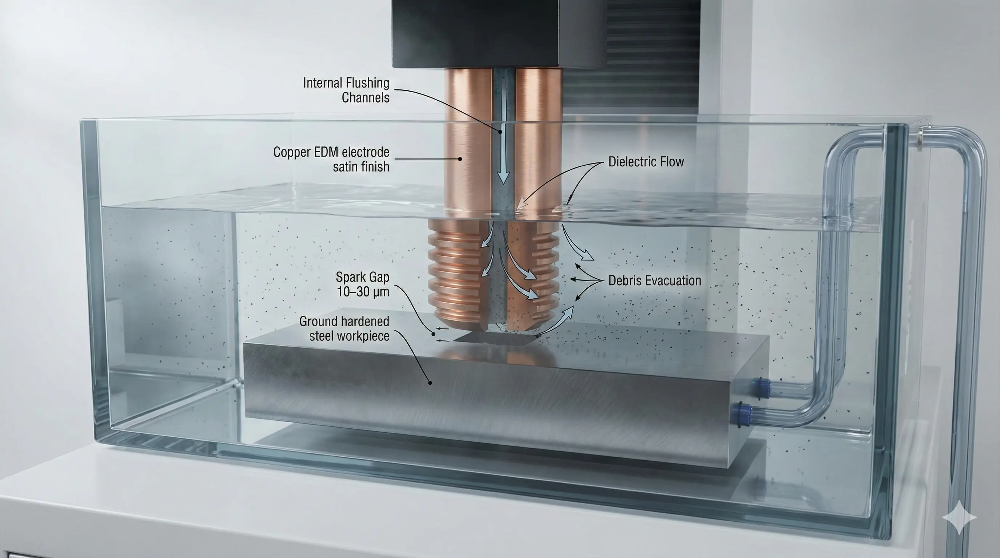
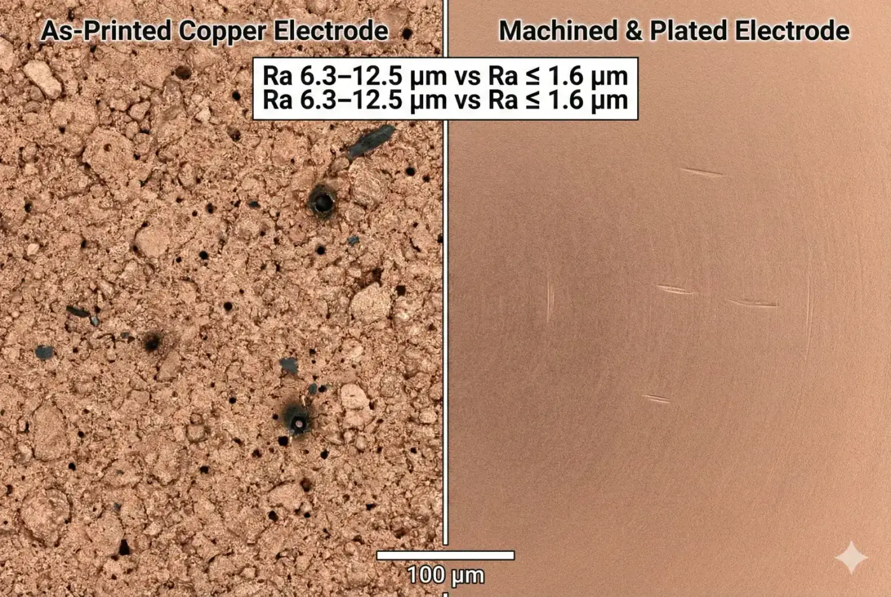
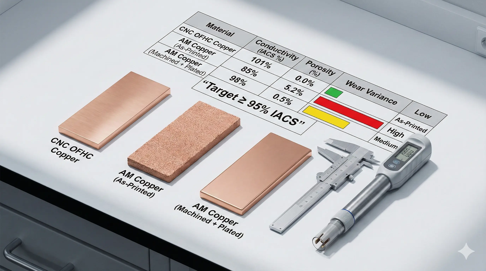

> **Wear and accuracy failures in 3D printed copper EDM electrodes are conditionally feasible for complex-geometry tooling,**especially when internal flushing paths matter. While they can enable conformal features impossible to mill, engineering teams must account for porosity-driven wear, surface-driven overburn, and post-processing “tax” to make dimensional accuracy hold below ±0.02 mm.

### 3D Printed Copper EDM Electrodes: The Request We Keep Getting

We repeatedly see the same RFQ: “We need a copper electrode with internal flushing channels and sharp ribs; can we 3D print it and EDM a hardened cavity?” The appeal is clear—conformal geometry and rapid iteration. The hidden problem is that EDM accuracy is not only a CAD problem; it is a**spark-gap stability**problem, and stability collapses when electrode surfaces behave like a porous resistor instead of bulk copper (typical target electrical conductivity for high-grade copper electrodes is**≥ 95% IACS**).

### EDM Electrode Wear: The Failure Mode Is Volumetric, Not Cosmetic

EDM (Electrical Discharge Machining) is a type of**thermal erosion process**where controlled discharges remove workpiece material and also erode the electrode. For sinker EDM, the accuracy penalty is governed by**volumetric wear ratio (VWR)**and by how predictable the wear is across edges and corners. In practice, the parts that matter are not flat faces; it is corner radii and thin ribs—where a**10–30 µm**local edge recession can translate into measurable taper and loss of detail on the cavity.

### Additive Copper Microstructure: Why Printed Copper “Acts Different” in the Spark Gap

A 3D printed copper electrode is a type of electrode produced by additive manufacturing (commonly LPBF or binder jet), and its surface/subsurface often contains**porosity (e.g., 0.5–3.0 vol%)**and partially sintered particles that are not present in CNC-machined OFHC copper. Those micro-voids trap dielectric, concentrate debris, and create micro-arcing sites. The symptom shows up as**unstable gap voltage**and intermittent arcing, which forces conservative EDM parameters and increases electrode wear per unit removal.

### Surface Roughness and Overburn: Where Accuracy Actually Gets Lost

Printed copper surfaces commonly start rougher than machined copper; roughness changes the effective spark distribution. When the electrode surface is**Ra 6.3–12.5 µm**instead of**Ra ≤ 1.6 µm**, discharge energy localizes on asperity peaks, increasing corner rounding and making finishing passes less repeatable. The result is the classic mismatch: the electrode measures “within tolerance” on a CMM, but the cavity shows**overburn drift**after a few burn cycles because the effective geometry changes under load.

### Execution Log: Binder-Jet Copper Electrode vs Hardened Tool Steel Cavity

A client asked us to EDM a hardened tool-steel cavity (≈**HRC 52–56**) using a binder-jet printed copper electrode that included internal flushing paths. We accepted because the geometry (deep ribs with internal channels) was not realistically machinable in one piece.

#### The Attempt: Printed Electrode, Minimal Post-Process

We received the electrode, did a light deburr, and ran a standard rough-to-finish sinker EDM sequence. Dimensional intent was**±0.02 mm**on rib thickness.

#### The Friction: Wear “Runs Away” at the Features That Matter

The first red flag was burn instability on thin ribs: we observed repeated arcing events, and the ribs lost definition early. Post-burn inspection showed edge recession and rib thinning beyond expectation; our measured feature loss was on the order of**0.03–0.06 mm**after a small number of cycles (measured by pre/post 3D scan). The cavity geometry then drifted because the electrode no longer matched its own original shape.

#### The Resolution: We Stabilized the Electrode, Then Paid the Tax

We recovered the project, but only by converting the printed electrode into a “near-net preform” and forcing it to behave more like bulk copper:

- **Finish machining** all functional faces and datums to **±0.01 mm** .
- **Densification step** (process-dependent) to push effective density toward **≥ 99%** of theoretical where possible.
- **Electroless copper plating** on working surfaces (typical **15–30 µm** ) to seal near-surface porosity and normalize discharge behavior.
- EDM parameter changes: reduced peak energy for finishing and enforced stable flushing to reduce debris-induced arcing (spark gap control held tighter; typical finishing gaps are on the order of **10–30 µm** , machine- and recipe-dependent).

**The bill:**we added**2–4 days**of process time and a step-change in cost (machining + plating + extra metrology). The electrode became viable, but only after we treated printing as a geometry enabler—not as a finished electrode process.

### Accuracy Failure Map: What Breaks First in Printed Copper EDM Electrodes

Printed copper electrodes fail in predictable, diagnosable ways:

- **Corner rounding acceleration:** edges behave like sacrificial fuses; local recession **> 20 µm** is enough to show in fine detail.
- **Rib taper and thickness drift:** thin features lose area, increasing current density and accelerating wear (positive feedback loop).
- **Debris retention and micro-arcing:** porous surfaces trap debris; arcing increases wear and produces local pitting.
- **Thermal distortion in long burns:** if conductivity is lower (e.g., **< 85–90% IACS** ), heat spreads less effectively and wear becomes less uniform.
- **Datum instability:** as-printed datums can shift with stress relief and finishing; without machining, true position errors of **> 0.05 mm** are common in complex parts (process- and vendor-dependent).

### Data Forensics Table: Printed Copper vs Conventional EDM Electrodes

| Parameter | Standard Approach | Advanced Approach | The Trade-off |
| --- | --- | --- | --- |
| Electrode material state | CNC OFHC copper, ≥ 95% IACS | AM copper, often 85–95% IACS pre-finish | Lower conductivity increases local heating and non-uniform wear |
| Bulk density / porosity | Near theoretical, porosity ~0% | 0.5–3.0% porosity unless densified | Porosity drives micro-arcing and debris trapping |
| Working surface finish | Machined/polished, Ra ≤ 1.6 µm | As-printed Ra 6.3–12.5 µm unless machined/plated | Rough surfaces concentrate discharge energy → overburn drift |
| Edge integrity | Sharp features maintained by machining | Edges degrade faster; corner loss > 20–50 µm common without sealing | Feature fidelity decays over burn cycles |
| Electrode wear behavior (VWR) | Stable, predictable with recipe | Often higher variance; requires recipe + surface normalization | More iteration cycles, higher scrap risk |
| Metrology strategy | CMM + visual | CMM + 3D scan + (optional) microCT | Added metrology cost, but prevents “invisible” porosity failures |
| Lead time structure | Mostly machining time | Print + densify + machine + plate adds 2–4 days | Time and supplier coordination “tax” |

*Test method: conductivity per ASTM B193 (resistivity), surface texture per ISO 4287, CMM verification per ISO 10360, density by Archimedes method, wear by pre/post structured-light scan volume differencing.*

### Feasibility Verdict for 3D Printed Copper EDM Electrodes

**Clearly Feasible**
Go ahead if all conditions hold:

- Functional faces are finish-machined to **±0.01 mm** and **Ra ≤ 1.6 µm** .
- Electrode working surfaces are sealed (e.g., plating **15–30 µm** or equivalent) and verified to be pore-stable near the surface.
- The burn is not edge-dominated: minimum feature thickness **≥ 0.5 mm** and corner radii are not required below **R0.10 mm** .

**Conditionally Feasible (High-Cost Route)**
Possible, but expect high cost/complexity when any condition holds:

- Feature thickness **0.2–0.5 mm** , deep ribs, or high aspect ratio cavities where flushing is marginal.
- Tight cavity tolerances **≤ ±0.02 mm** must hold across multiple electrodes/burn cycles.
- The electrode must be “as-printed functional” without machining (this almost always forces iteration and scrap). In this zone, success typically requires the full stack: densification, machining, sealing, and recipe tuning, plus extra metrology.

**Structurally Mismatched**
Not recommended when:

- Sharp internal corners or microfeatures demand **R < 0.10 mm** retention after repeated burns.
- The project requires stable wear without plating/sealing, or conductivity is measured **< 85% IACS** .
- You need production repeatability with minimal process steps. Consider alternatives: CNC copper electrode assemblies (brazed segments), graphite (where applicable), or hybrid electrodes (printed preform + brazed/machined copper wear caps).

> **Project Readiness Check**- Before committing, ask yourself (or your supplier):
>   - Can you certify conductivity (ASTM B193) and near-surface porosity (microCT or equivalent) for every electrode lot?
>     - What is the post-processing plan to guarantee **Ra ≤ 1.6 µm** and datum true position **≤ 0.02 mm** after stress relief/plating?

### FAQ: 3D Printed Copper EDM Electrode Failures (Wear + Accuracy)

**What is the fastest way to diagnose whether porosity is causing wear instability?**

Run a short controlled burn, then compare pre/post electrode volume using a structured-light scan. If edge recession is non-uniform and correlates with visible pitting or arcing marks, add a near-surface porosity check (microCT) and measure conductivity (ASTM B193). A conductivity result below ~90% IACS combined with visible discharge pitting is a strong indicator of porosity-driven instability.

**Does copper plating always fix printed copper EDM electrodes?**

No. Plating (commonly 15–30 µm) stabilizes near-surface behavior, but it cannot correct bulk conductivity limits or gross dimensional errors. If as-printed datums are off by >0.05 mm, plating only hides symptoms. Plating works best after finish machining and (where applicable) densification.

**When does graphite beat printed copper for EDM?**

When roughing dominates and feature fidelity is not edge-critical, graphite can deliver stable wear behavior with less concern about porosity and surface sealing. For fine details requiring tight finishing gaps (~10–30 µm) and smooth cavity finishes, copper still has advantages—provided the copper behaves like bulk copper (machined + sealed surfaces).

**Can we skip machining entirely and rely on “as-printed” accuracy?**

Only in loose-tolerance tooling where ±0.05 mm drift is acceptable and the cavity does not depend on sharp ribs or thin features. For tolerance targets ≤ ±0.02 mm, skipping machining typically fails because EDM accuracy follows the worn electrode geometry, not the CAD file.

**What acceptance criteria should we put on the RFQ for printed copper EDM electrodes?**

At minimum: conductivity per ASTM B193 (target ≥95% IACS for critical work), surface finish on working faces (Ra ≤1.6 µm after finishing), dimensional tolerance on datums (≤±0.01–0.02 mm depending on cavity), and a defined sealing strategy (plating thickness 15–30 µm or equivalent). Require pre/post wear measurement on a qualification burn using scan-based volumetrics.

---

> *Disclaimer: All scenarios described are based on real or closely analogous executed projects. If you choose to implement any of the examples described in this article, please conduct a careful evaluation first. This site assumes no responsibility for losses resulting from implementations made without prior evaluation.*
