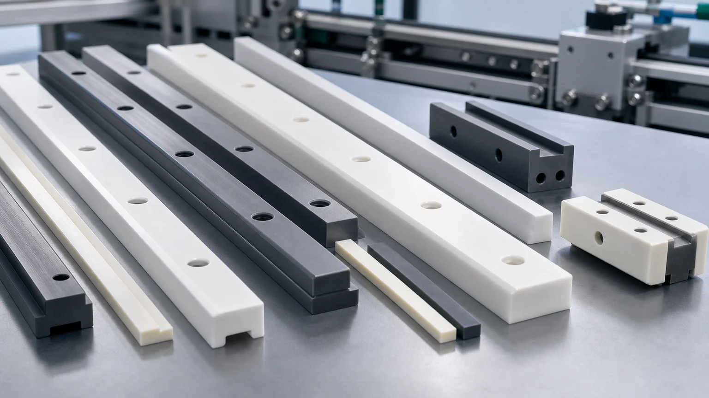
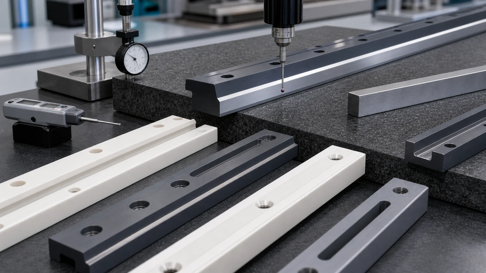
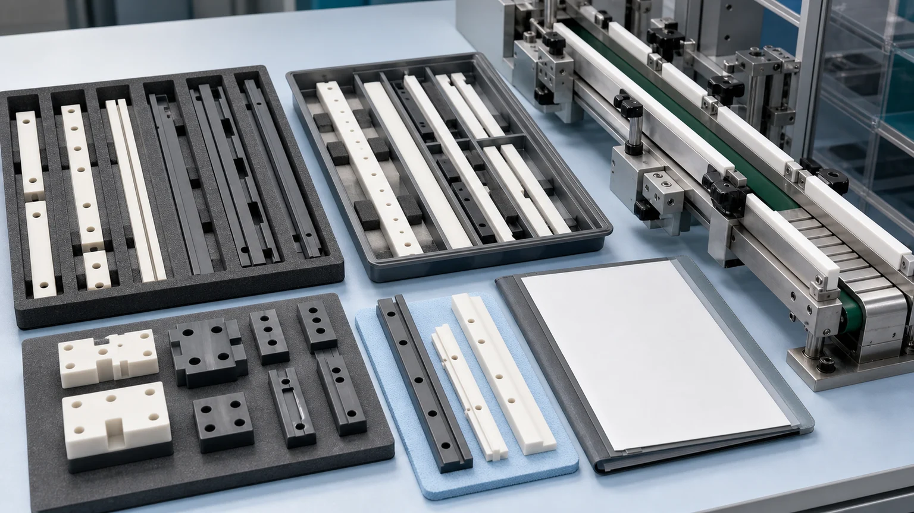

> Ceramic guide rails and wear strips are not just long ceramic bars. In a production line, the rail may control sliding wear, product guidance, side contact, fixture repeatability, mounting-hole stress, edge chips, straightness, flatness, and replacement fit. A useful RFQ should define the machine zone, material, rail length, contact face, mounting method, slot and hole details, straightness or flatness requirement, surface finish, edge criteria, inspection evidence, and packaging before feasibility, price, lead time, or tolerance scope is confirmed.

Ceramic guide rails, ceramic wear strips, guide blocks, sliding rails, wear pads, lane guides, side rails, locating strips, conveyor guide inserts, and ceramic track components appear in packaging machinery, food and beverage handling lines, electronics assembly, textile equipment, inspection automation, clean manufacturing, abrasive material handling, and custom production fixtures.

The search value is durable because engineers rarely search only for "ceramic part" when a rail is wearing out. They search for ceramic guide rail, alumina wear strip, zirconia guide block, ceramic conveyor rail, silicon nitride wear rail, ceramic sliding guide, ceramic side guide for packaging machine, or custom ceramic rail with mounting holes.

## Why This Topic Deserves A Dedicated Page

Factory automation and packaging equipment are both long-term drivers for precision wear components. [IFR World Robotics 2025 statistics](https://ifr.org/) reported 542,000 industrial robots installed in 2024, with annual installations above 500,000 for the fourth straight year. In packaging machinery, [PMMI's 2025 State of the Industry report](https://www.pmmi.org/report/state-of-the-industry-2025) tracks current U.S. and Canadian packaging machinery statistics, while PMMI also reported the U.S. packaging machinery market at $11.3 billion in 2024 in its 2025 industry update.

Those market signals matter for CERAMIC CNC only when they become real machined-part RFQs: guide rails that score plastic containers, wear strips that lose height, rails that create particles, conveyor side guides that need better corrosion resistance, or automation rails that need repeatable mounting and edge stability.

This page is therefore not a generic automation trend article. It is an RFQ guide for ceramic rails and wear strips where long geometry, contact surfaces, mounting features, and inspection method decide the machining route.

## What A Ceramic Guide Rail Usually Has To Control

A ceramic rail may look simple in a CAD model, but the part can have several functions:

| Function                    | What the ceramic part may control                                          | RFQ detail that changes machining review                                  |
| --------------------------- | -------------------------------------------------------------------------- | ------------------------------------------------------------------------- |
| Sliding product contact     | Low-wear side guide, top rail, wear strip, or contact land                 | Contact material, speed, lubrication, dry/wet condition, allowable marks  |
| Line guidance               | Straight edge, guide face, lane width, or tracking surface                 | Straightness, flatness, parallel rail set, datum strategy                 |
| Machine mounting            | Counterbores, slots, screw holes, clamp pockets, adhesive face             | Hole-edge quality, slot radius, mounting stress, metal fixture interface  |
| Replaceable wear surface    | Rail height, contact band, datum end, wear allowance                       | Which face is critical, replacement tolerance, matched left/right sets    |
| Clean or chemical operation | Low-particle contact, washdown, solvent, abrasive powder, corrosive media  | Cleaning method, media chemistry, packaging, residue limits               |
| Inspection and acceptance   | Measurable flatness, straightness, hole position, Ra, edge chip, thickness | CMM, height gauge, optical edge check, surface roughness, visual criteria |

For a wider map of industrial wear part families, use the [industrial ceramic machining guide for wear-resistant components](/posts/industrial-ceramic-machining/industrial-ceramic-machining-wear-resistant-components/). For cylindrical guide parts, use the [wear-resistant ceramic bushing guide](/posts/wear-components/wear-resistant-ceramic-bushings-industrial-machinery/). This page focuses on rail-style components: long bars, strips, blocks, slots, holes, datum faces, and exposed sliding edges.

## Typical Ceramic Rail And Wear Strip RFQs

Most guide rail RFQs fall into a few practical groups:

| Part name                        | Common use                                                           | Main drawing risk                                                              |
| -------------------------------- | -------------------------------------------------------------------- | ------------------------------------------------------------------------------ |
| Ceramic guide rail               | Side guide or product contact rail on packaging and automation lines | Long straightness, contact face finish, edge chip limits, mounting-hole stress |
| Ceramic wear strip               | Replaceable rail, liner, or sliding strip in high-friction equipment | Wear face flatness, thickness control, adhesive or mechanical mounting surface |
| Ceramic guide block              | Shorter rail block, locating block, or anti-wear guide insert        | Hole position, slot radius, datum faces, edge transition                       |
| Ceramic conveyor side guide      | Product alignment or container side contact                          | Rail set parallelism, entry/exit chamfer, low particle and marking risk        |
| Ceramic rail with mounting slots | Adjustable rail, slotted strip, or machine retrofit component        | Slot width, end radius, wall section around slots, screw load                  |
| Ceramic track or channel insert  | Channel guide, U-shaped rail, or sliding nest                        | Internal corner radius, grinding access, wear band definition                  |
| Matched rail pair                | Left/right guides or upper/lower rails in a controlled lane          | Matched height, straightness, packaging, lot consistency                       |

If a rail is part of a retrofit, send photos of the worn metal, polymer, or coated rail and describe the failure mode. A rail that failed by abrasion, adhesive wear, washdown corrosion, heat, product marking, vibration, or mounting crack should not be reviewed the same way.

## Material Choice For Ceramic Guide Rails

Material choice should start from the contact condition. [CoorsTek's technical ceramic materials overview](https://www.coorstek.com/en/materials/) lists advanced ceramics across wear, electrical, thermal, sensor, medical, and semiconductor use. For rail-style parts, those material properties must be translated into a real contact surface, mounting method, edge design, and inspection plan.

| Material              | Where it is often reviewed for guide rails and wear strips                    | RFQ review focus                                                               |
| --------------------- | ----------------------------------------------------------------------------- | ------------------------------------------------------------------------------ |
| Alumina Al2O3         | Economical wear strips, guide rails, insulating rails, general side guides    | Purity, wear mode, edge chips, long grinding, hole quality, corrosion exposure |
| Zirconia ZrO2         | Tougher compact guide blocks, product-contact rails, low chip-risk wear parts | Toughness need, temperature limit, edge load, sliding surface, mounting stress |
| Silicon nitride Si3N4 | Stronger rails, high-speed guides, thermal cycling, impact-sensitive contact  | Load path, rail cross-section, shock, straightness, ground face quality        |
| Silicon carbide SiC   | Abrasive, corrosive, high-temperature, or slurry-adjacent wear rails          | Chemical media, edge stability, grinding cost, lapped or ground wear face      |
| Macor                 | Prototype guide inserts, lab fixtures, low-load rail mockups                  | Final wear duty must be reviewed before treating it as production material     |
| Boron nitride BN      | Selected high-temperature guide or support roles                              | Atmosphere, fragility, mechanical load, temperature exposure                   |

Use the [ceramic material selection guide](/posts/materials-grade-selection/ceramic-material-selection-cnc-machining/) when the drawing only says "ceramic." Use material-specific pages when the project has narrowed to [alumina](/posts/industrial-ceramic-machining/precision-machined-alumina-ceramic-parts-industrial-applications/), [zirconia](/posts/industrial-ceramic-machining/zirconia-ceramic-machining-high-strength-precision-components/), [silicon nitride](/posts/industrial-ceramic-machining/silicon-nitride-ceramic-machining-structural-wear-parts/), or [silicon carbide](/posts/industrial-ceramic-machining/silicon-carbide-ceramic-machining-harsh-environment-applications/).

## The Contact Face Must Be Defined

The most important question for a ceramic guide rail is:

**Which face actually touches the product, belt, carrier, fixture, bottle, pouch, wire, fiber, plate, or sliding part?**

Without that answer, the supplier may apply precision in the wrong place. A rail can meet outside dimensions and still fail if the actual contact face has the wrong finish, edge condition, straightness, or transition radius.

Mark these zones on the drawing:

- Main sliding face or product-contact land.
- Side face that controls lane width.
- Top face or height datum.
- Mounting face, adhesive face, or clamp face.
- Entry and exit chamfers where product first touches the rail.
- Slot and counterbore edges that may crack under screw load.
- Ends that are used as stops, datums, or non-contact boundaries.
- Non-critical clearance faces that do not need premium finish.

This is the same logic used in the [ceramic surface finish and subsurface damage guide](/posts/surface-finish-functional/ceramic-ssd-surface-finish-specify-control-price/): specify finish and surface integrity where function needs them, not everywhere by habit.

## Straightness, Flatness, And Rail Set Matching

Long rails create a different machining problem from small blocks. A short ceramic guide block may be controlled by hole position and edge quality. A long ceramic wear strip may be controlled by straightness, flatness, bow, twist, parallelism, and how it sits against a metal frame.

Useful drawing questions include:

- Is straightness required on the contact edge, centerline, mounting edge, or full length?
- Is flatness required on the sliding face, mounting face, or both?
- Should two rails be matched as a left/right set?
- Does the rail mount to a machined metal frame, extruded profile, slotted bracket, or adhesive bed?
- Is the rail clamped at intervals, fully supported, or cantilevered?
- Does the rail see thermal cycling, washdown, abrasive dust, vibration, or impact?
- Is free-state measurement acceptable, or should the rail be measured on a support fixture?

Use the [ceramic tolerance capability map](/posts/tolerances-gdt/ceramic-tolerance-capability-map-by-feature-process/) when deciding which tolerance belongs to which feature. A long ceramic rail with tight flatness on every face, tight slot position, low Ra everywhere, and sharp corners can become unnecessarily expensive or high-risk. A better drawing identifies the critical rail contact surface and relaxes non-functional areas where possible.

## Slots, Holes, Counterbores, And Edge Quality

Mounting features are often the highest-risk parts of a ceramic guide rail drawing. Metals can tolerate screw load, local bending, and sharp hole edges more forgivingly. Fired ceramics cannot.

Review these details before release:

| Feature                      | Why it matters for ceramic rails                                      | Better RFQ input                                                                 |
| ---------------------------- | --------------------------------------------------------------------- | -------------------------------------------------------------------------------- |
| Through holes                | Hole edge chips and local stress can affect assembly                  | Hole size, position tolerance, chamfer, screw clearance, visual chip criteria    |
| Counterbores or countersinks | Concentrate clamp load near brittle edges                             | Seat geometry, washer use, torque expectation, edge radius                       |
| Long slots                   | Narrow walls and internal corners can chip or crack                   | Slot width, end radius, wall thickness, position tolerance, grinding access      |
| Pocketed rail profiles       | Sharp inside corners and unsupported sections increase risk           | Minimum radius, relief zones, non-critical faces, support condition              |
| Rail ends                    | Entry/exit impacts can chip sharp ends                                | End chamfer, lead-in radius, product contact direction                           |
| Thin wear strips             | Can break during grinding, handling, or mounting if unsupported       | Thickness, support method, adhesive bed, packaging, installation handling        |
| Matched rail sets            | Left/right or upper/lower rails may need controlled height and length | Mark set logic, packaging orientation, replacement strategy, inspection evidence |

For ceramic-friendly geometry, use the [ceramic CNC machining design rules](/posts/design-rules-dfm/ceramic-cnc-machining-design-rules-advanced-ceramic-parts/). It is usually better to add realistic radii and edge breaks at the drawing stage than to discover chip risk after the blank is already fired.

## Surface Finish, Product Marking, And Counterface Behavior

Guide rails may touch plastic containers, glass, foil, film, metal carriers, ceramic plates, textile fibers, wires, food-contact-adjacent tooling, or abrasive powder. The contact surface should be specified around the actual counterpart.

Important RFQ questions:

- Is the contact dry, lubricated, wet, washed down, dusty, abrasive, or chemical?
- Is the product sensitive to scratching, black marks, particles, or static charge?
- Does the rail contact a moving belt, a sliding product, a fixture carrier, or only occasional side impact?
- Should the contact face be ground, lapped, polished, or left as a standard ground surface?
- Which direction should surface texture run relative to product motion?
- Are edge chips acceptable outside the contact zone but not on the entry edge?
- Does the rail need cleaning or packaging for a food, medical-adjacent, electronics, or high-purity assembly line?

Do not specify "polished ceramic rail" without naming the face and acceptance method. A rail may need a low-Ra contact band, but the mounting face or non-contact side can often use a more practical finish.

## Inspection Evidence For Ceramic Guide Rails

The inspection plan should follow the failure mode. If the rail failed because of product marking, only checking hole spacing is not enough. If the rail failed because it was hard to install, contact-face Ra may be less important than slot position, rail straightness, or matched height.

Useful evidence can include:

| Rail requirement               | Possible inspection evidence                                            |
| ------------------------------ | ----------------------------------------------------------------------- |
| Contact-face flatness          | CMM, surface plate, height sweep, optical/profile method where suitable |
| Rail straightness              | CMM, straight edge method, height gauge, or agreed fixture-based check  |
| Hole or slot position          | CMM report, optical inspection, go/no-go fixture, datum-based report    |
| Mounting face relationship     | Parallelism, perpendicularity, thickness, or datum-to-contact check     |
| Surface finish on contact band | Ra reading with face and direction defined                              |
| Edge quality                   | Optical or visual inspection with chip limits by zone                   |
| Matched rail pair              | Matched height, length, side-to-side relationship, package grouping     |
| Clean handling                 | Cleaning note, bagging, tray protection, surface separation             |

For RFQs involving locating features, fixture rails, or inspection nests, the [precision ceramic fixture plate case guide](/posts/automation-fixtures/precision-ceramic-fixture-plate-locating-pins-case-study/) shows how datum pads, holes, bushings, and clean packaging interact in automation tooling.

## Packaging And Installation Readiness

Long ceramic rails are easy to damage after inspection if packaging is treated as an afterthought. Rail ends, thin strips, slot edges, polished contact faces, and matched sets need protection.

For production or repeat orders, define:

- Individual trays, foam separators, or sleeves for long rails.
- Protection for contact faces and entry/exit edges.
- Matched-set grouping for left/right or upper/lower rail pairs.
- Orientation labels at package level, not on critical ceramic contact surfaces.
- Cleaning, bagging, or residue limits if used in clean manufacturing.
- Whether mounting hardware is supplied, customer-supplied, or excluded.
- Whether installation torque, washers, adhesive, or support condition must be reviewed.

A ceramic rail can pass inspection and still arrive unusable if rails are stacked directly against each other or if a polished contact edge is exposed to impact during shipping.

## When A Ceramic Rail Is A Good RFQ Candidate

Ceramic guide rails are worth reviewing when a production line has one or more of these problems:

- Metal rails are wearing, galling, corroding, or contaminating the product path.
- Polymer rails are deforming, swelling, softening, or wearing too quickly.
- Coated rails are losing coating in the contact zone.
- Product-contact marks, particles, or dust are unacceptable.
- Abrasive powder, fibers, film, bottles, caps, pouches, or carriers are damaging current rails.
- The line needs a non-metallic wear strip, insulating rail, or chemically resistant guide.
- Replacement rails need more consistent hole position, straightness, or rail height.
- The existing rail design has screw holes, slots, or edges that chip after conversion to ceramic.

If the part is a simple low-precision bar with no defined contact face, a standard ceramic stock shape may be enough. If the rail includes controlled straightness, flatness, slot position, countersunk holes, low-Ra contact bands, matched-set logic, or clean packaging, it should be treated as a precision ceramic machining project.

## RFQ Checklist For Ceramic Guide Rails

A useful ceramic guide rail RFQ should include:

1. 2D drawing with length, width, thickness, rail profile, hole and slot details, datums, tolerances, and surface finish by zone.
2. STEP or CAD model with contact faces and mounting faces clearly identifiable.
3. Material requirement, or operating conditions if material is open.
4. Machine zone: packaging line, conveyor side guide, fixture rail, abrasive handling line, clean system, or automation station.
5. Current rail material and failure mode if replacing metal, polymer, coating, or previous ceramic.
6. Contact counterpart: product, belt, carrier, shaft, fiber, film, bottle, pouch, plate, powder, or fixture.
7. Motion condition: sliding, side contact, intermittent impact, dry/wet running, washdown, abrasive dust, chemical exposure.
8. Functional surfaces: contact face, side guide face, mounting face, datum edge, rail end, slot edge, or non-critical clearance face.
9. Required inspection: straightness, flatness, hole position, slot position, thickness, Ra, edge chip criteria, matched rail evidence.
10. Mounting method: screws, countersinks, clamps, adhesive, support rail, extrusion, metal fixture, torque expectation, washer use.
11. Quantity, prototype or production intent, target timing, and revision status.
12. Packaging, cleaning, and matched-set requirements.

Use the [custom ceramic CNC machining RFQ checklist](/posts/rfq-preparation/custom-ceramic-cnc-machining-rfq-checklist/) to prepare the full quote package. For a live project, send the drawing and application context through the [RFQ page](/rfq/) so material, machining route, contact surface, tolerance scope, inspection, and packaging can be reviewed together.

## Practical Takeaway

Ceramic guide rails and wear strips can be valuable when a production line needs better wear resistance, chemical stability, insulation, low-particle contact, or dimensional stability than metal, polymer, or coated rails can provide. The part should not be sourced as a generic ceramic bar.

For a serious RFQ, define the contact face, rail length, mounting features, straightness or flatness requirement, surface finish zone, edge criteria, material environment, inspection method, and packaging plan. That is how a guide rail becomes a reviewable precision ceramic machining project instead of a risky catalog substitution.
