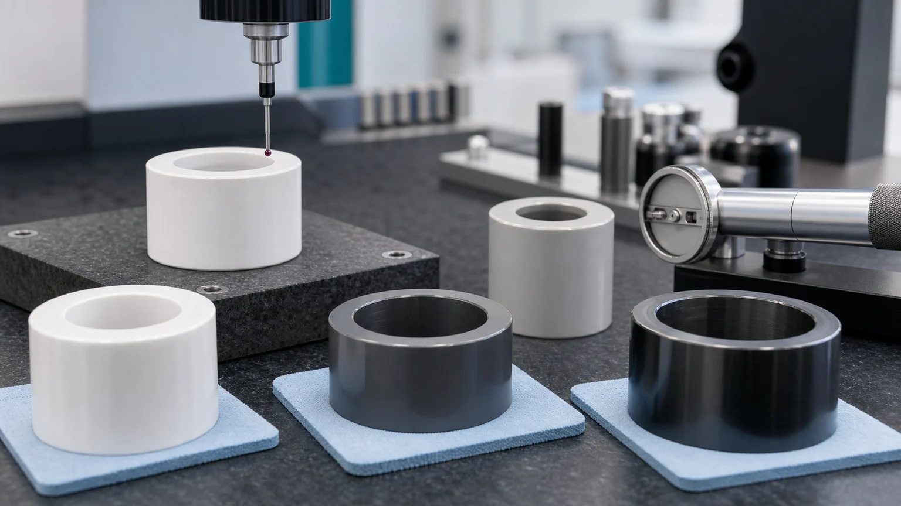
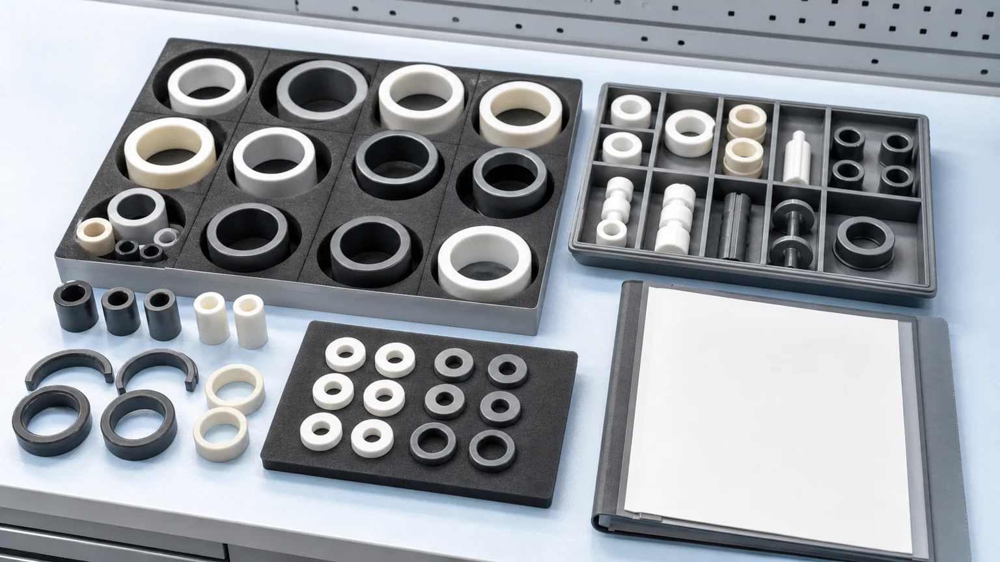

> Wear-resistant ceramic bushings look like simple rings until the machine depends on bore roundness, ID/OD alignment, sliding-surface finish, edge stability, and counterface behavior. A useful RFQ should define the material, wear mode, mating shaft or housing, fit condition, functional surface, inspection method, and packaging requirement before feasibility, price, lead time, or tolerance scope is confirmed.

Ceramic bushings, sleeves, guide rings, shaft sleeves, locating bushings, wear liners, and bearing-adjacent ceramic rings appear in packaging machinery, industrial automation, textile equipment, pumps and valves, metering systems, abrasive material handling, chemical processing equipment, clean manufacturing, inspection fixtures, and high-speed guide mechanisms. The search term may be direct: ceramic bushing, zirconia bushing, alumina sleeve, silicon nitride guide bushing, silicon carbide wear ring, ceramic bearing sleeve, or custom ceramic sleeve for industrial machinery.

The long-term RFQ need is straightforward: modern machines use more precise motion, more automation, more abrasive media, and more uptime-sensitive replacement parts. [IFR World Robotics 2025 statistics](https://ifr.org/) reported 542,000 industrial robots installed in 2024, with annual installations above 500,000 for the fourth straight year. That does not mean every robot needs a ceramic bushing. It does mean more factories need durable guide, locating, sliding, gripping, and wear interfaces where metal, polymer, or coated parts may not hold clearance, insulation, or surface stability long enough.

For CERAMIC CNC, the article target is narrower than the automation trend: help engineers prepare quote-ready RFQs for precision machined ceramic bushings and sleeves.

## What A Wear-Resistant Ceramic Bushing Has To Control

In a drawing, a ceramic bushing may look like a tube. In service, it may control several functions at the same time:

| Function                         | What the ceramic part may control                                  | RFQ detail that changes machining review                                  |
| -------------------------------- | ------------------------------------------------------------------ | ------------------------------------------------------------------------- |
| Shaft guidance                   | Bore size, bore roundness, bore finish, entry chamfer              | Shaft material, speed, lubrication, dry/wet running, clearance, load      |
| Housing location                 | OD size, OD roundness, OD-to-ID relationship, press or slip fit    | Housing material, fit type, assembly stress, temperature swing            |
| Wear surface                     | Sliding band, contact face, groove edge, abrasive contact zone     | Wear mode, counterface roughness, particles, media, replacement interval  |
| Electrical or thermal isolation  | Ceramic sleeve between metal shaft, pin, probe, housing, or spacer | Voltage context, temperature, creepage, contamination, edge condition     |
| Chemical or clean compatibility  | Exposed surface in fluid, slurry, solvent, vacuum, or clean system | Media chemistry, cleaning route, residue limits, packaging expectation    |
| Inspection and acceptance record | Measurable ID, OD, runout, roundness, cylindricity, Ra, edge chips | CMM, bore gauge, roundness check, surface finish reading, visual criteria |

For a broader overview of wear part families, start with the [industrial ceramic machining guide for wear-resistant components](/posts/industrial-ceramic-machining/industrial-ceramic-machining-wear-resistant-components/). This page is more specific: it focuses on bushing and sleeve geometry where the bore, outside diameter, finish, and mating parts decide whether the ceramic component can function.

## Start With The Wear Mode, Not The Material Name

"Ceramic is wear resistant" is not enough for a purchase decision. Wear is a system result, not a single material property.

Before selecting alumina, zirconia, silicon nitride, or silicon carbide, define the dominant wear mode:

| Wear mode              | Typical bushing risk                                              | What to define in the RFQ                                               |
| ---------------------- | ----------------------------------------------------------------- | ----------------------------------------------------------------------- |
| Sliding wear           | Bore polishing, scoring, heat, clearance growth, counterface wear | Shaft material, finish, lubrication, speed, load, duty cycle            |
| Abrasive wear          | Particles cutting the ID, OD, grooves, or entry edges             | Particle type, particle size, media, flow path, exposed edge zones      |
| Corrosive wear         | Chemical attack plus sliding or abrasion                          | Fluid chemistry, concentration, temperature, cleaning method            |
| Fretting or vibration  | Small-amplitude motion damaging a contact band                    | Contact pressure, vibration, clamp strategy, edge support               |
| Thermal cycling        | Cracks or fit changes from expansion mismatch                     | Temperature range, heat rate, housing material, assembly constraint     |
| Impact or shock        | Edge chipping, bore cracking, brittle fracture                    | Load path, unsupported wall, edge radius, accidental contact risk       |
| Clean or vacuum motion | Particles, contamination, galling, or unacceptable surface debris | Cleaning, packaging, residue rules, acceptable visual and particle risk |

If the current part failed, include photos, wear location, operating hours, and mating component information. A worn steel bushing, cracked polymer sleeve, scored coated part, or failed alumina replacement each points to a different ceramic route.

## Material Selection For Ceramic Bushings

Material choice should be reviewed against the full assembly. [CoorsTek's technical ceramic materials overview](https://www.coorstek.com/en/materials/) positions advanced ceramics around properties such as wear resistance, electrical insulation, thermal performance, corrosion behavior, and application-specific engineering use. Those properties are valuable, but the finished bushing still depends on geometry, grinding route, surface integrity, and inspection evidence.

| Material              | Where it is often reviewed for bushings and sleeves                                    | RFQ review focus                                                                |
| --------------------- | -------------------------------------------------------------------------------------- | ------------------------------------------------------------------------------- |
| Alumina Al2O3         | General wear bushings, insulating sleeves, guide parts, economical wear rings          | Purity, density, edge chips, bore finish, abrasive environment, electrical role |
| Zirconia ZrO2         | Tough precision sleeves, compact guide bushings, plungers, metering parts              | Toughness need, temperature limit, sliding fit, OD finish, counterface behavior |
| Silicon nitride Si3N4 | Stronger wear guides, high-speed mechanisms, rollers, shafts, bearing-adjacent sleeves | Roundness, finish, load path, thermal shock, vibration, edge stability          |
| Silicon carbide SiC   | Harsh media wear rings, pump sleeves, chemical wear components, seal-adjacent parts    | Chemical media, lapped or ground band, edge quality, finishing cost             |
| Macor                 | Prototype sleeves, insulating lab fixtures, quick-turn test geometry                   | Final wear duty must be reviewed; not a default substitute for fired ceramics   |
| Boron nitride BN      | Selected high-temperature insulation or contact roles                                  | Grade, atmosphere, mechanical load, fragility, temperature exposure             |

Use the [ceramic material selection guide](/posts/materials-grade-selection/ceramic-material-selection-cnc-machining/) when the material is still open. Use the material-specific pages when the search has narrowed to [alumina](/posts/industrial-ceramic-machining/precision-machined-alumina-ceramic-parts-industrial-applications/), [zirconia](/posts/industrial-ceramic-machining/zirconia-ceramic-machining-high-strength-precision-components/), [silicon nitride](/posts/industrial-ceramic-machining/silicon-nitride-ceramic-machining-structural-wear-parts/), or [silicon carbide](/posts/industrial-ceramic-machining/silicon-carbide-ceramic-machining-harsh-environment-applications/).

If the application is a pump, valve, metering sleeve, or fluid-control assembly, also review the [precision ceramic pump and valve component guide](/posts/pump-valve-components/precision-ceramic-pump-valve-components-corrosive-fluid-control/). Fluid chemistry, pressure, leakage, lapped seats, and cleaning can change the answer.

## ID, OD, And The Fit Relationship

Most ceramic bushing RFQs become clear when the buyer answers one question:

**Which surface locates the part, and which surface wears?**

The answer controls tolerance scope and inspection.

A shaft guide may use the ID as the functional surface. The OD may only hold the part in a housing. A locating bushing may use both ID and OD, with OD-to-ID runout or concentricity controlling assembly repeatability. A wear ring may care more about one lapped or ground band than the full outside profile. A ceramic sleeve used for electrical insulation may need controlled wall thickness and protected bore edges, even if it is not a high-speed wear interface.

Define these details in the drawing:

- ID nominal size and tolerance.
- OD nominal size and tolerance.
- Length, wall thickness, and unsupported span.
- Slip fit, press fit, shrink fit, adhesive fit, or free-floating condition.
- Datum structure for ID-to-OD runout, concentricity, or position.
- Roundness or cylindricity only where it affects motion, sealing, or locating.
- End-face squareness, parallelism, or stack-height requirement.
- Chamfer, radius, or lead-in on both bore entries.
- Surface finish by zone, not as a single note for the whole part.

For thin or long bushings, use the [thin-wall ceramic sleeve RFQ guide](/posts/thin-wall-sleeves/ceramic-thin-wall-sleeve-bore-concentricity-rfq/) to define wall section, concentricity, bore access, and measurement approach. A long thin ceramic sleeve is not reviewed like a short thick spacer.

## Surface Finish And Counterface Matter More Than Bulk Hardness

A hard ceramic bushing can still fail if the sliding surface is wrong for the mating shaft. Surface finish, surface integrity, counterface material, lubrication, and edge quality often matter as much as the ceramic grade.

Important RFQ questions include:

- Does the ceramic ID run on stainless steel, hardened steel, ceramic, coated metal, polymer, or a composite shaft?
- Is the motion continuous rotation, oscillation, reciprocating sliding, indexing, or occasional positioning?
- Is the condition dry, lubricated, wet, vacuum, chemical, slurry, or cleanroom-adjacent?
- Which surface needs a defined Ra or polished condition: ID, OD, end face, groove, or contact band?
- Is there a break-in period, cleaning requirement, particle limit, or replacement interval?
- Should the supplier provide surface finish readings, visual edge criteria, or paired-fit inspection?

Use the [surface finish and subsurface damage guide](/posts/surface-finish-functional/ceramic-ssd-surface-finish-specify-control-price/) when the drawing calls out Ra, lapping, polishing, or functional surface integrity. A cosmetic polish note is not enough when a bore is the actual running surface.

## Inspection Evidence For Ceramic Bushings

Ceramic bushing inspection should match the failure mode. Measuring only the nominal OD and length can miss the problem that matters.

Useful inspection evidence may include:

| Feature or risk                      | Possible evidence                                                              |
| ------------------------------------ | ------------------------------------------------------------------------------ |
| ID size                              | Bore gauge, air gauge, calibrated pin, CMM strategy where suitable             |
| OD size                              | Micrometer, CMM, roundness/profile equipment depending on tolerance            |
| ID/OD relationship                   | CMM, roundness equipment, runout fixture, datum-defined report                 |
| Roundness or cylindricity            | Roundness report or agreed measurement method                                  |
| Sliding-surface finish               | Ra reading on the functional band, with direction and measurement zone defined |
| End-face squareness or parallelism   | CMM, height, parallelism, or fixture-based evidence                            |
| Chamfer, radius, and edge condition  | Visual inspection criteria, optical inspection, agreed chip limit by zone      |
| Wall thickness and thin-wall support | Section-based dimension report, mandrel/support method disclosure where needed |
| Clean packaging                      | Protected trays, separators, bagging method, surface protection note           |

For drawing-level tolerance strategy, use the [ceramic tolerance capability map](/posts/tolerances-gdt/ceramic-tolerance-capability-map-by-feature-process/). The best ceramic bushing drawings avoid applying the same tight tolerance to every face. They mark the bore, sliding OD, datum end face, lapped band, or housing fit as critical and allow non-functional surfaces to use a more practical route.

## Common Design Mistakes In Ceramic Bushing RFQs

Many ceramic bushing quotes become slow or unreliable because the drawing hides the actual function. These are common problems:

1. **No counterface information.** The drawing says "ceramic bushing" but does not identify shaft material, shaft finish, load, speed, lubrication, or media.
2. **Tight tolerance everywhere.** The ID, OD, length, every radius, and every non-contact relief surface receive tight limits without explaining which interface controls function.
3. **Press fit copied from metal.** Ceramics do not yield like metals. Assembly stress, edge geometry, and housing material must be reviewed before assuming a press fit is safe.
4. **Sharp bore entries.** A sharp edge at the bore can chip during assembly or damage the shaft. Entry chamfer and edge-break criteria should be defined.
5. **Thin wall without inspection method.** A very thin sleeve may be difficult to grind, support, and measure. Free-state and supported measurements can differ.
6. **Undefined finish note.** "Polished" or "smooth" does not define the surface, direction, Ra target, or acceptance method.
7. **Material selected only by hardness.** Silicon carbide, silicon nitride, zirconia, and alumina can all be useful, but the right choice depends on the wear mechanism and geometry.
8. **Packaging ignored.** A bushing can meet the drawing and still arrive with bore edge damage if parts are shipped loose or stacked against finished faces.

The [ceramic CNC machining design rules](/posts/design-rules-dfm/ceramic-cnc-machining-design-rules-advanced-ceramic-parts/) explain why metal-style sharp corners, deep inaccessible features, and unsupported thin sections should be reviewed before release.

## Packaging Is Part Of The Acceptance Plan

Wear bushings and sleeves often have protected ID edges, lapped bands, or ground OD surfaces. If those zones are damaged after inspection, the part may fail before installation.

For production or repeat orders, define:

- Individual trays or separators for each bushing.
- Protection for bore entries and finished sliding bands.
- Whether matched sets must stay together.
- Orientation requirements if one end face is functional.
- Bagging, cleaning, or residue limits for clean manufacturing.
- Labeling at package level rather than marking directly on critical ceramic surfaces.
- Visual edge criteria before shipment.

This is especially important for small ceramic guide sleeves, thin-wall bushings, lapped seal-adjacent rings, or high-purity equipment parts.

## Where Ceramic Bushings Fit In Industrial Machinery

High-intent RFQs usually come from a concrete machine problem, not from a broad material search.

Common application patterns include:

| Application field                | Typical ceramic bushing or sleeve role                                   | Related internal path                                                                                                                         |
| -------------------------------- | ------------------------------------------------------------------------ | --------------------------------------------------------------------------------------------------------------------------------------------- |
| Packaging machinery              | Guide bushings, wear sleeves, sliding rails, locating collars            | [Automation fixture case guide](/posts/automation-fixtures/precision-ceramic-fixture-plate-locating-pins-case-study/)                         |
| Industrial automation            | Locating bushings, guide rings, ceramic sleeves near sensors or grippers | [Ceramic end effectors and automation guide](/posts/semiconductor-equipment/ceramic-end-effectors-wafer-handling-automation/)                 |
| Pump and valve hardware          | Plunger sleeves, valve guide sleeves, wear rings, seal-adjacent parts    | [Pump and valve ceramic component guide](/posts/pump-valve-components/precision-ceramic-pump-valve-components-corrosive-fluid-control/)       |
| Sensor and measurement tools     | Zirconia sleeves, guide bores, insulating sleeves, small wear guides     | [Sensor and measurement ceramic component guide](/posts/sensor-measurement-devices/precision-ceramic-components-sensors-measurement-devices/) |
| Cleanroom or high-purity systems | Low-particle guide sleeves, ceramic spacers, non-metallic wear parts     | [High-purity ceramic component guide](/posts/high-purity-cleanroom/precision-ceramic-components-cleanroom-high-purity-manufacturing-systems/) |
| Semiconductor-adjacent tools     | Wear-resistant sleeves, lift-pin guides, vacuum-side ceramic rings       | [Semiconductor ceramic component guide](/posts/semiconductor-equipment/precision-ceramic-components-semiconductor-equipment/)                 |

If the part is only a catalog-style straight tube with loose tolerance, a standard ceramic tube supplier may be enough. If the drawing includes controlled ID/OD relationship, surface finish, edge criteria, matched set behavior, or inspection evidence, treat it as a precision ceramic machining RFQ.

## RFQ Checklist For Wear-Resistant Ceramic Bushings

Send more than a STEP file when the bushing controls motion, wear, insulation, or sealing. A useful RFQ package includes:

1. 2D drawing with ID, OD, length, wall thickness, tolerances, GD&T, and surface finish by zone.
2. STEP or CAD model with functional surfaces marked if possible.
3. Material requirement or operating conditions if material selection is open.
4. Current material and failure mode if replacing a metal, polymer, coating, or previous ceramic part.
5. Shaft, pin, housing, or mating component material and finish.
6. Fit condition: slip, press, shrink, adhesive, clamp, or free-floating.
7. Motion type, speed, load, pressure, duty cycle, and lubrication or media.
8. Temperature, chemical exposure, abrasive particles, vacuum, cleanroom, or electrical context.
9. Critical surfaces: bore, OD, end face, groove, chamfer, lapped band, or datum face.
10. Inspection requirements: bore gauge, CMM, roundness, cylindricity, Ra, visual edge criteria, or special report.
11. Quantity, prototype or production intent, target timing, and revision status.
12. Packaging, cleaning, and matched-set requirements.

The [custom ceramic CNC machining RFQ checklist](/posts/rfq-preparation/custom-ceramic-cnc-machining-rfq-checklist/) gives a broader quote package structure for ceramic parts. For a live project, send the drawing and application context through the [RFQ page](/rfq/) so material, machining route, tolerance scope, inspection, and packaging can be reviewed together.

## Practical Takeaway

Wear-resistant ceramic bushings can be valuable when an industrial machine needs stable clearance, insulation, chemical resistance, abrasion resistance, or low-particle sliding behavior beyond what a metal, polymer, or coating can provide. The part should not be sourced by material name alone.

For a serious RFQ, define the wear mode, counterface, ID/OD relationship, fit condition, critical surface finish, edge criteria, inspection evidence, and packaging requirement. That turns a generic ceramic ring inquiry into a reviewable precision ceramic machining project.
